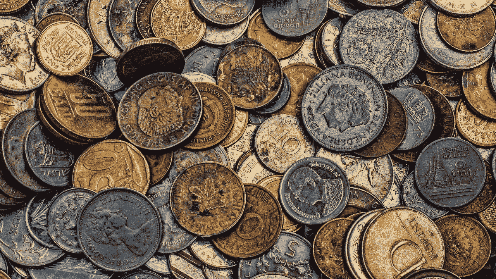

# 使用 ADA 硬币作为稀缺资源的优势

> 原文：<https://medium.com/coinmonks/the-advantages-of-using-ada-coins-as-a-scarce-resource-68e0c252612c?source=collection_archive---------3----------------------->

公共区块链网络需要一种机制来将合意的权力分配给希望参与网络的去中心化和安全性的实体。我们来看看卡尔达诺是怎么做的。

# **如何理想地分配权力，分配给谁**