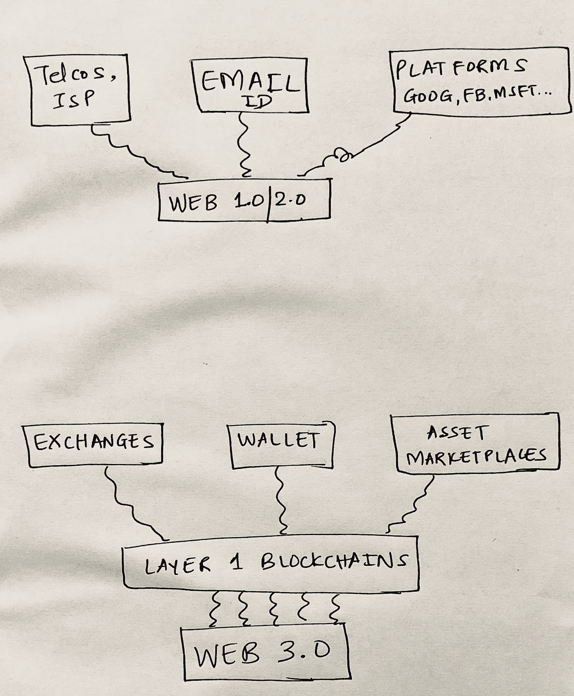
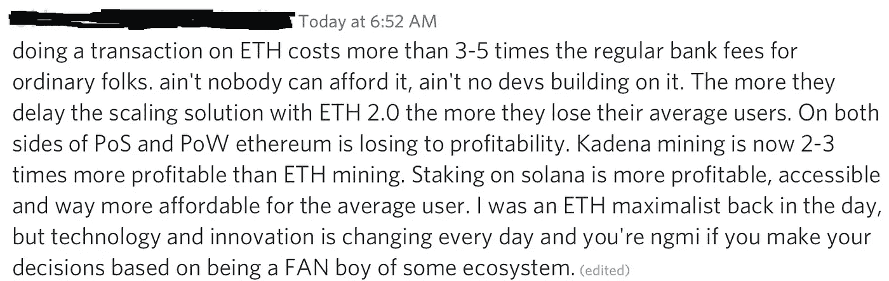
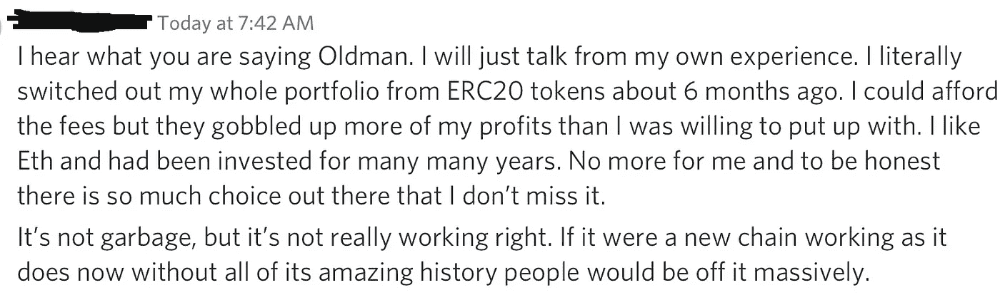

# 权力与 Web 3.0 的剖析

> 原文：<https://medium.com/coinmonks/the-anatomy-of-power-and-web-3-0-d2dd8dcaa926?source=collection_archive---------2----------------------->

## 权力下放会兑现它的承诺吗？

约翰·肯尼思·加尔布雷思有趣的书 ***剖析权力*** 仔细观察了**的权力**是如何行使的:

**被*强迫或惩罚*。**

**通过*货币或*补偿。**

**通过*集体信仰*。说服他人接受自己的意愿，相信它是正确的。**

加尔布雷斯的权力概念是理解 Web 3.0 和去中心化运动的有用框架。

## 加尔布雷斯的权力模式:入侵者的土地扩张战略

入侵者最初在他们的土地扩张战略中使用武力或惩罚(T21)。然后他们意识到单独使用武力是一个困难和昂贵的追求，因此演变成一个盗窃/国库囤积/税收的组合，采用货币或补偿作为行使权力的手段。随着时间的推移，人们认识到最后一种方法——诉诸集体信仰的方法——被证明是维护和行使权力最有用的方法。随着人类的发展，我们逐渐认识到，文明社会的正常运转需要三种力量的结合。武力或惩罚，对于那些违反法律的人。货币或报酬，用于经济组织。最后，维持“秩序”的中央机构(产生于集体信仰)。

这种追求权力的模式让我们可以通过 ***碎片化和*** 集权化的镜头来思考社会和经济动态。一旦我们掌握了这种动态，我们就可以开始欣赏 ***背后的细微差别，这是当前 Web 3.0 运动*** 中正在进行的去中心化浪潮。

## **集权是阻力最小的途径**

在加尔布雷斯的权力模型中，

> 我们注意到最初的分裂状态；随着时间的推移，这让位于中央集权。

一个系统在初始状态下是混沌的(**碎裂**)。然后采取行动减少混乱(**分裂**)并创造秩序(**集权**)。为什么？碎片化代表摩擦，是社会集体承担的成本。为了减少分散，我们最终不可避免地创造了集中化。

从**货币的易货和封地关系(碎片化)**，出现了**银行机构(集权化)**，减少了集体摩擦。从过去几个世纪的高利率，我们现在有了历史上最低的利率。无论这个系统有什么缺陷，很难说廉价资本会让社会变得更糟。 ***集权已经是必然的后果。大量匿名的人结合在一起，由一个集体的共同信念系统联结(偏好更低的，而不是更高的资本成本)*** 。

从**无政府状态(分裂)**，出现了**军事工业联合体**和**(主要是民主的)政治机构(中央集权)**，减少了集体摩擦。持续的战争状态已经被持续的纸上谈兵的思想“战争”所取代。不管这个系统有什么缺陷，很难想象会有人更喜欢实战。 ***集权已经是一个不可避免的后果。大量匿名的人团结在一起，由一个集体的共同信仰体系(偏好和平而非战争)联结在一起。***

从单位层面的**信仰体系(碎片化)**，出现了**宗教机构(集权化)**，减少了集体摩擦。 ***集权已经是不可避免的后果。大量匿名的人结合在一起，由一个集体共同的信仰系统(在他们自己版本的上帝中)*** 。

从地方**村陪审团/长老司法(碎片化)**，出现了**司法机构(集权化)**，减少了集体摩擦。 ***集权已经是必然的后果。大量匿名的人结合在一起，由一个集体共同的信仰系统连接起来*【正义的版本】**。

从**入侵者(分裂)**出现了**企业机构(集权)**减少了集体摩擦。 ***集权已经是不可避免的后果。******公司是一个与众不同的庞然大物，由一个集体的共同信仰体系*** 联结在一起的一群匿名的人组成。

在每一种情况下，一个共同的模式变得显而易见。

> 最初的分裂状态不可避免地会让位于中央集权。
> 
> 大量匿名的人自愿联合起来。
> 
> 结果，系统中的集体摩擦(成本)减少了。

## 信任的博弈论

以上每一种减少摩擦的追求都降低了社会的集体成本。但它并不是乌托邦式的普遍问题解决者。

为了理解为什么，一个简化的心智模型是有用的。

Author sketch

***Web 1.0/2.0***

一个简化的 Web 1.0/2.0 心智模型将互联网视为一个无所不在的存在；我们现在的世界就建立在这个基础上。

第一波价值获取发生在**基础设施层**(电信提供商、互联网服务提供商)，它们构建了通向 ***的信息高速公路，使*** 能够访问 Web 1.0/2.0。

**电子邮件 ID** 成为 ***网关，允许访问*。**

一旦接入网关就位，这就为我们所熟悉的无处不在的集中式平台的出现创造了条件。)今天。

在过去的二十年里，Web 1.0/2.0 接入的成本大幅下降。这减少了摩擦，创造了消费者剩余。这种动态的另一面是创造巨型平台，在减少摩擦的同时获取价值。

> 当接入成本低廉，消费者拥有比网络时代之前更多的选择时，是什么让集中化让我们烦恼呢？

虽然我们欢迎摩擦最小化，但我们似乎已经让 ***将用户控制和信任*让给了集中化的实体**。我们不知道这是故意发生的，但这足以让我们感到烦恼，因此我们寻求一种替代机制。

1.  当从一个国家向另一个国家发起 SWIFT 支付转账时，没有实际的现金流动。在引擎盖下，一个银行账户被借记，另一个账户被贷记，经过一个精心设计的检查系统以确保交易的完整性。这一检查层涉及多个实体，目的只有一个:**防止资金转移的不法用途**。然而，这一目标创造了一种 ***激励机制，在这种机制下，任何实体都不希望被视为在发生泄漏*** 时承担责任。最终的结果是以成本和时间延迟形式出现的摩擦，这是由于缺乏对内部机制的系统性信任。绝大多数真实交易实际上支付了补贴税，以弥补少数恶意交易。
2.  当谷歌或脸书向用户提供免费服务，并利用这种客户关注的受益者将其货币化时，一种算法(由中央实体控制)似乎处于完全控制之中。当用户看到这种力量(*如果你的行为与我们认为正确的行为不同，你将被拒之门外*)，我们就看到了 Galbraithain 的力量在起作用。

这些公司使用**既不强迫** ( *他们不强迫我们使用*)，**也不补偿** ( *他们不付给我们*)，而是**信念** ( *我们都集体相信，与替代方案*相比，使用它们对我们的目标是正确的。例如，谷歌/苹果地图优于实体地图，微软 Word 优于纸笔，insta gram/抖音状态搜索优于亲自状态搜索，SWIFT 支付优于易货……)。

> 因此，我们有一个矛盾的世界，这里几乎没有信任，但我们都相信集体权利！

## 权力下放向何处去

**Web 3.0 提供了什么替代方案？**

Web 3.0 可以被想象成一系列的第 1 层区块链，在它之上，新世界正在被构建。

在每一个区块链，都有**透明**(阻止任何人访问的探索者)**匿名**(有效身份是*地址*而不是“一个人”)，但最重要的是，它有一种**加尔布雷斯式的信仰动力在起作用** ( *越来越多的匿名人士集体认为，与目前的替代方案相比，这对于我们的目标是正确的)*。

> 现在的中央集权制度有很多信仰，但很少信任。
> 
> **去中心化的 Web 3.0 有很多信仰，*很多信任*** 。

这需要更仔细的检查。

在 Web 3.0 世界中，与 Web 1.0/2.0 非常相似，第一波价值获取可能发生在**基础架构层**。**交易所**即 ***启用接入*** ，以及**钱包**即 ***启用网关*** *，*然后将为**资产市场(如 DeFi，NFT)** 的创建做好准备。

我们现在有几个区块链在争夺用户的注意力，而旧的区块链(比特币、以太坊)——它们以去中心化/安全第一为目标——遇到了可扩展性问题和更高的成本。它们不够快，也不够便宜，跟不上用户的需求。

这引起了对更快的交易处理速度的日益高涨的呼声，导致了寻求减少这种摩擦的新替代方案(Solana、Algorand、Avalanche)。

随着时间的推移，随着用户群的增加，有理由假设将会有符合最大化事务处理速度的*低延迟解决方案*。

我们希望事情做得快，做得便宜。如果安全是实现这一目标的一个交换条件，那么有理由期待大量的匿名人会团结在一起，通过一个集体的共同信念系统(更快的交易速度和完全透明的历史)加入进来。

当我们转到**交易所**层时，我们可以想象一下*集中交易所* (CEX，例如比特币基地，币安)和*分散交易所* (DEX)之间的争斗。CEX 可能最终会将 DEX 纳入麾下，或者与 DEX 握手言和。所有这些都是由匿名群体对*低摩擦*的需求驱动的。随着这种趋势的加剧，这些实体会获得中央集权的特征吗？

对于**钱包**层，可以设想类似的轨迹。如今有多种钱包(一种用于以太坊，一种用于索拉纳生态系统等等)。生态系统之间的交流有摩擦(更慢，和/或更昂贵)。交叉操作性创造了限速器，但也提供了机会。*这个问题的解决方案是一个* ***单钱包*** *，这也有利于通往区块链生态系统*的无障碍通道。所以，一个集中的解决方案？

在**资产市场**，类似的举措可能会成功。在垂直应用领域，将会出现一些赢家，以及一长串次优替代方案。

最终，系统稳定在一个最佳(不是“最佳”)状态，即*最低摩擦。*

> *随着 Web 3.0 解决方案达到临界质量并变得无处不在，它们会达到集中化的特征吗？去中心化的理想最终会导致现在体制下同样的中心化结局吗？*

*然而，即使在某种形式的中央集权的最后阶段，Web 3.0 也拥有一个相对于现状更好的组织系统的前景。*

> *目前的中央集权制度有很多信仰，却很少信任。*
> 
> *去中心化的 Web 3.0 有很多信念，并且(希望)有很多信任。*

## *博弈论与分散自治组织*

*体质道是一个真正有趣的实验。这是第一次由一个集体的共同信仰体系(集体的(象征性的)美国宪法所有权)将一群不知名的人联合在一起。*

*这个例子作为一个例子，说明了未来的议会、国家，甚至中央政府是如何类似于道的。*

**政府道会是一个分散的解决方案吗？**

*让我们做一个思维实验。*

*在原子单位层面，假设一个本地**镇道**。*

*这个城镇道的存在是为了让所有的城镇居民对城镇的治理有一个投票权。这可能会导致一系列需要 DAO 投票的问题。*

*从严重的…*

*   *是否应该用 TOWNCOIN 缴税？*
*   **我们应该发行城镇硬币来资助前线工作者吗？警察？**
*   **我们应该废除死刑吗？**

*对世俗的…*

*   *我们应该有一个中央公园吗？*
*   *当 10 个信号已经足够时，我们还需要 20 个吗？*
*   *我们应该有更多的垃圾桶收集吗？*

*到可怕的…*

*   *我们应该投票决定与邻国开战吗？*
*   **我们应该投票按 N 键吗？**
*   *我们应该恢复死刑吗？*

*随着问题清单变得越来越长、越来越复杂、越来越微妙，大多数道成员会发现自己不知所措，可能会想方设法*。**

> **他们可以通过将投票权委托给委员会来减少决策摩擦。**
> 
> **…这将使我们回到目前的议会管理制度！**

**对于大多数用例，大规模的去中心化可能会增加摩擦和成本。Web 3.0 可能最终会导致一个**去中心化的选择:一个匿名但透明的信任系统，去中心化的整体在许多方面类似于中心化的实体。****

> **加入 Coinmonks [电报频道](https://t.me/coincodecap)和 [Youtube 频道](https://www.youtube.com/c/coinmonks/videos)了解加密交易和投资**

## **另外，阅读**

*   **[SmithBot 评论](https://blog.coincodecap.com/smithbot-review) | [4 款最佳免费开源交易机器人](https://blog.coincodecap.com/free-open-source-trading-bots)**
*   **[杠杆令牌](/coinmonks/leveraged-token-3f5257808b22) | [最佳密码交易所](/coinmonks/crypto-exchange-dd2f9d6f3769) | [Paxful 点评](/coinmonks/paxful-review-4daf2354ab70)**
*   **[加密套利](/coinmonks/crypto-arbitrage-guide-how-to-make-money-as-a-beginner-62bfe5c868f6)指南| [如何做空比特币](/coinmonks/how-to-short-bitcoin-568a2d0b4ae5)**
*   **[10 本关于加密的最佳书籍](https://blog.coincodecap.com/best-crypto-books) | [英国 5 个最佳加密机器人](https://blog.coincodecap.com/uk-trading-bots)**
*   **[Koinly 回顾](https://blog.coincodecap.com/koinly-review) | [Binaryx 回顾](https://blog.coincodecap.com/binaryx-review) | [Hodlnaut vs CakeDefi](https://blog.coincodecap.com/hodlnaut-vs-cakedefi-vs-celsius)**
*   **[40 个最佳电报频道](https://blog.coincodecap.com/best-telegram-channels) | [1xBit 回顾](https://blog.coincodecap.com/1xbit-review)**
*   **[如何在印度购买以太坊？](https://blog.coincodecap.com/buy-ethereum-in-india) | [如何在币安购买比特币](https://blog.coincodecap.com/buy-bitcoin-binance)**
*   **[在美国如何使用 BitMEX？](https://blog.coincodecap.com/use-bitmex-in-usa) | [BitMEX 回顾](https://blog.coincodecap.com/bitmex-review) | [买入索拉纳](https://blog.coincodecap.com/buy-solana)**
*   **[德国最佳加密交易所](https://blog.coincodecap.com/crypto-exchanges-in-germany) | [Arbitrum:第二层解决方案](https://blog.coincodecap.com/arbitrum)**
*   **[支持卡审核](https://blog.coincodecap.com/uphold-card-review) | [信任钱包 vs 元掩码](https://blog.coincodecap.com/trust-wallet-vs-metamask)**
*   **[Exness 回顾](https://blog.coincodecap.com/exness-review)|[moon xbt Vs bit get Vs Bingbon](https://blog.coincodecap.com/bingbon-vs-bitget-vs-moonxbt)**
*   **[如何开始通过加密贷款赚取被动收入](https://blog.coincodecap.com/passive-income-crypto-lending)**
*   **[Coldcard 评论](https://blog.coincodecap.com/coldcard-review) | [BOXtradEX 评论](https://blog.coincodecap.com/boxtradex-review)|[unis WAP 指南](https://blog.coincodecap.com/uniswap)**
*   **[比特币基地 vs 瓦济克斯](https://blog.coincodecap.com/coinbase-vs-wazirx) | [比特鲁点评](https://blog.coincodecap.com/bitrue-review) | [波洛涅克斯 vs 比特克斯](https://blog.coincodecap.com/poloniex-vs-bittrex)**
*   **[阿联酋 5 大最佳加密交易所](https://blog.coincodecap.com/best-crypto-exchanges-in-uae) | [SimpleSwap 评论](https://blog.coincodecap.com/simpleswap-review)**