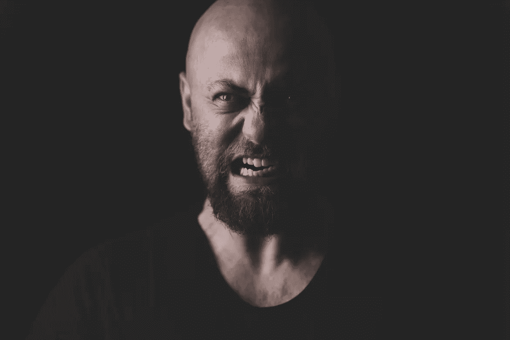
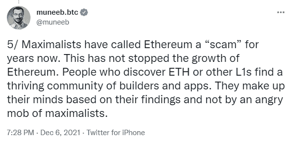
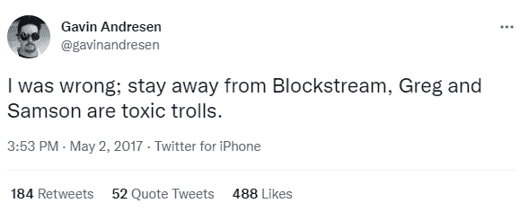
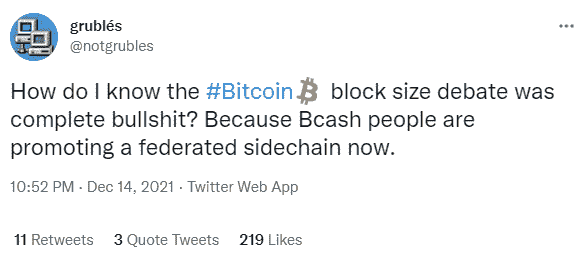
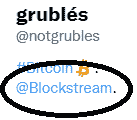

# 比特币最大化主义者的愤怒暴民

> 原文：<https://medium.com/coinmonks/the-angry-mob-of-bitcoin-maximalists-adf8be035f36?source=collection_archive---------6----------------------->

我不是最有资格讨论这个问题的人，因为在块大小的争论中我并不活跃在加密领域。

然而，我对块大小“战争”的话题研究了很多，这只是增加了我对比特币社区在我加入“Cryptoverse”之前很长一段时间所面临的状况的理解。我只能略微感受到早期比特币创造者的论点和理由，然而，这都是由 Blockstream 的中央命令预先确定的，在连接所有的点之后很容易弄清楚。

早在 2017 年，我们这些加入的人就艰难地发现，BTC 的叙述具有误导性。到了年底，我们明白了，或许“更大的街区”并不像那个时代的 BTC 福音传道者所暗示的那样，只是一个用比特币赚钱的骗局。

我自 2017 年年中以来的经历让我对我在大多数 BTC 社区中发现的东西感到厌恶，特别是在 bitcointalk，但也在 Reddit，YouTube 和每一个社交媒体中。或许这群乌合之众是同一批人，拥有十几个不同的用户名和多个账户，但这种毒性足以对抗，尤其是当他们得到管理员的支持，审查他们认为不符合主要叙述的内容时。

计算机科学家穆尼布·阿里(Muneeb Ali)在上面的这条推文中将这种对提问的狂热和不容忍描述为“比特币最大化主义者的愤怒暴徒”。

# 马克思主义者的愤怒的暴民

一条鱼从头开始腐烂。

2017 年之前我不会去，因为这是我第一次真正体验加密货币。

从第一天开始，我就立刻见到了所有的评论员，认为他们已经想通了一切，并称一切都是骗局，除了 BTC。

同样是这群乌合之众感到困惑，因为大多数人解释说，比特币仍然能够维持 1MB 块大小的货币功能，而在各种场合，费用显然不利于 BTC 的货币功能。塞格维特的失败足以令人信服，然而，这仍然无关紧要。叙述会再次变成不切实际的“价值储存”论点。

也许在 2017 年，这还不清楚，但在 2021 年，随着 BTC 费用再次超过 50 美元/笔，许多人开始提出疑问。

BTC 主义者的大嗓门总是令人讨厌。每当有人提出一些不合理的要求，有人与他们对抗时，他们就会得到十个或二十个以上的支持。这是一个赢得每一场争论的问题，不管他们有多么咄咄逼人或多么错误。这一点一直没有改变。

前一天还说 BTC 不适合所有人，但第二天就欢呼起来，声称 BTC 正在为没有银行账户的人提供银行服务。不过，这不是问题。变得危险的是他们一直以来反对比特币现金的做法。

# 街区的暴民

BTC 的网络被故意瘫痪，愤怒的暴民面对任何提问的人。我在各种场合遇到过 BTC 人群的挑衅，即使是作为一个初学者，在问简单问题时也是如此。

这些人不喜欢提问，他们总是求助于“人身攻击”，因为他们没有论据。这就是他们的巨魔主人的行为方式，他们只是跟随他们的脚步。

这种毒性产生了一群好斗的青少年 BTC 包持有者，其根源来自 bitcointalk。

Theymos、Gregory Maxwell 和其他几十名 Blockstream 人员会尽其所能冒犯和激怒任何提问或试图推动创新的人。

这个群体的宗教信仰和邪教行为是 BTC 马克思主义者议程的核心。比其他人喊得更大声是这个群体的策略。没有民族精神，也没有争论，这只是否认、挑衅和人身攻击。当话题变得激烈时进行人身攻击，以避免回答。用红旗标记比特币现金的成员，甚至指责某些作为开发者为比特币工作的个人是骗子，只是因为他们没有按照他们的思维模式摧毁 BTC 作为交换手段。

# 总之:傲慢和无知

毒性通常意味着无能。然而，审查制度甚至更糟糕。也许有一天穆尼布会遇到 BTC 黑帮最邪恶的一面。

侵略不断，混乱和无效的论点超过任何逻辑。

示例:

这位 BTC 最大化主义者得到了许多回应，解释他错在哪里。然而，我怀疑“grub les”是否理解比特币或任何与技术相关的东西。

Windows 98 配置文件图像符合 BTC 最大化叙事。

可能从来没有更新到更好的操作系统。

大概永远不会升级到更好的比特币。

*在以下网站写作:●*[*read cash*](https://read.cash/@Pantera)*●*[*noise cash*](https://noise.cash/u/Pantera99)*●*[*Medium*](/@panterabch)*●*[*Hive*](https://hive.blog/@pantera1)*●*[*Steemit*](https://steemit.com/@pantera1)*●*[*声乐*](https://vocal.media/authors/pantera)

> **免责声明**:本内容中发布的所有材料均用于娱乐和教育目的，并符合**公平使用**的准则。无意侵犯版权。如果您是或代表本文所用材料的版权所有者，并且对所述材料的使用有疑问，请发送 [**电子邮件**](https://read.cash/@Pantera/cryptouknowns-battlegrounds-the-crypto-battle-royal-part-i-0ca762da#bad-link) 。

***支持内容创作者。***

如果你喜欢这个故事，就订阅吧！

*最初发布于*[*https://read . cash*](https://read.cash/@Pantera/the-angry-mob-of-btc-maximalists-1ea59eac)*。*

> 加入 Coinmonks [电报频道](https://t.me/coincodecap)和 [Youtube 频道](https://www.youtube.com/c/coinmonks/videos)了解加密交易和投资

## 也阅读

 [## 杠杆代币[多头代币]终极指南

### 杠杆化令牌是具有杠杆化风险敞口的 ERC20 令牌，不考虑保证金、要求、管理…

medium.com](/coinmonks/leveraged-token-3f5257808b22)  [## 最佳加密交易所| 2021 年十大加密货币交易所

### 加密货币交易所的加密交易需要了解市场，这可以帮助你获得利润。之前…

blog.coincodecap.com](https://blog.coincodecap.com/crypto-exchange)  [## 2021 年最佳加密交换平台| CoinCodeCap

### 如果我们看看今天的场景，许多加密货币交换平台提供了广泛的功能和深度…

blog.coincodecap.com](https://blog.coincodecap.com/best-swap-platforms)  [## 2021 年最佳加密借贷平台| 6 大比特币借贷平台

### 获得比特币和其他加密货币的最佳贷款利率

medium.com](/coinmonks/top-5-crypto-lending-platforms-in-2020-that-you-need-to-know-a1b675cec3fa)  [## 2021 年 6 大最佳硬件钱包|顶级加密硬件钱包[更新]

### 最好的加密货币硬件钱包是绝对必要的。我们将在 NGRAVE、Ledger Nano X 和…

medium.com](/coinmonks/the-best-cryptocurrency-hardware-wallets-of-2020-e28b1c124069)  [## 2021 年最佳免费加密交易机器人

### 2021 年币安、比特币基地、库币和其他密码交易所的最佳密码交易机器人。四进制，位间隙…

medium.com](/coinmonks/crypto-trading-bot-c2ffce8acb2a)  [## 最佳 4 个加密交易信号电报通道

### 这是乏味的找到正确的加密交易信号提供商。因此，在本文中，我们将讨论最好的…

medium.com](/coinmonks/best-crypto-signals-telegram-5785cdbc4b2b)  [## 获取信号、交易机器人和套利

### 在本文中，我们将讨论 bits gap——一个满足您所有交易需求的一站式加密交易平台…

blog.coincodecap.com](https://blog.coincodecap.com/bitsgap-review)  [## 40 个最佳电报频道，用于加密、电影、表演和演讲| CoinCodeCap

### 随着我们周围无限的信息，我们很难筛选和了解有价值的信息。电报有…

blog.coincodecap.com](https://blog.coincodecap.com/best-telegram-channels)