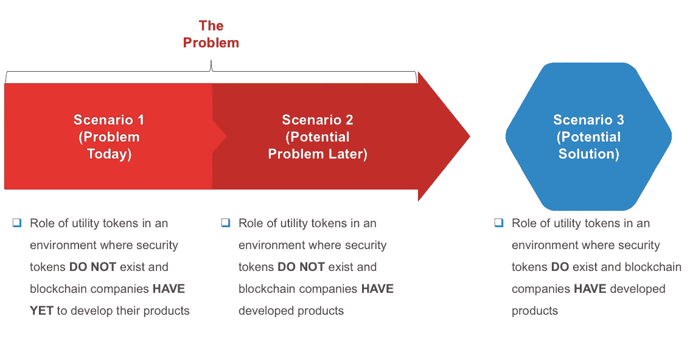
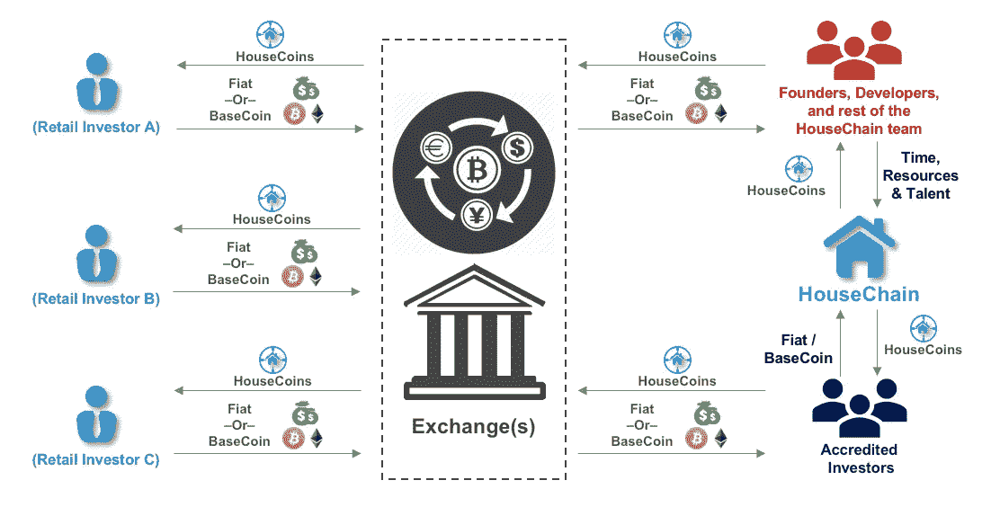

# 安全令牌的争论(第 1 部分，共 3 部分)

> 原文：<https://medium.com/coinmonks/the-argument-for-security-tokens-part-1-of-3-4bef6b8d8622?source=collection_archive---------4----------------------->

## **关于安全令牌如何减少实用令牌投机的思想实验，为功能强大的分散式产品铺平道路**

**简介**

在三篇文章的过程中，这个思想实验将展示存在的问题，以及只要实用令牌被视为投机的工具，这些问题就会存在，并断言为什么安全令牌将成为区块链/加密公司如何利用自己的新标准。

这个思维实验分为三个场景:

前两个场景展示了在缺乏安全令牌的情况下当今加密中存在的问题，以及如果加密公司不采用安全令牌作为筹集资本的新标准，可能会出现的潜在问题。

以一个说明性的公司为例，思维实验将更容易理解。为了这个思维实验的目的，让我们使用一个虚构的区块链公司，其标准如下:

公司名称:房屋连锁

产品:通过分散的网络提供短期租赁

实用令牌:家用硬币

安全令牌:HouseST

在深入细节之前，请随意参考我在[实用令牌](/coinmonks/utility-tokens-a-general-understanding-f6a5f9699cc0)和[安全令牌](/coinmonks/security-tokens-a-general-understanding-880bf6cec152)上的帖子，这些帖子可能会快速刷新这些东西是什么。

让我们开始吧。

**场景 1:在安全令牌不存在且区块链公司尚未开发其产品的环境中，效用令牌的作用**

最初，公用令牌在广泛的用户群体中激增(不一定被出售):创始人、开发人员、潜在的矿工、加密社区的成员，以及任何有足够知识来拥有加密钱包的人。早期的密码爱好者指出[网络效应](https://www.investopedia.com/terms/n/network-effect.asp)为什么这种做法是必要的。如果网络达到其用户的临界质量(即，令牌持有者的临界质量)，那么对公用设施令牌的需求将在最小或零用户获取成本的情况下增加，换句话说，公用设施令牌将升值。

到 2017 年年中，他们围绕加密资产的宣传全面展开，公用事业令牌发行者不再需要寻找有意愿的买家。世界对 ico 的需求永远不够。买家醉心于将他们的初始投资乘以我的倍数，不断将钱投入到 crypto，而很少考虑创始团队的优点或基础项目的可行性。

从那以后，聪明的投资者进入了 crypto 不，我不是用这种说法来称赞自己——逐渐减少了 2017 年的疯狂炒作。也就是说，加密仍然充斥着各种猜测。

以 HouseChain 为例，让我们看看效用令牌和投机是如何成为彼此的同义词的。HouseChain 希望创建一个分散的短期租赁网络。为了做到这一点，HouseChain 需要筹集资金。HouseChain 发行有限数量的 HouseCoins 出售给潜在投资者。首先，HouseCoins 通过一系列私下销售，以大幅折扣向资金雄厚的合格投资者出售 HouseCoins，从而吸引他们。一旦有足够多的 HouseCoins 卖给了这些初始投资者，HouseChain 就会推出 ICO，面向更广泛的合格投资者进行营销。散户投资者，也就是大多数投资 crypto 的人，只能在 HouseCoin 上市后购买 HouseCoin(例如， [CoinBase](https://www.coinbase.com/) ，[币安](https://www.binance.com/)等)。).

财大气粗的投资者以折扣价购买 HouseCoins，因为它期望 HouseChain 能够以全价出售其剩余的 HouseCoins，因此这个财大气粗的投资者从其投资中获得了直接收益。更广泛的合格投资者愿意以 ICO 价格购买，因为他们预计一旦 HouseCoin 在交易所上市，HouseCoin 的价格将会上涨。散户投资者坐在投机列车的最后，他们购买室内硬币，认为未来会有其他买家愿意支付更高的价格。

**Exhibit 1: Circulation of HouseCoin in Current Crypto Environment Where Utility Tokens Are Purchased for Speculation Only**

除了向合格的投资者出售其效用令牌，HouseChain 还向创始人、开发人员、ICO 营销人员和 HouseChain 团队的其他成员提供一些 HouseCoins，以补偿他们的时间、努力和/或服务。向创始人、开发商和 HouseChain 团队的其他成员发行的 HouseCoins 类似于员工股票补偿计划，当股票价格升值时，员工将从中受益。这群家庭硬币持有者将通过一个交易所出售他们的家庭硬币，有意愿的散户投资者坐在那里等待支付比家庭硬币最初价值高得多的价格。

家庭硬币的流通表明这些公用代币只不过是投机的工具。HouseChain 还没有开发出产品。HouseCoin 的持有者没有办法花掉他们积累的代币。那些持有室内硬币的人持有的原因只有一个:投机。那些从交易所购买家用硬币的人购买的原因只有一个:投机。

猜测的积极一面是，它给了加密行业全球认可。不利的一面是，它创造了一种非理性繁荣的状态，类似于 dot.com 的 T2 泡沫或 T4 的郁金香狂热。

当 HouseChain 最终开发出产品时，HouseCoin 持有者的行为会发生什么变化？答案将出现在这个思维实验的第二部分。

链接到第二部分:[安全令牌的参数(第 2 部分，共 3 部分)](/coinmonks/the-argument-for-security-tokens-part-2-of-3-2ecd73e367c)

**免责声明。这篇文章仅供参考。本帖表达的观点不是，也不应被理解为投资建议。本文件不是购买或出售此处提及的任何资产的要约，也不是要约邀请。这篇文章中的所有观点都是我个人的，不以任何方式代表 [CMX 资本](http://www.cmx-capital.com)或关联公司的观点。**