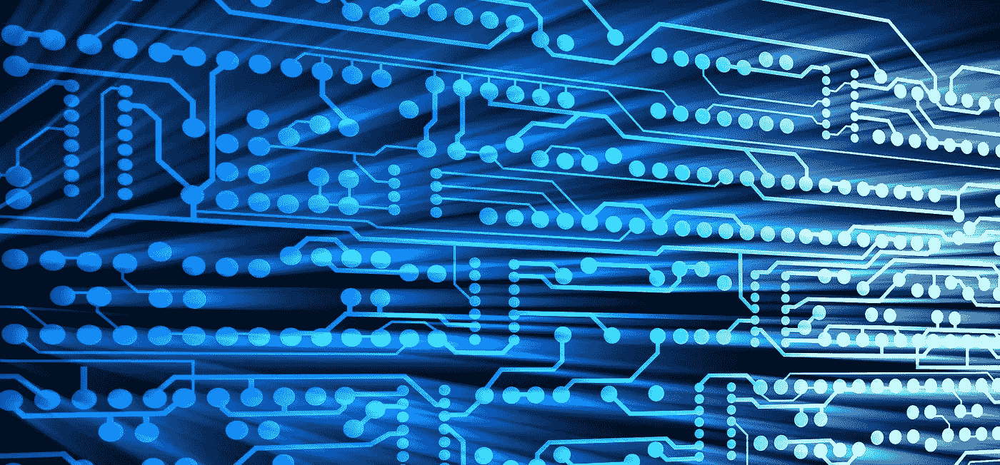
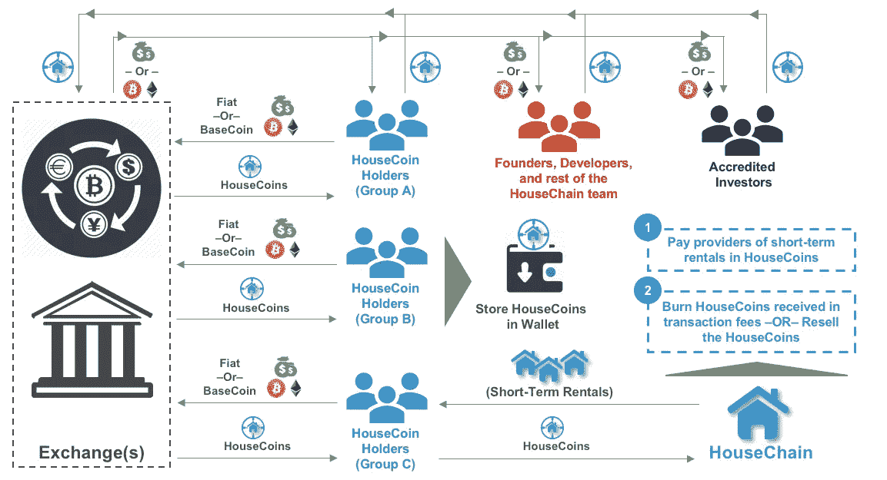

# 安全令牌的争论(第 2 部分，共 3 部分)

> 原文：<https://medium.com/coinmonks/the-argument-for-security-tokens-part-2-of-3-2ecd73e367c?source=collection_archive---------8----------------------->

## **关于安全令牌如何减少实用令牌投机的思想实验，为功能强大的分散式产品铺平道路**

你可以在这里阅读第一部分[关于安全令牌](/coinmonks/the-argument-for-security-tokens-part-1-of-3-4bef6b8d8622)的讨论。注意，两部分的介绍是相同的。

**简介**

在三篇文章的过程中，这个思想实验将展示存在的问题，只要实用令牌被视为投机的载体，这些问题就会存在，并断言为什么安全令牌将成为加密公司如何利用自己的新标准。

这个思维实验分为三个场景:

前两个场景展示了当今加密中存在的问题，即缺乏安全令牌，以及如果加密公司不采用安全令牌作为筹集资本的标准，可能会出现的潜在问题。

以一个说明性的公司为例，思维实验将更容易理解。为了这个思维实验的目的，让我们使用一个虚构的区块链公司，其标准如下:

公司名称:房屋连锁

产品:通过分散的网络提供短期租赁

实用令牌:家用硬币

安全令牌:HouseST

在进入细节之前，请随意参考我在[实用令牌](/coinmonks/utility-tokens-a-general-understanding-f6a5f9699cc0)和[安全令牌](/coinmonks/security-tokens-a-general-understanding-880bf6cec152)上的帖子，这些帖子可以作为快速刷新这些东西的工具。

让我们开始吧。

**场景 1(总结):在安全令牌不存在且区块链公司尚未开发其产品的环境中，效用令牌的作用**

目前，区块链公司分发公用事业代币的方式使得它们的公用事业代币只不过是一种投机工具。首先，区块链公司首先向早期合格投资者出售代币，这些投资者购买并持有代币，意图以更高的价格转售。此外，区块链公司向创始人、开发人员和他们团队的其他成员发放代币，以补偿他们的时间和努力。这种做法类似于任何公司的员工股票补偿计划。如果代币价格上涨，那些获得代币奖励的人会受益，就像如果公司股价上涨，那些获得股票奖励的人会受益一样。这些个人有动机持有他们的代币，并在以后转售给第三方以获利。

猜测的积极一面是，它给了加密行业全球认可。不利的一面是，它创造了一种疯狂炒作的状态，类似于 dot.com 的泡沫或 T2 的郁金香狂热。

阅读第一部分:[安全令牌的争论(第 1 部分，共 3 部分)](/coinmonks/the-argument-for-security-tokens-part-1-of-3-4bef6b8d8622)

**场景 2:在安全令牌不存在、区块链公司已经开发出产品的环境下，效用令牌的作用**

快进到 HouseChain 已经开发了它的分散短期租赁服务的时候，让我们分析一下 HouseCoins 的购买者将如何使用他们的代币。该分析假设 HouseChain 发展到成熟状态，没有证券代币成为筹集资本的标准(即，HouseChain 发行 HouseCoins，而不是 HouseSTs 来筹集资本)。

上述假设意味着一枚室内硬币有两种潜在用途:

投机手段

货物或服务的贸易方式

加密投资者称赞这一理论，即网络的价值随着网络用户群的增长而增加。然而，这种说法背后的假设是，用户实际上是在“使用”网络。如果用户在投机家用硬币——如表 2 中 A 组家用硬币持有者的情况——他们将 [*hodl*](https://en.wikipedia.org/wiki/Hodl) 并在未来的某个时间通过交易所转售代币，希望获利，而不是在网络内使用代币。这些类型的持有人 *hodl，*就像 HouseChain 的创始人、开发商和早期合格投资者从他们第一次收到 HouseCoins 以来一直在做的那样。这是因为他们的净值和/或投资价值直接取决于 HouseCoin 的价格升值。最终结果是这些持有者没有使用网络，因此没有为网络贡献任何价值。

**Exhibit 2: Different Incentives for Different Types of HouseCoin Holders in a Developed Product Environment**

另一类持有人(附表 2 中的 B 组)购买房屋硬币，因为他们打算支付短期租金，但目前没有迫切的需求。这些买家也看到 HouseCoin 不断升值，那么他们有什么动力现在和以后支付短期租金呢？与消费者在高度通缩环境下的反应相比，这些房屋硬币持有者没有动力“今天”使用他们的房屋硬币，因为等待“明天”会让他们以更少的代币租用相同的短期租金。因此，这些类型的家庭硬币持有者会把他们的家庭硬币存放在他们的钱包里，等待使用。

第三类 HouseCoin 持有者(图表 2 中的 C 组)将从交易所购买代币，并立即与 HouseChain 网络进行交易。这组持有人是活跃的网络用户，他们只代表了全部家庭硬币持有人的一小部分。网络的基本价值最终取决于它的活跃用户，而不是它的投机者。思考加密网络的基本价值让我想深入研究加密资产评估。为了不跑题，我就不说了；然而，我将留给你这个由[克里斯·伯恩斯克](https://medium.com/u/2a8f9285c9aa?source=post_page-----2ecd73e367c--------------------------------)撰写的关于[加密资产估值](/@cburniske/cryptoasset-valuations-ac83479ffca7)的精彩帖子，并承诺不久将在帖子中进一步讨论这个话题。

最后，HouseChain 的激励机制是什么？HouseChain 将如何处理它从活跃用户那里收到的令牌？HouseChain 可以用从网络交易用户那里收到的 HouseCoin 做两件事:烧掉或转卖。如果 HouseCoin 的价值是由投机决定的，那么 HouseChain 就会被激励去烧掉这些硬币。为什么？假设对家用硬币的需求保持不变，那么经济学的基本原理表明，家用硬币供应的减少(例如，焚烧家用硬币)将导致用户愿意为家用硬币支付的价格增加。如果 HouseChain 转售了 HouseCoins，那么它就暂时增加了当时流通中的 HouseCoins 的供应量。按照同样的逻辑，假设需求保持不变，供给的增加将导致价格下降。在这种情况下，创始人、开发者和 HouseChain 团队的其他成员都以 HouseCoin 的形式获得报酬，当 house coin 的价格上涨时，他们的净资产也会增加。因此，他们会被激励去焚烧家庭硬币。从长期投资者的角度来看，这是一个问题，因为那些负责 HouseChain 的人有动机促进短期价格升值，而不是采取行动使网络的长期价值最大化。

总而言之，如果大多数 HouseCoin 持有者不参与该网络，那么 HouseChain 将会开发出一个“僵尸网络”——换句话说，该网络将会正常运行，但只有少数甚至没有活跃用户。因此，在这种状态下，任何家庭硬币的价格上涨都将是由于投机，而不是来自网络基本价值的任何增加。

消除投机作为购买公用事业代币的原因是关键，以便在提供商品和服务的区块链公司与这些商品和服务的消费者之间存在贸易的情况下，拥有具有真实商业的功能性宏观加密经济。

第三篇文章将看看这样一个世界会是什么样子。

链接到第三部分:[安全令牌的争论(第 3 部分，共 3 部分)](/coinmonks/the-argument-for-security-tokens-part-3-of-3-5d9486786bf)

**免责声明。**本文仅供参考。本帖表达的观点不是，也不应被理解为投资建议。本文件不是购买或出售此处提及的任何资产的要约，也不是要约邀请。本帖中的所有观点都是我个人的，不以任何方式代表 [CMX 资本](http://www.cmx-capital.com)或关联公司的观点。