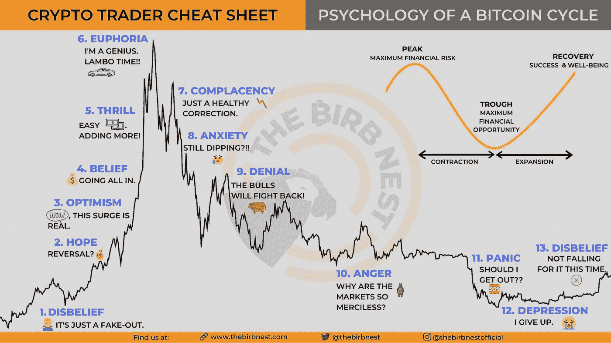
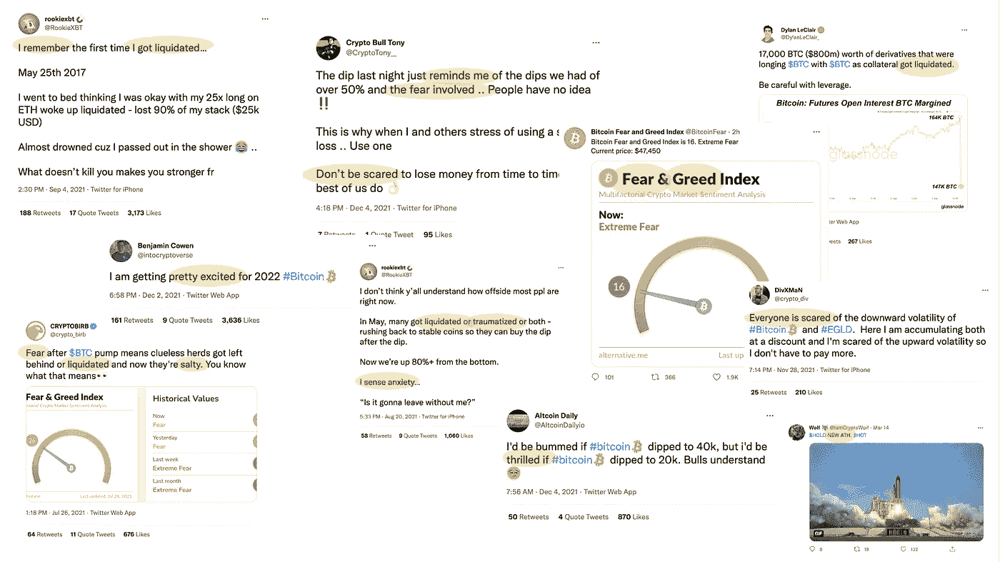
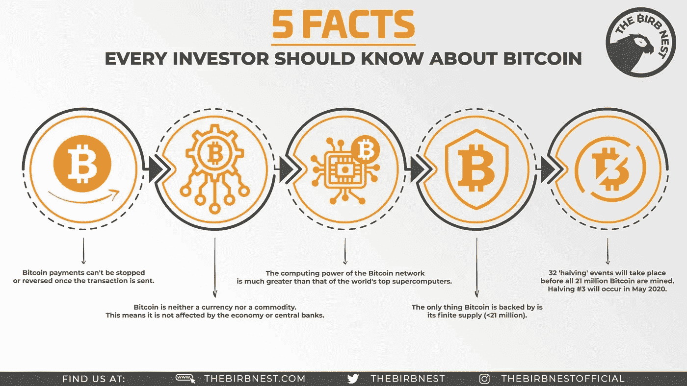
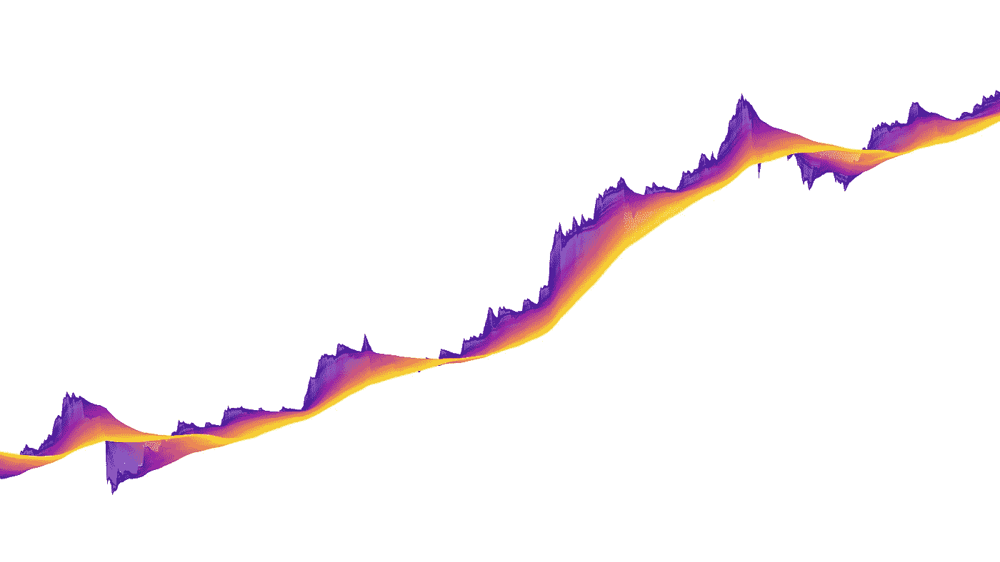

# 加密波的艺术:BTC 和 ETH。2121 & 1018.情感与分析。

> 原文：<https://medium.com/coinmonks/the-art-of-cryptowaves-btc-eth-2121-1018-long-short-4d61e136b029?source=collection_archive---------15----------------------->

> 加密波的艺术是一个由 3139 个生成性艺术价格波组成的集合，这些价格波是为了纪念 T2 的加密进化特性和 T4 的所有加密交易者而创造的。每一个 C **ryptowave** 都是一件**独特的艺术品**，其元素受到**价格波动和技术分析**的启发，拥有自己的调色板和特征。

在这篇文章和接下来的文章中，我将解释“密码波艺术”背后的基本原理。你可以在 [**网站**](https://theartofcryptowaves.com/) 、 [**推特**](https://twitter.com/TACryptowaves) 和 [**不和**](http://discord.gg/wvkPq7jH4f) 上找到更多信息，以及系列的第一篇文章[隐波的成因](/@288kartscientist/the-art-of-cryptowaves-genesis-310a2fa16ff2)。

Cryptowaves 的建造考虑到了**仔细和精确的设计**，再加上许多**参考**和**平行度**。我们来分析一下。

# 情感的过山车

如果你仔细观察 BTC 价格在中低时间段的演变，你会注意到不同的模式，如上升或下降通道，下跌，极端波动。

我打赌当你看着它的时候..**你可以记得你进入市场的时间**，你的记忆把你带回到**当时你正在经历的情绪**。

*   你什么时候买的第一个$BTC 或$ETH？是一头公牛吗🐂或**熊🐻市场**？
*   你的**情绪是什么**😃🤣🥰 ➡ ️🤨😞😖➡ ️😭🤬😱当你还是个新手的时候👩‍💻👨‍💻？或者甚至当你更 experienced🕵️‍♀️🕵️‍♂️的时候？
*   **你在支撑位买入了吗📈在阻力时卖出📉**，还是反过来？你赢得了吗💰还是你**迷路了😭**？
*   **在**低谷**期间，你有没有** [**hodl**](https://www.investopedia.com/terms/h/hodl.asp) ？你是钻石手吗💎🙌还是🧻手中的**纸**🙌？
*   你有没有模仿你最喜欢的密码专家的一个未知项目？
*   你是一个包包持有者吗👜2013 年或 2017 年之后🌋山峰？
*   你在想 cryptos 去**月球**吗🚀🌕？

密码波艺术的目的是**在算法生成的**艺术品**和**观众**、**、**如**交易者、密码交易者、投资者和散户之间建立联系和相互关系**。**

The Psychology of a Cycle, Infographic from The Birb Nest ([https://www.thebirbnest.com/infographics/](https://www.thebirbnest.com/infographics/))

> *在我看来，如果 Cryptowaves 项目的艺术能够唤起加密交易员和投资者随着时间的推移所经历的情感，并且能够永远代表和象征加密货币和加密项目的发展，那么它就是成功的。*

让我们来看看我在推特上发现的一些情绪的例子。正如你注意到的，有恐惧、快乐、压力、贪婪和兴奋等等。

# 生成艺术

在深入研究 Cryptowaves 及其设计之前，我认为将作品置于背景中是很重要的。

> **生成艺术，**也被称为[算法艺术和合成媒体](https://en.wikipedia.org/wiki/Generative_art)，是一个通过算法产生新想法、形式、形状、颜色或图案的过程。首先，创建为创建过程提供边界的规则。然后一台计算机按照这些规则代表你创作新的作品。

你可以在下面的链接中找到很多著名艺术家的精彩作品。

 [## 生成艺术:50 个最佳范例、工具和艺术家(2021 指南)——AIArtists.org

### 生成艺术是一个通过算法产生新思想的过程…

aiartists.org](https://aiartists.org/generative-art-design)  [## 生成艺术导论:它是什么，你如何制作它

### 生成艺术可能是一个令人生畏的话题——它似乎涉及到很多数学，而艺术在…

medium.com](/free-code-camp/an-introduction-to-generative-art-what-it-is-and-how-you-make-it-b0b363b50a70) 

生成艺术并不新鲜，过去有很多例子，维基百科提供了不同领域的列表。

新的部分是**区块链**、**分散应用** (Dapps)和**不可替代代币** (NFT)的出现，它们已经颠覆了一个行业。请参考下面的中等文章的一个很好的介绍。

 [## 密码朋克、密码猫&数字收藏品的未来

### 见见鲍勃。我以 0.2 ETH(当时大约 90 美元)的价格购买了 Bob。鲍勃的正式名字是密码朋克#1720，他是一个…

medium.com](/@Ozery/cryptopunks-cryptokitties-the-future-of-digital-collectibles-fe58599930b) 

# **BTC & ETH，2021 & 1018**

为什么选择比特币和以太坊来创建密码波？[比特币](https://en.wikipedia.org/wiki/Bitcoin)是整个加密市场的**驱动力**和**参照物**，而[以太坊](https://ethereum.org/en/)则是为成千上万**去中心化应用**提供动力的**骨干技术**。比特币也被用来给替代币定价(BTC 对的替代币)，最近以太坊也被用上了(ETH 对的替代币)。一些人甚至预测在未来几年内，BTC 将会崩溃。

**使用了符号和参考符号**，并且**嵌入到密码波**的设计中。可用密码波的数量是 3139，这是以下结果:

*   **2121** 用于**比特币的 Cryptowaves，**强调将有 2100 万个固定数量的比特币可供使用。
*   **1018** 隐波为**以太坊，**提醒 10 个卫是 1 个以太。

Infographic from The Birb Nest ([https://www.thebirbnest.com/infographics/](https://www.thebirbnest.com/infographics/))

# 长与短，年份与年份

**就像在葡萄酒领域**一样，可能会有几年的好年份，或者罕见的几年的顶级年份，然后是几年的正常季节，甚至是不好的季节，就像在秘密领域一样，可能会有**牛市期**，或者**极度牛市的几周/几个月，在市场上有**的欢欣鼓舞，或者正常的几周/几个月有**的盘整**，甚至有**熊市的几个月**一切下跌 50–90%。

让我们用密码波来分析其中的一些。

# 复古 2020–2021 版，长。

这种类型的隐波，“Vintage 2020–2021 edition，long”的特点是**稳定的 HTF 增长**、**巨大的波动**、 **8x 回报**和看涨的消息。

*   *返回* : **8x。**
*   *收益*:如果你在 2020 年 1 月 1 日在 BTC 购买了 10 万美元，在 2021 年 1 月 12 日在 HODL 购买了**和**美元，你会有大约 **80 万美元。**
*   *波动率* : **非常高**，如尖锐的紫色线条所示。
*   *生长* : **S 形**，如黄线所示。在 HTF，你不必担心太多，因为你的投资正在上升。
*   事件:发生了许多看涨和看跌的事情。【2020 年 3 月，由于 **Covid** ，所有市场都经历了一场巨大的崩盘。然而，价格跟随一个 V 形复苏，实际上继续追求历史高点(ATH)，直到 2021 年 4 月见顶**。从 5 月到 7 月，市场上一直存在恐惧和绝望，尤其是那些想在 4 月卖出，但没有卖出的人。
    7 月份，许多密码高手都在喊着做空 20k 甚至 10k。只有**几个** **职业交易者在 29k** 时喊底，另一次在 **40k** 左右(比如我跟着 [Crypto Birb](https://twitter.com/crypto_birb) )。
    2021 年 6 月 8 日**萨尔瓦多**立法议会**(在 [Nayib Bukele](https://twitter.com/nayibbukele) 领导下)通过了《比特币法**，给予加密货币比特币在 2021 年 9 月 7 日之后在萨尔瓦多的法定货币地位。
    12 月还不清楚比特币是遵循之前的周期，还是已经进入超级周期(我喜欢跟随 [TechDev](https://twitter.com/TechDev_52) 和[进入 Cryptoverse](https://twitter.com/intocryptoverse) 了解更多细节)。**

在“Vintage 2020–2021 edition，Long”中，有许多不同种类的加密波。这里只有几个黑色背景的例子。

如果你喜欢 Cryptowaves，请在这里给个赞，在[中](/@288kartscientist)和[推特](https://twitter.com/288kArt)关注我。加密波的艺术:

*   **网站**https://theartofcryptowaves.com/
*   **https://twitter.com/TACryptowaves 推特**T43
*   **不和**不和[discord.gg/wvkPq7jH4f](https://t.co/vHGIaZmPIK)

我会跟进更多关于其他类型的 **Cryptowaves 版本的故事！敬请关注。**

> 加入 Coinmonks [电报频道](https://t.me/coincodecap)和 [Youtube 频道](https://www.youtube.com/c/coinmonks/videos)了解加密交易和投资

## 另外，阅读

 [## 获取信号、交易机器人和套利

### 在本文中，我们将回顾 Bitsgap，这是一个满足您所有交易需求的一站式加密交易平台。它…

blog.coincodecap.com](https://blog.coincodecap.com/bitsgap-review)  [## 5 个最佳社交交易平台[2021] | CoinCodeCap

### 困惑于社交交易和副本交易哪个平台最好？本文将带您了解各种…

blog.coincodecap.com](https://blog.coincodecap.com/best-social-trading-platforms)  [## BlockFi 评论 2021:利弊和利率| CoinCodeCap

### 今天，我们提出了一个全面的 BlockFi 评论，这是一个成立于 2017 年的加密贷款平台，拥有其…

blog.coincodecap.com](https://blog.coincodecap.com/blockfi-review)  [## 如何在印度购买比特币？2021 年购买比特币的 7 款最佳应用[手机版]

### 如何使用移动应用程序购买比特币印度

medium.com](/coinmonks/buy-bitcoin-in-india-feb50ddfef94)  [## 加密税务软件——五大最佳比特币税务计算器[2021]

### 不管你是刚接触加密还是已经在这个领域呆了一段时间，你都需要交税。

medium.com](/coinmonks/best-crypto-tax-tool-for-my-money-72d4b430816b)  [## 存储比特币的最佳加密硬件钱包[2021] | CoinCodeCap

### 保管您的数字资产很容易，但找到正确的存储方式却是一项繁琐的任务。在线钱包有一个风险…

blog.coincodecap.com](https://blog.coincodecap.com/best-hardware-wallet-bitcoin)  [## Pionex 评论 2021 |免费加密交易机器人和交换

### Pionex 是为交易自动化提供工具的后起之秀。Pionex 上提供了 9 个加密交易机器人…

medium.com](/coinmonks/pionex-review-exchange-with-crypto-trading-bot-1e459d0191ea)