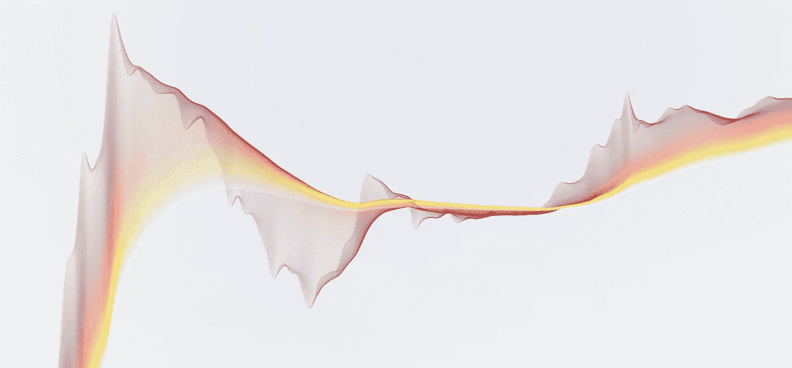
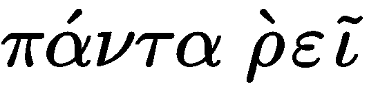
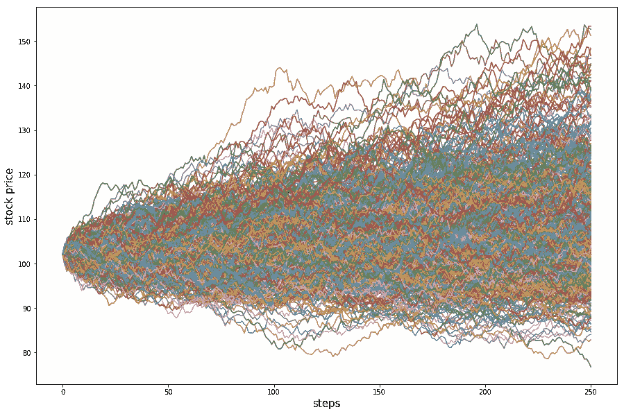
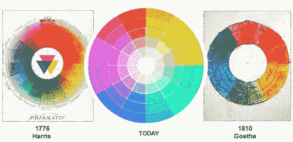
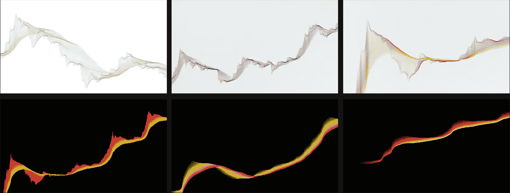

# 隐波艺术:色彩与生活

> 原文：<https://medium.com/coinmonks/the-art-of-cryptowaves-colours-and-life-3f2354372ebb?source=collection_archive---------14----------------------->

在这篇文章中，我将解释我在设计“隐波艺术”时所经历的过程和想法。

你可以在 [**网站**](https://theartofcryptowaves.com/) 、 [**推特**](https://twitter.com/TACryptowaves) 和 [**不和**](http://discord.gg/wvkPq7jH4f) 找到关于密码波艺术的一般信息，其他文章[在这里](/@288kartscientist)。

这个故事是关于颜色的..享受阅读吧！

# 生命的元素

总的来说，比特币和加密技术在这些年中产生了许多机会:**新的资产类别**和**新的投资机会**，新奇的和**颠覆性的应用**，**分散式金融**(DeFi)**新的交易所交易基金**(ETF)，最后还有**不可替代的代币** (NFT)。

> 这些新的机会代表了生活。

 [## 加密银行和分散金融，解释

### 随着加密货币开始重塑人们的借贷方式，数字货币的革命正在向银行业转移…

www.nytimes.com](https://www.nytimes.com/2021/09/05/us/politics/cryptocurrency-explainer.html)  [## 人们在非食物疗法上花费了数百万。什么？为什么？

### NFT，或不可替代的令牌，已经存在一段时间了，但是“NFT”是什么意思呢？几个…

www.theverge.com](https://www.theverge.com/22310188/nft-explainer-what-is-blockchain-crypto-art-faq) 

**命**给以前无法想象和打乱的项目，**命**给新的代币，**命**给新的投资，**命**给新的 NFT 收藏品，**命**给人新的机会。一些主题和相关的颜色组合在隐波中象征着**生命**因素。

如果一个人思考生活，他会想到什么样的元素？**水、土、火、气**、T42 为四大古代文化经典元素。这些元素被翻译成 4 种调色板，代表水、土、火和空气的不同颜色组合。

> **水、土、火&空气**

Photo by [Max Kukurudziak](https://unsplash.com/@maxkuk?utm_source=medium&utm_medium=referral) on [Unsplash](https://unsplash.com?utm_source=medium&utm_medium=referral)

# Phanta Rhei，万物流动

密码和所有市场都在不断变化，一切都处于流动状态，一切都经历周期。

根据哲学家赫拉克利特的说法。

我们每个人每年经历的周期的象征是自然季节。**春夏秋冬**因此是调色板，象征着生命的**周期**以及市场的**周期，**时间的**流动，**密码的**进化**。正如维瓦尔第在他的音乐杰作中永恒地代表了四季一样，隐波也继承了这一点。

> **春夏秋冬**

更详细地说，持续流动的另一个日常象征是日日夜夜的循环重复，日出日落，黎明黄昏。这两种元素是另一种调色板组合。

> **日出&日落**

Photo by [David Mullins](https://unsplash.com/@mullins?utm_source=medium&utm_medium=referral) on [Unsplash](https://unsplash.com?utm_source=medium&utm_medium=referral)

因为流动的途径需要是普遍的，当地球上的某些人群生活在完全的黑暗中，就像冬天在极圈之上，会发生什么？**北极光**，也被称为北极光，是出现在天空中的惊人效果，并且持续流动，就像赫拉克利特河一样。北极光事件中没有两个不同的时刻是相同的，因此没有两个隐波是相等的。细节不同，颜色组合相似，形状不一样。万物流动。

> 北极光

Photo by [Jon Anders Dalan](https://unsplash.com/@jonadalan?utm_source=medium&utm_medium=referral) on [Unsplash](https://unsplash.com?utm_source=medium&utm_medium=referral)

总的来说，一切都是由颜色和感知驱动的，颜色驱动着我们的情感和模式，是 cryptowaves 的永恒主题。暖色唤起爱、激情、幸福和愤怒，而冷色与平静、悲伤和冷漠联系在一起。

> 基本颜色

红色通常与兴奋和能量联系在一起，但也与危险联系在一起，而绿色则与平衡和成长、和谐和治愈联系在一起；橙色代表自信和成功，而蓝色代表信任与和平。颜色会影响我们的决策，这就是为什么某些技术分析师会把标准的红色和绿色蜡烛换成黄色或蓝色和灰色。

# 对比、随机性和建模

密码的特点是**对比**。

*   **多头&空头**头寸。
*   **牛市&熊市**趋势。
*   价格走向北方还是南方。
*   一个到达**前 10 名**的代币，或另一个失去市值并到达**前 100–200 名**的代币。

对比由**不同的颜色组合来象征。**

> 不同的颜色

Photo by [Etienne Girardet](https://unsplash.com/@etiennegirardet?utm_source=medium&utm_medium=referral) on [Unsplash](https://unsplash.com?utm_source=medium&utm_medium=referral)

在这个**恒定流中，**加密货币(以及一般的金融市场)可以建模为**连续时间随机过程**，例如[布朗运动模型](https://en.wikipedia.org/wiki/Brownian_model_of_financial_markets)。这个模型有一个内在的**随机成分**，在密码波中由**随机颜色表示。**

> 随机性

[https://www.quantconnect.com/tutorials/introduction-to-options/stochastic-processes-and-monte-carlo-method](https://www.quantconnect.com/tutorials/introduction-to-options/stochastic-processes-and-monte-carlo-method)

**技术分析**是交易员用来模拟股票价格行为或密码的工具。有没有类似的东西可以应用到隐波？**色彩理论**是每一种隐波色彩风格的内在驱动力。

> 色彩理论

无论是模拟、互补、分裂互补、三元还是四元，Cryptowaves 的设计都将色彩理论嵌入到每个方面。

[https://www.colormatters.com/color-and-design/basic-color-theory](https://www.colormatters.com/color-and-design/basic-color-theory)

 [## 让你成为更好的 UX 设计师的 10 个色彩理论问题

### 你知道 RGB 和 CMYK 的区别吗？

aryanindraksh.site](https://aryanindraksh.site/10-questions-of-color-theory-that-will-make-you-a-better-ux-designer-b5244c1341a6) 

# 摘要

如你所知，Cryptowaves 的颜色是对颜色和颜色理论进行深入研究和分析的结果，同时也与希腊哲学、音乐和日常生活相类似。

> 生命的元素。四季。日落和日出。基本颜色。不同的颜色。随机颜色。

## 以前的文章:

*   [隐波艺术:创世纪](/@288kartscientist/the-art-of-cryptowaves-genesis-310a2fa16ff2)
*   加密波的艺术:BTC 联邦理工学院。2121 & 1018。情绪&分析

如果你喜欢隐波，请在**和 [**推特**](https://twitter.com/288kArt) 中给一个**喜欢**和**的跟我来**。[隐波艺术**网站**在这里](https://theartofcryptowaves.com/)和[推特在这里](https://twitter.com/TACryptowaves)。**

**我会跟进更多的故事！**

****敬请期待。****

> **加入 Coinmonks [电报频道](https://t.me/coincodecap)和 [Youtube 频道](https://www.youtube.com/c/coinmonks/videos)了解加密交易和投资**

## **另外，阅读**

*   **[加拿大最好的加密交易机器人](https://blog.coincodecap.com/5-best-crypto-trading-bots-in-canada) | [赌注加密](https://blog.coincodecap.com/staking-crypto)**
*   **[如何在印度购买比特币？](/coinmonks/buy-bitcoin-in-india-feb50ddfef94) | [WazirX 审核](/coinmonks/wazirx-review-5c811b074f5b)**
*   **[最佳网上赌场](https://blog.coincodecap.com/best-online-casinos) | [硬件钱包](/coinmonks/hardware-wallets-dfa1211730c6)**
*   **[如何在 WazirX 上购买柴犬(SHIB)币？](https://blog.coincodecap.com/buy-shiba-wazirx)**
*   **[比特币主根](https://blog.coincodecap.com/bitcoin-taproot) | [排名前 6 的比特币信用卡](/coinmonks/bitcoin-credit-card-bc8ab6f377c6)**
*   **[最佳免费加密信号](https://blog.coincodecap.com/free-crypto-signals) | [YoBit 评论](/coinmonks/yobit-review-175464162c62) | [Bitbns 评论](/coinmonks/bitbns-review-38256a07e161)**
*   **[huo bi 的加密交易信号](https://blog.coincodecap.com/huobi-crypto-trading-signals) | [BitMEX 评论](https://blog.coincodecap.com/bitmex-review)**
*   **[7 个最佳零费用加密交易平台](https://blog.coincodecap.com/zero-fee-crypto-exchanges)**
*   **[分散交易所](https://blog.coincodecap.com/what-are-decentralized-exchanges) | [比特 FIP](https://blog.coincodecap.com/bitbns-fip) | [Pionex 审查](https://blog.coincodecap.com/pionex-review-exchange-with-crypto-trading-bot)**
*   **[用信用卡购买密码的 10 个最佳地点](https://blog.coincodecap.com/buy-crypto-with-credit-card)**
*   **[OKEx 评论](/coinmonks/okex-review-6b369304110f) | [Kucoin 交易机器人](/coinmonks/kucoin-trading-bot-automate-your-trades-8cf0ca2138e0) | [期货交易机器人](/coinmonks/futures-trading-bots-5a282ccee3f5)**
*   **[AscendEx Staking](https://blog.coincodecap.com/ascendex-staking)|[Bot Ocean Review](https://blog.coincodecap.com/bot-ocean-review)|[最佳比特币钱包](https://blog.coincodecap.com/bitcoin-wallets-india)**