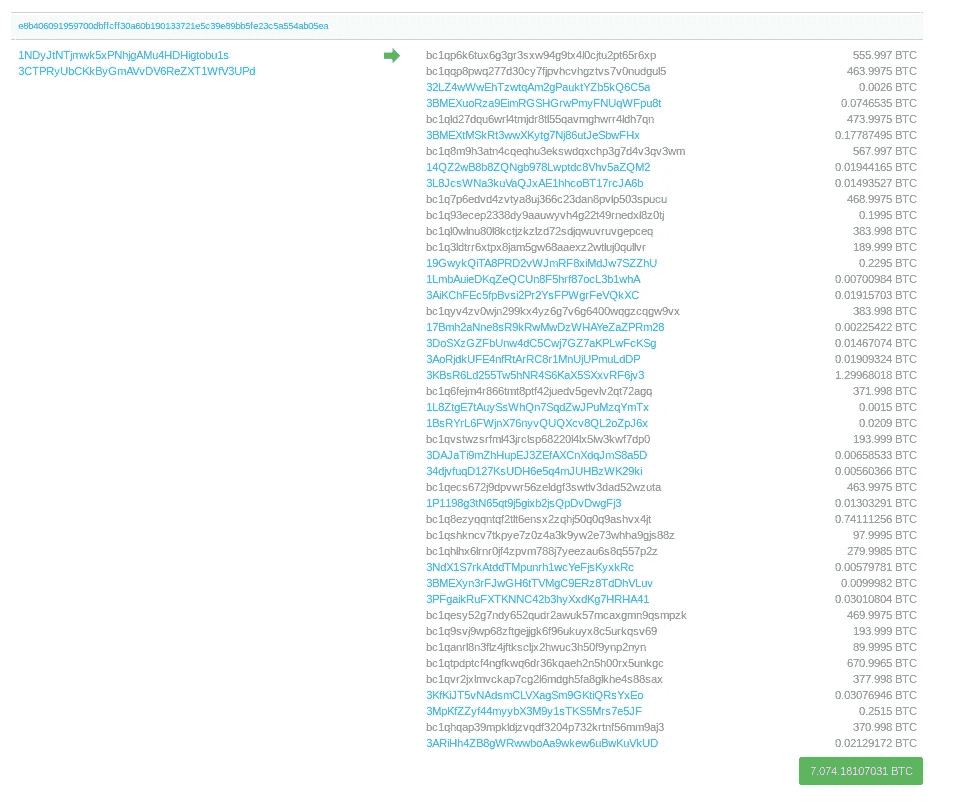
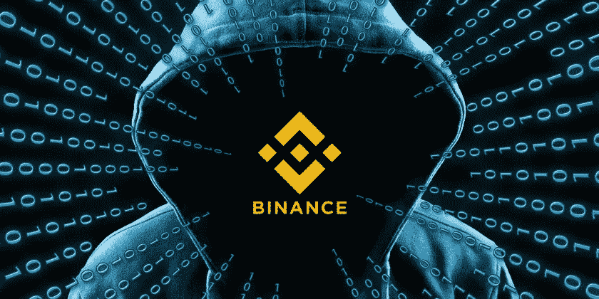

# 币安黑客

> 原文：<https://medium.com/coinmonks/the-attack-on-binance-eba46700eef6?source=collection_archive---------3----------------------->

The BTC withdrawal from Binance’s hot wallet

币安的第一次重大黑客攻击发生在昨天。7074 BTC 从币安的钱包里被偷了。在一份新闻稿中，币安首席执行官赵昌鹏表示:

> 我们发现了一个大规模的安全漏洞，今天，2019 年 5 月 7 日 17:15:24。黑客能够获得大量的用户 API 密钥、2FA 代码和潜在的其他信息。黑客使用了各种技术，包括网络钓鱼、病毒和其他攻击。我们仍在总结所有可能使用的方法。还可能有其他尚未确定的受影响帐户。

我所建议的大部分都是基于对事件真相的假设。我的目标是解决组织应该拥有的最佳安全实践。这一切都假设币安所说的一切也是真实的。目前还没有太多关于这次攻击的信息。出于各种原因，币安没有透露确切的渗透点。如果仍然存在安全漏洞，币安希望在披露最终问题之前纠正这些漏洞。币安也不想提醒攻击者，如果攻击者仍然在他们的网络基础设施内部，币安知道他们是如何破坏网络的。这将允许攻击者玩猫捉老鼠的游戏，并进一步延长他们不必要的逗留。从几个小时后的安全发布和 [CZ 的 AMA](https://www.pscp.tv/w/1mrGmvjpbqBJy) 来看，他提到每个帐户应该改变他们的 API 密匙和 2FA 密匙。这让我相信这个漏洞可能会影响 API 密匙和 2FA 密匙的种子生成。这种集中创建密钥的方式总是容易受到攻击。近年来的技术已经允许最终用户能够创建和管理这些密钥。如果在客户端创建，新的风险将转移到确保用户正确使用/存储这些密钥。

The evil hacker setting their eyes on Binance

# 币安注意事项

币安支持短信，TOTP 支持 2FA。SMS 2FA 已被破解，围绕使用 [SMS as 2FA 的安全漏洞已被深入讨论](https://blog.goodaudience.com/a-cryptocurrency-security-approach-to-avoid-sim-porting-e8001247e62?source=---------7------------------&gi=944cb683c089)。它完全坏了。TOTP 遭受 DNS 劫持攻击。还有一个问题是 TOTP 种子是在服务器端生成的。如果攻击者能够渗透到币安并获得该种子，那么他们就有可能获得每个最终用户的 2FA 代种子。

FIDO2 和带有客户端生成的密钥的硬件令牌将有助于减少这些攻击。用户错误仍然是一个大问题，这看起来是攻击的最大元凶。攻击者一旦有了一个帐户，就不会立即尝试提取 BTC。相反，他们选择了一个更合适的时间来提取资金。然后，攻击者能够在一次交易中提取超过 7000 BTC。之前，我写了一篇文章，当[币安成功地阻止了一次类似于这次](/@cryosecurity/binance-phishing-site-and-how-to-navigate-your-security-stance-b44a2dfe1171)的攻击，在它完全执行之前阻止了一次大规模撤军。这个之前提到的安全事件发生在 2018 年 5 月左右。币安这次没能阻止它。

币安有单独的基金(名为 SAFU 基金)用于这类黑客攻击，但如果这种攻击的很大一部分是由于用户错误。币安不能因为其最终用户的安全技能差而总是被套牢(这当然取决于这样一个事实，即最终用户控制问题，就像币安所说的那样)。币安应该实施强制性安全措施。这就变成了一个方便的问题，但是正如我们在这个领域和一般的安全领域所看到的，你不能两者兼得。你只能拥有便利或安全。

# 比特币重组？

提到的一个可能的解决办法是重组 BTC 链。出于各种各样的原因，密码社区发出了强烈抗议。我不会讨论这个问题所带来的哲学问题。我是从一个安全研究员的角度来考虑这个问题的。需要有一个强有力的理由让矿业网络勾结足够长的时间来执行重组。CZ 表示，这只是一个“由社区提出的”想法。比特币网络足够强大，足够庞大，要在网络上达成共识会非常困难。矿工们可能没有足够的动机，仅仅为了金钱利益而策划对币安黑客的报复。激励动机可能不足以让足够多的矿工上船。[中本聪共识](https://blockonomi.com/nakamoto-consensus/)为这类攻击设置了障碍，并表明网络真正的去中心化本质不允许个人、公司或企业重置账本。为了澄清，CZ 表示这只是一个他刚刚被告知的想法，看起来他们并不打算走这条路。CZ 发推文:

> 在与包括 [@JeremyRubin](https://mobile.twitter.com/JeremyRubin) 、 [@_prestwich](https://mobile.twitter.com/_prestwich) 、 [@bcmakes](https://mobile.twitter.com/bcmakes) 、[@ hashufl](https://mobile.twitter.com/hasufl)、 [@JihanWu](https://mobile.twitter.com/JihanWu) 等人在内的各方沟通后，我们决定不采用重组的方式。考虑因素是:
> 
> 优点:1 我们可以通过将费用“转移”给矿工来“报复”黑客；2 在此过程中阻止未来的黑客攻击企图。3.探索比特币网络如何处理类似情况的可能性。
> 
> 反对意见:1 我们可能会损害 BTC 的信誉，2 我们可能会导致比特币网络和社区的分裂。这两项损失似乎都超过了 4000 万美元的报复。黑客们确实展示了我们设计中的某些弱点和用户困惑，这在以前并不明显。反对意见:4 虽然这对我们来说是一个非常昂贵的教训，但它仍然是一个教训。保护用户资金是我们的责任。我们应该承认。我们会学习和提高。一如既往的感谢大家的支持！

# 现在怎么办？

对于受此攻击影响的用户来说。值得称赞的是，币安为这次活动做了充分的准备。这个漏洞可能会更严重。这并不是说 7074 BTC 是一个小数目，但正如历史告诉我们的那样，当大规模黑客攻击交易所时，它往往会使交易所陷入糟糕的财务状况。如果你使用交易所来储存你的资产，那么我确信我在这里写的任何东西都不会改变你的想法。你不应该在交易所长期储存你的资产。在交易所里只保留你能承受损失的密码。如果 交易所会被黑，那就不是 ***的问题了。**的事*的事*的时候**的事。互联网上暴露的每一件东西都是易受攻击的，但归根结底是侵入你的容器/基础设施有多困难。如果你是一个大的机构持有者，你应该保持对你的私人钥匙的控制/所有权。即使您完全信任您的服务，如果您不拥有您的密钥，您就没有对该资产的适当要求权，因此始终存在内部威胁的风险。***

*如果您有任何关于数字资产安全的问题或任何其他与加密货币安全相关的安全问题，请随时联系我在 Josh@airfoilcapital.com 或访问* [*翼型服务*](http://Airfoil.services)

> [在您的收件箱中直接获得最佳软件交易](https://coincodecap.com/?utm_source=coinmonks)

