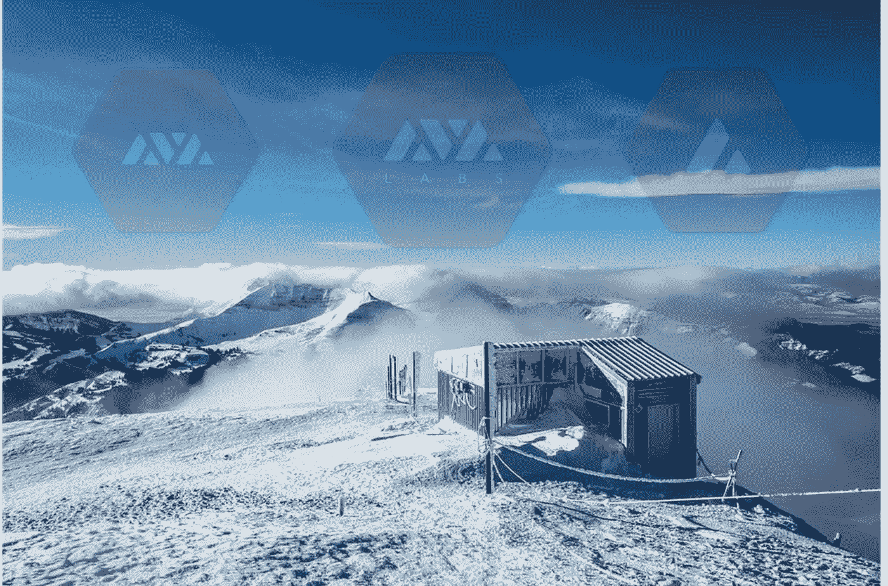

# 雪崩平台

> 原文：<https://medium.com/coinmonks/the-avalanche-ecosystem-3f06c5f9387e?source=collection_archive---------4----------------------->

From left to right : The Avalanche Platform, Avalabs and $AVAX

## 一组计算机科学博士如何将一份“匿名”白皮书转化为现实平台。

如今，分散式系统正成为一个普遍的概念。去中心化的应用在未来将成为一种商品。但是非技术爱好者很难看到剩余的障碍来征服更大的用户群。事实上，甚至一些技术爱好者有时也会被他们的热情所淹没，忘记还有许多问题需要回答。

随着专家们处理有待解决的问题，许多框架出现在开放分布式系统的世界中。其中最常用的是 tryptic 可伸缩性——去中心化——安全性。但是，即使在这个问题上，胰蛋白酶专家也没有就定义达成一致:如何定义可伸缩性？是 TPS 吗？终结？什么是去中心化？是用户数量吗？参与节点？什么是安全？是工业级函数语言吗？良好的验证框架？

随着许多分散融资项目的出现，很明显，网络应该能够处理大量交易(TPS)，快速验证交易(终结性)，并将参与扩展到大量节点。除了这些实际考虑之外，网络应该尽可能环保，以获得长期采用。

为了使事情更容易理解，让我们尝试从一个开放的分布式系统或平台(无论是区块链还是 DAG)的目标开始:许多机器(或节点)一起工作来维护一个网络和一个分类帐。无许可系统中的假设是任何人都可以加入网络，并且这些机器互不信任。但是需要信任他们合作的结果。因此，合作机制对于确保这种全球信任是必不可少的。验证此输出有一些重要的概念:

*   **一致协议:**这是一种协议(算法、架构和属性)，允许机器在每个瞬间就网络和账本的状态达成一致。
*   **反攻击机制:**这是网络的特点，将“双花”或任何其他黑客攻击的风险降至最低。

例如，以下是一些可能被误解的概念——摘自[这个关于共识协议的优秀系列文章](/@vardan.sevan/consensus-protocols-e859afa54838):

> 工作证明(PoW)不是一个共识协议。它是一个战略元素，可以添加到某些类型的共识协议中，否则这些协议将是不可靠的，甚至是完全不起作用的，以便通过减慢它们的速度和降低它们的吞吐量来使它们工作。PoW 还可以作为抵御 Sybil 攻击的防御机制。比如比特币，中本聪共识协议中使用 PoW，这是基于最长链的规则。
> 
> 利害关系证明(PoS)不是一个共识协议。就像在 PoW 的情况下一样，PoS 是一种用于减少节点数量的方法，这些节点被允许参与添加或投票支持区块链上的新块，或者任何类型的网络公共存档上的另一种记录或事务。PoS 还可以降低 Sybil 攻击的风险。

现在让我们回到共识协议的历史:

*   **70 年代**:研究开始寻找解决共享网络中共识问题的方法。
*   **在 80 年代&90 年代:**我们看到了一些众所周知的协议的出现:基于法定人数；Paxos/Raÿt，PBFT。由两位图灵奖获得者 Leslie Lamport 和 Barbara Liskov 的工作领导。
*   **2008:**中本聪的突破性协议，基于最长链和工作证明。
*   **2018 年:**斯诺家族的论文被“火箭队”投到了 IPFS，基于流行病协议和八卦网络。该小组与康奈尔大学的 Emin Gun Sirer 教授保持联系。尽管对论文作者的身份存在争议，但它似乎提供了一种达成共识的全新方式。

然后，雪崩平台开始形成:

*   **2019:**团队揭示了 Avalabs，一个致力于开发基于协议的平台的实体。
*   **2020 年:** Avalabs 成功推出了拥有 1000 多个验证器的测试网，并完成了代表 100 多个国家的令牌的首次分发。

值得注意的是，核心团队在开放分布式系统生态系统中有多年的贡献:

*   **Emin Gun Sirer** 在中本聪论文问世之前的 2002 年发布了一篇工作证明论文。他参与了比特币和以太坊的早期研究，并为许多已建立的项目提供建议。
*   Ted Yin 开发了 Hotstuff 协议，这是与脸书的 Libra 一起测试的协议。
*   **Kevin Sekniqi** 发表了关于 stablecoins 框架和加密安全的研究论文。
*   **吴炯**非常了解数字资产管理领域，自 1992 年以来一直涉足金融领域。

有趣的是，该团队在项目开始时试图只针对一个商业案例，这就是 DeFi。他们的雄心是建立金融互联网，这可能会颠覆整个行业。他们周围都是优秀的人才，他们会帮助尽可能多的用户和参与者。来实现这个宏伟的愿景。

## Avalanche 是一个开源平台，用于启动高度分散的应用程序、新的金融原语和新的可互操作区块链。

它将允许做什么？

*   **推出定制的区块链，私有&公共:**借助 Avalanche，用户可以部署符合任何应用需求的区块链。使用他们自己的虚拟机进行构建，并明确规定区块链应该如何运行。
*   **创建和交易数字资产:** Avalanche 能够推出智能资产或符合特殊参数和交易限制的真实世界资产的数字表示。[最近的一个合作伙伴关系提出了一个非功能性测试的分散交换方案！](/avalabs/polyient-games-to-bring-nft-focused-decentralized-exchange-to-ava-labs-avalanche-2f7c3c6e738d)
*   **构建可扩展的智能合约和 dapp:**通过利用 Avalanche 协议，开发人员可以启动智能合约，这些合约可以在一秒钟内确认，并扩展到数千或数百万个验证器。

该平台尚未推出，mainnet 在 8 月底之前待定。虽然该团队需要交付并证明该系统在真实世界环境中工作，但 testnet 和底层技术显示出良好的前景。暂时如此。

**全面了解雪崩平台开发团队和背景:**

 [## 团队|艾娃实验室

### 我们是计算机科学、经济、金融和法律领域的世界级专家团队，在纽约市和…

www.avalabs.org](https://www.avalabs.org/team) 

> [*在您的收件箱中直接获得最佳软件交易*](https://coincodecap.com/?utm_source=coinmonks)

