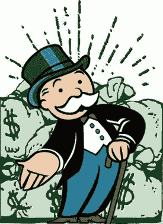
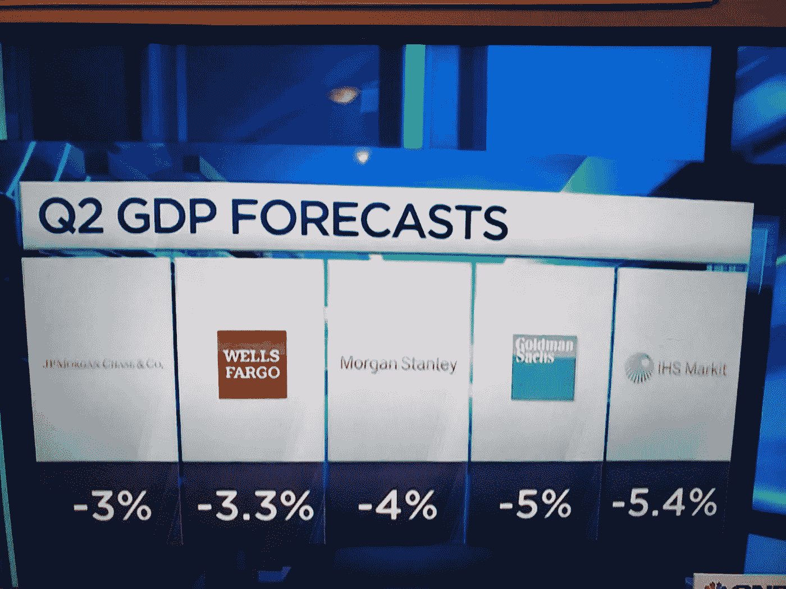
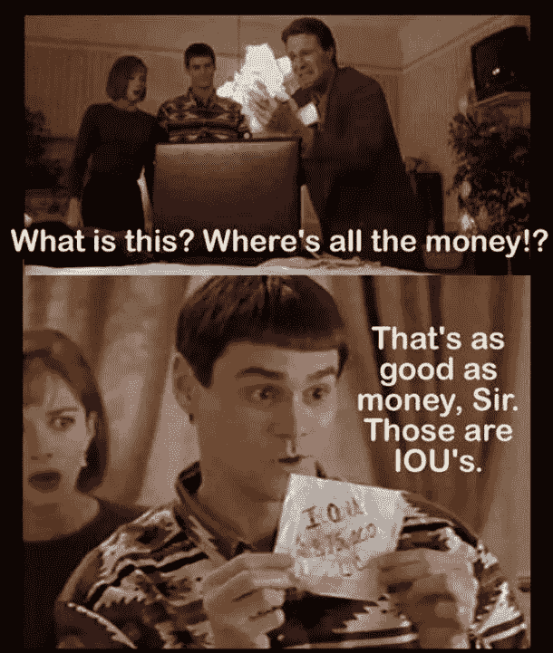
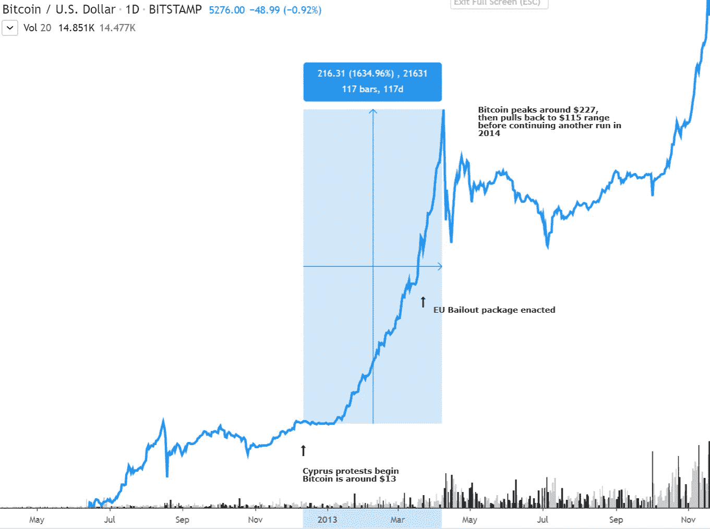
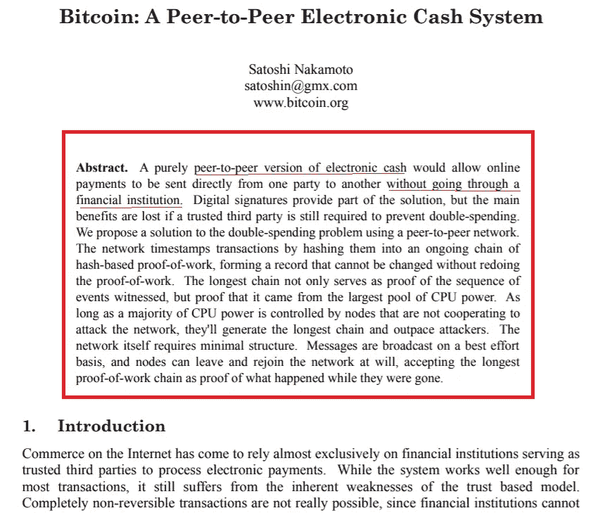
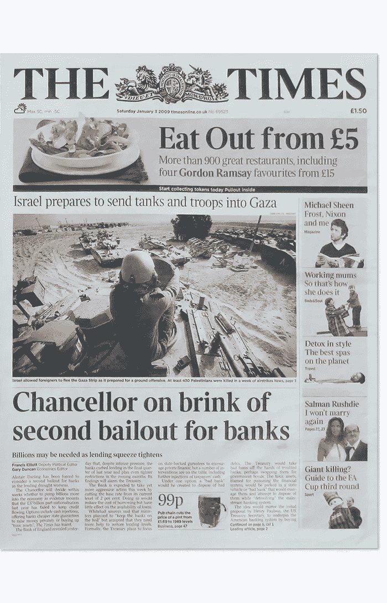
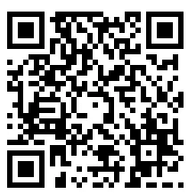

# 这家银行永远不会破产

> 原文：<https://medium.com/coinmonks/the-bank-never-goes-broke-9ae22627bf48?source=collection_archive---------1----------------------->

玩过棋盘游戏“大富翁”的人都知道，“银行永远不会破产。如果银行的钱用完了，银行家可以通过在任何普通纸上写字来发行更多的钱。

**银行破产实际上是违反规则的。**

大富翁游戏适用于棋盘游戏之外的真实世界(不幸的是)。这个游戏被称为“大富翁”并不是巧合:尽管你可能认为这个游戏的目标以及如何获胜是为了创造一个大富翁——实际上更像是**银行是大富翁**——一个永远不会输的大富翁。历史表明，银行家从来不会输。这家银行永远不会破产。

如果你还记得在 08 年，银行“太大而不能倒”,银行接受了纳税人资助的紧急援助，而这些援助被发放给了银行家高管奖金。

公众经常忘记银行是一个企业，一个靠贷款(利息)赚钱的企业。如果银行从贷款中赚钱，他们就会受到激励去发放尽可能多的贷款。显然，他们必须小心谨慎，不要超过现金存款或准备金限额，并保持偿付能力。除非你有 John Q. Public 来承担你糟糕的商业决策。

当这一特定业务因糟糕的商业决策(即贷款给不良候选人、贷款过多、没有储备足够的现金等)而注定失败，并开始收获糟糕商业投资的回报时，它从未失败过:银行以某种方式获得了纾困。

想象一下，不管你的错误投资有多大，不管你的决定有多冒险，不管你有多不负责任，拥有一家不会失败的企业。你会收获做出冒险决定的回报，但如果它对你不利，你绝对不会输。当你真的输了，你可以把责任归咎于其他因素(“贸易赤字”、“疲软的经济”、“科罗诺病毒”)，让纳税人为你纾困，“当然是为了公共利益”。这将是一个甜蜜的安排——一个只有银行家才能拥有的安排。

银行并不是因为系统薄弱而倒闭的。这个系统失败了，因为银行太弱了。“我不打算解释银行是如何脆弱的，以及为什么联邦储备系统是一个骗局——那是另外一个帖子——但现在，只要知道纵观历史，当银行因其鲁莽而倒闭时，他们总是会得到救助。这家银行永远不会破产。证明？这里有几个最近的案例，银行从不亏损，所有亏损都被社会化了。

你可能会想，“是的，这有点糟糕，也不公平，但我为什么要在乎呢？联邦政府用我们的钱做得更糟”。有太多的理由说明美联储银行系统是邪恶的、腐败的，应该从地球上彻底清除，但我现在只阐述一个理由——下一次救助以及它对你个人的影响。

“科罗诺病毒”，“中国病毒”，“新冠肺炎”——现在被指责为银行的弱点。事实上，只是针头引起了爆裂，但并没有产生泡沫。记住，这是银行干的。经典的“嫁祸于人”。

银行已经开始抱怨，指责病毒。当然，他们不会告诉你[他们通过制造假币并借给消费者，年复一年地在银行存款上赚取超过 8900%的回报率](https://youtu.be/iTuqtMDsI8s?t=86)。他们不会站出来说“我们制造了资产泡沫，我们应该为此负责”。记住，这是科罗诺病毒的错。

Poor, poor, banks!

当然，公众将会来拯救银行。不是为了银行的利益——当然是为了公众的利益！你不想看到银行倒闭吧？你不会希望航空公司破产吧？当然不是。

因此，约翰 Q. Public 将再次站出来买单。想象一下，公众是一个富有的父亲，总是为他的继子的不良行为承担责任:他总是保释他的继子出狱，代表他宣布破产，支付他的房租。继子永远不会为自己的错误决定承担责任，而父亲会。现在想象一下，儿子说“为了你的利益，爸爸，你必须把我从监狱里保释出来。你不会想看到我失败吧？”。

不过，我可以推测，这次他们将如何拯救银行是 TBD 的事。* *请记住，这是我的推测——我写这篇文章的原因是因为我爱的人，朋友和家人，同事，熟人，任何人！可以采取先发制人的措施，以防这种类型的银行纾困(或在这种情况下“保释”)发生。你如何选择采取先发制人的措施最终取决于你，尽管我会暗示我是怎样的。**

2008 年后，当银行做出令人难以置信的糟糕投资时，人们对拯救银行感到非常恼火。这不仅激怒了人们，而且纳税人的钱被用来给银行高管发放丰厚的奖金——这着实激怒了公众。因此，政府基本上通过多德-弗兰克法案与银行家达成了一项协议，即“T4”不再提供救助。下一次，你不会因为你的错误决定而收到公款。

这是好消息，对吗？从表面上看，是的，但是细节决定成败。回到垄断游戏:银行**永远不会**破产。在同一个多德-弗兰克法案(细则)中，在银行资不抵债的情况下，政府将直接介入**的纾困，而不是约翰 Q. Public 轻抚支票来纾困银行。**

**“I’m from the government, and I’m here to help”**

**政府如何处理这些保释？简单来说，联邦存款保险公司将介入并监督和控制银行的运作。这一切看起来都很好，直到你意识到[法案](https://www.law.cornell.edu/wex/dodd-frank_title_II)明确规定联邦存款保险公司将迫使股东、债权人和储户承担破产金融公司的损失。**

**关键词是储户。如果你把钱存入银行，你就被认为是存款人。政府是来帮忙的！当然是用你的钱。**

**你可能会相信，当你把工资支票放进真空管，看到富国银行(Wells Fargo)应用程序上的数字上升时，这笔钱就是你的了。恰恰相反。它们实际上是银行欠客户的一份报表。你存入的资金不再是存款人(你)的财产。相反，存款人(你)成为银行的无担保债权人或贷款人。**

**多德-弗兰克法案在欧洲巴塞尔协议之后被模仿。2013 年 3 月，塞浦路斯已经进行了这种“保释”的试运行。由于糟糕的决策，银行家再次面临破产。为了寻求帮助，塞浦路斯政府关闭了塞浦路斯银行。当然，银行的大股东在破产的消息公开之前就退出了。[其余股东几乎全军覆没，21，000 名存款超过 100，000 欧元的银行客户看到他们 47.5%的无担保储蓄被转换为股权，**这使他们成为一家破产银行 81.4%的所有者**](https://infinitebanking.org/banknotes/from-bailouts-to-bail-ins-understanding-the-dodd-frank-act/) 。银行重新开业后，储户开始恐慌，试图提取任何可能的现金，结果却遇到自动取款机排长队和严格的取款限制。**

****总结一下**，塞浦路斯银行做出了高风险的决策，他们面临破产。政府介入(当然是在大股东离开之后)，用剩余存款人的钱来保持银行的偿付能力。然后，他们给其他储户一张“借据”纸片(而不是他们的现金)，并说，“恭喜！你现在拥有一家倒闭银行的股份”。告诉我，如果你在银行存了 10 万美元，你会接受其中的一半被取走，换成一家面临破产的银行的股票吗？**

****

**你可能会想，“嗯，在美国，联邦存款保险公司为我的存款提供高达 25 万美元的保险，我很好”。**

**根据联邦存款保险公司的网站，目前用于在银行挤兑或保释事件中保护消费者的保险基金为[1103 亿美元](https://www.fdic.gov/bank/analytical/qbp/2019dec/qbp.pdf#page=1)。这听起来是个不错的数目，对吗？直到你意识到商业银行系统中有 [18.2 万亿](https://alfred.stlouisfed.org/series?seid=TLAACBW027SBOG&utm_source=series_page&utm_medium=related_content&utm_term=related_resources&utm_campaign=alfred)(带 T)美元。这就是人们在银行里的存款。FDIC“保险基金”可以覆盖商业银行系统中 0.6%，甚至不到 1%的资产(货币)。**

**举个例子，联邦存款保险公司的保险基金可以为美国的每个人支付 337 美元。然而，如果你认为联邦存款保险公司保险基金会平等对待每一个人，并公平分配，那你就错了。就像塞浦路斯银行挤兑一样，银行家、股东和关系密切的人将首先掠夺联邦存款保险公司的保险基金。即使他们平均分配，337 美元是多少？那可能是我家一个月的食品杂货。**

**至此，我希望你对银行持极度怀疑的态度。你应该害怕。但我想成为希望的灯塔，而不是以一个坏的音符结束这个故事。我相信有办法保护自己。你可能不同意我的方法，但你至少应该采取你认为会保护你一生积蓄的行动。**

**2013 年塞浦路斯银行挤兑期间，比特币暴涨 1600%，这并非巧合。**

****

**你可能想知道..为什么？比特币是如何关联的？我试图向大多数人解释比特币，但他们并不真正理解它，尤其是当它被描述为“一种加密的区块链技术，用于分发分散的账本，实现点对点交易”时。我可以看到你的眼睛现在掩饰。人们认为这是假互联网硬币，或郁金香狂热，或泵和转储计划。是的——当比特币的价格涨到近 2 万美元时，它引起了公众的注意。但我们必须明白:比特币是专门为这种情况制造的。简单描述一下比特币:它是一种在没有第三方(银行/政府)的情况下，把钱(价值)送给别人的方式。[比特币](https://blog.coincodecap.com/tag/bitcoin/)可以让你成为自己的银行，把你的钱寄给其他没有银行的人。基本上，它是[虚拟现金。](https://bitcoin.org/bitcoin.pdf)**

****

**The Bitcoin White Paper (see more at [https://bitcoin.org/bitcoin.pdf](https://bitcoin.org/bitcoin.pdf))**

**比特币是作为反银行资产而产生的。在第一个区块，即“创世纪区块”(不要担心它如何工作的细节，如果你想深入了解比特币如何工作，请查看[这段视频](https://www.youtube.com/watch?v=41JCpzvnn_0))，创造者“挖掘”了第一个区块，并引用了《纽约时报》头版文章“财政大臣濒临对银行的第二次救助”。**

****

**在我们的全球银行体系中，人们总是松散的。如果我们玩一个大富翁游戏，每次你玩的时候你都输了，ad nase um…然后发现这个游戏实际上是对你不利的，任何有逻辑的人都会抓住机会玩这个游戏。**

*****“奇怪的游戏，唯一的赢棋就是不玩”*****

**比特币只是一种不再玩银行家游戏的选择。**

**我不确定哪个鲁莽愚蠢的决定会导致银行系统资不抵债。这可能是他们制造的 173 万亿美元的衍生品(9 倍于 T2 和美国的年度国内生产总值(T3))(衍生品只是一个用贷款押注市场的时髦词)。或者宣布银行[不再需要将现金存在银行](https://www.federalreserve.gov/newsevents/pressreleases/monetary20200315b.htm)。随着量化宽松政策的开始，这可能是我们的美元进一步贬值的开始。老实说，谁知道“什么”会导致银行破产——我们只知道历史表明，它会到来，银行永远不会破产(以你为代价)。**

**当银行这一轮资不抵债时，他们可能会借鉴塞浦路斯的剧本，启动保释-这是一种花哨的说法，拿走你的现金，给你一家面临“止赎”的银行的股份。不能用银行股买杂货。当银行最终恢复营业，人们排队提取有限的现金时，你认为会发生什么？看看我们已经在卫生纸上做了什么！**

****

**America: The Toilet Paper Rumble Pit**

**所以采取措施停止玩游戏。当银行家开始盯上你的存货时，不要被洗劫一空。也许通过购买贵金属来保护你的财富。取出几个月的现金，以防银行注资导致长时间的“银行假期”。购买[比特币](https://blog.coincodecap.com/tag/bitcoin/)。**

**在接下来的帖子中，我将为比特币辩护，并解释它是如何受到银行家的攻击(并抵御住了它)。我还将概述为什么我们应该停止投机比特币的价格行为(我向你保证，你永远买不到底部)，而是在美元成为垃圾时将其用于支付方式。我们还应该将比特币从交易所中取出，独立持有，而不是在法定交易所持有，并开始熟悉如何独立持有和独立使用比特币。**

**如果你喜欢，考虑“练习”给我发[比特币](https://blog.coincodecap.com/tag/bitcoin/)！**

**科里的比特币地址:**

**17 mz 2 x1 zxj 4 uqj 5 gqdfwe 1 yv7hs 1 ukeuug**

****

> **[在您的收件箱中直接获得最佳软件交易](https://coincodecap.com/?utm_source=coinmonks)**

****