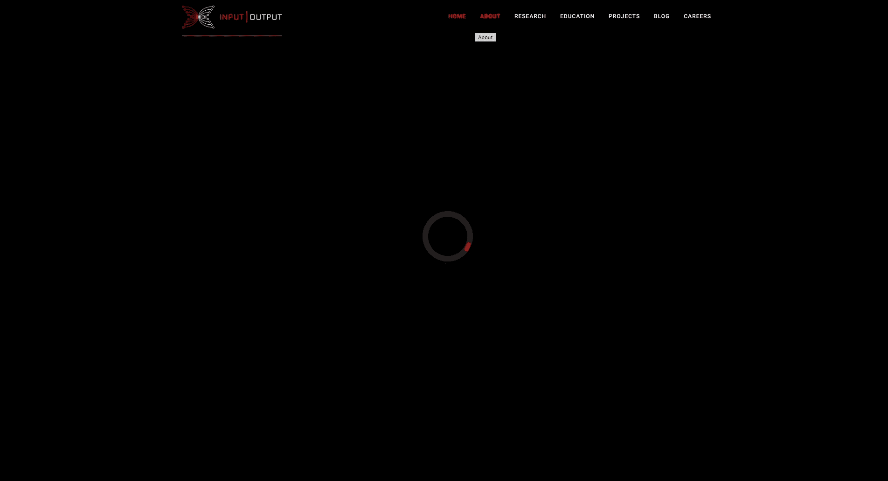
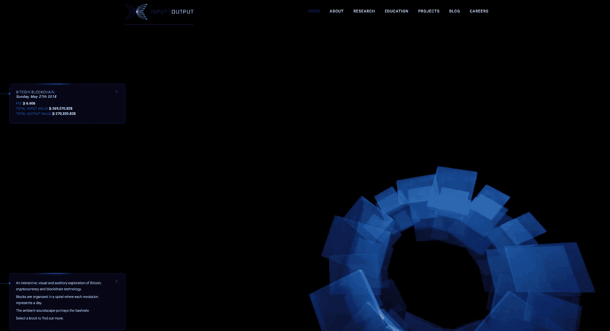
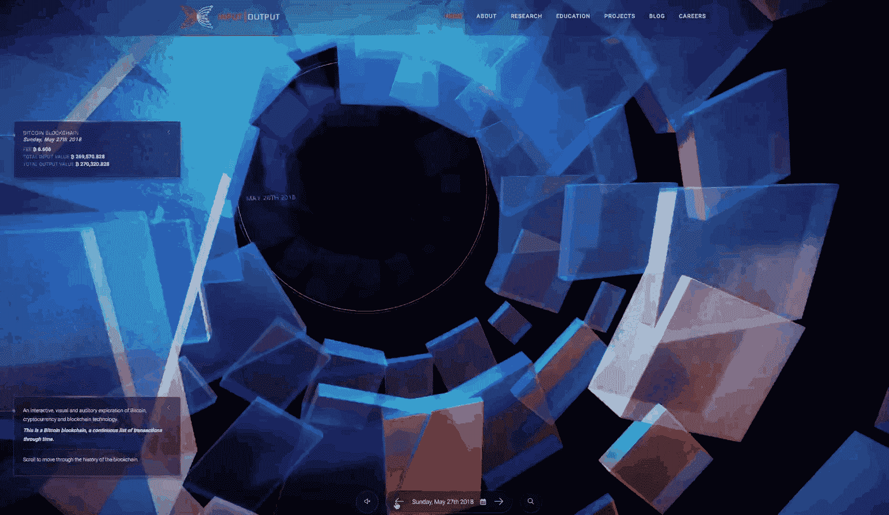
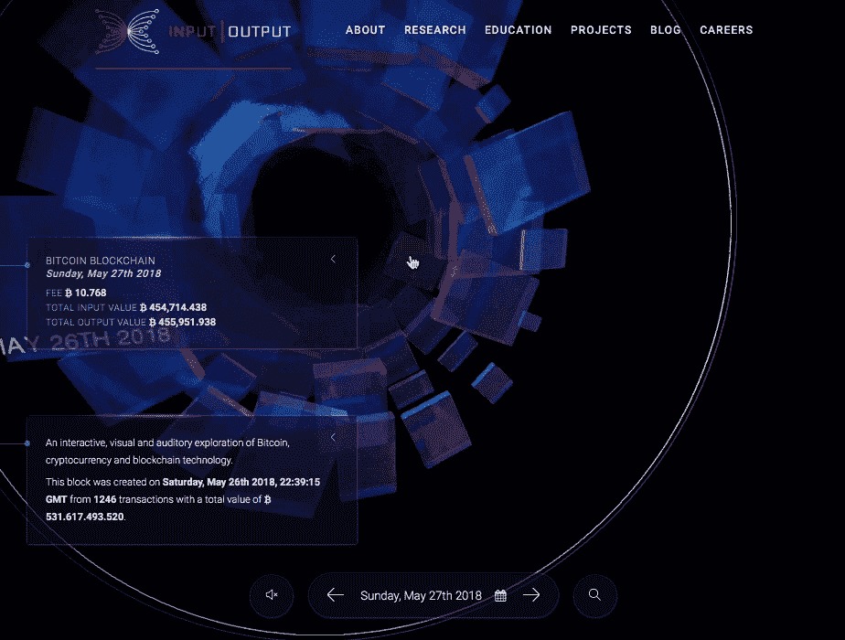
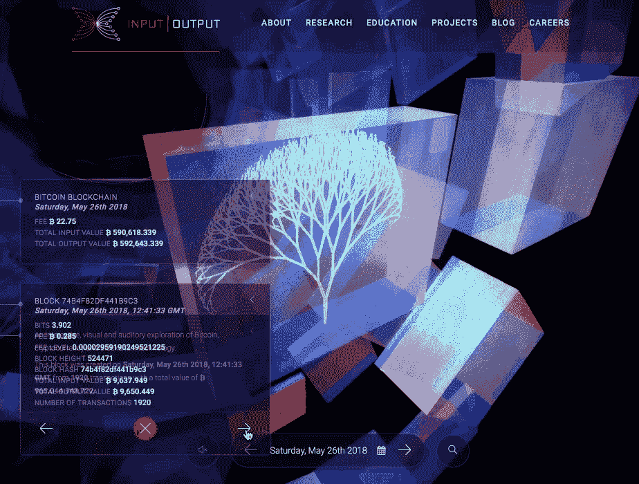
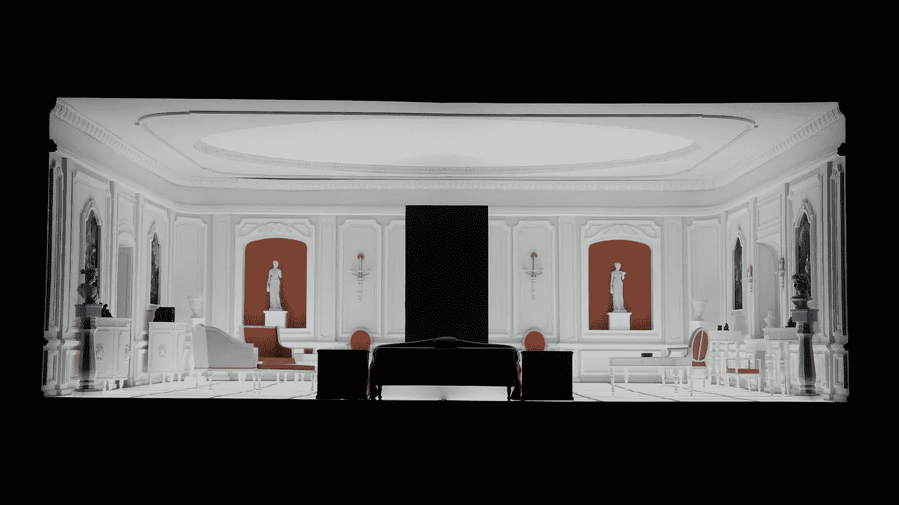

# 区块链可视化之美

> 原文：<https://medium.com/coinmonks/the-beauty-of-blockchain-visualisation-5b86cc08404b?source=collection_archive---------1----------------------->

比特币从 2009 年就有了。你是不是信徒并不重要。不可否认，在比特币的区块链上，仍有超过 50 万个区块。对大多数人来说，区块链理工学院有点太抽象，难以理解。输入 [IOHK](https://iohk.io) 和 [KUVA](https://www.kuva.io) 。他们推出了《区块链交响曲》，这是一部探索区块链的视听作品。甚至在你点击“探索 3d 区块链”之前，视觉盛宴就已经开始了。一旦你进入，你可以滚动浏览，用你的鼠标选择块，并点击导航从一天到另一天，从一个块到另一个块。我做的 gif 不包含声音，但你绝对应该尝试打开声音导航。因为它增加了另一层信息。

我在这里滚动日子。每一天都被想象成彩色积木的螺旋。螺旋包含了那天开采的所有区块。这让我想起了 2001 年的一个场景:太空漫游。当我滚动到创世街区时，会有一个白色的房间在等我吗？我没有发现，因为即使有了自动化(Apple Automator)我也走不了那么远。2 年后，页面开始重新加载。搜索功能还不能用，所以也没用。

如果您愿意，可以使用导航按钮跳到下一天或返回前一天。我试着用键盘上的箭头键和 AWSD，但那不起作用。目前，你可以导航到包含你所做交易的最近区块，这很酷。

可以单独选择这些块。每个块包含关于位、费用、费用水平、总输入值、总输出值和交易数量的信息。这些街区包含了 Merkle 树。如果你不知道什么是 Merkle 树或者想要一个关于香蕉的描述，你可以看看[这篇由 ConsenSys 撰写的优秀文章](https://media.consensys.net/ever-wonder-how-merkle-trees-work-c2f8b7100ed3)。

您也可以使用箭头按钮导航到下一个块，而不是从螺旋中选择块。你可以清楚地看到，并不是所有的块都是平等的。有些厚，有些薄。有些石块直径很小，有些则很大。它们听起来也不一样，颜色也不一样。有一篇文章解释了这一切是如何发生的。

KUVA 是创作《区块链交响曲》的设计工作室。他们过去为谷歌、阿迪达斯、丰田和 Inition 做过项目。他们为 Twitter 做的项目是他们过去作品中我最喜欢的。

下一步是什么？IOHK 计划为其他区块链项目(比如 ETH、ADA)做区块链可视化，人们将能够欣赏区块链的交响乐。所以他们可以想象任何他们想要的区块链。在 [Github](https://github.com/input-output-hk/symphony) 已经有了。我想象着在浏览器中并排运行两部区块链交响曲，试图体验其中的不同。也有将它放入 3d 环境的说法。从螺旋上抓一块会很有趣。当搜索功能起作用时，去创世纪街区的长途旅行也是值得期待的。虽然我害怕白色的房间。

[图片来源](https://commons.wikimedia.org/wiki/File:Stanley_Kubrick_The_Exhibition_-_LACMA_-_2001_A_Space_Odyssey_-_Bedroom_model_(8999723752).jpg)