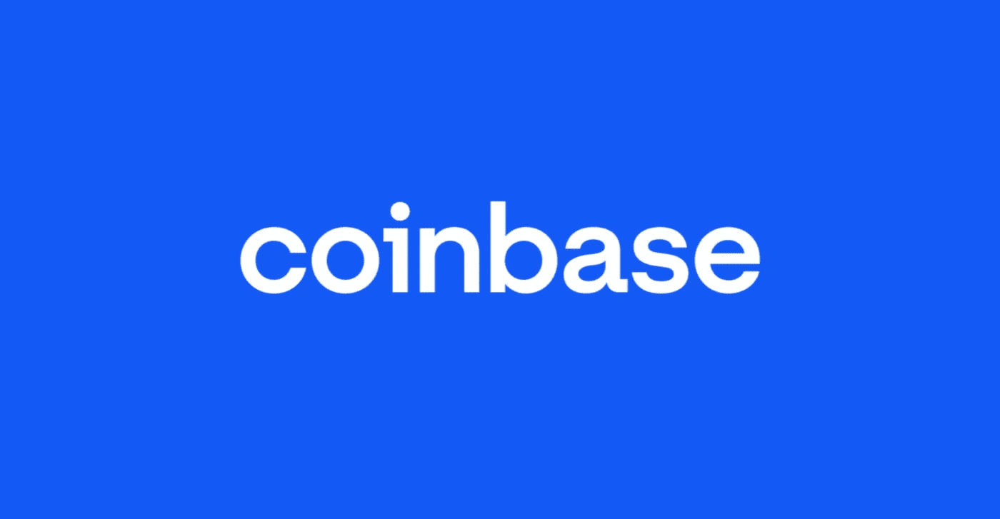
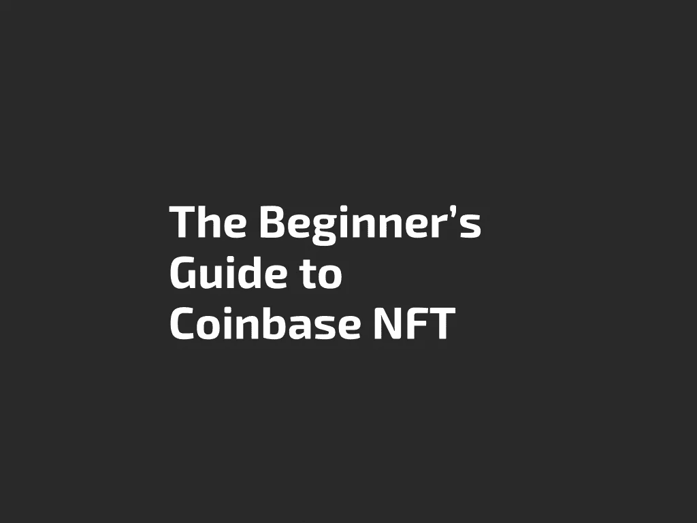

# 比特币基地·NFT 入门指南

> 原文：<https://medium.com/coinmonks/the-beginners-guide-to-coinbase-nft-d88876e2b822?source=collection_archive---------9----------------------->

## 这篇文章介绍了一个新的 NFT 平台——比特币基地·NFT，并概述了如何为初学者导航 NFT 空间。

Coinbase is joining the NFT space by creating an NFT marketplace for its user base.

# 介绍

比特币基地于 2021 年 10 月 12 日宣布，使用他们新的 NFT 平台比特币基地 NFT 的等候名单开放给人们加入。

比特币基地 NFT 是一个点对点的市场，允许用户在不同的区块链上创造、购买、展示和发现 NFT。在发布时，比特币基地将只支持基于以太坊的遵循 ERC-721 和 ERC-1155 标准的 NFT，但在不久的将来将允许多链支持。

这份等待名单允许新用户提前进入 NFT 最大的市场之一，该市场将与目前的 NFT 平台如 OpenSea、Rarible 和币安 NFT 竞争。

估计到目前为止[已经有 140 万人](https://decrypt.co/83443/coinbase-sees-1-4-million-signups-new-nft-platform)报名加入等候名单。如果您尚未加入等候名单，请使用以下链接加入:[比特币基地等候名单链接](https://www.coinbase.com/nft/announce/1PHP5Q)。

> 还可以订阅 [**Coinmonks Youtube 频道**](https://www.youtube.com/c/coinmonks/videos) 获取每日加密新闻。

# 什么是 NFT？

不可替换的代币代表区块链上的独特数字资产。这些数字资产是由区块链开发者创建的，他们在**智能合约**中编写代码来创建 NFT。

智能合约代码由创建人们收集的 NFT 的区块链执行。人们出于独特的原因收集 NFT，我们已经看到了很多成功的例子，也有相当一部分失败的例子。

你可以收集由人工智能和算法生成的 NFT 艺术，可以在社交媒体上用作个人资料图片的酷 NFT，甚至是通用的单词列表。今天，仍然可以发现不同种类的 NFT 用例。

MekaVerse was an example of a recent NFT craze. MekaVerses before they were revealed were being sold at an average price 8.5 ETH.

# 有多少个 NFT 项目？

区块链可以容纳无限量的 NFT 项目。区块链本质上是去中心化的，因此任何理解如何编码的人都能够创建 NFT。这有好有坏。

这很好，因为它为人们开启了一种新的创作媒介。这个 NFT 只是一个普通的单词列表，但实际上通过在 NFT 上添加额外的实用程序为其持有者提供了价值。Cryptoodles 中的一个例子是这个 [Toodle Loot Bag NFT](https://docs.cryptoodles.com/) 允许人们访问项目中的独家 NFT，被动地赚取在区块链游戏中使用的数字积分，所有这些都是在 Toodle Loot Bag 中建立的新功能。

然而，并不是所有的 NFT 项目都有正确的意图。学会保护自己，用你辛苦挣来的密码在 NFTs 周围进行明智的购买，这将有助于你的钱包在 NFT 的空间里呆得更久。

Cryptoodles 将发布一篇单独的媒体文章，概述如何在 NFT 保护自己。请务必在 Twitter 上关注我们，加入我们的讨论，或者注册以获得我们发布新媒体文章的通知！与此同时，请查看这篇研究 NFT 和令牌的简单指南:

# 我可以通过哪些不同的方式获得 NFT？

如今获得非功能性货币的主要途径包括**以固定价格购买、在二级市场从其他人那里购买、**和**免费铸造。**这完全取决于区块链开发商如何编写 NFT 智能合同。

以固定价格购买意味着开发商在你支付接收他们的 NFT 时包含了额外的费用。

在二级市场上从其他人那里购买是人们接受非金融交易的传统方式。在这种方法中，你可以使用像 OpenSea 或比特币基地·NFT 这样的 NFT 平台从另一个拥有它的人那里购买 NFT。

免费铸造意味着开发者不会向你收取额外的费用，但是你仍然要支付**汽油费**来支付让区块链为你创造 NFT 的费用。

如果你想尝试铸造一个免费的造币项目，看看这个一步一步的免费铸造图德尔战利品包 NFT 指南:

# 初学者收藏什么样的 NFT？

初学者专注于收集视觉上吸引他们的 NFT。初学者看一幅 NFT，如果某人制作的艺术品引起了你的注意，他们就会购买 NFT 来支持所制作的艺术品。

中级 NFT 收藏家不仅关注 NFT 作品的视觉方面，还希望收藏那些具有额外特征的作品。这被称为 NFT 的**实用程序**。可能是 NFT 解除了对 NFT 社区中某些锁定内容的访问。

在隐洞的情况下，铸造一个免费的图德尔战利品$袋 NFT 将让你获得额外的非战斗堡垒，只有通过持有$袋 NFT 才能获得。这个额外的工具允许您以最低的成本建立一个不断增长的 NFT 投资组合。

There were people that genuinely enjoyed how these CryptoPunks looked at first. Other people may disagree, but now some are selling for over a million USD.

中级和高级 NFT 收藏家也将围绕自己的影响者在 NFT 空间。这些有影响力的人与名人一起参加 NFT 聚会和 NFT 艺术展，希望从著名的 NFT 创作者那里购买一件独特的 NFT 作品。

高级 NFT 收藏家分析二级市场的买卖量、最低价和最高价，以及正在收藏特定非艺术收藏品的 NFT 收藏家的“著名”钱包。一个众所周知的 NFT 分析工具是 icy.tools:

一个经验法则是不要急于成为中级和高级 NFT 收藏家。作为一个初学者，你会学到很多关于 NFT 行业的经验，从长远来看，这将使你受益。如果你急于成为一个中级甚至高级 NFT 收藏家，你的钱包里可能没有足够的钱在 NFT 空间里走得很远。

被称为 NFT 行业的初学者并不丢人，我们在这个领域都还处于起步阶段。

**建议加入一个 NFT 收藏家的社区，这样你就可以和这个社区一起成长和学习。加入** [**隐密者不和谐这里**](https://discord.com/invite/g9SnvzdFs2) **开始收集 NFT。**

# 哪个 NFT 是初学者的好起点？

初学者应该从免费的薄荷项目开始，解锁额外的功能，以帮助提供效用和增长你的 NFT 投资组合。不要仅仅为了艺术而购买 NFT，也要寻找能够在项目中释放额外特性的 NFT，其开发团队会长期坚持下去。

我们推荐 [Toodle Loot $BAG NFT](https://docs.cryptoodles.com/toodl-nfts/redeeming-loot-bag-nfts) 作为初学者的第一个 NFT，因为它是一个低成本、免费的 mint 项目，可以解锁 Cryptoodles 社区的附加功能，并通过让您随着时间的推移访问更多免费的 NFT 来为您的 NFT 投资组合提供实用工具。

Only 10,000 Toodle Loot Bags ever will be available to be redeemed for free. While they are available, you should add it to your NFT portfolio for the long run.

开发团队也致力于确保 Toodle Loot $BAG 的长期成功。只有 10，000 个 Toodle Loot $包可用，所以现在拥有一个 Toodle Loot $包是将它添加到您的比特币基地 NFT 投资组合中的最佳时机。

你可以在这里找到使用比特币基地·NFT 铸造图德尔战利品$袋的说明，或者直接从官方智能合同中使用说明[在这里](https://docs.cryptoodles.com/toodl-nfts/redeeming-loot-bag-nfts)铸造图德尔战利品$袋。

# 结论

Cryptoodles 将为初学者发布关于 NFTs 指南的中型文章。下一篇文章将围绕 NFT 安全入门指南展开。一定要加入 [Cryptoodles Discord](https://discord.com/invite/g9SnvzdFs2) 加入我们的 NFT 分析师社区！

> 加入 Coinmonks [电报频道](https://t.me/coincodecap)和 [Youtube 频道](https://www.youtube.com/c/coinmonks/videos)了解加密交易和投资

## 另外，阅读

*   [什么是融资融券交易](https://blog.coincodecap.com/margin-trading) | [美元成本平均法](https://blog.coincodecap.com/dca)
*   [用信用卡购买密码的 10 个最佳地点](https://blog.coincodecap.com/buy-crypto-with-credit-card)
*   [加拿大最佳加密交易机器人](https://blog.coincodecap.com/5-best-crypto-trading-bots-in-canada) | [Bybit vs 币安](https://blog.coincodecap.com/bybit-binance-moonxbt)
*   [火币加密交易信号](https://blog.coincodecap.com/huobi-crypto-trading-signals) | [Swapzone 审查](/coinmonks/swapzone-review-crypto-exchange-data-aggregator-e0ad78e55ed7)
*   最佳[密码交易机器人](https://blog.coincodecap.com/best-crypto-trading-bots) | [购买索拉纳](https://blog.coincodecap.com/buy-solana) | [矩阵导出评论](https://blog.coincodecap.com/matrixport-review)
*   [Coldcard 评论](https://blog.coincodecap.com/coldcard-review) | [BOXtradEX 评论](https://blog.coincodecap.com/boxtradex-review)|[uni swap 指南](https://blog.coincodecap.com/uniswap)
*   [阿联酋 5 大最佳加密交易所](https://blog.coincodecap.com/best-crypto-exchanges-in-uae) | [SimpleSwap 评论](https://blog.coincodecap.com/simpleswap-review)
*   [购买 Dogecoin 的 7 种最佳方式](https://blog.coincodecap.com/ways-to-buy-dogecoin) | [ZebPay 评论](https://blog.coincodecap.com/zebpay-review)
*   [最佳期货交易信号](https://blog.coincodecap.com/futures-trading-signals) | [流动性交易所评论](https://blog.coincodecap.com/liquid-exchange-review)
*   [3 商业评论](/coinmonks/3commas-review-an-excellent-crypto-trading-bot-2020-1313a58bec92) | [Pionex 评论](https://blog.coincodecap.com/pionex-review-exchange-with-crypto-trading-bot) | [Coinrule 评论](/coinmonks/coinrule-review-2021-a-beginner-friendly-crypto-trading-bot-daf0504848ba)
*   [莱杰 vs n rave](/coinmonks/ledger-vs-ngrave-zero-7e40f0c1d694)|[莱杰 nano s vs x](/coinmonks/ledger-nano-s-vs-x-battery-hardware-price-storage-59a6663fe3b0) | [币安评论](/coinmonks/binance-review-ee10d3bf3b6e)
*   [Bybit Exchange 审查](/coinmonks/bybit-exchange-review-dbd570019b71) | [Bityard 审查](https://blog.coincodecap.com/bityard-reivew) | [CoinSpot 审查](https://blog.coincodecap.com/coinspot-review)
*   [3 commas vs crypto hopper](/coinmonks/3commas-vs-pionex-vs-cryptohopper-best-crypto-bot-6a98d2baa203)|[赚取加密利息](/coinmonks/earn-crypto-interest-b10b810fdda3)
*   最好的比特币[硬件钱包](/coinmonks/hardware-wallets-dfa1211730c6) | [BitBox02 回顾](/coinmonks/bitbox02-review-your-swiss-bitcoin-hardware-wallet-c36c88fff29)
*   [BlockFi vs 摄氏度](/coinmonks/blockfi-vs-celsius-vs-hodlnaut-8a1cc8c26630) | [Hodlnaut 审核](/coinmonks/hodlnaut-review-best-way-to-hodl-is-to-earn-interest-on-your-bitcoin-6658a8c19edf) | [KuCoin 审核](https://blog.coincodecap.com/kucoin-review)
*   [Bitsgap 审查](/coinmonks/bitsgap-review-a-crypto-trading-bot-that-makes-easy-money-a5d88a336df2) | [Quadency 审查](/coinmonks/quadency-review-a-crypto-trading-automation-platform-3068eaa374e1) | [Bitbns 审查](/coinmonks/bitbns-review-38256a07e161)
*   [加密复制交易平台](/coinmonks/top-10-crypto-copy-trading-platforms-for-beginners-d0c37c7d698c) | [Coinmama 评论](/coinmonks/coinmama-review-ace5641bde6e)
*   [印度的加密交易所](/coinmonks/bitcoin-exchange-in-india-7f1fe79715c9) | [比特币储蓄账户](/coinmonks/bitcoin-savings-account-e65b13f92451)