# 市场上 10 款最佳加密交易机器人(2020 年更新)

> 原文：<https://medium.com/coinmonks/the-best-automated-crypto-trading-bots-in-the-market-38e21a25d1b?source=collection_archive---------0----------------------->

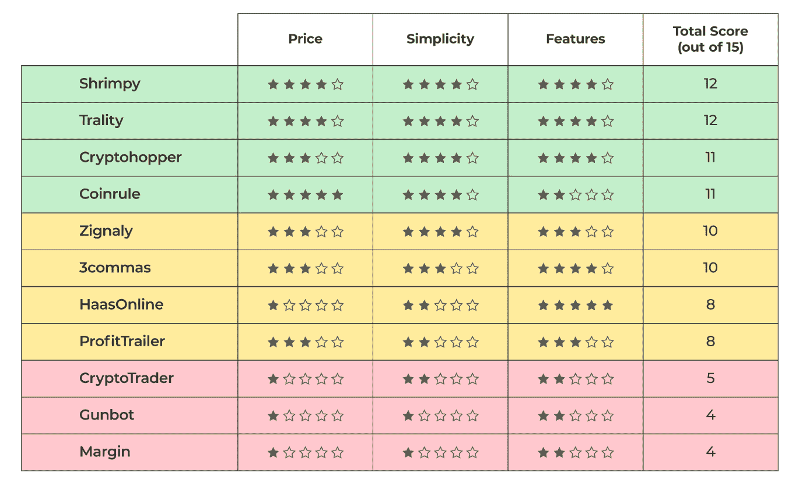

随着加密市场开始从 2018 年的熊市中缓慢复苏，我们注意到用户对自动加密交易机器人和服务感兴趣的趋势有所增加。

在这篇文章中，我们将探索目前市场上可用的[顶级加密交易机器人](https://blog.shrimpy.io/blog/cryptocurrency-trading-bots-the-complete-guide)。我们来看看顶尖选手。下面的信息图根据每月网站访问量(从 SimilarWeb 收集的数据)对加密交易员使用的 8 种最流行的自动交易机器人进行了细分。

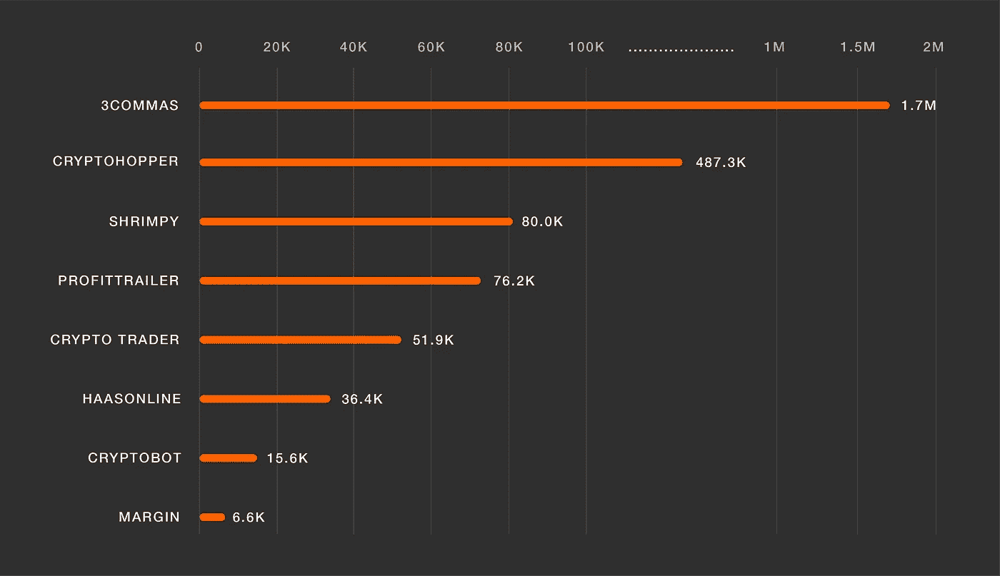

The top trading bots by monthly website visits.

我们可以看到每月网站访问量排名前三的交易机器人是 3Commas、 [Cryptohopper](http://blog.coincodecap.com/go/cryptohopper) 和 [Shrimpy](https://shrimpy.io/referral?r=I6VFZ7d2E) 。这些交易机器人分别维持着 170 万、48.7 万和 8 万的月访问量。让我们看看所有的顶级交易机器人，看看它们有什么不同。

# 1.[**3 命令**](https://3commas.io/?c=tc252152)

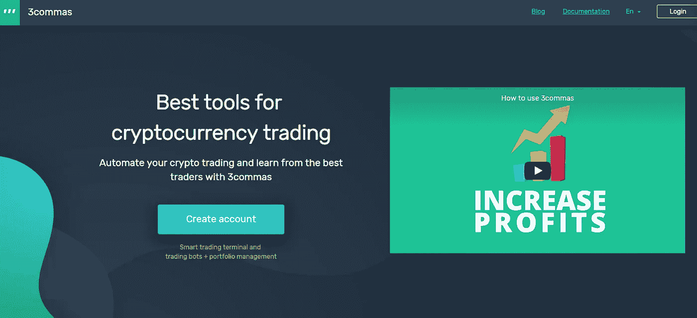

[**3Commas**](https://3commas.io/?c=tc252152) 是市场上最知名的交易机器人之一。这个提到十亿美元俱乐部的名字是一个俄罗斯制造的软件解决方案。

3Commas 是一个加密交易终端，具有 bot 交易和投资组合管理功能。它具有一个*智能交易终端，允许用户执行订单和交易，设置 bot 交易和止损/盈利头寸。*

## 价格

他们的计划价格从每月 22 美元到 75 美元不等。

## 支持的交换

YoBit.net，KuCoin，Bitfinex，OKEX，HitBTC，Huobi Global，Bitstamp，Cryptopia。

**亦读:**[**3 commos Review**](https://blog.coincodecap.com/3commas-review-an-excellent-crypto-trading-bot)

# 2.[哈桑林](https://www.haasonline.com/?ref=11087)

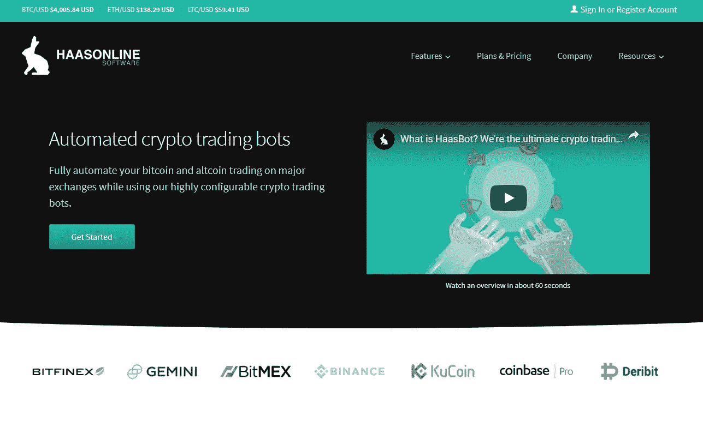

HaasOnline 是一个自动化的加密交易机器人，让用户从一个可定制的仪表板上自动化他们所有交易所账户的加密交易策略。

HaasOnline 为每个交易机器人提供完整和精细的控制，为每个机器人提供广泛的交易指标配置。

如果您正在寻找企业解决方案，Haasbot 可能是您的解决方案。功能列表感觉上支持天底下的一切。从做市到区域恢复。

一些最显著的特征包括:

*   累积机器人
*   闪击机器人
*   乒乓球机器人
*   趋势线机器人

## 价格

这种企业级交易 bot 平台当然带有企业价签。[最低定价层为 200 美元/ 3 个月](https://www.haasonline.com/pricing/)，并迅速攀升至 600 美元/ 3 个月。

## 支持的交换

币安、Bitfinex、BitMEX、Bitstamp、Bittrex、CCEX、CEX.io、Cobinhood、比特币基地 Pro、Deribit、Gemini、HitBTC、Huobi、ionomy、北海巨妖、KuCoin、Nova、OKCoin、OKEX、OKEX Futures、Poloniex。

**亦读:** [**哈森在线评论**](https://blog.coincodecap.com/haasonline-review)

# 3.

**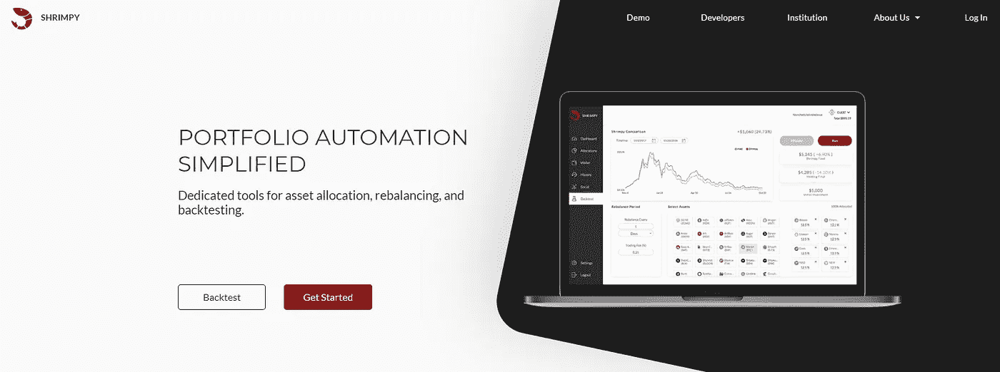**

**[**Shrimpy**](https://shrimpy.io/referral?r=I6VFZ7d2E)**是领先的投资组合管理应用。与其他交易机器人不同，Shrimpy 专注于再平衡等投资组合策略。通过注册、插入 exchange API 密钥、选择资产和进入重新平衡期，在不到 5 分钟的时间内自动化您的投资组合。这是简化加密工作的低维护方式。****

****作为一个新的密码交易员，你可能会发现 Shrimpy 上的社交功能正是你想要使用的。与其发展你自己的策略，不如复制一些世界顶级投资者的交易策略。****

**** [## 社会投资组合正在改变加密货币(2020 年更新)

### 选择哪些资产应该在您的加密组合中是复杂的。通过 Shrimpy，我们已经创建了…

blog.shrimpy.io](https://blog.shrimpy.io/blog/shrimpy-adds-social-portfolios-for-crypto) 

Shrimpy 的通用加密交易 API 为开发人员提供了一个管理所有用户的解决方案，本质上是一个完整的用户管理解决方案。每个用户都可以直接与 Shrimpy 通信来访问他们的帐户、执行交易和收集数据，而不是让您的服务器陷入用户请求的泥潭。这释放了开发资源，并允许您的团队专注于您的核心产品。

除了低延迟交易应用程序所需的后端系统架构之外，试图手动集成交易所的开发人员还面临着通过零星更新来维护每个交易所的问题。随着交换数量的增加，维护这些交换的难度也在增加。使用 Shrimpy APIs 不需要任何维护。Shrimpy 团队处理 exchange 集成和任何需要立即关注的更新。

[Shrimpy 的通用加密交换 API](https://developers.shrimpy.io/) 旨在解决加密领域的关键开发挑战:

*   低延迟订单执行和自动化交易
*   用户授权和管理
*   业务和产品扩展
*   实时数据和分析

## 价格

[**Shrimpy**](https://shrimpy.io/referral?r=I6VFZ7d2E) 计划的价格从每月 13 美元到 19 美元不等。核心计划提供对所有投资组合分配、交易、再平衡和外汇管理功能的访问。

## 支持的交换

KuCoin、Bittrex、比特币基地 Pro、币安、北海巨妖、波洛涅克斯、火币、双子座、Bibox、BitMart、火币全球、HitBTC、OKEX、Bitstamp。

**亦读:** [**伯明尼评论**](https://blog.coincodecap.com/shrimpy-crypto-trading-bot-review)**** 

# ******4。** [旅游城市](https://www.trality.com/)****

********

****Trality 是一个任何人都可以通过自动交易机器人创建和投资的平台。****

****这家总部位于维也纳的公司由 Moritz Putzhammer 和 Christopher Helf 于 2019 年创立，他们的愿景是将华尔街的先进自动化技术带给每个人。无论你是高级 Python 开发人员、普通交易员还是新手，他们都提供了一些独特而强大的工具来帮助任何人创建最有利可图的交易算法。****

****凭借世界上第一个基于浏览器的 **Python 代码编辑器，**高级交易者可以利用易于使用的 API 和一长串 TA 指标，以极大的灵活性真正定制您的机器人。****

******规则构建器**是 Trality 最先进的工具，它允许任何不具备 Python 技能的人通过在一个超级简单的图形界面中简单地拖放指标和策略来构建高级交易机器人。有数百种指标可供选择，您甚至可以使用预定义、精心策划的策略来帮助您启动和运行。****

****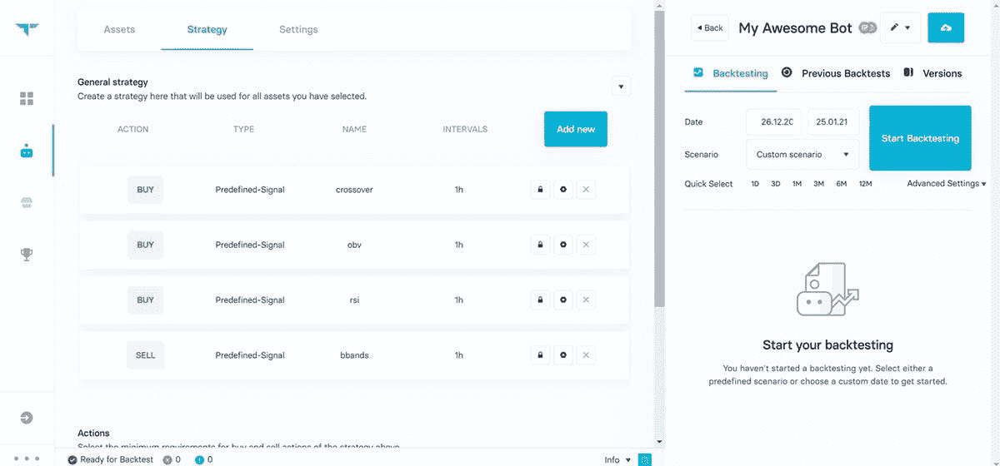****

****Trality Rule Builder — bot creation terminal****

****对于这两个工具，Trality 允许您使用历史数据执行闪电般快速的回溯测试，以真正验证您的策略并清楚地了解风险。****

## ****价格****

****除了免费的典当计划，他们还有从€每月 9.99 到€每月 59.99 不等的订阅费。****

## ****支持的交换****

****币安，北海巨妖，比特熊猫，比特币基地专业****

> ****另请参阅:[旅游评论](https://blog.coincodecap.com/trality-review)****
> 
> ****[立即免费试用 Trality】](https://www.trality.com/)****

# ****5.[密码交易商](https://cryptotrader.org/?r=3161)****

****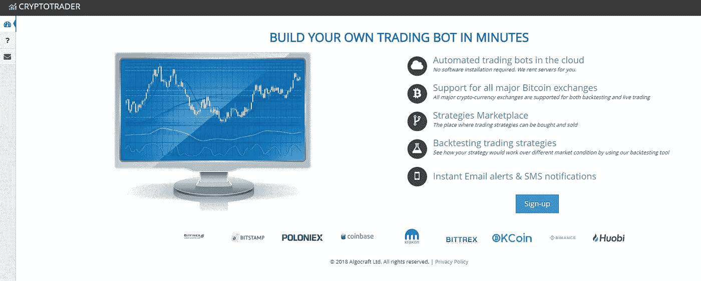****

****[Cryptotrader](https://cryptotrader.org/?r=3161) 是一个基于云计算的比特币和其他加密货币的算法交易平台。Cryptotrader 在可扩展的云上提供自动化交易机器人，能够提供即时警报和通知。****

****除了自动化和基于指标的交易机器人，Cryptotrader 还有一个策略市场，让用户购买交易策略。Cryptotrader 还允许用户回溯测试交易策略。****

## ****价格****

****他们的计划价格从每月 16 美元到 200 美元不等。****

## ****支持的交换****

****币安，北海巨妖，比特币基地专业版，Bittrex，Bitfinex，Poloniex，Huobi，Bitstamp，OKCoin。****

# ****6. [Coinrule](https://webapp.coinrule.io/coupon/coinmonks-7-25-3-e2bf6c60e795407381edf98d1a174ac2?fp_ref=coincodecap)****

****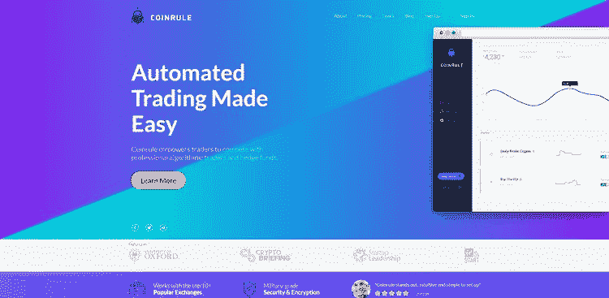****

****[**Coinrule**](https://webapp.coinrule.io/coupon/coinmonks-7-25-3-e2bf6c60e795407381edf98d1a174ac2?fp_ref=coincodecap) 是一个新兴的自动化交易服务，专注于基于指标的交易。Coinrule 关注的不是长期战略的自动化，而是市场上每分钟都在发生的复杂互动。随着你的资产价格在一天中不断变化，自动交易机器人将根据你指定的交易策略执行交易。****

****我们向希望亲自操作资金的加密货币交易者推荐 Coinrule。不断更新你的策略和修补机器人以获得最佳结果可能是耗时的，所以这个交易机器人是有时间投资全面学习他们实施的策略的人的理想选择。****

## ****定价****

****Coinrule [的定价从合理的 9.99 美元/月](https://coinrule.io/pricing.html)开始，但最高级的计划很快就涨到 199.99 美元/月。只需 9.99 美元，你就可以一次连接 2 个 exchange 账户并自动执行 5 条规则。****

******亦读:**[**coin rule Review**](https://blog.coincodecap.com/coinrule-review-a-perfect-trading-bot)****

# ****7.[隐翅虫](http://blog.coincodecap.com/go/cryptohopper)****

****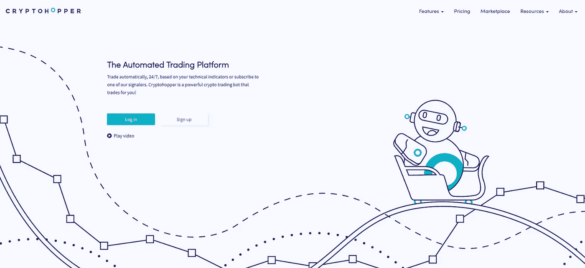****

****[Cryptohopper](http://blog.coincodecap.com/go/cryptohopper) 是一个专注于自动化 bot 和副本交易的加密交易平台。Cryptohopper 允许用户根据自己的个人指标进行交易，或者模仿其他交易者的策略。****

****用户可以在 Cryptohopper 的交易策略设计器中使用 130 多个指标和烛台模式来建立交易策略。它还提供了一个市场，用户可以从预先设置好的经过筛选的交易者那里买卖交易信号和策略。****

****Cryptohopper 还为那些对“无风险”交易感兴趣的人提供票据交易****

## ****价格****

****他们的计划价格从每月 19 美元到 99 美元不等。****

## ****支持的交换****

****霍比，币安，波洛涅克斯，Bittrex，比特币基地专业，北海巨妖，Bitfinex，KuCoin，Cryptopia。****

# ****8.枪机****

****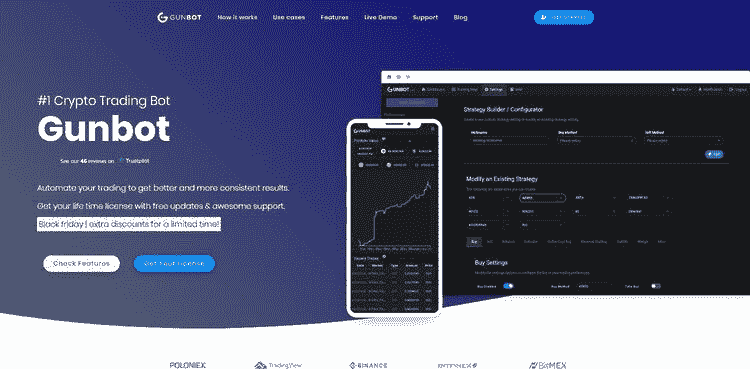****

****在进入市场几年后，[枪机器人](https://www.gunbot.com/)仍然是市场上鲜为人知的竞争者之一。****

****Gunbot 是一个桌面应用程序，需要下载才能运行。这意味着你需要自己 24/7 运行服务，以确保你的交易策略的持续执行。这可能是许多经常忙碌的交易者所担心的。设置一台 24/7 全天候运行的机器会变得成本高昂且令人沮丧。****

****该应用程序中一些最突出的功能包括:****

*   ****反向交易****
*   ****蔓延的****
*   ****确认指标****

## ****价格****

****枪机并不适合所有人。它是市场上交易机器人中价格最高的之一。如果你想连接多达 5 个交易所和所有的交易策略，启动成本可能接近 1000 美元。当然不是每个人都适合。****

## ****支持的交换****

****CryptoBot 支持 Bitmex、Poloniex、Bittrex、币安、比特币基地 Pro、Cex.io、北海巨妖、Bitfinex、Kucoin、Cryptopia、Huobi。****

# ****9.[盈利预告片](https://profittrailer.com/pt/gaurav/?campaign=coinmonks)****

****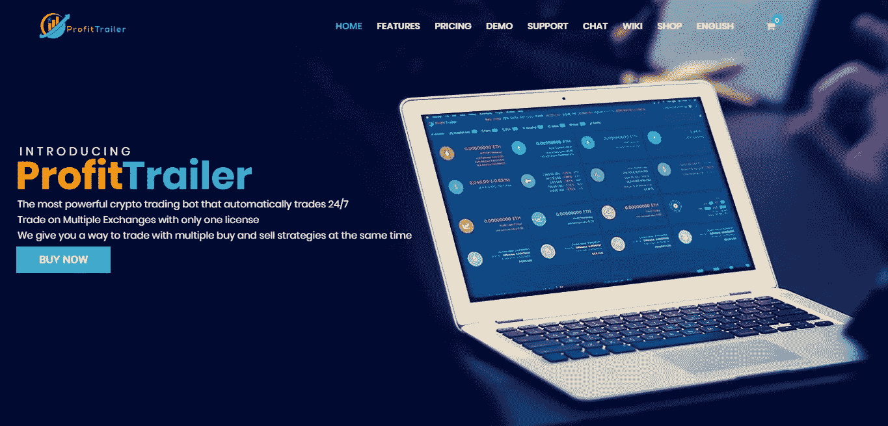****

****ProfitTrailer 是一个加密交易机器人和终端软件，让用户根据指标或信号构建自己的交易机器人。****

****除了基于指标和信号的交易，ProfitTrailer 还允许用户订阅信号，并在单个交易所运行并发交易策略。它还为无风险交易者提供了先进的票据交易功能。****

## ****价格****

****ProfitTrailer 提供从€39 英镑/月到€89 英镑/月的包月套餐，可以选择购买终身许可。****

## ****支持的交换****

****ProfitTrailer 支持币安、Bittrex、火币、Kucoin、Poloniex、VPS。****

# ******10。**保证金****

********

****[Margin](https://margin.de/) 是专为比特币和加密货币交易者设计的自动化交易终端。它提供了一个干净的交易界面，专注于提供一个简单的用户体验，具有美丽的视觉效果，带来非凡的交易体验。Margin 还允许用户使用一套广泛使用的交易指标快速建立自动交易机器人和策略。****

## ****价格****

****Margin 提供从 89 美元到 1999 美元的终身许可。****

# ****11.齐格纳里****

****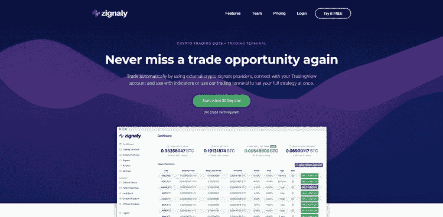****

****[Zignaly](https://zignaly.com/) 可以被认为是 Coinrule 更复杂的竞争对手。提供加密交易信号、指标和交易视图连接，交易者可以通过组合各种基于信号的策略来执行详细的策略。****

****除了基于各种指标的交易，Zignaly 还开辟了一个基于头寸的交易终端，允许交易员在交易所设置特定订单，而无需自动化策略。****

****Zignaly 支持大量特性，但令人惊讶的是，它们只支持币安交易所。没有币安帐户，你就不能享受这项服务。****

****它们支持的一些核心功能包括:****

*   ****跟踪止损****
*   ****信号****
*   ****交易视图机器人****
*   ****来自信号的多个目标****

## ****定价****

****目前只有一个针对 Zignaly 应用的[单一定价层](https://zignaly.com/pricing)。他们提供的一切都可以以 15.99 美元/月的价格购买。这包括无限的硬币对和位置。****

## ****12.[alt ready](https://coincodecap.com/go/altrady)****

****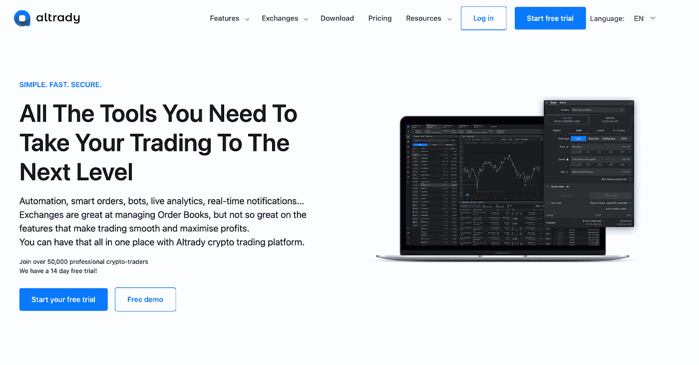****

****每天都有成千上万的交易者使用 Altrady 独特的自动化加密交易工具，通过自动化交易来实现回报最大化。该公司提供几种类型的机器人，包括网格和信号机器人，为有经验的交易者提供了一种简单的方法，让他们在没有任何知识或技能的情况下，在快节奏的市场中占据优势。****

******具有上下拖动功能的 Altrady 网格机器人******

****Altrady 网格机器人是交易者利用市场涨跌趋势的完美工具。有了它，你可以指定价格上限和下限，这样你的交易将永远是安全的，即使有一个巨大的波动！你还可以止盈止损，这使得交易比以往任何时候都容易。****

****[**Altrady**](https://coincodecap.com/go/altrady) **带有 TradingView Webhook 或 Crypto Base Scanner 信号的信号机器人******

****信号机器人是以最小的努力参与行动的好方法。只需配置您的进入和退出设置，然后让这个机器人为您做所有的工作！****

****为了使用带有自定义信号的信号机器人，您必须配置带有 webhook 的信号机器人****

******Altrady 为每种类型的加密交易提供完整的工具集:******

*   ****在多个交易所和交易所账户进行交易****
*   ****单个交易所的多个账户****
*   ****实时盈亏平衡计算****
*   ****离线价格和订单提醒****
*   ****图表上的直观交易反馈 1****
*   ****独特的集成市场扫描仪****
*   ****交易自动化，带止盈和止损****
*   ****带有 tradingview webhook 或基于加密的扫描器信号的信号机器人****
*   ****上下拖动的网格机器人****
*   ****具有子账户的投资组合管理****
*   ****交易分析****

****值得一提的是，他们正在不断改进他们的功能集，在 2022 年第 3-4 季度的简短路线图中，他们将添加:****

*   ****新的移动应用****
*   ****具有外部钱包支持的投资组合****
*   ****Dex 集成****
*   ****票据交易****

****利用你的知识和技能与最先进的交易平台:Altrady 14 天免费****

# ****最后的想法****

****市场上有几种交易机器人解决方案。最终，你对交易机器人的选择最终取决于你的加密交易策略和偏好。****

****你想绝对控制你的交易机器人并配置每一个细节吗？你只是想用一个简单的不需要太多设置的交易机器人吗？还是只想付钱抄袭别人的交易？****

****下表是有兴趣为自己的加密资产组合实现自动交易机器人解决方案的加密交易员的快速参考。****

****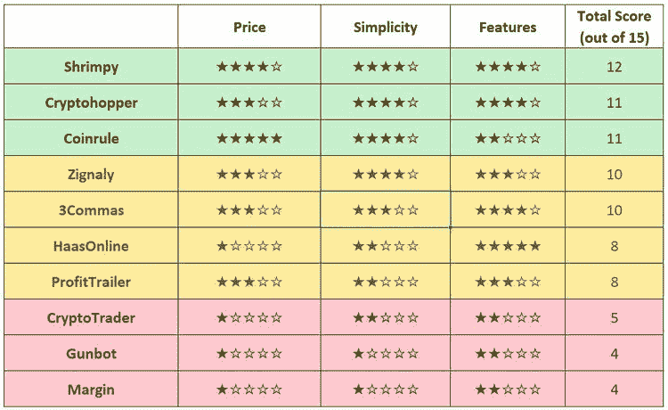******** [## 加密货币交易机器人-2020 年完全指南

### 加密交易机器人已经成为全球数百万加密货币用户的热门话题。寻找方法来…

blog.shrimpy.io](https://blog.shrimpy.io/blog/cryptocurrency-trading-bots-the-complete-guide)**** 

## ****用 Shrimpy 构建你自己的加密交易机器人****

****想要像上面提到的那样建立自己的交易机器人吗？Shrimpy 实际上允许开发人员使用[通用加密交易所交易 API](https://developers.shrimpy.io/)创建他们自己的加密交易应用程序，该 API 将负责与加密交易所的通信和交易交互，从而允许开发人员专注于创建他们的定制交易机器人或应用程序。****

****今天就开始使用 [**Shrimpy 的加密交易 API**](https://developers.shrimpy.io/) 。****

**** [## 面向开发者的加密交易 API

### 业界领先的加密交易、实时数据收集和交易账户管理 API。

developers.shrimpy.io](https://developers.shrimpy.io/)**** 

****[**Shrimpy**](https://shrimpy.io/referral?r=I6VFZ7d2E) 是一个简化加密投资组合管理的交易机器人。将您的 exchange 帐户链接到 Shrimpy 可以解锁方便的交易功能，帮助您自动执行加密策略。 [**今天就试试吧！**](https://www.shrimpy.io/)****

****[**Shrimpy 的通用加密交换 API**](https://developers.shrimpy.io/)是唯一专门为应用开发者设计的加密交换统一 API。收集实时交易或订单数据，管理用户交易所账户，执行交易策略，并简化您连接到每个交易所的方式。****

****在 [Twitter](https://twitter.com/ShrimpyApp) 和[脸书](https://www.facebook.com/ShrimpyApp)上关注我们的更新，并在[Telegram](https://t.me/ShrimpyGroup)&[Discord](https://discord.gg/gXyy95y)上向我们令人惊叹的活跃社区提问。****

**** [## Shrimpy —加密货币投资组合管理

### 管理您的数字资产的最简单、最值得信赖的方式。

www.shrimpy.ioA](https://www.shrimpy.io/)**** 

## ******同样，请阅读******

*   ****最好的比特币[硬件钱包](/coinmonks/the-best-cryptocurrency-hardware-wallets-of-2020-e28b1c124069?source=friends_link&sk=324dd9ff8556ab578d71e7ad7658ad7c)****
*   ****最好的[加密税务软件](/coinmonks/best-crypto-tax-tool-for-my-money-72d4b430816b)****
*   ****[加密交易机器人](/coinmonks/crypto-trading-bot-c2ffce8acb2a)****
*   ****[最佳加密交易平台](/coinmonks/the-best-crypto-trading-platforms-in-2020-the-definitive-guide-updated-c72f8b874555)****
*   ****[unis WAP 最佳钱包](/coinmonks/best-wallets-to-use-uniswap-e91a6385d9e8)****
*   ****最佳[加密贷款平台](/coinmonks/top-5-crypto-lending-platforms-in-2020-that-you-need-to-know-a1b675cec3fa)****
*   ****[3 commas vs Cryptohopper vs Shrimpy](/coinmonks/cryptohopper-vs-3commas-vs-shrimpy-a2c16095b8fe)****
*   ****Bitmex 上的[保证金交易的白痴指南](/coinmonks/the-idiots-guide-to-margin-trading-on-bitmex-dbbd7742c6fc?source=friends_link&sk=7bfa99d2a181142510c8442c8ddb0786)****
*   ****加密摇摆交易的权威指南****
*   ****[Bitmex 高级保证金交易指南](/coinmonks/bitmex-advanced-margin-trading-guide-2270c195ce25?source=friends_link&sk=1d986cca731f5084b9a2db4a4bc4a7ad)****
*   ****[开发者最佳加密 API](/coinmonks/best-crypto-apis-for-developers-5efe3a597a9f)****
*   ****[加密套利](/coinmonks/crypto-arbitrage-guide-how-to-make-money-as-a-beginner-62bfe5c868f6)指南:新手如何赚钱****
*   ****顶级[比特币节点](https://blog.coincodecap.com/bitcoin-node-solutions)提供商****
*   ****最佳[加密制图工具](/coinmonks/what-are-the-best-charting-platforms-for-cryptocurrency-trading-85aade584d80)****