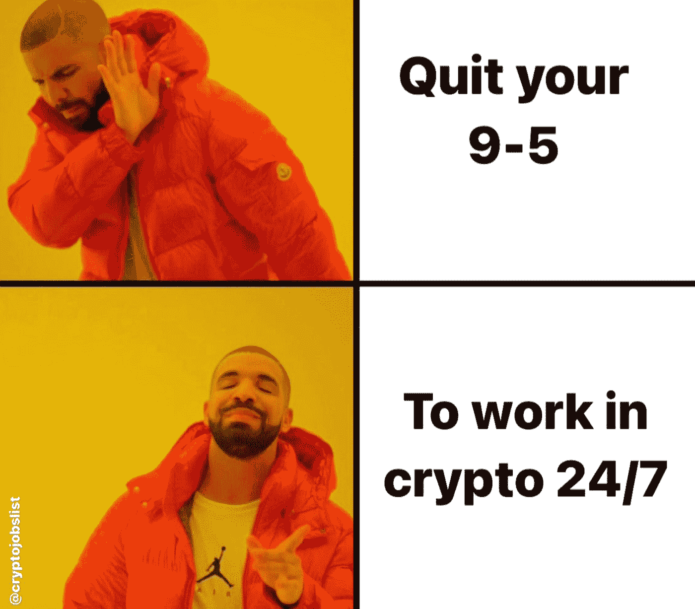
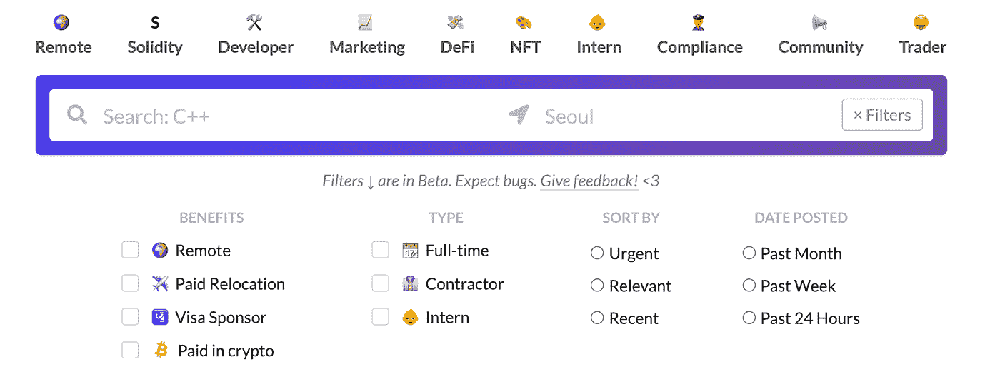
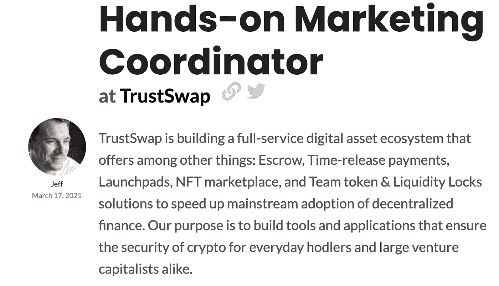
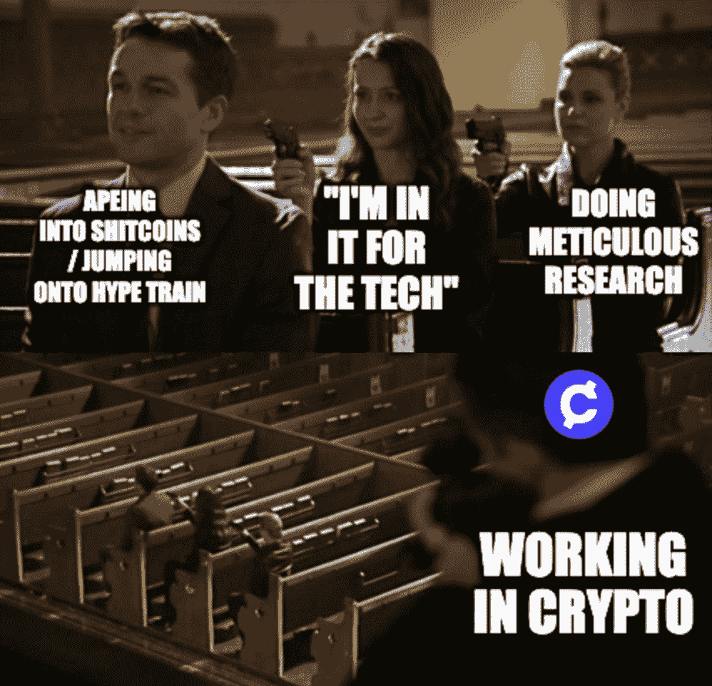

# 你不知道的最好的加密工作网站

> 原文：<https://medium.com/coinmonks/the-best-crypto-job-site-you-dont-know-about-3b136b781782?source=collection_archive---------4----------------------->

## 以下是一些帮助您浏览加密作业空间的提示。

如果你点击了这个故事，你可能正在考虑转行去区块链行业工作。如果你已经在其中，如果你知道去哪里找，机会是很多的。

Because the 9–5 life is too mainstream.

在通用工作门户网站或 LinkedIn 的搜索栏中键入“加密”或“区块链”，希望找到合适的职位发布，却发现一些工作甚至与加密/区块链毫不相关的日子应该一去不复返了。

像许多其他人一样，我在网上搜寻最好的、专门的加密工作门户网站，我找到了很多。然而，没有比 [**更适合我的加密工作列表**](https://cryptojobslist.com) 。

无论您是区块链工程师/开发人员、加密专家或内容作者，还是只是想换个行业的人，您都可以在一个网站上轻松找到最新的机会。

# 有效使用加密作业列表的 3 种方法:

## 1.过滤器，过滤器，位置！

想要远程工作？检查。想在 DeFi 工作？检查。所有你需要做的是确保过滤器被设置到你想要的类别，你准备好了！

Sort and filter like your life (or whatever’s left of it after checking your portfolio) depends on it.

这是一个显而易见的问题，但是值得一提的是，你在找工作的时候应该总是很具体，而不是用散弹枪的方法去申请每一份工作，并祈求最好的结果！

## 2.案例研究和博客

除非你知道如何应用，否则学习就不是学习。在 Crypto Jobs List 上有许多博客文章，提供来自申请人和雇佣者的案例研究，讲述他们的经历以及他们通过 Crypto Jobs List 获得理想工作/候选人的过程。重要的是向那些和你现在走在同一条路上的人学习。

Learn what not to do so you don’t get stuck

你可以读到进入这个行业[如何改变这个人的生活](https://cryptojobslist.com/blog/crypto-changed-my-life-this-is-my-story)，公司在[雇佣一个加密内容作者](https://cryptojobslist.com/blog/3-things-we-learned-while-hiring-a-crypto-content-writer)时学到的东西，以及[如何不通过一堆简历找到一个完整的工程师](https://cryptojobslist.com/blog/how-to-find-a-full-stack-engineer-without-sifting-through-a-stack-of-resumes)。

## 3.知道谁是谁。

你可能是那种认为人际关系网被夸大了，和别人“联系”听起来有点肤浅的人。你可能是对的，但是有一个更好的方法来做这整个“网络”的事情。

**跟随秘密空间的思想领袖**。参与并理解他们在做什么。这些人应该是你有兴趣了解或共事的人。尤其是如果你想追求一份职业，知道它们代表什么是很重要的。

加密工作列表可以让你知道在大多数情况下是谁在招聘，这样你就可以查找招聘者，了解更多关于他们做什么或者他们怎么想的！这是一种很棒的方式，可以知道谁是这个行业中的谁，并把一个名字/项目/公司与一张面孔联系起来。

His name Jeff. Follow [Jeff Kirdeikis](https://twitter.com/JeffKirdeikis), founder of TrustSwap.

当然，如果你在申请后没有得到工作，或者看到了一份你非常喜欢的工作，你可以随时关注他们的最新动态，这样你就能知道他们什么时候开始新一轮的招聘。

## 额外提示(为工作而来，为文化而来。

我知道你们中的大多数人不会在醒着的大部分时间里呆在加密工作清单上。然而，如果你在社交媒体上，你可能会喜欢关注社交媒体句柄的加密工作列表( [Twitter](https://twitter.com/cryptojobslist) ， [Instagram](https://www.instagram.com/cryptojobslist/) )，因为它们经常发布招聘信息(和大量的模因)。这样你可能会偶然发现一份你感兴趣的工作。

Sniper is working in crypto. Be like the sniper.

谢谢你走到最后！如果你喜欢读这篇文章，请在这里为我鼓掌，或者在 [Twitter](https://twitter.com/lukexzq) 或 [Medium](https://lukezyx.medium.com/) 上关注我。