# 2023 年 10 大最佳硬件钱包回顾与比较

> 原文：<https://medium.com/coinmonks/the-best-cryptocurrency-hardware-wallets-of-2020-e28b1c124069?source=collection_archive---------0----------------------->

## 为加密货币 Ledger、Ngrave、Trezor、BitBox、KeepKey 和 Keevo 选择最佳硬件钱包…

一个好的加密硬件钱包对我们许多人来说是必不可少的。除了帮助我们感觉与我们的资金联系更加紧密，硬件钱包还能让我们在使用数字货币时保持安全，让我们安心。

我过去几年的使命是帮助人们理解加密货币，并在使用它们时保持安全。硬件钱包是保护加密货币最重要的组成部分之一。

如果你正在寻找一个，你会想要最好的加密硬件钱包。

通读本指南，了解不同钱包提供商之间的差异。如果你急于找到你的钱可以买到的最好的东西，你也来对地方了。

在这里阅读我们的更新文章👇

 [## 存储比特币的最佳加密硬件钱包 2022 | CoinCodeCap

### 保管您的数字资产很容易，但找到正确的存储方式却是一项繁琐的任务。在线钱包有一个风险…

coincodecap.com](https://coincodecap.com/best-hardware-wallet-bitcoin) 

# **什么是硬件钱包？**

简而言之，硬件钱包是便携式设备，让我们能够安全地访问我们的密码。它们的功能是在安全的离线环境中生成用户的私钥，同时具有易于使用的显示屏。它们通常通过 USB 或蓝牙连接到联网设备，如您的电脑。钱包上的单独屏幕用于验证和批准交易，以帮助防止敏感信息泄露给联网设备。这两者结合起来非常方便，因为你不必担心计算机受到损害。

除了安全优势，硬件钱包还能让用户通过触觉控制他们的资金。对许多人来说，将资金握在手中是一种熟悉的感觉，这种感觉对于领养来说至关重要。

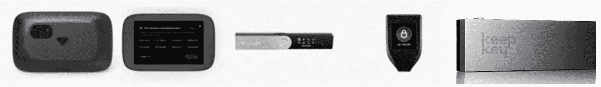

Top 7 Crypto Wallet of 2022

市场上只有少数几款硬件钱包，但要选择一款适合你的可能还是很有挑战性的。我把加密货币的这四大硬件钱包放在一起，帮你省时省钱做实验。

我们选择突出显示六个硬件钱包 NGRAVE ZERO、BitBox、Ledger Nano X、Trezor Model T、Keevo 和 KeepKey。他们都有不同的特点和属性，可能会使一个更适合你的目标。

**你可能也会感兴趣:**

> [*特雷佐 vs 莱杰*](/coinmonks/ledger-vs-trezor-best-hardware-wallet-to-secure-cryptocurrency-22c7a3fd391e)
> 
> [*n rave vs Trezor*](https://coincodecap.com/ngrave-vs-trezor)
> 
> [*莱杰纳诺 S vs 特雷佐 one vs 特雷佐 T vs 莱杰纳诺 X*](https://coincodecap.com/ledger-nano-s-vs-trezor-one-vs-trezor-t-vs-ledger-nano-xledger-nano-s-vs-trezor-one-vs-trezor-t-vs-ledger-nano-x)
> 
> [*n 储蓄 vs 总账*](https://coincodecap.com/ledger-vs-ngrave-zero)
> 
> [*莱杰纳米 S vs 莱杰纳米 X*](https://coincodecap.com/ledger-nano-s-vs-x)
> 
> *交易新手？试试* [*密码交易机器人*](/coinmonks/crypto-trading-bot-c2ffce8acb2a) *或* [*复制交易*](/coinmonks/top-10-crypto-copy-trading-platforms-for-beginners-d0c37c7d698c)

下面是进入 2023 年的 8 款最好的比特币硬件钱包。

# **# 1**[n 平均](https://www.ngrave.io/?sca_ref=380802.hYAXqGXOgJ)

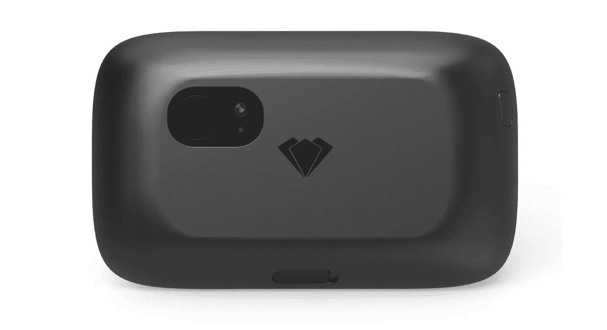

*NGRAVE ZERO: “the coldest wallet,” uses a QR technology to bypass direct internet access*

n rave 是一个新的竞争对手。这家公司是由全球顶尖的安全研究公司之一 [imec](https://www.imec-int.com/en/home) 孵化出来的。该设备被称为业内“最冷的钱包”，它不允许你以任何方式连接互联网。ZERO 没有使用 USB 端口或蓝牙，而是使用单向二维码通信将信息传递给联网设备，同时保持离线。所有这些都意味着您永远不必担心软件受损。

另一个很棒的特性是 NGRAVE Zero 还为你的种子短语提供了“永久备份”。这些不锈钢板具有防火、防水和“可回收”的特性这使得存储您的种子代码比其他钱包提供商更容易，其他钱包提供商只包括纸张来备份您的种子。

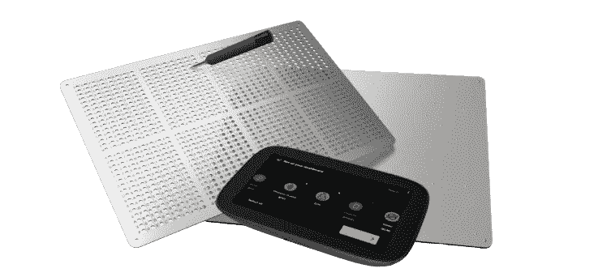

NGRAVE Graphene: a weather-proof seed solution right out of the box. Comprised of two parts, each part can be situated in a different location as an additional measure of security.

**优点:** [NGRAVE](https://shop.ngrave.io?sca_ref=380802.hYAXqGXOgJ) 举例说明了端到端的产品思维。独特的“冷”设计意味着它不会受到数字危害，并且您永远不必担心您的硬件钱包的软件是否正常。非常适合那些希望对自己的加密资金完全放心的人，尤其是那些经常携带设备旅行的人。包括开箱即用的不锈钢板，以简化种子短语的正确存储。

劣势:这是一家新公司，推出了第一款主要产品。有了 [IMEC](https://en.wikipedia.org/wiki/IMEC) 的支持，你可以期待极大的安全，然而，社区支持可能需要一些时间才能跟上。

还有，看我们的[**n 零复习**](/coinmonks/ngrave-zero-review-c465cf8307fc) 。

# #2 [总账硬件钱包](https://shop.ledger.com/pages/ledger-nano-x?r=da6d9b98e517)

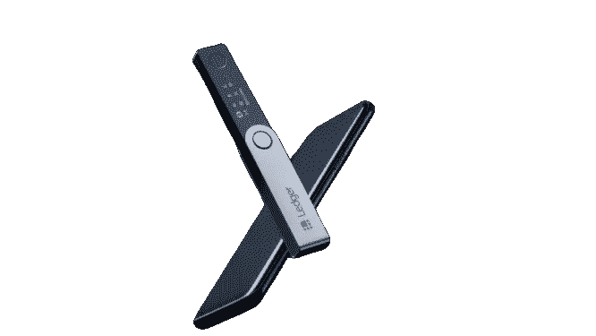

Nano Ledger X: new display screen

来自法国一家初创公司的 Ledger Nano X 看起来像一个典型的 USB 拇指驱动器，只是有一个钢壳。该设备可以通过 USB 或蓝牙连接到任何移动设备或个人电脑。

蓝牙连接和移动支持是 Ledger Nano X 相对于 Ledger Nano S 的主要升级。

该设备支持 30 多种加密货币，包括比特币、以太坊、Dash、莱特币、Tron 等。这是迄今为止最受欢迎的硬件钱包——部分得益于莱杰多年来的巨大营销努力。

**优点:** Ledger 是最受欢迎的硬件钱包提供商。钱包允许您存储许多不同的加密货币。有很多软件集成形式的社区支持，使用分类帐直接交易。其中包括许多新的分散式交易所。该设备不断更新新软件。

**缺点:**干扰布局使得设置或重启钱包需要相当长的时间。新增的移动支持很棒，但它的主要改进，蓝牙功能，远非一帆风顺。许多软件更新影响了用户体验:经常引入滞后的钱包，它们并不总是立即兼容。唯一一家采用蓝牙连接的公司。虽然安全问题尚未得到证实，但业界怀疑蓝牙可能会引入另一种攻击媒介。

你可以在这里了解更多关于 [Ledger Nano X 和其他 Ledger 产品的信息](https://shop.ledger.com/pages/ledger-nano-x?r=64e6bd3adf1a)。

> 另外，请阅读我们对 [**莱杰纳诺 S vs X**](/coinmonks/ledger-nano-s-vs-x-battery-hardware-price-storage-59a6663fe3b0) 的比较

# Trezor 硬件钱包

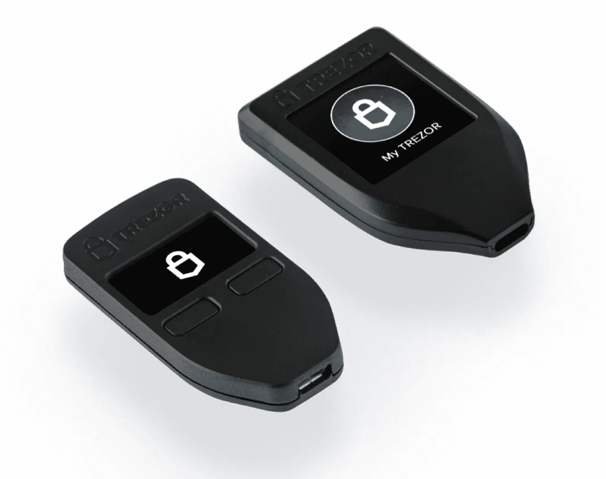

Trezor 型是由 Satoshi Labs 最新开发的，Satoshi Labs 是世界上第一家 note 硬件钱包提供商。T 型钱包与其他钱包不同，它有一个触摸屏界面。Trezor 钱包允许您存储无数的加密货币，包括比特币、Dogecoin、Namecoin、Dash、以太坊等。

**优点:**支持多种加密货币。允许转换为法定货币。在钱包中，交换有许多功能，包括原子交换和菲亚特交换。

**缺点:**价格昂贵。T 型车在用户界面上有所升级，但与 Trezor 相比没有太大变化。它的价格几乎是功能不丰富但功能相当的竞争对手的 3 倍。

你可以在这里了解更多关于 [Trezor 钱包的信息。](https://shop.trezor.io/product/trezor-one-metallic?offer_id=24&aff_id=5199)

> 此外，阅读我们的对比 [**莱杰与特雷佐**](/coinmonks/ledger-vs-trezor-best-hardware-wallet-to-secure-cryptocurrency-22c7a3fd391e)

# #4 [BitBox02](https://shiftcrypto.shop/?ref=NGR4VOALV3) 硬件钱包

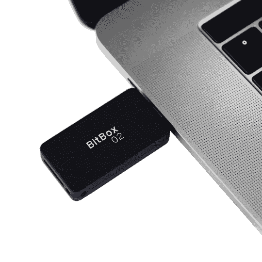

[BitBox02](https://shiftcrypto.shop/?ref=NGR4VOALV3) 对于个人来说是一个很好的工具，可以轻松存储、保护和交易加密货币。它的伴侣 BitBoxApp 提供了一个一体化的解决方案，可以轻松安全地管理您的数字资产。

硬件钱包看起来像一个小的 USB-C 拇指驱动器，关机时看不到显示屏。BitBox02 外形小巧，关机时看不到屏幕，是一款非常谨慎的设备，继承了经典的瑞士品质和隐私价值观。你需要的一切都包括在内:一个普通的 USB 适配器，一根 USB 延长线，一个用于备份的 microSD 卡，一些挂绳和贴纸。或者，您还可以获得额外的 microSD 卡作为备份冗余。

根据 Shift Crypto 的说法，BitBox 硬件钱包自 2016 年以来一直存在，并在 100 多个国家销售。

它还为高级用户提供了一些功能。BitBoxApp 提供了一个到你自己的比特币完整节点的简单连接，提供了额外的隐私，因为没有人(即使是 Shift Crypto)会知道你的交易。“硬币控制”功能对于使用 Wasabi 或 Samourai 等硬币加入钱包的用户来说非常重要，否则，他们将无法控制在交易中选择使用哪些硬币。此外，BitBox02 还兼容[比特币钱包 Electrum](/shiftcrypto/use-the-bitbox02-with-electrum-wallet-5088219b8497) 和 [MyEtherwallet](/shiftcrypto/myetherwallet-integrates-the-bitbox02-hardware-wallet-63568e405f2c) ，因此高级用户可以在增加硬件安全性的情况下直接使用他们喜欢的工具。

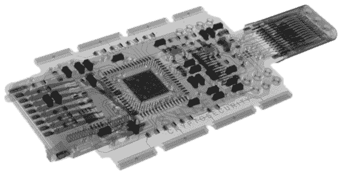

安全双芯片架构是一个独特的功能，可以解决其他硬件钱包的透明度和物理保护问题。BitBox02 使用安全芯片结合完全开源的固件进行物理设备加固，这是 Ledger(闭源固件)和 Trezor(无安全芯片)都无法提供的。Shift Crypto 还有一个透明的威胁模型，解释他们的产品可以防御哪些攻击，哪些攻击被认为超出了范围。

# **#5** [**赛克斯石五金钱包**](https://coincodecap.com/go/secuxtech)

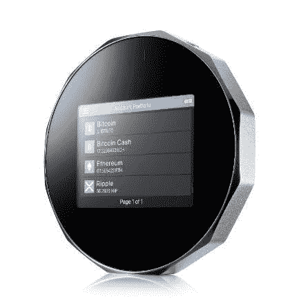

[SecuX STONE V20](https://blog.coincodecap.com/go/secuxtech)

SecuX STONE V20 Crypto 硬件钱包采用菱形铝制外壳，由台湾区块链的一家安全公司设计。所有 SecuX STONE V20、W20 和 W10 钱包都嵌入了安全元件芯片，以保护您的私钥和设备 PIN 码的安全。

SecuX STONE V20、W20 和 W10 钱包配有一个 2.8 英寸的大触摸屏，使加密货币用户可以通过手指轻松操作，并一目了然地查看多个加密账户。用户可以很容易地提示直观的彩色生动的图标与可读的字符。

SecuX STONE V20/W20 钱包是最好的跨平台加密硬件钱包，支持包括 Windows、Mac OS、Chrome OS、Linux、Android 和 iOS 在内的主要操作系统。SecuX STONE V20/W20 具有双连接功能，允许钱包通过 USB 或蓝牙连接到台式机、笔记本电脑和手机。加密货币投资者可以使用 SecuX Mobile iOS 或 Android 应用程序在支持蓝牙的 SecuX STONE 钱包上轻松管理加密资产。

SecuX STONE V20、W20 和 W10 采用 SecuX Web 应用程序作为门户，无需安装应用程序，这是一个真正简单的解决方案，可以随时访问您的帐户管理和发送/接收加密资产。

**优点:** SecuX STONE 硬件钱包支持跨平台操作系统兼容性，允许加密货币用户轻松管理加密货币并在旅途中进行交易。

**缺点:** SecuX STONE 硬件钱包是对主要加密硬币的较少硬币支持，如比特币、比特币现金、以太坊、莱特币、Ripple、币安、Groestlcoin、DigiByte、Dash、Stellar Lumens、DOGE 和所有 ERC-20 代币。

> 阅读 [SecuX Stone 评论](/coinmonks/secux-stone-hardware-wallet-review-15-discount-coupon-2020-7577032faa6e)

# **#6** [**KeepKey 硬件钱包**](http://lddy.no/omv4)

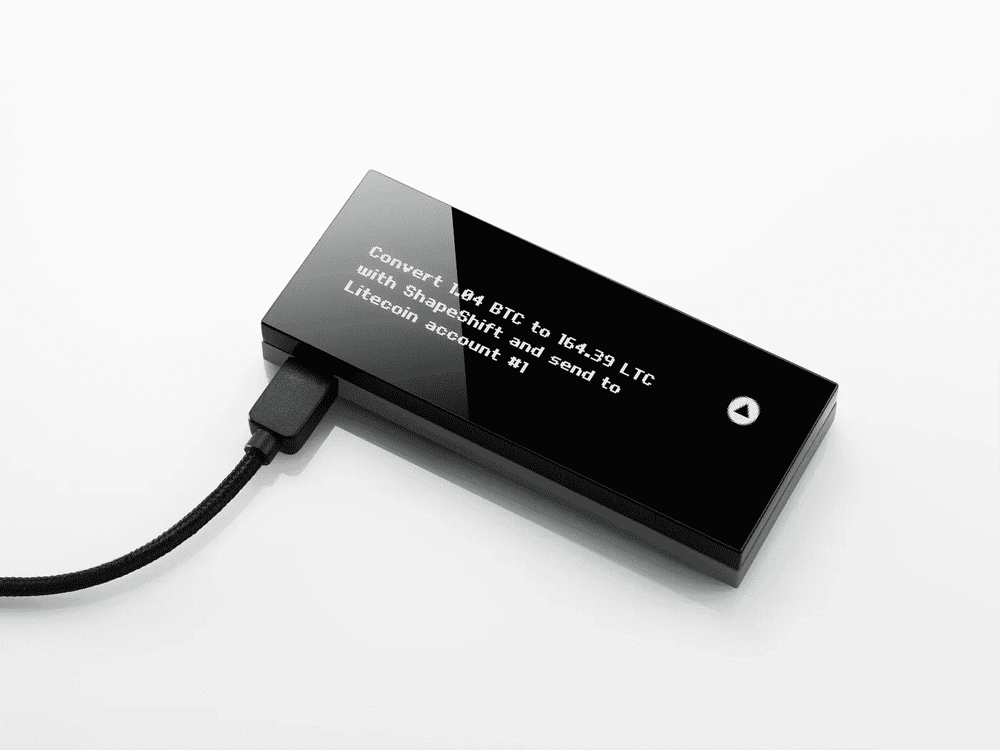

Conducting a transaction on the Keepkey Hardware Wallet

[KeepKey](http://lddy.no/omv4) 的形状与分类帐相似，但是，它具有易于阅读的数字显示。它的母公司 Shapeshift 是加密领域一家长期值得信赖的软件钱包提供商。

**优点:**外观上对伊莱杰的升级。与其竞争对手 Ledger Nano X 相比，易于阅读和使用。与 Shapeshift 钱包同步，为您提供开箱即用的交换选项。

**缺点:**与竞争对手 TREZOR 和 Ledger 相比，它仍然缺乏社区支持。此外，用户必须添加 Electrum 或 MultiBit 等软件才能使用 Keepkey 应用程序。仅当它通过插入互联网连接设备的 USB 电缆连接时才可用。

# #7 [Keevo 钱包](https://coincodecap.com/go/keevo-wallet)

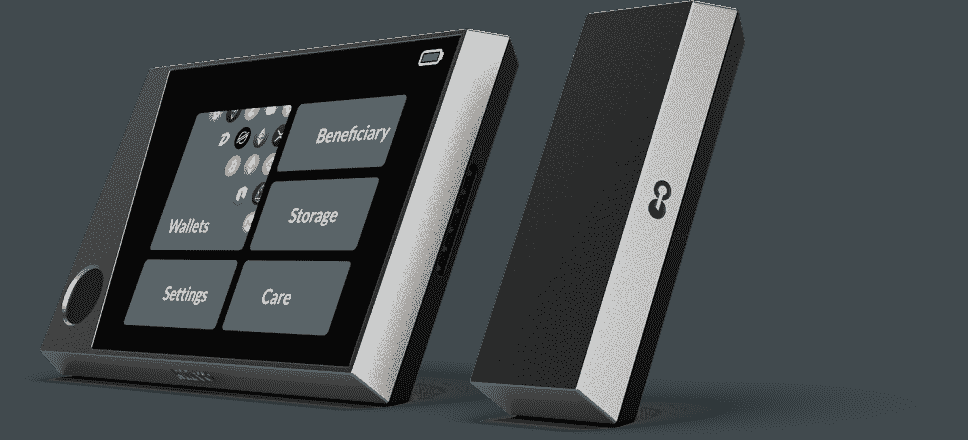

Keevo Hardware Wallet

Keevo 钱包是一款硬件钱包，具有多因素/多签名认证系统，旨在为您提供安全性。此外，它有担心丢失种子短语的解决方案。钱包为您所有的加密交易提供了终极解决方案。

Keevo 钱包有四个主要组成部分，包括 Keevo 硬件钱包、carbon key、桌面应用程序和 keevo premium plus 服务。此外，Keevo 钱包的独特之处在于其“回收”功能。它是第一个推出硬件钱包的平台，可以在没有种子短语的情况下执行恢复。

优点: Keevo 钱包遵循标准的安全协议。该设备易于握持，看起来很坚固。该设备没有不安全性，因为没有记住种子短语的风险。支持所有主要的加密货币。

缺点:提供的教育内容很少。钱包提供的付费服务计划没有吸引力。对一些用户来说，公司保护加密数据的过程可能令人担忧。

## **最佳加密硬件钱包排行榜**

1.  [n 平均](https://shop.ngrave.io?sca_ref=380802.hYAXqGXOgJ)
2.  [莱杰纳米 X](https://shop.ledger.com/pages/ledger-nano-x?r=64e6bd3adf1a)
3.  [Trezor 硬件钱包](https://shop.trezor.io/product/trezor-one-metallic?offer_id=24&aff_id=5199)
4.  [位框 2](https://shiftcrypto.shop/?ref=NGR4VOALV3)
5.  赛克斯石
6.  [KeepKey 硬件钱包](http://lddy.no/omv4)
7.  凯沃

## **想要更多关于硬件钱包的信息？**

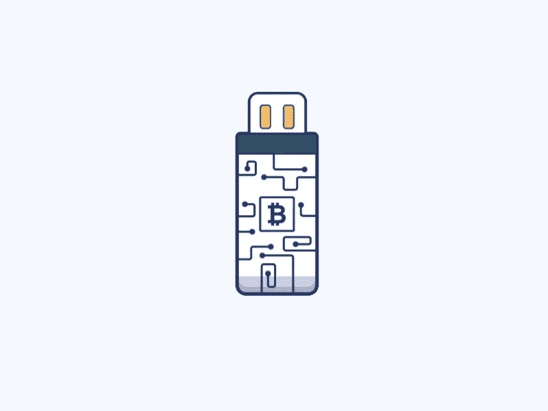

Plug In — Bitcoiners

对更深入的解释感兴趣吗？为此，我在这里链接了安德烈亚斯·安东诺普洛斯的[视频。Antonopoulos 很好地解释了硬件钱包是什么，不是什么。](https://www.youtube.com/watch?v=8mpDcBfNA7g)

虽然硬件钱包是一项投资，但考虑到在管理数字资产时你会感到安心，它们可能是值得的。硬件钱包将在交易时保护你的安全，但你仍然需要保留你的种子的备份，并遵循其他最佳实践。关于加密货币存储的最佳实践，从我最喜欢的另一个 [Antonopoulos Q & A 会话](https://www.youtube.com/watch?v=A5I55aOgX2o)开始

感谢您的阅读！

# 常见问题

## 硬件钱包为什么安全？

硬件钱包通过使用 USB 驱动设备非常安全地存储用户的私钥。这使得钱包不受可能存在于用户电脑上的病毒的影响。

## 总帐钱包是如何工作的？

账本钱包基本上是离线保存多种货币的 USB 存储设备。它能够在设备上存储用户的私钥，从而使第三方难以访问用户的帐户。此外，如果物理设备被盗，用户可以依靠 24 字密码备份恢复来访问他/她存储的加密货币。

***这里你可以对比一下***[***Ledger vs n grave***](https://coincodecap.com/ledger-vs-ngrave-zero)***，决定哪一款最适合你。***

## 如何设置 Trezor 钱包？

1.  将 trezor 钱包连接到您的电脑。
2.  转到[trezor.io/start](https://trezor.io/start/)
3.  安装 trezor 钱包。
4.  安装固件。
5.  重新连接崔佐。
6.  给 trezor 设备起个名字。
7.  设置 PIN。
8.  记下恢复种子

***继续阅读*** [***莱杰 vs 特雷佐***](/coinmonks/ledger-vs-trezor-best-hardware-wallet-to-secure-cryptocurrency-22c7a3fd391e) ***对比文章，更好地洞察这两个钱包。***

## Ngrave 钱包是如何工作的？

1.  创建交易请求。
2.  扫描二维码。
3.  验证交易细节。
4.  扫描你的签名。
5.  广播你的交易。

***了解更多关于***[***SecuX STONE***](https://coincodecap.com/go/secuxtech)***crypto 硬件钱包的知识，发现它为什么适合各种加密货币持有者。***

## 哪个加密硬件钱包最好？

如果你正在寻找一个地方来保护你的加密货币，那么一些最好的加密硬件钱包可供选择:Ledger，Trezor，Ngrave，BitBox，KeepKey 和 Keevo。

## 我需要加密钱包吗？

加密钱包是一项伟大的投资。拥有一个安全的加密钱包可以保证加密货币的安全，防止黑客入侵。此外，有一个钱包可以让你在关注余额的同时进行多项交易。

***阅读本文《*** [***存储比特币的最佳加密硬件钱包***](https://www.google.com/url?sa=t&rct=j&q=&esrc=s&source=web&cd=&cad=rja&uact=8&ved=2ahUKEwiXs5qCtJD4AhWEg2MGHTqDCB4QFnoECBIQAQ&url=https%3A%2F%2Fcoincodecap.com%2Fbest-hardware-wallet-bitcoin&usg=AOvVaw0NVQr_ZcHaNyOSQE4yVn25) ***》，选择最适合自己的钱包。***

## 哪种硬件钱包支持的硬币最多？

Ledger Nano S 是支持最多硬币的硬件钱包之一。虽然 Trezor 是另一个这样的钱包，但它不支持 Ripple(XRP ),这是主要的加密货币之一。

## 哪个硬件钱包支持 Solana？

莱杰纳米 S 和莱杰纳米 X 支持索拉纳。

## 硬件钱包如何连接 metamask？

1.  解锁您的元掩码。
2.  导航并点击右上角的头像图标。
3.  选择“连接到硬件钱包”
4.  从 Ledger 或 Trezor 中选择。
5.  点击连接。
6.  最后，选择您想要与之互动的任何帐户。

## 什么是比特币钱包地址？

比特币钱包地址是一个唯一的标识符，作为加密货币可以发送的虚拟位置。

***看看这 9 款*** [***最佳比特币钱包印度***](https://www.google.com/url?sa=t&rct=j&q=&esrc=s&source=web&cd=&cad=rja&uact=8&ved=2ahUKEwiXs5qCtJD4AhWEg2MGHTqDCB4QtwJ6BAgPEAE&url=https%3A%2F%2Fcoincodecap.com%2Fbitcoin-wallets-india&usg=AOvVaw162TgdffTaGQNfTSgKumVj) ***的列表，以及帮助你理解加密钱包和保管的概念。***

## 什么是冷加密钱包？

冷加密钱包只是硬件钱包的另一个术语。它是一种加密钱包，不与互联网连接，存储用户的私钥和地址，并与计算机上的兼容软件配合工作。

## 哪个是最安全的加密钱包？

Trezor 钱包是最安全的加密钱包之一，因为它具有可靠的安全功能。

## 以太坊钱包哪个好？

以太坊是世界上最有价值的加密货币之一。一些最好的以太坊钱包包括 Trezor One、Metamask 和 Ledger Nano。

## 如何选择加密钱包？

选择一个合适的加密钱包真的很重要，这样你就不会失去你潜在的资金。为此，

1.  确定你想要的钱包类型:硬件或移动钱包。
2.  购买并下载所选的钱包。
3.  安装他想要的软件。
4.  设置所需的帐户和安全功能。
5.  将您的加密货币存入钱包。

## 另外，阅读

*   [埃利帕尔泰坦评论](/coinmonks/ellipal-titan-review-85e9071dd029)
*   [总账 vs 平均](https://coincodecap.com/ledger-vs-ngrave-zero)
*   [SecuX STONE 五金钱包回顾](https://coincodecap.com/secux-stone-hardware-wallet-review)
*   [莱杰纳米 S vs 莱杰纳米 X](https://coincodecap.com/ledger-nano-s-vs-x)
*   什么是[闪贷](https://coincodecap.com/what-are-flash-loans-on-ethereum)？
*   最好的[密码交易机器人](/coinmonks/crypto-trading-bot-c2ffce8acb2a) | [网格交易](https://coincodecap.com/grid-trading)
*   [3 商业评论](/coinmonks/3commas-review-an-excellent-crypto-trading-bot-2020-1313a58bec92) | [Pionex 评论](/coinmonks/pionex-review-exchange-with-crypto-trading-bot-1e459d0191ea) | [Coinrule 评论](https://coincodecap.com/coinrule-review-a-perfect-trading-bot)
*   [AAX 交易所评论](/coinmonks/aax-exchange-review-2021-67c5ea09330c) | [德里比特评论](/coinmonks/deribit-review-options-fees-apis-and-testnet-2ca16c4bbdb2)
*   [n 零审核](/coinmonks/ngrave-zero-review-c465cf8307fc) | [FTX 密码交易所审核](/coinmonks/ftx-crypto-exchange-review-53664ac1198f)
*   [Bybit Exchange 审查](/coinmonks/bybit-exchange-review-dbd570019b71) | [Bityard 审查](https://coincodecap.com/bityard-reivew) | [CoinSpot 审查](https://coincodecap.com/coinspot-review)

 [## 8 大最佳硬件钱包|顶级加密硬件钱包

### 保管您的数字资产很容易，但找到正确的存储方式却是一项繁琐的任务。在线钱包有一个风险…

medium.com](/coinmonks/hardware-wallets-dfa1211730c6)