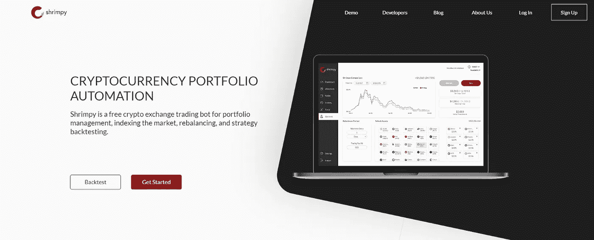
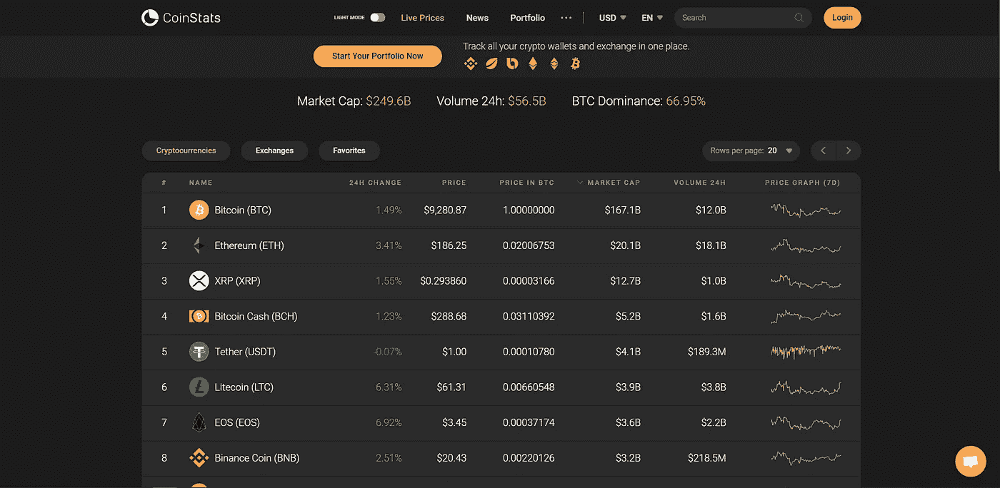
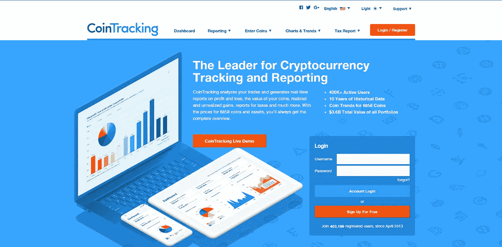
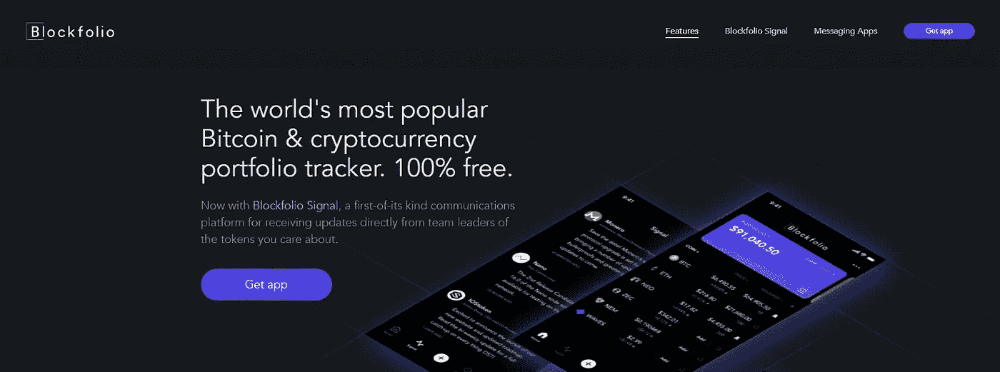
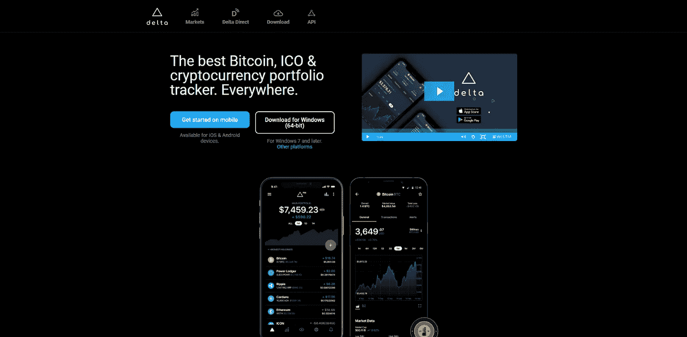

# 2022 年最佳免费加密货币投资组合跟踪器

> 原文：<https://medium.com/coinmonks/the-best-free-cryptocurrency-portfolio-trackers-in-2019-cbb9a2013e3f?source=collection_archive---------0----------------------->

加密空间仍在从 2018 年的熊市中复苏。虽然加密货币投资者在 2017 年最后一个季度创下历史新高，但整个 2018 年市场的突然崩溃让投资者感到紧张。虽然一些经验丰富的交易者可能通过密切跟踪市场并在创纪录低点时买入来利用熊市，但许多用户仍在寻找市场真正复苏的确认。

根据 [CoinMarketCap](https://coinmarketcap.com) 的数据，目前市场上有超过 2，300 种加密货币，每日 24 小时交易量超过 770 亿美元，这是增长和积极投资者参与的一个突出指标。你的投资组合中只有少数加密货币已经成为过去，如今投资者有如此多的选择，跟踪和管理多样化的[加密](https://blog.coincodecap.com/tag/crypto/)投资组合变得越来越困难。

虽然这个过程可能会很麻烦，但是有一些应用程序和在线服务可以帮助你解决[投资组合管理](https://blog.coincodecap.com/tag/portfolio-management/)的问题。简化您跟踪资产和业绩的方式，同时了解您的所有投资决策。

除了简单的跟踪功能，还有更复杂的应用程序正在兴起，这使得这一过程更进一步。随着时间的推移，促进交易，自动化策略，维护您的投资组合，这些应用程序可以节省您的时间和金钱。在这篇文章中，我们将介绍目前市场上的顶级 [crypto](https://blog.coincodecap.com/tag/crypto/) 投资组合追踪器，并分析每个选项，这样您就可以了解哪些选项最适合您的需求。

# 最佳加密货币投资组合跟踪器

以下是顶级加密投资组合追踪器。

*   [虾米](https://shrimpy.io/referral?r=I6VFZ7d2E)
*   [硬币跟踪](https://cointracking.info/?ref=T987862)
*   [Coinstats](https://coinstats.app/pricing?promo=coinmonks)
*   组合证券
*   三角洲
*   [Altrady](https://blog.coincodecap.com/go/altrady)

## [1。虾米](https://shrimpy.io/referral?r=I6VFZ7d2E)

[**Shrimpy**](https://shrimpy.io/referral?r=I6VFZ7d2E) 也许是最流行的[投资组合管理](https://blog.coincodecap.com/tag/portfolio-management/)应用程序，它结合了跟踪和交易两个领域。设计有许多高级功能，使其在行业中独树一帜。凭借其“通用交换接口”，您可以在一个地方鸟瞰您的整个加密组合。投资者和交易者可以轻松地将他们所有的交易所账户与 Shrimpy 联系起来，并在一个统一的仪表板界面上即时查看他们的投资组合。

Shrimpy 的另一个重要功能是其投资组合回溯测试，投资者和交易者可以[回溯测试长达 5 年的历史数据](https://hackernoon.com/the-simple-backtest-for-rebalancing-a-portfolio-3289bc8ee618)，这些数据是从每个单独的交易平台收集的，具有精确的买卖市场数据，以提高精确度。借助 Shrimpy，您可以对您的投资组合进行分类，并跟踪您所有硬件钱包、冷存储甚至 exchange 帐户的表现，所有这些都在一个统一的仪表板中。

Shrimpy 不仅是一个出色的投资组合追踪器，它还提供了一套完整的工具，允许自动交易、积极的投资组合管理和交易执行。面向经验丰富的投资者和消费者，它是管理从资产选择到投资组合跟踪和交易的一切的理想应用程序。如果你是一个被动的投资者，不要担心。Shrimpy 还提供最先进的一套[加密货币索引工具](https://blog.shrimpy.io/blog/how-to-create-a-custom-cryptocurrency-index-tutorial)。只需选择一个索引策略，Shrimpy 将在几秒钟内启动并运行它。

好消息是，Shrimpy 提供的所有投资组合管理功能和交易管理都是完全免费的。然而，你可以利用其他高级功能，每月只需 8.99 美元。

**网址:**[**https://www.shrimpy.io/**](https://shrimpy.io/referral?r=I6VFZ7d2E)

## 2. [CoinStats](https://coinstats.app/pricing?promo=coinmonks)

[**coin stats**](https://coinstats.app/)**是加密货币市场中最大的投资组合跟踪应用之一，拥有超过 30 万活跃用户。CoinStats 提供完整的网络和移动体验，无论您使用什么设备，都可以轻松掌控您的加密货币组合。**

**CoinStats 服务支持 100 多个不同交易所的数千种资产。搭配个性化新闻、价格通知和投资组合建筑，您将始终了解市场最新动态。**

**如果你对在交易所保存资产不感兴趣，CoinStats 还可以让你轻松同步钱包和手动输入余额。**

**最后，[快速交易](/coinstats/coinstats-update-marches-on-brings-quick-trade-feature-into-the-spotlight-9aeac43b52a4)允许直接通过应用程序以最快的方式进出头寸。只需选择你想出售的资产，你想购买的资产，CoinStats 将迅速路由交易，使之发生！**

****网址:**[**https://coinstats.app/**](https://coinstats.app/)**

****App Store 链接:**[**Playstore**](https://play.google.com/store/apps/details?id=com.coinstats.crypto.portfolio)**|**[**App Store**](https://apps.apple.com/us/app/coin-stats-btc-eth-xrp-prices-and-altfolio/id1247849330)**

## **3.[硬币跟踪](https://cointracking.info/?ref=T987862)**

****

**[**coin tracking**](https://cointracking.info/?ref=T987862)**面向需要功能丰富的投资组合跟踪器应用的高级 [crypto](https://blog.coincodecap.com/tag/crypto/) 投资者和经验丰富的交易员。注册过程是通过网站完成的，不能从 app 本身完成。你也可以从网站而不是应用程序中添加/删除交易，这有时是一项令人生畏的任务。似乎 CoinTracking 主要是一个基于网络的平台，其应用程序只为他们的网络产品提供便利。不过，该应用程序适用于 Android 和 iOS 平台。****

****硬币追踪有许多不同的功能。它有能力连接所有主要的交易平台，下载你的交易活动，以及余额等。它还支持从 Trezor、Ledger 等硬件钱包以及 [blockchain.info](http://blockchain.info) 和 Exodus 等软件钱包导入数据。****

****CoinTracking 有从 65 美元到 1090 美元不等的可变定价方案。在 CoinTracking 的免费版本中，你最多只能导入 200 笔交易，这是非常少的，即使对于业余交易者来说也是如此。CoinTracking 目前支持 70 多个受欢迎的[加密交易所](https://blog.coincodecap.com/tag/crypto-exchange/)，并通过提供资本收益报告和 12 种独立的税收方法(按照不同地区要求的格式)来帮助简化纳税申报。****

****你可以根据具体的交易所对你的交易进行分组，这将有助于你跟踪在特定时间任何交易所发生的所有交易活动。CoinTracking 的另一个显著特点是它提供个人分析报告，包括利润/损失审计、已实现和未实现收益等。总的来说，CoinTracking 是经验丰富的投资者和交易者的最佳加密投资组合跟踪器，他们需要详细的评估，图表和报告，超出了典型的散户投资者的需求。****

****【https://cointracking.info/】网址:****

********App Store 链接:**[**Playstore**](https://play.google.com/store/apps/details?id=info.cointracking.cointracking)**|**[**App Store**](https://itunes.apple.com/us/app/cointracking/id1263133106)******

## ****4.组合证券****

********

****凭借刚刚超过 500 万的下载量，[**block folio**](https://blockfolio.com)**的用户数量超过了业内任何传统的投资组合追踪器。该应用程序具有直观的设计，仅在谷歌 Play 商店就获得了 9 万多条正面评论。Blockfolio 支持 8，000 多种加密资产，并定期从 300 多个交易所收集数据，为您提供最新的价格和市场更新。******

******Blockfolio 最近推出了一个名为' [Blockfolio Signal](https://blockfolio.com/signal) 的功能，这就是他们所说的应用程序内的'通信平台'。此功能提供了您当前投资组合中持有的或添加到您的意愿列表中的每个加密资产背后的团队的直接更新。Blockfolio 的另一个有用的功能是，它让你能够创建多个投资组合，当你想对你的投资进行分类并独立跟踪它们时，这很方便。******

******在最近的版本中，Blockfolio 增加了直接连接流行的[加密交易所](https://blog.coincodecap.com/tag/crypto-exchange/)并导入您的交易活动的功能。Blockfolio 目前支持币安、Bitfinex、Bittrex、比特币基地+比特币基地 Pro、OkEx 和 Poloniex。就像 Gem 一样，Blockfolio 完全可以免费使用，但在最近的一篇博客文章中，Blockfolio 的创始人 Edward Moncada 提到，他们计划稍后围绕“Blockfolio Signal”将该应用货币化。******

******【https://blockfolio.com/】网址:******

********App Store 链接:**[**Playstore**](https://play.google.com/store/apps/details?id=com.blockfolio.blockfolio&hl=en_US)**|**[**App Store**](https://itunes.apple.com/us/app/blockfolio-bitcoin-altcoin/id1095564685?mt=8)******

## ****5.三角洲****

********

****下载量超过 100 万次的**在很多方面都与热门的同类产品相似。它在 Android 和 iOS 上可用，桌面客户端支持 Windows、Mac 和 Linux。开始使用之前，您需要将桌面客户端与您的 Delta mobile 应用程序同步。Delta 的设计非常简洁，具有企业的外观和感觉，它通过直观的图表将您的投资组合可视化，因此您可以快速了解您的资产。******

******达美还可以连接超过 7 个不同的交易所，以输入您的余额和交易活动。它可以与一些精选的加密钱包同步，以导入您的资产和投资组合。除了你现有的投资组合，你还可以从你的观察列表中添加硬币，并跟踪它们的表现。达美的另一个非常有趣的功能是它的“帐户恢复”功能，达美应用程序会生成一个恢复密码，您可以稍后使用它来恢复您的帐户。******

******达美支持 3000 多种加密货币，并从 200 多家交易所收集数据，以获得准确的价格信息和市场数据。就像 Blockfolio 一样，Delta 也有一个名为“Delta Direct”的功能，在这里您可以获得即时通知和更新，并可以与您最喜欢的硬币或即将推出的 ico 背后的团队直接沟通。通过 [Delta Direct](https://delta.app/en/direct) ，你还可以从社交媒体渠道和博客上获得你喜欢的硬币的所有更新。******

******Delta app 还附带了一个名为 Delta Pro 的高级计划，iOS 用户的价格为 7 美元/月，Android 用户的价格为 8.5 美元/月。在 Delta Pro 中，投资者和交易者可以获得高级投资组合分析工具，这是免费版应用程序所不具备的。达美在 Telegram 和 Slack 等平台上也有非常活跃的社交社区。******

******【https://delta.app/en】网址:[T5](https://delta.app/en)******

********App Store 链接:**[**Playstore**](https://play.google.com/store/apps/details?id=io.getdelta.android)**|**[**App Store**](https://itunes.apple.com/app/delta-crypto-ico-portfolio/id1288676542)******

## ****6.[奥特拉迪](https://blog.coincodecap.com/go/altrady)****

********

****Altrady 独特的自动化加密交易工具每天都有成千上万的交易者使用，通过自动化交易来实现回报最大化。该公司提供几种类型的机器人，包括网格和信号机器人，为有经验的交易者提供了一种简单的方法，让他们在没有任何知识或技能的情况下，在快节奏的市场中占据优势。****

******上下尾随的 Altrady 网格机器人******

****Altrady 网格机器人是交易者利用市场涨跌趋势的完美工具。有了它，你可以指定价格上限和下限，这样你的交易将永远是安全的，即使有一个巨大的波动！你还可以止盈止损，这使得交易比以往任何时候都容易。****

******带有 TradingView Webhook 的备用信号机器人或基于加密的扫描仪信号******

****信号机器人是以最小的努力参与行动的好方法。只需配置您的进入和退出设置，然后让这个机器人为您做所有的工作！****

****为了使用带有自定义信号的信号机器人，您必须配置带有 webhook 的信号机器人****

******Altrady 为每种类型的加密交易提供了完整的工具集:******

*   ****在多个交易所和交易所账户进行交易****
*   ****单个交易所的多个账户****
*   ****实时盈亏平衡计算****
*   ****离线价格和订单提醒****
*   ****图表上的可视交易反馈****
*   ****独特的集成市场扫描仪****
*   ****交易自动化，带止盈和止损****
*   ****带有 tradingview webhook 或基于加密的扫描器信号的信号机器人****
*   ****上下拖动的网格机器人****
*   ****具有子账户的投资组合管理****
*   ****交易分析****

****值得一提的是，他们正在不断改进他们的功能集，在 2022 年第 3-4 季度的简短路线图中，他们将添加:****

*   ****新的移动应用****
*   ****具有外部钱包支持的投资组合****
*   ****Dex 集成****
*   ****票据交易****

****利用你的知识和技能与最先进的交易平台:Altrady 14 天免费****

******网址:**[**【https://www.altrady.com/】**](https://www.altrady.com/)****

## ****结论****

****加密产业正在快速发展。如今，投资者和交易者有了更多的选择，加密投资组合追踪器通过分析、报告、交易所链接等额外好处使这一过程变得更容易。随着市场的不断发展，投资者保持其加密投资组合的方式也将不断变化。****

****尝试这些选项，找到最适合你的投资组合跟踪工具。不要再忘记你的基金了。享受依靠强大的投资组合跟踪器带来的简单和便利。****

****如果你有任何其他建议，我们很乐意倾听！请在下面评论并分享你的想法。****

> ****加入 Coinmonks [电报频道](https://t.me/coincodecap)和 [Youtube 频道](https://www.youtube.com/c/coinmonks/videos)了解加密交易和投资****

## ****也阅读****

**** [## 2022 年 5 大最佳社交交易平台

### 5 个最佳社交交易平台阅读加密产品评论和比较，了解比特币交易和…

coincodecap.com](https://coincodecap.com/best-social-trading-platforms)  [## BlockFi 评论:2022 年的利弊和利率

### 今天，我们提出了一个全面的 BlockFi 评论，这是一个成立于 2017 年的加密贷款平台，拥有其…

coincodecap.com](https://coincodecap.com/blockfi-review)  [## 如何在印度购买比特币？2021 年购买比特币的 7 款最佳应用[手机版]

### 如何使用移动应用程序购买比特币印度

medium.com](/coinmonks/buy-bitcoin-in-india-feb50ddfef94)  [## 加密税务软件——五大最佳比特币税务计算器[2021]

### 不管你是刚接触加密还是已经在这个领域呆了一段时间，你都需要交税。

medium.com](/coinmonks/best-crypto-tax-tool-for-my-money-72d4b430816b)  [## 9 个 2022 年最值得购买的密码| CoinCodeCap

### 9 个 2022 年最值得购买的加密产品阅读加密产品评论和比较，了解比特币交易和…

coincodecap.com](https://coincodecap.com/crypto-to-buy-in-2022)  [## 存储比特币的最佳加密硬件钱包 2022 | CoinCodeCap

### 硬件钱包是我们存储加密资产的唯一可靠选择。在本文中，我们将讨论 8 个…

coincodecap.com](https://coincodecap.com/best-hardware-wallet-bitcoin)  [## Pionex 评论 2021 |免费加密交易机器人和交换

### Pionex 是为交易自动化提供工具的后起之秀。Pionex 上提供了 9 个加密交易机器人…

medium.com](/coinmonks/pionex-review-exchange-with-crypto-trading-bot-1e459d0191ea)  [## 2022 年密码交易员的三大电报渠道

### 加密信号是来自专业交易者的交易想法，以特定的价格或价格买卖特定的加密货币

medium.com](/coinmonks/top-3-telegram-channels-for-crypto-traders-in-2021-8385f4411ff4)  [## 2022 年 5 个最佳免费加密投资组合追踪器

### 在这篇文章中，我们将带你通过一些最好的免费加密投资组合追踪器，让你选择最好的…

coincodecap.com](https://coincodecap.com/free-crypto-portfolio-trackers)****