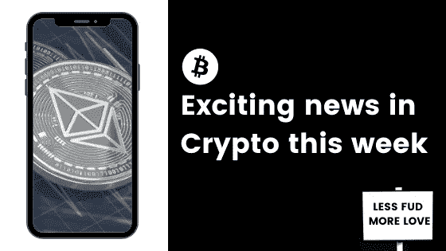

# 本周最好的隐语诗

> 原文：<https://medium.com/coinmonks/the-best-of-the-cryptoverse-this-week-794a1710a6ed?source=collection_archive---------8----------------------->

在加密领域，我们每天都会收到很多负面新闻和 FUD。

所以，我想把焦点放在一些积极的消息上，这些消息为我们所有人带来了这个星期的希望。

# 🔒大玩家也喜欢 Hodl 生活！

这些天，我们经常听到 MicroStrategy 和 Tesla 宣称他们对 crypto 的热爱，并在 BTC 抢购王者。

但是还有谁在拥抱你不知道的 Hodl 生活，却热衷于隐密体？

找出谁在享受这里的秘密生活。

# 💡Visa 看到了 NFT 之光

支付系统巨头 Visa 刚刚[发布了一份白皮书，暗示 NFT 将继续存在。](https://cointelegraph.com/news/visa-whitepaper-describes-nfts-as-a-promising-medium-for-fan-engagement)

他们认为这是一个潜在的核心工具，可以吸引全球的观众。我们只需要看看现在 NFT 的数字艺术界周围不断增长的社区，就知道这能有多成功。

# 💵5 年内取代美元！？你疯了吗？

显然不是。

随着最近市场的良好增长，通常的头条新闻是“比特币已死”。媒体频道[现在转向了加密是否会取代美元的问题](https://bitcoinist.com/can-crypto-replace-the-dollar-in-five-years-bankers-say-it-could/)，如果会呢？什么时候？

NFT 韵文的爆炸式发展已经将许多人引入了密码世界。现在，随着越来越多的知名人士进入这个领域，它给市场带来了更多的合法性和可信度。所以，像这样的文章只是时间问题，谁知道呢？也许几年后它们会成真。

# 🤑Opensea 在一个月内创造了 30 亿美元的 NFT 销售额，与亚马逊和其他市场相比如何？

又是一周，甚至更多的里程碑。

Opensea 分享说，他们在过去 30 天内处理了 30 亿美元的销售，打破了他们的历史交易记录。一个疯狂的成就，但这与亚马逊的大联盟相比如何？解密团队揭开了所有的真相。

# 👩‍💻不仅仅是市场在增长，加密和区块链的工作也在增长！

随着加密技术在全球范围内的持续采用以及 NFT 和 De-Fi 等产品的爆炸式增长，公司想要获得自己的内部专业知识只是时间问题。

看起来我们现在看到的是，2021 年，区块链和过去 10 个月中以加密为重点的招聘广告将增长 118%。

点击此处了解更多信息。

# 💬本周推特

# 那都是乡亲们！

我的朋友们，这一次到此为止，但不要担心，这只是从积极的消息中挑选出来的，我们可能不会经常看到。

如果你有兴趣看这样的周刊或月刊，请给这篇文章点个赞，并在下面留言告诉我。

# 更多来自我

[全球加密采用率在 12 个月内上升了 888%:](https://www.publish0x.com/eckbloc/worldwide-crypto-adoption-rises-by-888-percent-in-12-months-xppzrpx)这对金融业的未来意味着什么。

[百万美元比特币:幻想还是现实？](https://www.publish0x.com/eckbloc/million-dollar-bitcoin-fantasy-or-a-certain-reality-xdgkyyq)

# 想要更多这样的吗？

订阅我的免费两周一期的时事通讯，专注于分享提高你财商的最佳内容。没有垃圾邮件，随时退订。

# 重要的🚨

我不是财务顾问、心理学家或任何被认可的专业人士。因此，这不是财务建议，我没有资格或许可提供任何类似的东西。这些内容是一群来自人类同胞的想法，仅用于教育目的——仅此而已。

> 加入 [Coinmonks 电报频道](https://t.me/coincodecap)，了解加密交易和投资

## 另外，阅读

*   [尤霍德勒 vs 科恩洛 vs 霍德诺特](/coinmonks/youhodler-vs-coinloan-vs-hodlnaut-b1050acde55a) | [Cryptohopper vs 哈斯博特](https://blog.coincodecap.com/cryptohopper-vs-haasbot)
*   [如何在 FTX 交易所交易期货](https://blog.coincodecap.com/ftx-futures-trading) | [OKEx vs 币安](https://blog.coincodecap.com/okex-vs-binance)
*   [如何在势不可挡的域名上购买域名？](https://blog.coincodecap.com/buy-domain-on-unstoppable-domains)
*   [印度的秘密税](https://blog.coincodecap.com/crypto-tax-india) | [altFINS 审查](https://blog.coincodecap.com/altfins-review) | [Prokey 审查](/coinmonks/prokey-review-26611173c13c)
*   [区块链 vs 比特币基地](https://blog.coincodecap.com/blockfi-vs-coinbase) | [比特坎评论](https://blog.coincodecap.com/bitkan-review) | [币安评论](/coinmonks/binance-review-ee10d3bf3b6e)