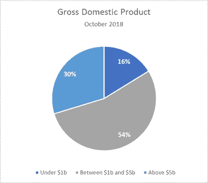
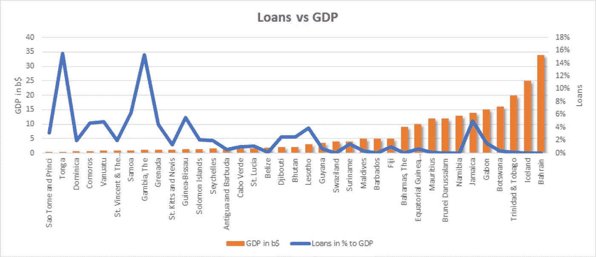
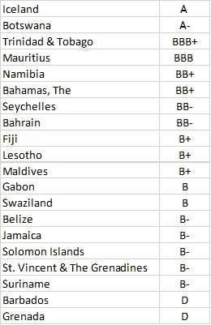
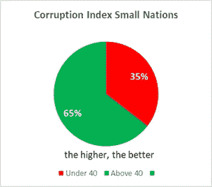

# 小国的大未来:统计分析

> 原文：<https://medium.com/coinmonks/the-big-future-for-small-states-a-statistical-analysis-1aeaf5fa6a7d?source=collection_archive---------7----------------------->

***本文更新于 2019 年 1 月 29 日***

[世界银行](http://www.worldbank.org/en/country/smallstates)将小国定义为人口少(少于 150 万人)、人力资本有限、国土面积狭小或孤立的国家或民族。小国面临着以最佳效率和效力实现繁荣的挑战。由于经济发展选择有限，市场波动可能造成海啸般的影响，小国在实施货币制度和政策时不需要承担额外的风险。

让我们检查一下数字，分析一下这些国家的情况。

# 国内生产总值

增长既是经济选择，也是政治选择。对小国来说，增长来自国际贸易和旅游业。这些部门的创新必须成为经济活动的一个固有组成部分，当创新在市场设计的指导下并在所有参与者的参与下不断发展时，国内生产总值(GDP)的增长将会提高。

小国的经济*可以通过理解*如何在它们的市场内部处理不稳定和危机而得到改善，而不是着眼于外部的影响。一个很好的例子是互联网的诞生，它赋予了大多数国家权力，因为互联网是旅游和贸易的完美载体。

目前，在一个经济体中流通的大部分新货币是由商业银行创造的，每次他们发放新的贷款。这些贷款可以帮助一个经济体，但在许多情况下，它们也会造成问题(缺乏灵活性和较高的利率)，因此在小国(只有在那里)的一个优先事项必须是政府的大力参与。与银行相比，只有政府会考虑增长和公民的福利。银行以利润为导向。货币的创造方式会影响社会财富的分配。因此，货币创造的 ***方法应该被理解为一个政治问题，而不应该完全掌握在银行手中*** 。同样，这仅适用于小国。

平均而言，小国的国内生产总值从 63 亿美元(2017 年)增加到 70 亿美元，其中 16%的国家国内生产总值低于 10 亿美元(2017 年超过 30%)。只做个对比:美国电影业的大本营好莱坞的 GDP，2018 年对美国 GDP 的贡献为 490 亿美元。

[https://www.imf.org/external/pubs/ft/weo/2018/02/weodata/download.aspx](https://www.imf.org/external/pubs/ft/weo/2018/02/weodata/download.aspx)

小国人口少，收入和支出也低。当消极的事情发生时，困难就开始了——这也是世界银行强调的小国面临的巨大问题之一。*例如，在 2017 年飓风玛丽亚造成破坏之前，多米尼加的国内生产总值为 6 亿美元，他们的经济增长约为 3%，通货膨胀率为 1.5%* 。

他们的人口是 71，000。自 2006 年以来，其经济增长归功于旅游业、建筑业、离岸和其他服务业以及香蕉业一些分支部门的增长。国际货币基金组织(基金组织)最近赞扬多米尼克政府成功的宏观经济改革。

2017 年，该国遭受了毁灭性的飓风袭击。[灾后需求评估](https://reliefweb.int/sites/reliefweb.int/files/resources/dominica-pdna-maria.pdf)得出结论，飓风玛利亚造成了 9.31 亿美元的总损失和 3.82 亿美元的损失，这相当于 2016 年国内生产总值的 226%。已确定的重建和复原干预措施的恢复需求达 13.7 亿美元。多米尼克将无法产生那么多的钱，等待外部支持将需要很长时间。虽然政府多年来一直在做出色的工作，但这样一个问题可以在几分钟内使这些努力化为乌有。需要创建一个新的解决方案。

# 债务

将多个国际机构的未偿还贷款、信贷和赠款加在一起，并与该国的 GDP 进行比较，可以看出一个 GDP 较低的国家可能拥有较高的未偿还金融支持价值。这是一个重要的统计数据，因为它强调了我们的理论，即小国必须得到授权，以减少对其他国家/机构的依赖。

小国的增长缓慢，因为这通常与基础设施建设有关，但衰退可能非常快。这就是为什么这些国家可以通过实施自己的货币作为加密货币来保护自己的原因。

> [在您的收件箱中直接获得最佳软件交易](https://coincodecap.com/?utm_source=coinmonks)

# 信用评级

只有一些小国家被赋予了信用评级。分配这个分数的三大机构是[惠誉](https://www.fitchratings.com/index_fitchratings.cfm)、[穆迪](https://www.moodys.com/cust/default.asp)和[标准&普尔](https://www.standardandpoors.com/home/en/us)。他们的职能是评估借款人偿还债务的可能性，并帮助那些在二级市场交易债务合约的人。失去评级或被降级会对一个国家在市场上借钱的能力产生致命影响。

Source (January 2019) [https://tradingeconomics.com/country-list/rating](https://tradingeconomics.com/country-list/rating)

相比之下，巴西这样的国家信用评级为 BB-，墨西哥为 BBB+

对于评级机构来说，如果债券的信用评级为 BBB-或更高，则被视为投资级。评级为 BB+及以下的债券被认为是投机级，有时也被称为“垃圾”债券。在那些已经被评级的小国中，大多数都属于“投资级”国家。

将评级与世界银行和国际货币基金组织的公开贷款/信贷和赠款进行比较，所有信用评级良好(BBB-以上)的国家在这些机构都没有未偿还的贷款、赠款或信贷。

# 腐败

我们的分析基于透明国际发布的数据，该组织自 1995 年以来一直发布清廉指数(CPI)，每年“根据专家评估和意见调查确定的腐败程度”对各国进行排名 CPI 通常将腐败定义为“滥用公共权力谋取私利”。CPI 目前对 176 个国家进行了“从 100(非常廉洁)到 0(高度腐败)”的排名

在这些小国中，有 31 个被列入了这个腐败指数。

Source (January 2019): [https://www.transparency.org/research/cpi/overview](https://www.transparency.org/research/cpi/overview)

相比之下，巴西的 CPI 为 35，墨西哥为 28。小国的平均值为 47(比 2018 年有所改善)。这比大多数其他国家要好，这表明腐败在小国并不是一个大问题。这可以用这样一个事实来解释:在小国，人们互相认识，大规模的腐败会立即显现出来。