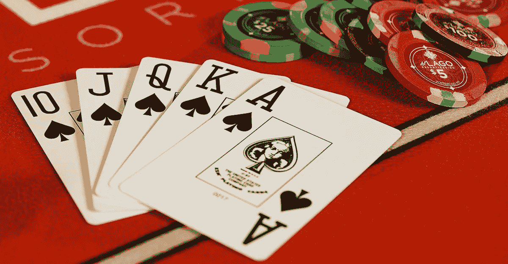

# 大游戏——但是鲍勃和爱丽丝就是不信任对方，或者事实上，不信任任何人:精神扑克问题

> 原文：<https://medium.com/coinmonks/the-big-game-but-bob-and-alice-just-dont-trust-each-other-or-in-fact-anyone-the-mental-poker-73506bbfa847?source=collection_archive---------7----------------------->

我们有一个主要的竞争…它是鲍勃在有史以来最伟大的扑克游戏中扮演爱丽丝。但是 Bob 和 Alice 都不信任对方来交易，因为他们认为另一方会作弊，并且他们不信任任何其他人，因为每个选择的经销商都对 Bob 或 Alice 有一些偏见。