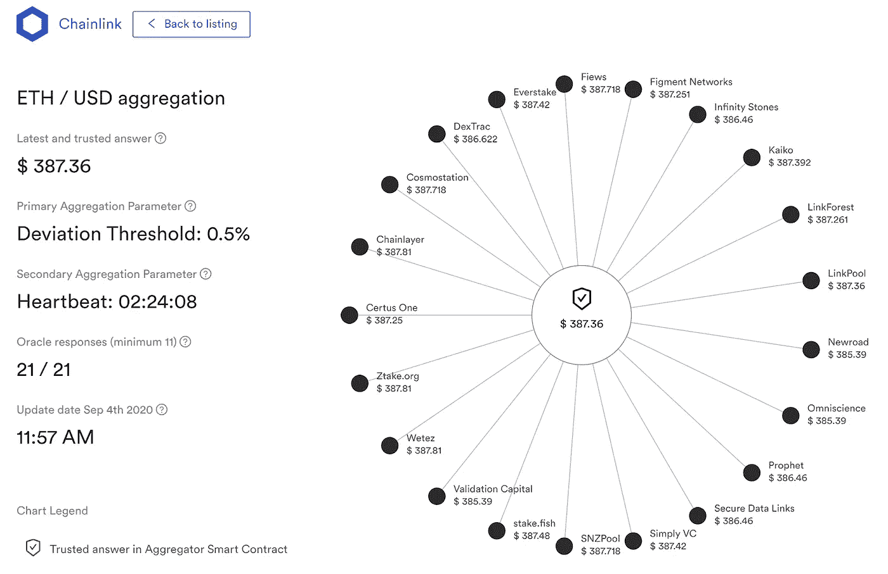
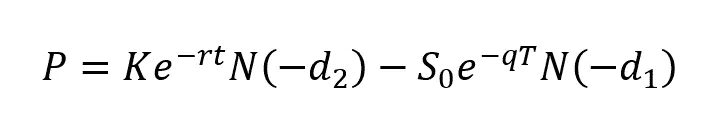
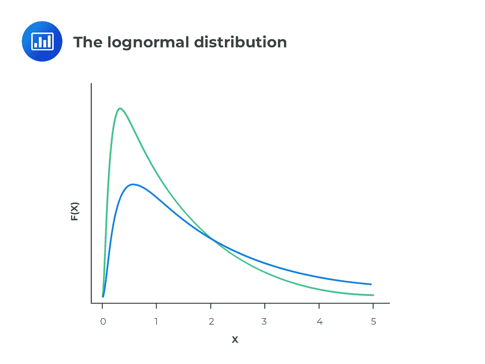
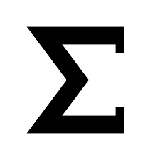
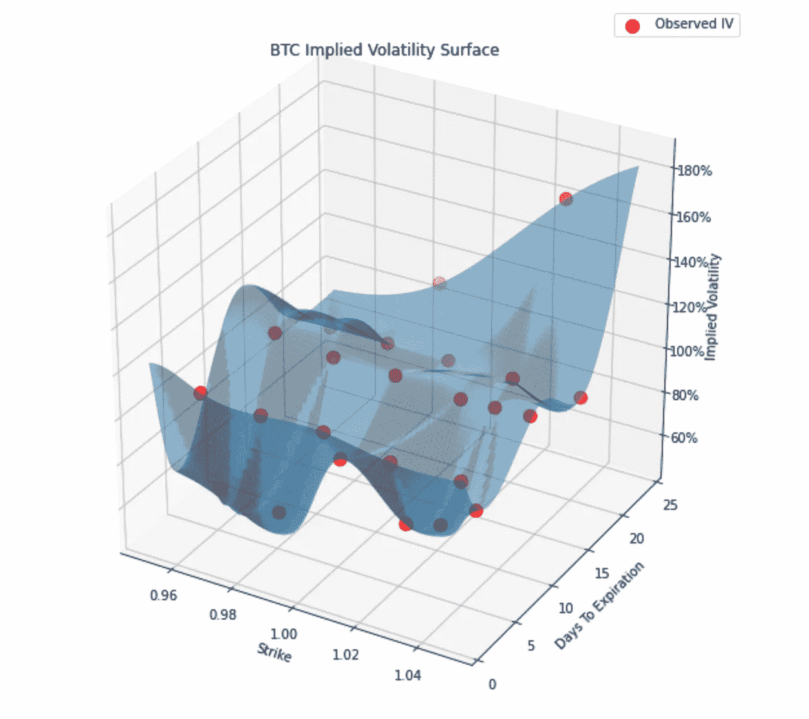
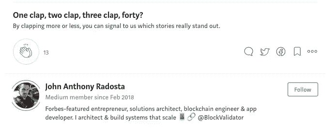

# 分散金融面临的最大障碍

> 原文：<https://medium.com/coinmonks/the-biggest-hurdle-facing-decentralized-finance-defi-1e1151c4afe?source=collection_archive---------3----------------------->

上个月，我为 [Chainlink](https://chain.link/) 提供了一个解决方案，内容是如何使用价格反馈和 oracles 最好地为比特币和以太坊期权建模隐含波动率(IV)。

Chainlink — Decentralized Pricing Feeds For Etherum Smart Contracts

如果你不太熟悉以太坊智能合约的工作方式或者[甲骨文问题](https://blog.chain.link/what-is-the-blockchain-oracle-problem/)，在进入公共区块链协议面临的主要问题之一之前，我将给出一个简短的概述*。*

# **公有区块链的隔离问题**

公共区块链越来越受欢迎，因为它们强调分散的基础设施和支付授权。前提是，当涉及到数据共享、支付和其他通常由中央机构作为服务提供的行业应用程序(如 Visa、Mastercard、Google 或 Paypal)时，去中心化提供了公平性。

虽然区块链无疑为去中心化问题提供了独特的解决方案，但他们有一些独特的问题，这些问题围绕着可能引入安全风险、欺诈性交易以及在区块链分类帐的历史中变成不可改变(不可删除)的明显错误的应用程序状态的链外数据接收。

**换句话说，区块链有一个数据问题。**

所以问题变成了:

> 您如何使用来自现实世界的数据，您如何知道这些数据是可信的，以便添加到分类账中的交易既准确又公平？

# 数据问题变成了 Oracle 问题

总而言之，区块链的数据问题围绕着一个非常简单的限制— **区块链不能作为内置功能从任何外部系统获取数据或向其推送数据。** **因此，区块链是孤立的网络，非常类似于没有互联网连接的计算机。**

像 [Chainlink](http://chain.link) 这样的公司正试图通过提供被称为*价格反馈*的预建解决方案来解决这个问题。

Price Feed Example for ETH / USD Exchange Rate Using Various Sources,

这些价格源本质上是收集离线数据的神谕，并使用加权平均将它们聚合成单一的真实来源。

虽然这对于价格馈送和原始数据很有效，但智能合约目前面临的主要问题是高阶金融建模变得几乎不可能。如果区块链的最终目标是财政分权，那么这是一个需要解决的问题。

# 传统金融与 DeFi 的脱节

当谈到 DeFi 时，我看到的公共区块链协议所面临的问题不一定是一个哲学问题(集权与分权)，而是一个技术问题。

当谈到传统金融(TradFi)中的风险管理或投资组合分配时，基金经理通常使用金融模型来进行投资组合分配，以各种方式量化风险。这些风险管理指标通常采用希腊字母的形式: *alpha、beta、delta、gamma、rho、theta 等。*允许经理衡量投资组合对基础价格、市场波动、利率和其他因素的市场变化的敏感度。

除此之外，量化货币经理经常使用贝叶斯模型将投资组合表现建模为概率分布，因此这些希腊字母可能采用多个概率分布相加的值(贝叶斯统计)。

> 区块链目前面临的主要问题是，如果你要真正分散金融，你必须提供与传统金融相同的工具，否则你所做的一切都是在承担无法量化的风险。

# 智能合同的当前限制

在前面的部分中，我提到了风险管理和投资组合管理通常可以归结为希腊字母。这些希腊字母通常是各种金融建模方程的偏导数，其中最著名的是期权定价的 Black-Scholes 模型。

The closed-form Black-Scholes Equation for option pricing. The equation is used for deriving the expected price of an option based on the price of the current price of underlying asset, the cost of capital, the time to expiration, the strike price, and the asset’s volatility.

在这里，我们看到了区块链在 TradFi 建模时面临的问题，即 TradFi 模型经常包含分布。在 Black Scholes 模型中,“N”符号是对数正态分布。

The log-normal distribution, where Y is function of X distributed over a range of probabilities.

这就给我们带来了当今智能合约面临的最关键的技术问题…

**以太坊智能合约的主要问题是，作为一种编程语言，Solidity 不支持浮点数**，这使得在智能合约中使用 Black Scholes Merton (BSM)模型等人工计算隐含波动率成为不可能。

如果你没有浮点数，你就不能对连续分布建模，这意味着你不能在链上进行 TradFi 建模。这是 Solidity 在采用分散资产管理方面面临的一个主要障碍。

相比较而言，所有现代编程语言如 Python、Java、C++、Javascript、Go，甚至 Rust 都支持浮点数。

Python 现在*是金融建模事实上的*语言，因为它有大量的金融库，如 TA-Lib 和 Mibian。如果独立金融专业人士和独立量化资产管理公司的开发人员打算采用智能合约作为可行的透明资金管理解决方案，那么这个浮点数问题就需要解决。

并且这些库将需要在链上重建，因为没有人愿意浪费时间手工做 Black-Scholes 计算。开发人员希望专注于解决现实世界的问题，而不是重新发明轮子。

# 目前唯一可行的解决方案

就性能而言，目前使用以太坊进行 TradFi 建模的唯一可用且可伸缩的解决方案是在中间层 API 中进行所有建模*离线*，将结果四舍五入为整数或整数数组，并将结果返回给调用 oracle。

除了因为缺乏可靠的浮点数支持而无法在链上进行这种建模之外，即使你尝试了，天然气价格也可能会扼杀你的交易，因为在引擎盖下需要大量的计算——计算分配涉及到许多*西格玛*。

Calculations involving sigmas could cause gas prices on Ethereum to explode.

在下面的 Colab 笔记本中，我提供了一个在以太坊当前版本的 Solidity 中如何进行 TradFi 建模的工作示例。

作为 Chainlink 的一个例子，我展示了如何使用 Chainlink 价格源为比特币和以太坊期权合约的隐含波动率(IV)建模。

**Colab 笔记本(点击“运行时”然后点击运行全部)**:
[https://kaizentek.live/chainlink-BTC-IV-architecture](https://kaizentek.live/chainlink-BTC-IV-architecture)

简而言之，您需要在中间层 API 中完成所有繁重的工作，然后将结果缓存或存储为链上的舍入整数，在这种情况下，智能契约或多或少只是充当一个数据库。

> 但这引入了大量与区块链的前提背道而驰的哲学问题:如果金融建模本身没有去中心化，那么去中心化这些模型的结果有什么好处呢？

这是以太坊基金会需要解决的一个主要问题，因为这是所有金融发展的方向:*概率风险管理。*

这也是概率深度学习和金融开始合作的交叉点，所以像 TensorFlow 这样的深度学习框架也需要出现在链上。

如果智能合约最终不能提供这种基本的浮点数功能来进行链上的 TradFi 建模，你怎么能真正地期望分散*所有*西方金融？

# 实际上分散了西方财政

当我写完这篇文章时，我正看着我笔记本电脑右边的星巴克咖啡。今天花了我 1.86 美元，一个小数点数字。

如果星巴克的 POS 系统是建立在坚固的基础上，他们将不得不四舍五入，向我收取 2 美元。在现实世界中，金融不是这样运作的。

在金融世界彻底去中心化和民主化之前，我们还有一段路要走。但是我相信以太坊基金会的开发者能够胜任弥合 TradFi 和 DeFi 之间的鸿沟的任务。

# 如果你从这篇文章中学到了什么，给我一些掌声和关注…

# 如果你需要做正确的事情…

[改善——现代化、加速、&规模](http://www.kaizentek.io)