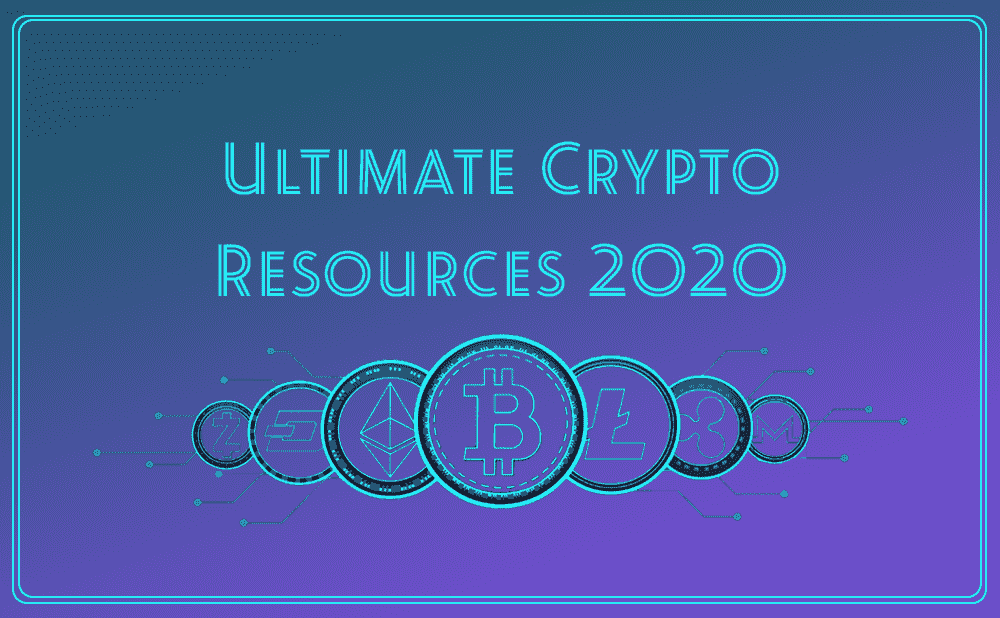

# (最大)终极 2020 加密货币资源列表【300+资源！]

> 原文：<https://medium.com/coinmonks/the-biggest-ultimate-2020-cryptocurrency-resource-list-300-resources-4523e47f298?source=collection_archive---------1----------------------->

在过去的几年里，DLT 和加密货币的广阔世界确实出现了新的项目、工具和平台，供交易员和其他加密狂热分子使用和享受。

这不仅仅是另一个资源列表——这是一个包含整个密码领域 300 多种不同资源的**大列表，包括交易工具、电影和书籍、各种各样的在线社区，以及获取新闻和信息的最佳地点。最重要的是，它是 2020 年可用的当前和最新的，没有一堆不再存在的旧网站。**

我制作它是希望你*个人*能从中获得很多价值，真的希望你会..

所以废话不多说..

*(* [*联系*](mailto:ultimatecryptolist@gmail.com) *如果你想让我把你的项目/平台加入我的大名单。人越多越开心* 🥳 *)*

> [此外，检查 CoinCodeCap，发现很酷的新加密项目](https://coincodecap.com)

# 📰新闻网站

*   📰 [CoinDesk](/@ck_87144/(www.coindesk.com)) — CoinDesk 是一个数字货币的全球媒体平台，每月拥有超过 1700 万用户。
*   [CCN](https://www.ccn.com/) —提供全球范围内所有最新的加密货币新闻。监控并检查加密货币诈骗。
*   [解密媒体](https://decryptmedia.com/) —涵盖科技、商业、艺术、教育等所有最新消息的媒体平台。
*   关于最新数据、新闻和研究的信息。BTC 优势:66.21%
*   所有当前交易的加密货币的新闻。
*   [空 Tx](https://nulltx.com/) —始于 2014 年。关于加密货币世界和教育内容的所有最新更新。
*   [比特币杂志](https://bitcoinmagazine.com/)——加密货币新闻最古老的来源之一。提供 2012 年以来最新准确的加密货币数据。
*   [比特币专家](https://bitcoinist.com/)——报道区块链、加密货币、比特币和其他科技新闻。
*   [勇敢的新硬币](https://bravenewcoin.com/news/) —始于 2014 年。领先的研究和数据公司之一。
*   [比特币价格](http://www.bitcoinprice.com/)——通过定期简讯发布的加密货币新闻和分析。

# 💬论坛

*   💬[新兴技术](https://emerging.technology/) —未来主义的新论坛，用于讨论和赚钱，包括加密、区块链、人工智能、虚拟现实、3D 打印、无人机等。
*   [Cryptocurrencytalk](http://cryptocurrencytalk.com/) —超过 70，000 名用户和 79，000 个高质量的加密货币视频。
*   Bitcointalk——有多种语言版本，由中本聪创建。
*   [Cryptorum](http://cryptorum.com/) —大约 70 个线程可用。加密货币教育论坛。
*   [加密大师](https://mastersofcrypto.com/forum) —一个关于加密货币的最新论坛，拥有超过 3000 名会员。
*   [以太坊](https://www.cryptocompare.com/coins/eth/forum) —超过 33000 条帖子，360 万次观看。
*   [stee MIT](https://twitter.com/)——加密货币领域的第一个全球社交网络。
*   [Litecoin Talk](https://litecointalk.io/) —成立于 2011 年。约 1440 次浏览和超过 17500 名用户。
*   Dash 论坛——最受欢迎的论坛之一，每月有超过 322，800 名观众。
*   [中](/) —关于加密货币的资讯性和细节性文章。超过 6000 万会员。
*   [堆叠交换](https://stackexchange.com/) — Q & A 基础。包括多个子站点。

# 📢博客

*   📢 [Cryptocoinsnews](https://www.ccn.com/) —订阅 Cryptocoinsnews 的每日时事通讯，获取各种关于加密货币的最新可靠消息。
*   [Reddit 加密货币](https://www.reddit.com/r/CryptoCurrency/top) —为数百万人提供一个讨论最新加密货币新闻的全球平台。
*   [ET 内容中心](https://emerging.technology/cc) —涵盖与新的尖端技术相关的广泛主题。
*   [Cryptoverze](http://cryptoverze.com/) —经常发布加密货币新闻的现代网站。
*   [密码更新](http://thecryptoupdates.com/)——每天所有的最新消息。独特的“骗局”部分，提供所有关于加密骗局和欺诈的更新。
*   [XT rgate](https://xtrgate.net/)——最古老的加密货币博客之一。用户友好的博客。
*   [比特币新闻](http://thebitcoinnews.com/)——提供更短更准确的新闻。在推特上有超过 67000 名粉丝。
*   [以太坊博客](https://blog.ethereum.org/) —以太坊的最新更新和新闻、公告。
*   [使用比特币](https://usethebitcoin.com/)——增长最快的加密货币博客之一。每月超过 570，000 次浏览。
*   [加密英雄](https://cryptohero8.com/)——适合加密货币世界的新手。
*   以太坊周[—每周提供新闻。](http://www.weekinethereum.com/)

# 🚀交换

*   🚀领先的保证金交易加密平台。在全球贸易中，每天高达 100 亿 2B .
*   [Coinmama](https://buybitcoinww.co/CoinMama_Crypto) —在大多数国家都有售。包括莱特币、以太币、比特币等。
*   比特币基地专业版——实惠的费用。它由比特币基地经营。
*   [本地比特币](https://localbitcoins.com/)——每月超过 1000 万用户。
*   [OkEx](https://coinsutra.com/go/okex/) —加密货币交易的可靠平台。
*   [Luno](https://luno.fl9beu.net/kqNj3) —包括以太坊和比特币的兑换。
*   币安，位于马尔他。手续费低:每笔交易 0.05%。
*   [现在更改](https://coinsutra.com/go/changenow/) —包括 200 多种加密货币。也支持美元/欧元。
*   [北海巨妖](https://coinsutra.com/go/Kraken/)——加入加密货币社区已近十年。
*   [KuCoin](https://coinsutra.com/go/KUCoin/) — KuCoin 提供 iOS 和 Android 两种版本的移动应用。
*   [Bittrex](https://coinsutra.com/go/bittrex/)——包括几枚硬币。易用性。

# 👩‍🚀中等渠道

*   👩‍🚀[Brain Armstrong](https://medium.com/u/cbc31cc3214a?source=post_page-----cf0e03a0c7fb----------------------)——比特币基地的联合创始人兼首席执行官。
*   [Coin and Crypto](https://medium.com/u/fffbcf90a5c9?source=post_page-----cf0e03a0c7fb----------------------) —你需要的所有关于加密货币的信息都可以在 Coin and Crypto 上找到。
*   [Linda Xie](https://medium.com/u/514b75d4b762?source=post_page-----cf0e03a0c7fb----------------------)——加密货币社区最具影响力的女性之一。
*   [Crypto Oracle](https://medium.com/crypto-oracle) —由专家撰写的有趣的新加密货币内容。
*   [亚历山大·巴甫洛夫·尼尔森](https://medium.com/u/30526afe7b86?source=post_page-----cf0e03a0c7fb----------------------) —关于加密货币的教程和基本新闻。在新手中广为人知。
*   Stefano Bernardi——Token Economy 出版物的编辑和作家。
*   [加密链接](https://medium.com/cryptolinks) —关于加密货币的各种观点和内容。
*   尼克拉斯·戈克——《加密时报》的编辑。

# 🗣️电报频道

*   🗣️ [加密武士](https://t.me/CryptoSamurai1)——关于加密货币最相关、最真实的新闻。超过 3000 名用户。
*   [加密证书](https://t.me/CryptoCharters) —面向高级分析师和交易员。擅长比特币分析。
*   [英国加密](https://t.me/ukcrypto) —提供关于技术分析和基本面分析的信息。
*   [Crypto Shuttle](https://t.me/Cryptoshuttle) —一些关于加密货币和市场情况的最准确和最新的新闻。
*   [coin telegraph](https://t.me/cointelegraph)——关于加密货币的最受欢迎的出版物之一。
*   [DeCenter](https://t.me/DeCenter) —超过 75，000 名订户。每天发布最新消息。
*   由访谈和抽认卡等有趣的功能组成。它有大约 44000 名用户。
*   [鲸鱼坦克](https://bit.ly/MYCREFWT)——拥有超过 38000 名订户。各种加密货币市场更新。

# 🗞新闻聚合器

*   🗞[cryptopanic](https://cryptopanic.com/)——提供优秀的功能，如搜索栏、侧边栏、投票等。
*   [Coinna](https://www.coinna.com/) —汇集来自金融磁铁、Bitsonline 等热门平台的加密货币新闻。
*   [Ccowl](https://ccowl.com/) —相关加密货币新闻和价格更新的有用信息。
*   [CoinLib](https://coinlib.io/) —它有一个独特的功能，可以跟踪投资组合。在 CoinLib 查看最佳加密货币市场价格。
*   [今日加密链](https://www.todayonchain.com/) —包括加密货币和区块链。
*   [CryptoControl](https://cryptocontrol.io/en/) —更适合专业交易者和密码爱好者。
*   [CoinLive](https://coins.live/) —国际加密货币新闻及市场分析。有益于新的密码交易员。
*   [FAWS](https://faws.com/)——除了 crypto news 上的优秀内容，FAWS 还有其他很酷的功能，如投资组合跟踪、Altcoin 价格检查器等。
*   CryptoViral——从 Reddit 和 Twitter 带来新闻和更新。

# 📈价格跟踪器

*   📈 [CoinMarketCap](http://coinmarketcap.com/) —根据市值提供前 100 种加密货币。
*   [Coincap](http://coincap.io/) —实时加密货币价格追踪器。
*   [Intrinio](https://intrinio.com/) —包括 1000 多个加密货币市场，并提供实时数据。
*   [硬币追踪器](http://www.cointracker.io/) —极简功能，提供精确的加密货币价格和数据。
*   [token trax](http://www.tokentrax.com/)——数字货币和数字钱包的结合。手机友好的价格跟踪。
*   [Gem](https://gem.co/) —兼容 iOS 和 Android。
*   [德尔塔](https://delta.app/) —超过百万用户。
*   [财神](https://teamfox.co/mammon/) —超过 700 种最新加密货币价格数据。可用的自定义选项。
*   Bitdec —用户友好。综合价格数据。
*   [比特币基地](https://rapidapi.com/package/Coinbase/functions?utm_campaign=Quora&utm_medium=link_Coinbase&utm_source=Quora) —实时价格数据图表。提供以太坊和比特币的交易。

# 📉ICO、STO、IEO 跟踪器

*   📉 [ICOStats](https://icostats.com/) —有用信息。硬币之间的比较。
*   [CoinGecko](https://www.coingecko.com/en) —监控 ICO 诈骗。最受欢迎和最著名的 ICO 追踪器之一。
*   [Tokener](https://thetokener.com/)–开发者和用户的独特博客。
*   [币安发射台](https://cryptonews.com/ext/binance) —包括 Celer Network、Matic Network、Bread (BRD)等多个 ieo。
*   [Bittrex](https://cryptonews.com/ext/bittrex) —易于访问的 ieo。
*   ICOgang —几个加密货币项目的可靠信息。有助于吸引投资者。
*   [TokenTops](https://tokentops.com/) —关于 ICO 和加密货币的最新信息和评论。
*   [ICO 下降](https://icodrops.com/) —结束+即将+当前 ICO 信息。详细的加密货币和 ICO 新闻。

# 🗯聊天群

*   🗯 [增强型投资者](http://stocktraders.live/)——与数千名加密货币爱好者的活跃聊天室。
*   Whaleclub 大约有 3000 名用户。易加入，最大的比特币群体之一。
*   [Blockfolio](https://telegram.blockfolio.com/) —该聊天室由知名投资人 Masternode 创办。
*   硬币农场大约有 2000 名成员。关于替代硬币的更新。
*   my cryptopedia—BitMex 和币安的可靠交易信号。
*   [WhaleTank](https://bit.ly/MYCREFWT)——超过 38000 名订户。24x7 支持系统。
*   [加密货币](https://discordapp.com/invite/GdVCYvr)——Reddit 上的官方不和平台。积极的社区互动。
*   最活跃的聊天群之一。以太坊的独立聊天室。
*   推特上有超过 20 万名粉丝。公开图表和讨论。

# 💭其他社区

*   💭bit PAM——用户友好的社区。
*   [Dogecoin](https://bitcoinexchangeguide.com/robinhood-crypto-trading-app-adds-dogecoin-doge-cryptocurrency/) —最活跃的加密货币社区之一。
*   [TRON](https://bitcoinexchangeguide.com/tron/)——由孙正义于 2014 年创立。超过 200 万人。
*   [加密水族馆](https://cryptoaquarium.com/) —区块链社区。
*   [/r/BTC](https://www.reddit.com/r/btc/) —这是一个开放的社区平台，用于各种加密货币的讨论。
*   [/r/EthDev](https://www.reddit.com/r/ethdev/) —以太坊发展与 DApps。
*   [Altpocket](https://altpocket.io/) —管理和监控加密货币投资。
*   [Coinspeaker](https://www.coinspeaker.com/) —包括主要的加密货币话题和讨论，如技术包装、市场更新等。

# 🎯求职网站

*   🎯区块链求职网站排行榜。
*   免费开放。
*   [Coindesk](https://jobs.coindesk.com/) —全球顶级数字媒体平台之一。
*   [crypto grind](https://www.cryptogrind.com/)——自由职业加密货币求职网站。
*   [In Crypto](http://beincrypto.com/)—这是一个加密货币工作网站，也是一个加密聚合器。
*   [天使名单](http://angel.co/) —为潜在的加密货币爱好者提供数千个加密货币工作机会。
*   [coin telegraph](https://cointelegraph.com/)——包括加密货币的最新消息和更新。
*   [Blocktribe](https://blocktribe.com/) —易于使用，人性化的平台。每天更新加密作业。

# 🔒硬件钱包

*   🔒[莱杰 Nano X](http://tidd.ly/236d9b73) —易于使用。兼容安卓、台式电脑和 iOS。
*   [TREZOR T](https://billfodl.com/pages/trezor-t?afmc=6r&utm_campaign=6r&utm_source=leaddyno&utm_medium=affiliate)—2018 年发布。
*   [TREZOR One](https://billfodl.com/pages/trezor-one?afmc=6s&utm_campaign=6s&utm_source=leaddyno&utm_medium=affiliate) —小型。比特币硬件钱包。
*   [KeepKey](https://99bitcoins.com/goto/keepkey) —大设计。没有用于交易加密货币的外部交易所。
*   Bitfi——创始人——约翰·迈克菲。
*   [BitLox](https://99bitcoins.com/goto/bitlox) —用户友好的加密货币硬件钱包。
*   酷钱包——功能类似信用卡。
*   [Ledger Nano S](https://coinsutra.com/go/LedgerNanoS/) —包括九种加密货币和比特币。

# 🔗软件钱包

*   🔗[Electrum](https://electrum.org/#home)——专门研究比特币。超过 100 个用户。开源。
*   [Jaxx Liberty](https://jaxx.io/downloads) —支持 Das、比特币、莱特币等。提供手机版。
*   [CoPay](https://github.com/bitpay/copay) —桌面兼容加密钱包。
*   [BRD 钱包](https://brd.com/)——直接连接比特币网络。高安全性钱包。
*   [原子钱包](https://atomicwallet.io/) —超过 300 种加密货币。可靠的来源。
*   [Infinito 钱包](https://www.infinitowallet.io/) —全球范围内更快的交易。包括几种加密货币，如 Neo 代币、比特币、莱特币等。
*   [军械库](https://www.bitcoinarmory.com/)——兼容 Mac、Linux、Windows。严密的安全系统。
*   [Freewallet](https://freewallet.org/) —内置加密货币兑换选项。适用于 iOS、Andriod 和其他在线平台。
*   [Guarda 钱包](https://ripplecoinnews.com/go/guarda-wallet)——包含超过 10，000 个代币和 40 个知名区块链。
*   [Coinpayments](https://www.ripplecoinnews.com/go/coinpayments) —数字加密货币钱包。开放且无成本的平台。
*   [Nexo 钱包](https://platform.nexo.io/)—Nexo 代币最佳软件钱包。
*   [Copay 钱包](https://cryptoslate.com/products/copay/)——由 Bitpay 创建。基于比特币加密货币的最受欢迎的钱包之一。

# 📊替代投资组合

*   📊[瑞波(XRP)](https://www.investopedia.com/terms/r/ripple.asp) —全球范围的实时网络。市值:92 亿美元。
*   [Monero](https://www.investopedia.com/articles/investing/082914/basics-buying-and-investing-bitcoin.asp) —开源。成立于 2014 年
*   [卡达诺](https://www.cardanohub.org/en/home/) —资金的数字转移。市值超过 24 亿美元。
*   恒星——由杰德·麦卡勒创建。
*   [系绳](https://i.insider.com/5ac5e2884d0386a9008b466b) —数字法定货币。始于 2014 年。
*   [Libra](https://www.google.com/search?sxsrf=ALeKk03o2CwjHN7fw-XKq7hkD_j5wYapkg:1585032757547&q=Libra+bitcoin&stick=H4sIAAAAAAAAAF2QwU7CQBRFMxoTLWAI7kg0DXHhpkyrNYILE6LEEJHEgDG6adrpQEfoTJl5UOpn8Amu_RH7AS5duPMPDCuD2gXu3n0v79zcu7lXKeABtqz-MHwaO_X6w76AgEqdyCQCQSZSUk4S3) —最受欢迎的组合加密货币之一。
*   [NEO](https://www.bitdegree.org/tutorials/buy-neo-coin/) —由大创建于中国的加密货币。Neo 被称为“中国以太坊”
*   [EOS。IO](https://www.google.com/search?sxsrf=ALeKk03o2CwjHN7fw-XKq7hkD_j5wYapkg:1585032757547&q=EOS.IO+bitcoin&stick=H4sIAAAAAAAAAOOQU-LVT9c3NMxISssqMawwjFLJL8lILVJILqosKMlPLi0qSs1LrlRISi3OTEktVkjKLEnOz8w7xcitn6tvYGhgkZRnVHGKkRPEM7coqiw-xcgFYpeYmpjkmJxihBieEl9eUpZs) —最新的数字加密货币。由丹·拉里默创作。
*   [ACrypto](https://dworks.in/acrypto)——详细且信息丰富。altcoin 价格图表。

# 🛠有用的工具

*   🛠 [硬币追踪](https://coinsutra.com/go/cointracking/)——管理你的加密货币投资组合。
*   [3Commas](https://coinsutra.com/go/3commas/) —多种功能。包括 Bittrex、Poloniex、币安等交易所。
*   [Bitfinex](https://coinsutra.com/go/KUCoin/) —独特的加密货币信息和交易所。
*   [Shrimpy](https://coinsutra.com/go/shrimpy/) —管理加密货币投资。风险最小化。
*   [CoinMarketCal](https://coinmarketcal.com/) —加密货币市场日历。加密货币的详细和最新信息。
*   [交易视图](https://coinsutra.com/go/tradingview/) —精确实时的市场和加密货币图表。
*   [bit MEX](https://rebrand.ly/bitmex-CryptoManiaks)——总部位于香港。监控交易交易所，如比特币基地专业和币安。
*   超过 45 家交易所。最受欢迎的交易平台之一。
*   [bitcoinvisions](https://bitcoinvisuals.com/)—最新准确的比特币信息和新闻。

# 📺YouTube 频道

*   📺由尼克主持。5/5 信任分数。
*   [Doug Polk Crypto](https://www.youtube.com/channel/UC4sS8q8E5ayyghbhiPon4uw) —关于加密货币数据和事件的最新消息。
*   每日加密——超过 20，000 名用户。每日剂量的秘密新闻。
*   加密货币、区块链和 ico 的新闻和更新。
*   [BoxMining](https://www.youtube.com/channel/UCxODjeUwZHk3p-7TU-IsDOA) —加密技术新闻。
*   [数字黄金](https://www.youtube.com/channel/UCd4bJKIvbGOIAT-GK4K-3_w) —采矿方面的科技新闻和更新。
*   [Crypt0](https://www.feedspot.com/infiniterss.php?_src=feed_title&followfeedid=4930239&q=site:https%3A%2F%2Fwww.youtube.com%2Ffeeds%2Fvideos.xml%3Fuser%3Dobham001) —关于加密货币的最新动态和新闻，以及观点。
*   [加密分析师](https://www.youtube.com/channel/UCZg4Dz-sUF7qUWLWAX696cQ/featured) —提供所有关于加密货币和区块链的信息，并与当前市场保持一致。
*   [Cryptosomniac](https://www.youtube.com/channel/UCRQkQ8YlIY2LlTWGjdo1Opw) —加密货币新闻和交易的更新。教育加密内容。
*   [Crypto Gnome](https://www.feedspot.com/infiniterss.php?_src=feed_title&followfeedid=4817954&q=site:https%3A%2F%2Fwww.youtube.com%2Ffeeds%2Fvideos.xml%3Fchannel_id%3DUCJLZOWAy4TN7kt0SLyoBQ5Q) —包括关于比特币、莱特币和其他几种加密货币的讨论。
*   [CryptoBud](https://www.youtube.com/channel/UCAEktd4wejD_N4aPyDPD3zw/videos) —超过 25000 名用户。ico、分析、访谈等信息。
*   [硬币局](https://www.youtube.com/channel/UCqK_GSMbpiV8spgD3ZGloSw)——增长最快的 YouTube 频道，为新手提供令人惊叹的教育视频。
*   [Crypto Love](https://www.youtube.com/channel/UCu7Sre5A1NMV8J3s2FhluCw)——由美国国家航空航天局前雇员兰德尔经营，提供你需要知道的关于比特币的所有信息。
*   [The Crypto Vaper](https://www.youtube.com/channel/UCmtMxy1rkWLwhrX-pDHqoxw)——由李(Lee)运营，他是一名加密货币爱好者，拥有很棒的加密货币视频。

# 📽电影和纪录片

*   📽[比特币福音](https://u.today/guides/blockchain/best-10-bitcoin-movies-and-cryptocurrency-documentaries-to-watch-in-2019#h31)——关于比特币的荷兰纪录片。主要涵盖日本 Roger Ver 的加密货币性能。
*   [比特币上的生活](https://u.today/guides/blockchain/best-10-bitcoin-movies-and-cryptocurrency-documentaries-to-watch-in-2019#h86)——一部记录片，通过一对新婚夫妇的生活展现了比特币的方方面面。
*   [比特币:我们所知的货币的终结](https://u.today/guides/blockchain/best-10-bitcoin-movies-and-cryptocurrency-documentaries-to-watch-in-2019#h53) —由托尔斯滕·霍夫曼于 2015 年创造。
*   [比特币的故事](https://u.today/guides/blockchain/best-10-bitcoin-movies-and-cryptocurrency-documentaries-to-watch-in-2019#h108) —关于比特币出现的电影。比特币的技术和政治方面。
*   [神秘国度](https://www.imdb.com/title/tt9203586/?ref_=kw_li_tt)——由屡获殊荣的托尔斯滕·霍夫曼执导并制作。区块链产业及其演进。
*   [不可告人的状态](http://www.iamsatoshi.com/) —这部电影讲述的是比特币社区知名领袖之间的对话。
*   [我是 Satoshi](https://www.ccn.com/bitcoin-films-exclusive-interview-with-producer-of-iamsatoshi/)——围绕加密货币展开的教育电影。
*   [信任机器:区块链的故事](https://www.trustmachinefilm.com/) —加密货币这些年的发展。
*   [比特币的崛起和崛起](https://www.imdb.com/title/tt2821314/) —一部关于比特币崛起的惊人纪录片

# 🐥推特频道

*   🐥 [Cointelegraph](https://twitter.com/Cointelegraph) —关于加密货币各个方面的不同观点和最新更新。
*   [费城密码](https://twitter.com/PhilakoneCrypto) —技术分析。交易中令人兴奋的挑战。
*   [Cryptomanran](https://twitter.com/cryptomanran) —由 Ran Neu-Ner 处理的账户。
*   coindesmarkets—加密货币分析和新闻。
*   [Cryptodemedici](https://twitter.com/cryptodemedici) —金融加密图表和科技新闻。
*   Cz _ 币安——由密码界的知名人物赵昌鹏负责。
*   [Blocksdecoded](https://twitter.com/blocksdecoded) —教育加密货币内容。
*   风险专栏作家——关于加密图表和技术分析的每日新闻。
*   比特币投资者罗杰·弗的推特账户
*   [维塔利布特林](https://twitter.com/VitalikButerin)——以太坊的创建者，twitter 上与加密货币相关的最大账户之一
*   [劳拉欣](https://twitter.com/laurashin)——福布斯杂志的加密货币专家
*   AriDavidPaul —提供加密货币所有法律方面的信息

# 👥脸书集团

*   👥[加密战士](https://www.facebook.com/groups/246479302178538/?ref=group_browse_new) —面向高级加密爱好者和初学者。
*   [加密大师](https://www.facebook.com/groups/1393515590756580/)——由人气 YouTuber 的汤姆·亥维(Tom Heavey)创建。4000 名订户。
*   [Crypto hustler FB Group](https://www.facebook.com/groups/1863296943682020/)—加密货币新闻和采访每日更新。
*   [加密货币学院](https://www.facebook.com/groups/TheCryptocurrencyAcademy/) -包括技术、加密货币、区块链等方面的新闻和更新。
*   [比特币泰国俱乐部](https://www.facebook.com/groups/bitcointhaiclub/)——总部位于泰国。提供翻译，以查看英语讨论和内容。
*   [密码交易员休息室](https://www.facebook.com/groups/cryptotraderslounge/)——超过 10，000 名会员
*   初学者加密货币收藏家俱乐部——顾名思义，这个团体是为加密社区的新手而设的。
*   加密联盟(Crypto Alliance)——最古老的 facebook 加密组织之一。
*   [The Crypto's News Group](https://www.facebook.com/groups/crypt0snews/?ref=group_browse_new) —拥有超过 21，000 名活跃成员的加密货币新闻更新。
*   [比特币美国](https://www.facebook.com/groups/1814011868815753/about/) —大集团。超过 16 万会员。对初学者也很有用。
*   [Altcoin 投资](https://www.facebook.com/groups/LitecoinGroup/?ref=group_browse_new)——专门做 Altcoin 的讲座和讨论。

# 📚书

*   📚[Satoshi](https://aax-us-east.amazon-adsystem.com/x/c/Qui-HET6DlEgGYr0HZ3Tbl8AAAFxDINirwEAAAFKAay4cFE/https:/assoc-redirect.amazon.com/g/r/https:/www.amazon.com/Book-Satoshi-Collected-Writings-Nakamoto/dp/0996061312/?creativeASIN=0996061312&linkCode=w61&imprToken=)之书——中本聪关于比特币的文章和帖子汇编。
*   [区块链基础知识](https://aax-us-east.amazon-adsystem.com/x/c/Qui-HET6DlEgGYr0HZ3Tbl8AAAFxDINirwEAAAFKAay4cFE/https:/assoc-redirect.amazon.com/g/r/https:/www.amazon.com/Blockchain-Basics-Non-Technical-Introduction-Steps/dp/1484226038/?creativeASIN=1484226038&linkCode=w61&) —区块链和加密货币的基本信息和基础。
*   内森·罗斯的《密码简介》。加密货币交易所，数字代币，加密货币钱包。
*   [比特币标准](https://www.amazon.com/gp/product/1119473861/ref=as_li_qf_asin_il_tl?ie=UTF8&tag=coindiligent-20&creative=9325&linkCode=as2&creativeASIN=1119473861&linkId=b5084f43715eb249ef9b997f7f664af3)——最受欢迎的加密货币书籍之一。作者 Saifedean Ammous。
*   [货币互联网](https://aax-us-east.amazon-adsystem.com/x/c/Qui-HET6DlEgGYr0HZ3Tbl8AAAFxDINirwEAAAFKAay4cFE/https:/assoc-redirect.amazon.com/g/r/https:/www.amazon.com/Internet-Money-Andreas-M-Antonopoulos/dp/1537000454/?creativeASIN=1537000454&linkCode=w61&imprToken=OTS)——由著名作家安德烈亚斯·安东诺普洛斯撰写。
*   [面向婴儿的区块链](https://aax-us-east.amazon-adsystem.com/x/c/Qui-HET6DlEgGYr0HZ3Tbl8AAAFxDINirwEAAAFKAay4cFE/https:/assoc-redirect.amazon.com/g/r/https:/www.amazon.com/Blockchain-Babies-University-Chris-Ferrie/dp/1492680788/?creativeASIN=1492680788&linkCode=w61&imprToken) —非常适合区块链和加密货币爱好者。
*   [掌握比特币](https://www.amazon.com/gp/product/1491954388/ref=as_li_qf_asin_il_tl?ie=UTF8&tag=coindiligent-20&creative=9325&linkCode=as2&creativeASIN=1491954388&linkId=4e84df6bfde825410e119044da307fe4) —了解比特币加密货币的所有信息。
*   [比特币:货币的未来？](https://aax-us-east.amazon-adsystem.com/x/c/Qui-HET6DlEgGYr0HZ3Tbl8AAAFxDINirwEAAAFKAay4cFE/https:/assoc-redirect.amazon.com/g/r/https:/www.amazon.com/Bitcoin-future-money-Dominic-Frisby/dp/1783521023/?creativeASIN=1783521023&linkCode=w61&imprToken=OTSjN) —关于比特币历史和演变的书。
*   [比特币和加密货币技术](https://www.amazon.com/gp/product/0691171696/ref=as_li_qf_asin_il_tl?ie=UTF8&tag=coindiligent-20&creative=9325&linkCode=as2&creativeASIN=0691171696&linkId=50aecc000217c6e0c0fb2813120ec648) —区块链技术信息。
*   [加密货币时代](https://www.amazon.com/gp/product/1250081556/ref=as_li_qf_asin_il_tl?ie=UTF8&tag=coindiligent-20&creative=9325&linkCode=as2&creativeASIN=1250081556&linkId=5e33ac85f59fb8a21ff61f108c920da3)——由迈克尔·凯西和保罗·维格纳于 2015 年推出。
*   《黑暗之网》——作者杰米·巴特利特。比特币和“丝绸之路”。
*   [数字黄金](https://aax-us-east.amazon-adsystem.com/x/c/Qui-HET6DlEgGYr0HZ3Tbl8AAAFxDINirwEAAAFKAay4cFE/https:/assoc-redirect.amazon.com/g/r/https:/www.amazon.com/Digital-Gold-Bitcoin-Millionaires-Reinvent/dp/006236250X/?creativeASIN=006236250X&linkCode=w61&imprToke) —比特币的历史和比较。
*   [加密货币投资圣经](https://www.amazon.com/gp/product/1979688362/ref=as_li_qf_asin_il_tl?ie=UTF8&tag=coindiligent-20&creative=9325&linkCode=as2&creativeASIN=1979688362&linkId=cda5776063dba5e46022e9bf32eb5df8) —针对初学者的加密货币社区的优秀书籍。

# 📖课程

*   📖[区块链和比特币基础](https://click.linksynergy.com/deeplink?id=vedj0cWlu2Y&mid=39197&murl=https%3A%2F%2Fwww.udemy.com%2Fblockchain-and-bitcoin-fundamentals%2F) —与获奖导师 George Levy 一起研究区块链和比特币。
*   [加密货币交易课程:交易替代硬币的完整指南](https://click.linksynergy.com/deeplink?id=vedj0cWlu2Y&mid=39197&murl=https%3A%2F%2Fwww.udemy.com%2Fcryptocurrency-trading%2F) —了解加密货币社区以及避免诈骗和黑客攻击的方法。
*   [在线免费赚取比特币:如何让比特币进入你的钱包](https://click.linksynergy.com/deeplink?id=vedj0cWlu2Y&mid=39197&murl=https%3A%2F%2Fwww.udemy.com%2Fbeginners-blueprint-for-earning-bitcoins-online%2F) —初学者的最佳课程。
*   [完整的比特币课程](https://click.linksynergy.com/deeplink?id=vedj0cWlu2Y&mid=39197&murl=https%3A%2F%2Fwww.udemy.com%2Fbitcoin-for-beginners%2F) —超过 1 万名学员。畅销书之一。
*   [数字货币介绍](https://digitalcurrency.unic.ac.cy/free-introductory-mooc/)——免费。由尼科西亚大学发起。
*   [IBM 区块链 101](https://www.ibm.com/developerworks/cloud/library/cl-ibm-blockchain-101-quick-start-guide-for-developers-bluemix-trs/index.html) —面向加密开发者的课程。
*   [加密货币交易课程](https://click.linksynergy.com/deeplink?id=vedj0cWlu2Y&mid=39197&murl=https%3A%2F%2Fwww.udemy.com%2Fcryptocurrencytrading%2F) —简单易懂的课程。
*   [区块链精要](https://developer.ibm.com/courses/all/blockchain-essentials/) —两小时在线课。
*   [比特币、Altcoins &区块链](https://crypto.stanford.edu/cs251/) —免费课程。包括比特币、账本技术、共识系统等。
*   [加密货币:完整比特币、以太坊、Altcoins](https://click.linksynergy.com/deeplink?id=vedj0cWlu2Y&mid=39197&murl=https%3A%2F%2Fwww.udemy.com%2Fcryptocurrency-complete-bitcoin-ethereum-course%2F) — 4.4/5 评级。由史蒂夫·巴林杰教授。
*   [加密货币钱包课程](https://click.linksynergy.com/deeplink?id=vedj0cWlu2Y&mid=39197&murl=https%3A%2F%2Fwww.udemy.com%2Fcryptocurrency-wallet%2F) —了解关于加密货币安全的一切。
*   [如何加入比特币革命](https://click.linksynergy.com/deeplink?id=vedj0cWlu2Y&mid=39197&murl=https%3A%2F%2Fwww.udemy.com%2Fhow-to-confidently-join-the-bitcoin-revolution%2F) —比特币基础知识详细课程。金融系统、诈骗、黑客等。

# 💰比特币/加密水龙头

*   💰[bonus bit coin](https://99bitcoins.com/goto/bonusbitcoin)——通过 CoinPot 工作。硬币乘法器。
*   [TimeForBitcoin](http://timeforbitco.in/510881) —使用 TimeForBitcoin 每五分钟认领一次小睡。
*   [区块链扑克](https://99bitcoins.com/goto/blockchainpoker)——现金游戏，用真实的比特币玩。最低取款额— 10 万英镑
*   [FreeBitcoin](https://99bitcoins.com/goto/freebitcoin) —成立于 2018 年。发送到比特币钱包的硬币。
*   每五分钟大约有 15 次睡眠。用这个水龙头增加索赔金额。
*   [加密挖掘游戏](https://cryptomininggame.com/)——最强的加密龙头之一。
*   bit fun——最好的加密货币龙头之一。
*   [Eobot](https://www.eobot.com/new.aspx?referid=2396569) —具有很棒的水龙头功能的挖矿服务。
*   [月亮比特币](http://moonbit.co.in/?ref=c89bba1ee1d8)——人性化。
*   [共同提示](https://99bitcoins.com/goto/cointiply)——每小时宣称多达 200 次小睡。成立于 2018 年
*   [Bitcoinker](https://99bitcoins.com/goto/bitcoinker) —每周付款。最低取款额——20k Satoshis。
*   [coin 水龙头](https://coinfaucet.io/?ref=572732)——波纹水龙头。成立于 2017 年。
*   没有任何投资的加密收益。

# ↔️原料药公司

*   ↔️ [加密市场日内参考利率 API](https://rapidapi.com/BraveNewCoin/api/crypto-market-intraday-reference-rates)——由 BraveNewCoin 推出。包括以太坊、莱特币、比特币等等。
*   [ICOs API](https://rapidapi.com/zloadr/api/icos) —令牌的最新信息、过去和未来数据。
*   [全球比特币价格指数——GBX API](https://rapidapi.com/bitcoinaverage/api/global-bitcoin-price-index-gbx)——由 BitcoinAverage 创建。全球平台上最早的加密价格指数。
*   [GetBalance](https://rapidapi.com/bips/api/getbalance) —监控加密钱包余额。
*   Poloniex API —总部位于美国。检查你所有的订单、地址、存款、交易等。
*   [币安 API](https://www.programmableweb.com/user/register?destination=node/258218&pwaction=track&pwentity=node&pwtrack=248342&pwflag=follow_api) —创建加密交换应用。
*   [Upbit API](https://www.programmableweb.com/api/upbit-rest-api-v10) —监控你的资产、存款、取款和订单。
*   [Alpha Vantage API](https://www.programmableweb.com/api/alpha-vantage-rest-api) —提供现在和过去的加密货币数据。
*   [Bibox API](https://www.programmableweb.com/user/register?destination=node/258218&pwaction=track&pwentity=node&pwtrack=255121&pwflag=follow_api) —基于中国的数字资产平台。
*   [KrakenAPI](https://www.kraken.com/features/api) —第三方服务和应用的授权。
*   [Hitbtc API](https://english.api.rakuten.net/community/api/hitbtc) —包括多种加密和明文交易。

# 💻区块链开发资源

*   💻[薄雾](https://blockgeeks.com/webinars/how-does-ethereum-work/) —全节点钱包。以太坊创造的。
*   [Cakeshop](https://github.com/jpmorganchase/cakeshop) —本地区块链开发。
*   [登上](https://embark.status.im/)——包括 IPFS、EVM·区块链、轨道和耳语。
*   [Geth](https://github.com/ethereum/go-ethereum/wiki/geth)——基于 GO 编程语言。创建智能联系人、挖掘、令牌等。
*   [Dot-abi-cli](https://github.com/cryppadotta/dotta-license/tree/master/dot-abi-cli) —增加命令行工具。自定义 CLI。智能合同
*   [松露](https://github.com/trufflesuite/truffle)——以太坊的区块链。开发复杂的智能合同和 dApps。
*   cava——帮助区块链发展的图书馆。
*   [稳健](https://solidity.readthedocs.io/en/v0.5.3/)——用稳健写智能合同。专门研究 EVM。
*   [混合 IDE](https://remix.ethereum.org/#optimize=false&evmVersion=null) —创建可靠性合同。增强的 IDE 功能。

# ⌨️其他开发者资源

*   ⌨️ [比特古尔](https://bitgur.com/)——市场价格图表。加密货币性能报告。
*   [链点](https://chainpoint.org/) —使用方便。强大的 CLI 界面。
*   [Sifr 数据](https://www.sifrdata.com/) —对加密货币的分析和模拟。
*   [进入 Block](https://coinsutra.com/go/intotheblock/) —最适合长期和短期密码投资者。
*   [加纳切](https://www.trufflesuite.com/ganache) —包括私人探险家。方便用户。
*   [coincheck](https://coincheckup.com/)—监控和分析你所有的加密货币。投资统计数据、图表等。
*   [PeerName](https://peername.com/) —包括莱特币、以太币、比特币等。
*   [BTCPay 服务器](https://github.com/btcpayserver/btcpayserver) —开源。接受并支付款项。

# 📡播客

*   📡——每周新闻。
*   糟糕的加密播客——全球最好的播客之一。包括 ICOs、区块链、以太坊等。
*   [秘密街道播客](https://www.feedspot.com/infiniterss.php?_src=feed_title&followfeedid=4950183&q=site:https%3A%2F%2Fcryptostreetpod.podbean.com%2Ffeed.xml) —信息播客
*   [账本投](https://ledgerstatus.com/topic/ledgercast/) —关于区块链和加密货币社区的内容。
*   [Crypto Disrupted](https://www.feedspot.com/infiniterss.php?_src=feed_title&followfeedid=4950271&q=site:https%3A%2F%2Fcryptodisrupted.podbean.com%2Ffeed.xml) —了解多种加密货币和区块链发展的最新动态。
*   [区块链秀](https://www.theblockchainshow.com/)——每周在科技新闻和区块链更新上发布一集。
*   [西海岸加密货币](https://www.feedspot.com/infiniterss.php?_src=feed_title&followfeedid=5084806&q=site:https%3A%2F%2Fwww.westcoastcryptos.com%2Fblog-feed.xml)——关于加密货币世界的信息和视频。
*   [比特币做了什么](https://www.whatbitcoindid.com/podcast) —彼得·麦科马克创造的副产品。基于采访。
*   [我们来聊聊比特币](https://letstalkbitcoin.com/)——播放时间最长的播客。400 集左右。
*   [未经证实的](https://unchainedpodcast.com/category/unconfirmed/) —较短的独白。
*   [比特币播客网](https://www.feedspot.com/infiniterss.php?_src=feed_title&followfeedid=4950148&q=site:http%3A%2F%2Ffeeds.feedburner.com%2Fbitcoinpodcast) —来自专家的关于区块链科技和比特币社区的信息。
*   [交易员 Cobb Crypto 播客](https://soundcloud.com/thetradercobbcryptopodcast)——专门谈论和讨论加密市场的情况。
*   [震中](https://epicenter.tv/) —开源项目。超过 250 集。
*   [块零](https://www.feedspot.com/infiniterss.php?_src=feed_title&followfeedid=4950195&q=site:https%3A%2F%2Frss.simplecast.com%2Fpodcasts%2F4267%2Frss) —分散技术。包括更新和采访。

# ⛏矿业公司

*   ⛏ [渡鸦币](https://ravencoin.org/)——2018 年开发，提供高流动性。
*   [以太坊经典](https://ethereumclassic.github.io/) —高通胀但提供最赚钱的加密货币之一。
*   [DASH](https://www.dash.org/) —最快、最安全的交易之一。
*   [Monero](https://getmonero.org/home)——最可靠的之一，匿名水平惊人。
*   [比特币黄金](https://bitcoingold.org/)——主要是为了 GPU 挖矿而创建的。
*   [ZCash](https://z.cash/)—2016 年推出，允许你进行匿名交易
*   [Grin](https://grin-tech.org/)——最新的加密货币之一，具有极佳的私密性。
*   [doge coin](http://dogecoin.com/)——最受欢迎的加密货币之一，市值 2.19 亿美元。
*   [Hashr8](https://hashr8.com/) —为矿工制作的软件，由矿工来提高效率。

# 唷！

这就是列表的结尾，但随着加密货币行业不断变化的性质，越来越多令人敬畏的新平台不断推出，我会继续为您更新它。

如果你想被添加到列表中，请随意给我写信，我会尽我所能保持这是🥰可用的最好的资源之一

> 加入 Coinmonks [电报频道](https://t.me/coincodecap)和 [Youtube 频道](https://www.youtube.com/c/coinmonks/videos)获取每日[加密新闻](http://coincodecap.com/)

## 另外，阅读

*   [复制交易](/coinmonks/top-10-crypto-copy-trading-platforms-for-beginners-d0c37c7d698c) | [加密税务软件](/coinmonks/crypto-tax-software-ed4b4810e338)
*   [网格交易](https://coincodecap.com/grid-trading) | [加密硬件钱包](/coinmonks/the-best-cryptocurrency-hardware-wallets-of-2020-e28b1c124069)
*   [密码电报信号](http://Top 4 Telegram Channels for Crypto Traders) | [密码交易机器人](/coinmonks/crypto-trading-bot-c2ffce8acb2a)
*   [最佳加密交易所](/coinmonks/crypto-exchange-dd2f9d6f3769) | [印度最佳加密交易所](/coinmonks/bitcoin-exchange-in-india-7f1fe79715c9)
*   [面向开发人员的最佳加密 API](/coinmonks/best-crypto-apis-for-developers-5efe3a597a9f)
*   最佳[密码借贷平台](/coinmonks/top-5-crypto-lending-platforms-in-2020-that-you-need-to-know-a1b675cec3fa)
*   [免费加密信号](/coinmonks/free-crypto-signals-48b25e61a8da) | [加密交易机器人](/coinmonks/crypto-trading-bot-c2ffce8acb2a)
*   [杠杆代币的终极指南](/coinmonks/leveraged-token-3f5257808b22)