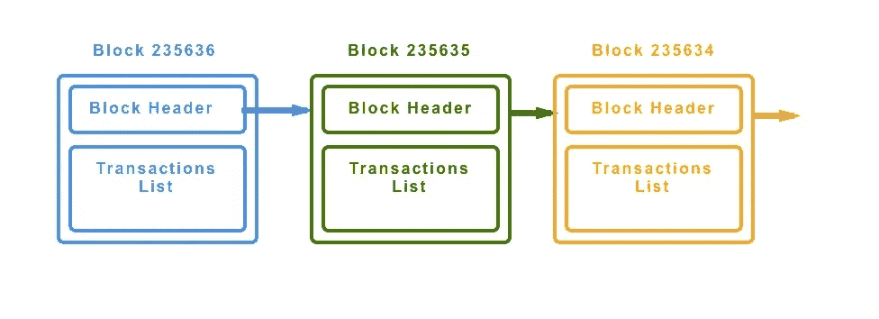
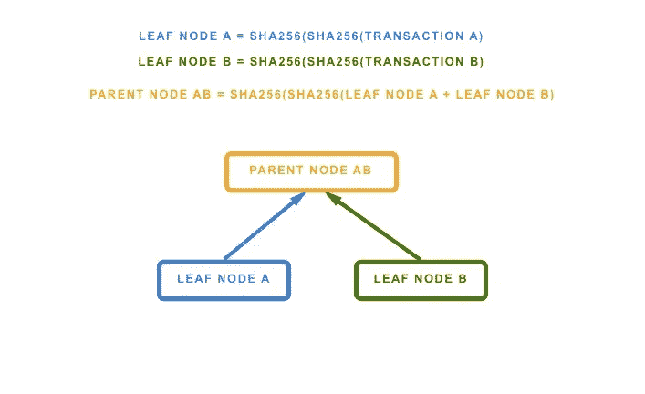
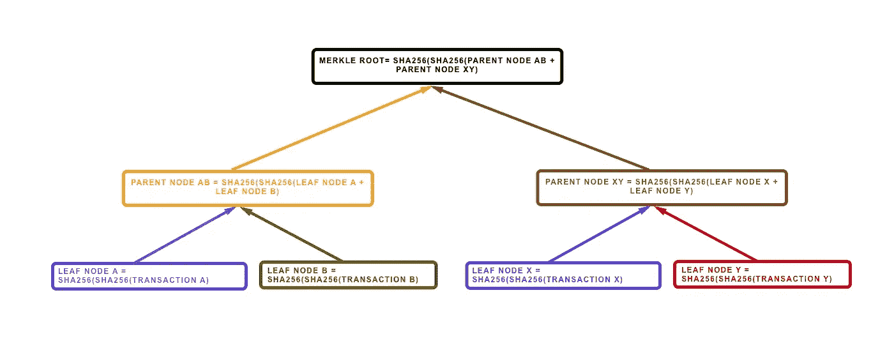

# 比特币区块链

> 原文：<https://medium.com/coinmonks/the-bitcoin-blockchain-a3eb996f7140?source=collection_archive---------2----------------------->

## 我相信你以前听说过“区块链”这个词，它是当今最热门的词汇之一。在本帖中，我们将解释什么是比特币区块链，以及它的内部工作原理。

比特币区块链(Bitcoin Blockchain)是一种数据结构，用于在一系列反向链接的区块中存储交易。每个块内部都有一个事务列表，每个块都链接到它的“父”块。它可以存储在文件或简单的数据库中。块的结构由块标题和事务列表组成。

Blocks linked through previous hash block saved on the block header

# **块头**

块头有一个唯一的标识符，称为块头哈希，在块头中我们可以找到三个主要部分:

*   **前一块哈希**
*   **时间戳、难度和随机数(挖掘信息在另一篇文章中讨论)**
*   **默克尔树根**

## **块头散列**

每个块都由一个散列号**唯一且明确地标识**。这个数字是通过使用 SHA256 算法对块头进行双重哈希运算获得的。**报头散列不存储在块结构**中，而是在通过网络接收块时由每个节点计算。它可能存储在单独的元数据数据库中，用于索引和更快的检索目的。

区块的另一种识别形式是“**区块高度**”。每块积木都是由“***”***”堆叠而成，因此“*高度*”的计数加 1。这意味着从块#0(起源块)开始，每个新块增加总高度。截止 2018 年 2 月最后记录的块高为 [509415](https://blockchain.info/block-height/509415) 。区块高度是第二种识别方式，尽管在某些情况下它不能作为唯一的标识符，因为可能会有两个或多个区块在同一时间竞争相同的高度。最终这种情况(分叉)会得到解决，高度只增加一个块。

## **前一块哈希**

每个块都有一个**先前块散列** **来标识其父块**。块只能有一个父块，但是当几乎同时发现块时，一个块可能有多个子块。最终情况(fork)得到解决，每个块只剩下一个子块。

前一个块哈希是块中非常重要的一部分，因为它将与其他信息一起哈希以获得当前块哈希。这意味着父亲的 **' *身份* '** 被嵌入到孩子的 **' *身份* '** 中，正因为如此，对父亲哈希的任何改变都意味着对孩子哈希的修改，也意味着对孙子哈希的修改，以此类推。这确保了一旦一个块后面有许多代，在不强制重新计算所有后续块的情况下，它不能被改变。这是区块链不变性的基础，因为这样做，将需要非常高的计算能力几乎*‘不可能’*才能得到。在另一篇文章中，我们将分析这种几乎不可能的力量，以及在 51%的攻击或量子计算机力量下破解它的方法。

## **Merkle 树**

Merkle 树是一种二叉树，其叶子上包含加密散列。术语'*树*'在计算机科学中用于描述分支数据结构。比特币区块链中的每个区块都包含一个使用 Merkle 树的区块中所有交易的摘要。

比特币中的 Merkle 树是通过递归散列一对节点直到只有一个散列来构建的:**Merkle 根**。请注意，在这种情况下，节点意味着我们在叶级别对事务进行哈希处理，而在任何其他父级别，我们都在对事务进行哈希处理。别担心，看下一张图，它会帮助你理解:

Hashing with SHA256 a pair of transactions to get the parent node.

The Merkle tree can be expanded to many transactions as needed.

每个叶子是事务数据上 SHA256 的**双重散列。最终结果(Merkle 根)存储在块头中。由于 Merkle 树是一个二叉树，它需要偶数个节点，如果我们有奇数个节点，我们添加一个重复的事务，然后*瞧！*偶数个节点！**

这是一个**非常有效的数据结构**来检查一个值是否在里面，在这个例子中检查树中是否有一个事务。通过提供一组散列，节点可以证明事务与报头中的 Merkle 根相关，因此被包括在树中(事务列表)。这种方法被称为“ ***Merkle 认证路径*** ”，SPV 节点使用它来验证块是否有交易。正如我们在[另一篇文章](/@sheinix/the-bitcoin-network-6713cb8713d)中看到的，SPV 节点存储块头，它实际上包含 Merkle 根。然后，它将向所有节点询问一组符合“*认证路径*的散列，并用它们来证明某个事务在符合已知 Merkle 根的 Merkle 树内。比特币节点可以产生 10-12 个哈希的路径，以证明一个交易是在一个超过 1000 个交易的树中。

*这是比特币区块链的基础知识。现在，你可以更好地理解我们说区块链是为了什么。*

下次见！

# 行动呼吁

[如果您想了解更多关于区块链的信息，请加入我们的每周简讯，了解加密领域的所有新闻。](https://mailchi.mp/fe27d17793e9/cryptolitics)

> [直接在您的收件箱中获得最佳软件交易](https://coincodecap.com/?utm_source=coinmonks)

