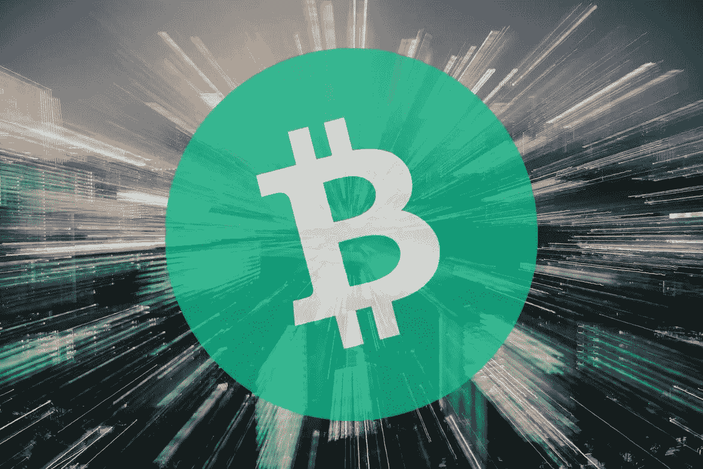

# 比特币现金元宇宙

> 原文：<https://medium.com/coinmonks/the-bitcoin-cash-metaverse-cd6a553180d5?source=collection_archive---------5----------------------->

加密货币领域有计划着手创建基于区块链的元宇宙，旨在包括用于所有金融交易的加密货币和用于任何数字资产所有权的 NFT。

与每个网站和互联网服务的互操作性也是元宇宙的一个关键特征。我们今天使用的每一个应用程序、平台和网站都将在元宇宙运行。

去中心化的区块链世界更喜欢一个远离体罚、审查和第三方增加成本和更高费用的元宇宙。

然而，元宇宙将需要一个强大的分散区块链网络。一个没有中断、没有服务器停机的系统，它可以让**立即**、**验证交易，成本很低**，最好低于 1 美分。

目前，比特币现金提供了实现这一目标的能力和效率。随着最近 SmartBCH sidechain 的加入，智能合同领域出现了新的机遇。

# 元宇宙要求

*Source:* [*Unsplash*](https://unsplash.com/photos/2UjheC7FBWQ)

分散式应用程序和区块链游戏的开发者在以太坊上浪费了大量的资源和时间。以太坊作为一个网络来扩展和满足普遍采用是低效的。

在以太坊上从事各种项目的开发人员早就放弃了他们，转移到了其他区块链。

币安智能链简直就是以太坊的集中版。它需要人们相信币安将永远正常运转，需要人们相信币安不会像以前其他数百家交易所那样失败。

因为是币安在控制，所以有区块链也没什么区别。BSC 是一个集中的区块链，由币安交易所控制验证器。在区块链上跑步是不够的。IBM 也有一个区块链，它毫无用处，对世界贡献甚微，因为它只是一个由 IBM 运营的网络。最近流行的几种区块链和替代技术(如 hashgraph 和 tangle)都有很大的集中化问题。由一群开发者控制的区块链网络存在设计缺陷。

此外，集中化并不能保证网络的安全性。

比特币现金在不损害去中心化或安全性的情况下解决了这些问题。

元宇宙将为银行网络和加密货币之间的另一场科技战争提供基础。

元宇宙将连接传统的银行系统和区块链网络。微交易将占据主导地位，尽管它需要一种快捷的支付方式。

除非加密领域有人希望银行轻而易举地赢得这场技术战，否则金融网络的效率就不应被忽视。

## 分散土地的严重错误

分散的土地运行在一个堵塞且无法扩展的网络之上。

我已经成为分散土地的一部分很长时间了。从 2017 年开始，我在分散地进行测试和创作。我是竞赛的一部分，并通过它的构建工具和我对事件的参与，获得了法力令牌和各种 NFT 作为奖励。

但是到了 2020 年，大家期待的事情发生了。我记得我试图申请在分散的土地上空投一架 NFT，费用已经达到了 250 美元。

这是实现的时刻。以太坊对于去中心化的土地和任何类似的网络都是无用的。它连一个简单的区块链游戏都帮不了，更别说处理整个元宇宙了。

以太坊没有过去，没有现在，也没有未来。

它的运营基于一个低效的网络，每当超过 1000 人使用时，网络就会堵塞。今天，分散土地被过度炒作，投资者将资金投入其中，但没有测试它，没有使用它，没有意识到以太坊网络的离谱要求。

交易室将设在元宇宙内，投资者可以利用它们投资股票、大宗商品和加密货币。交易室将可用，每个网站都将连接到元宇宙，并在 3D 环境中提供服务。

虚拟现实(VR)和增强现实(AR)将是进入和充分探索元宇宙的一项要求。但是还有更多。增强现实不仅仅是关于数字世界。它的真正应用是提高人类在现实生活中的能力。

# 最后

*Source:* [*Pixabay*](https://pixabay.com/illustrations/virtual-reality-psyche-mask-4908697/)

大约在 1995-1996 年，手机开始呈指数增长。在一些地区，移动技术的采用达到了 100%以上的市场渗透率，因为许多人拥有不止一个移动设备和号码。

那时互联网也不流行。而这仅仅是 25 年前。一代人的时间，变化是巨大的。

**想象一个运行在以太坊之上的通信网络，我们打每一个电话都要支付 250 美元的费用。**以太坊功能失调，等待以太坊 2.0 不是一个合理的投资论点。

以太坊只是为那些今天在 DeFi 上赌博的鲸鱼准备的。对于移动 10 万美元的人来说，250 美元的费用并不意味着什么。

比特币现金在一个分散且安全的网络下提供即时且几乎无感觉的交易。它提供了现代数字经济所需的一切。

一个元宇宙需要一个高效、分散、安全的网络，而今天只有比特币现金在所有这三个特征上表现出色。

向高效分散的区块链支付网络转变是不可避免的。

Follow me on: ● [ReadCash](https://read.cash/@Pantera) ● [NoiseCash](https://noise.cash/u/Pantera99) ● [Medium](/@panterabch) ● [Hive](https://hive.blog/@pantera1) ● [Steemit](https://steemit.com/@pantera1) ●[Vocal](https://vocal.media/authors/pantera) ● [Minds](https://www.minds.com/pantera99/) ● [Twitter](https://twitter.com/Panterabch) ● [LinkedIn](https://www.linkedin.com/in/panterabch/) ● [email](https://read.cash/@Pantera/localcryptos-p2p-exchange-is-now-offering-bitcoin-cash-trading-06637230#bad-link)

**备注:**

> **免责声明**:本内容中发布的所有材料均用于娱乐和教育目的，并符合合理使用准则。无意侵犯版权。如果你是或代表本文所用材料的版权所有者，并且对所述材料的使用有问题，请发送[电子邮件](https://read.cash/@Pantera/cryptouknowns-battlegrounds-the-crypto-battle-royal-part-i-0ca762da#bad-link)。这篇文章或我发表的任何文章都不是金融建议，但包含与投资研究相关的信息。

***支持内容创作者。***

如果你喜欢这个故事，就订阅吧！

*原发布于*[*https://read . cash*](https://read.cash/@Pantera/the-bitcoin-cash-metaverse-9ff60ddd)*。*

> 加入 Coinmonks [电报频道](https://t.me/coincodecap)和 [Youtube 频道](https://www.youtube.com/c/coinmonks/videos)了解加密交易和投资

## 也阅读

 [## 最佳加密交易所| 2021 年十大加密货币交易所

### 编辑描述

blog.coincodecap.com](https://blog.coincodecap.com/crypto-exchange)  [## 2021 年 10 大最佳加密贷款平台| CoinCodeCap

### 编辑描述

blog.coincodecap.com](https://blog.coincodecap.com/crypto-lending)  [## 2021 年最佳免费加密交易机器人

### 2021 年币安、比特币基地、库币和其他密码交易所的最佳密码交易机器人。四进制，位间隙…

medium.com](/coinmonks/crypto-trading-bot-c2ffce8acb2a)  [## 最佳 4 个加密交易信号电报通道

### 这是乏味的找到正确的加密交易信号提供商。因此，在本文中，我们将讨论最好的…

medium.com](/coinmonks/best-crypto-signals-telegram-5785cdbc4b2b)  [## 5 个最佳社交交易平台[2021] | CoinCodeCap

### 编辑描述

blog.coincodecap.com](https://blog.coincodecap.com/best-social-trading-platforms)  [## BlockFi 评论 2021:利弊和利率| CoinCodeCap

### 编辑描述

blog.coincodecap.com](https://blog.coincodecap.com/blockfi-review)  [## 如何在印度购买比特币？2021 年购买比特币的 7 款最佳应用[手机版]

### 如何使用移动应用程序购买比特币印度

medium.com](/coinmonks/buy-bitcoin-in-india-feb50ddfef94)  [## 加密税务软件——五大最佳比特币税务计算器[2021]

### 不管你是刚接触加密还是已经在这个领域呆了一段时间，你都需要交税。

medium.com](/coinmonks/best-crypto-tax-tool-for-my-money-72d4b430816b)  [## 存储比特币的最佳加密硬件钱包[2021] | CoinCodeCap

### 编辑描述

blog.coincodecap.com](https://blog.coincodecap.com/best-hardware-wallet-bitcoin) 

[https://medium . com/coin monks/pionex-review-exchange-with-crypto-trading-bot-1e 459d 0191 ea](/coinmonks/pionex-review-exchange-with-crypto-trading-bot-1e459d0191ea)