# 比特币机器

> 原文：<https://medium.com/coinmonks/the-bitcoin-machine-f679efeeec88?source=collection_archive---------1----------------------->

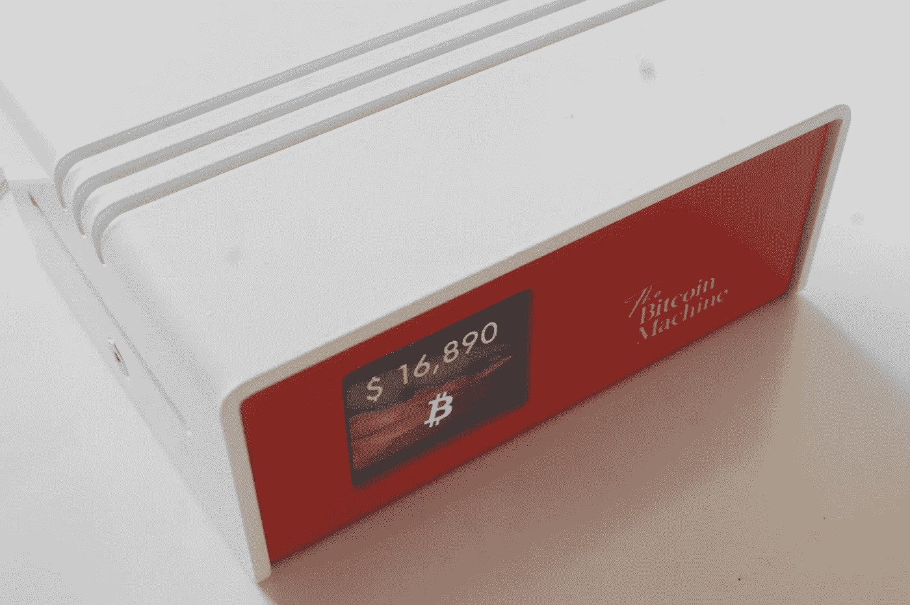

[thebitcoinmachines](https://thebitcoinmachines.com)

摆弄了多个比特币闪电节点软件后，想到了为比特币节点搭建一个完美的外壳。

## **在没有适当外壳的情况下运行比特币闪电节点的缺点**

*   周围杂乱的电缆。
*   硬盘电缆受到干扰的可能性很高，这可能会导致数据损坏。
*   *树莓派侧面和背面的 I/O* 端口。

## **我们在设计外壳时考虑的事情**

*   实惠。
*   没有杂乱的电缆。
*   仪表板(比特币报价器)。
*   机柜背面的所有 *I/O* 端口。
*   极简设计。
*   精英装扮。

## **SATA 扩展板**

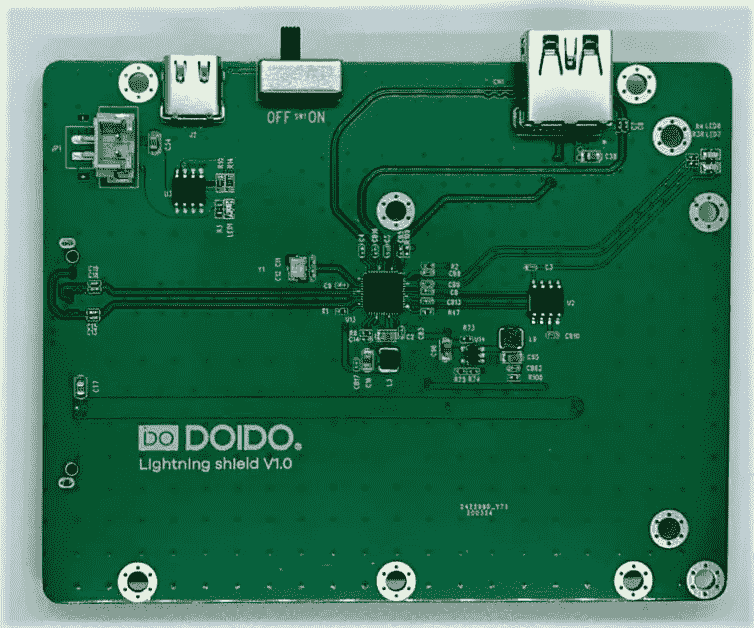

M08 SATA Expansion Board

一切都是从设计 SATA 扩展板来安装 2.5 英寸硬盘开始的。经过 3 次迭代，我们有足够的信心生产名为 *M08 SATA* 的扩展板。

***M08*** 通过*USB C 型*连接器供电。我们选择 C 型的原因是，那些已经运行比特币节点的用户有一个 C 型电源适配器(*我们建议官方 Raspberry Pi 电源*，如果你没有的话)。所以我们不想为了给同一个 RPi 供电而再给一个带筒形连接器的电源适配器污染环境。

SATA 扩展板使用 USB 3.0 跳线桥接 raspberry Pi 的 USB 端口。

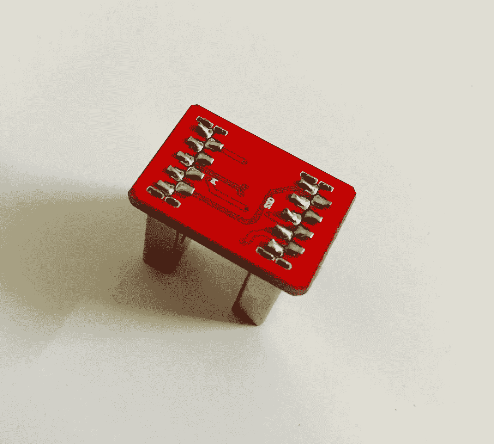

USB 3.0 Jumper

## **H8 热控制器**

我们都知道 Rpi 4 功耗很高，速度比以前的型号更快，由于它的设计，处理器升温非常快，在初始区块链同步时达到高温。在没有 H8 的初始同步过程中，记录的温度高达 83℃。通过使用 H8，温度显著降低至 68℃。

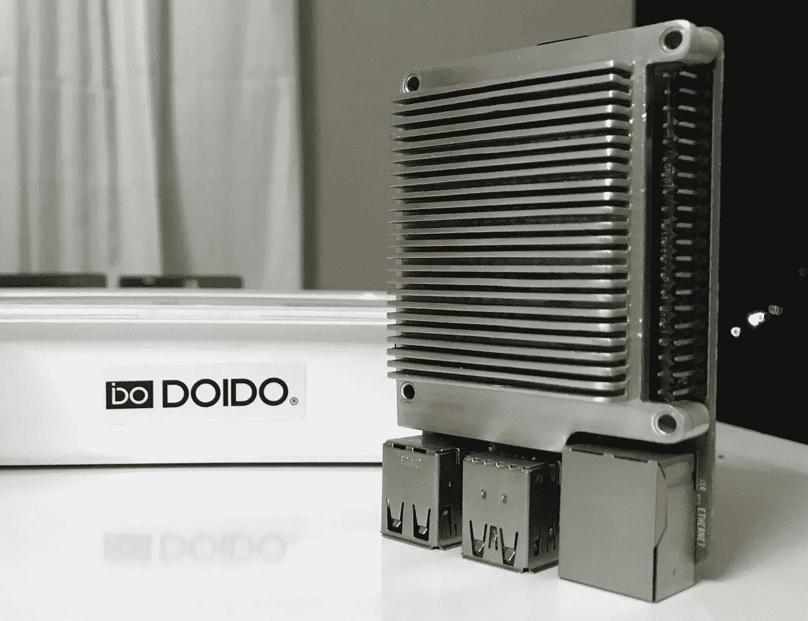

H8 Fusion (Aluminum fins with Copper Base)

> 我有没有告诉你，H8 聚变是内部设计和制造的。

## **外壳**

这个外壳是精心制作的，可以容纳你的比特币节点的所有配件。

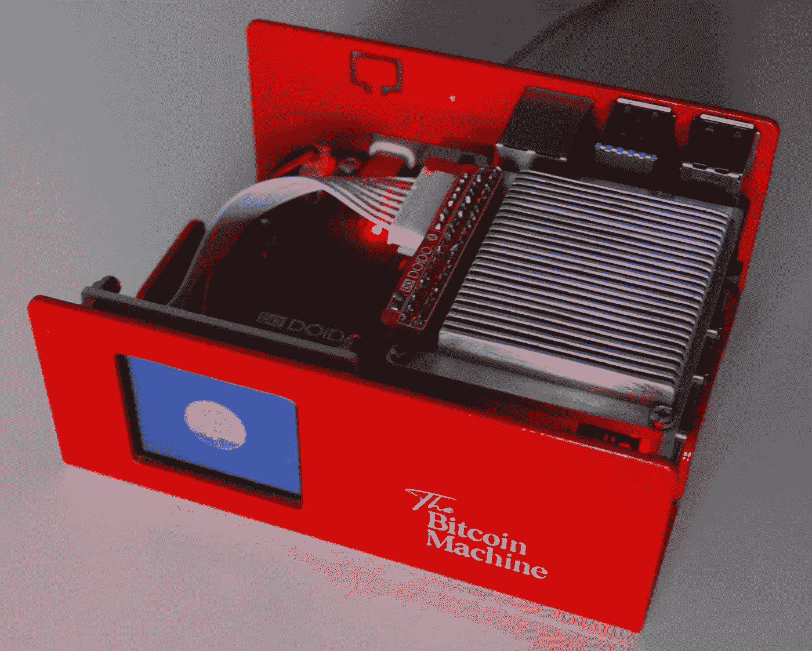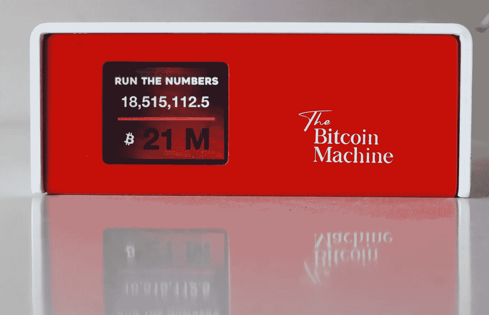

*材料*:铝用于制造外壳，然后经过粉末涂层处理，以获得一个精致光滑的表面。

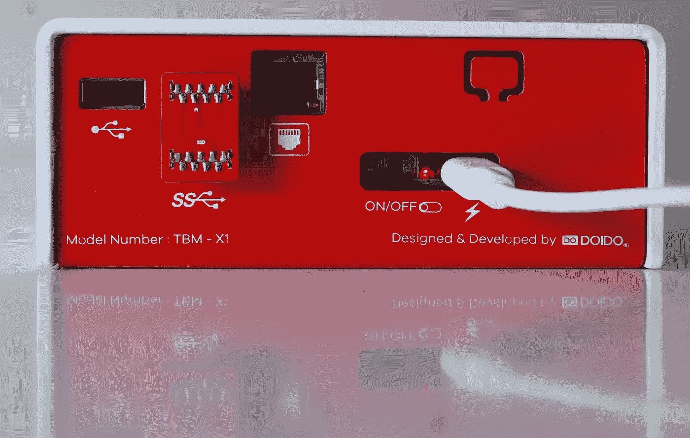

## **仪表盘又名机器脸(比特币行情自动收录器)**

相信我们大多数人都有时不时查看比特币价格的习惯。因此，我们决定在外壳中内置一个比特币报价器。在对 LCD 的可用性及其尺寸做了大量研究后，我们选定了 1.8 ST7735s 型号。这有助于绘制漂亮的仪表板。机器表面可根据您的需要定制。

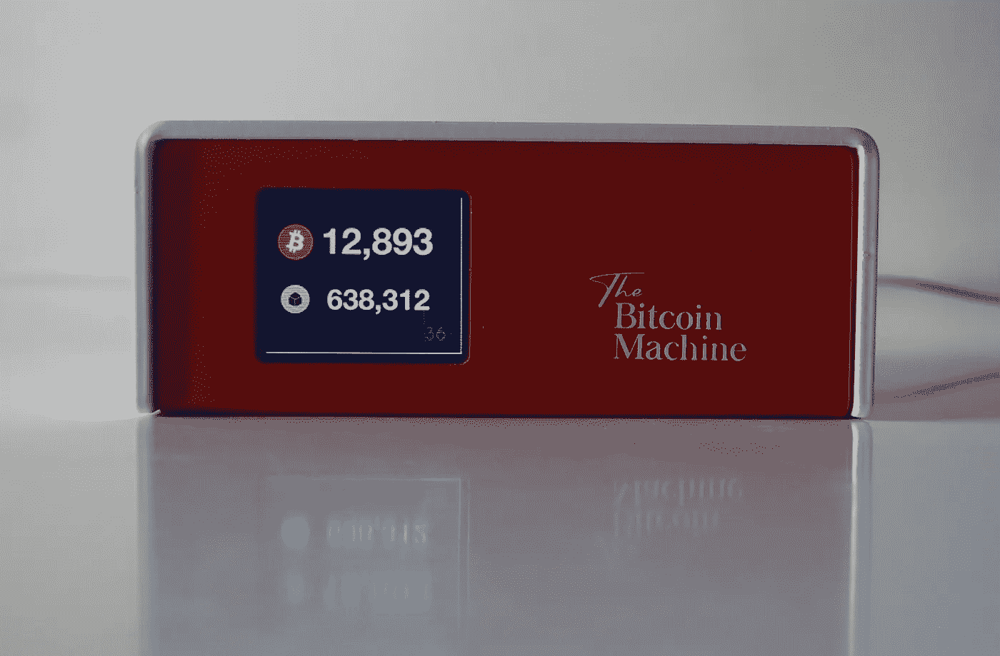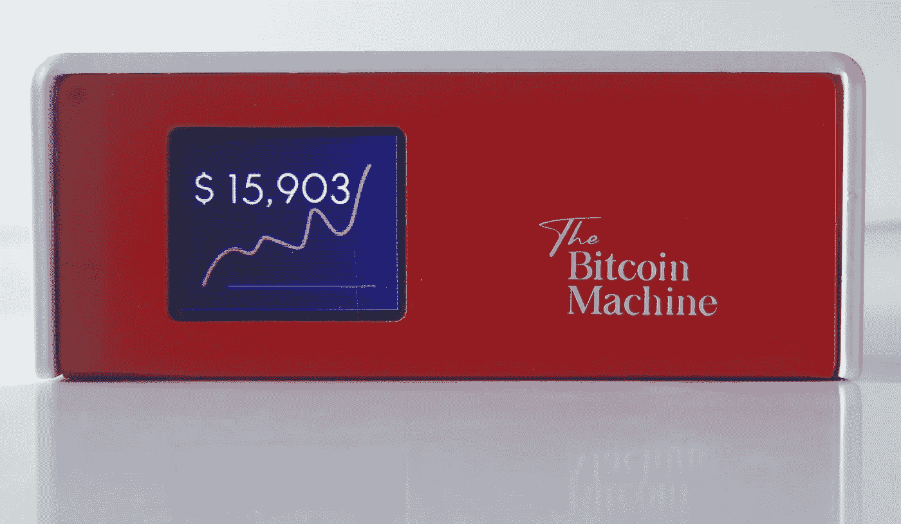

## **比特币闪电节点软件**

市场上有多种节点软件。你可以选择任何你喜欢的。

即插即用: *Raspiblitz，Mynode 和 Umbrel* 。

注重隐私:RoninDojo

如果你喜欢修补和了解更多关于比特币闪电节点和手动设置闪电节点，我建议 **Raspibolt** 。有一份由[斯塔德库斯](https://stadicus.github.io/RaspiBolt/)撰写的优秀文献。为了更好地了解比特币闪电节点及其逐步设置。

我们喜欢市场上所有可用的比特币节点软件，我们开发了 machine faces，作为未来几天所有节点的仪表板。

从可用仪表板脚本列表中选择或自定义:

*   比特币价格
*   最近生成的比特币块
*   到目前为止产生的比特币数量
*   数字显示式时钟

….我们正在研究一些更令人兴奋的机器面孔。

## **价目表**

比特币机器有多种组合，颜色诱人。为了让 ***比特币网络支持者*** 买得起，我们决定尽可能低。

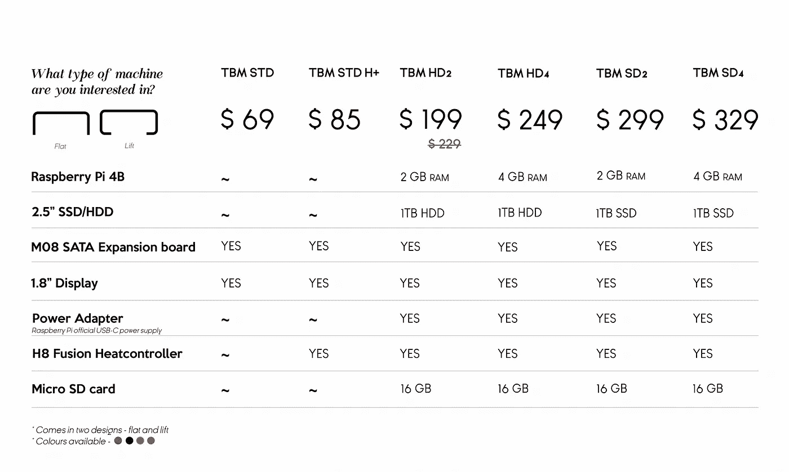

Bitcoin Machine Price List

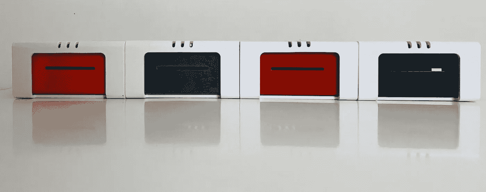

从商店链接找到比特币机器及其配件

*   [thebitcoinmachines.com](https://thebitcoinmachines.com/shop/)

## 另外，阅读

*   最好的[密码交易机器人](/coinmonks/crypto-trading-bot-c2ffce8acb2a)
*   [密码本交易平台](/coinmonks/top-10-crypto-copy-trading-platforms-for-beginners-d0c37c7d698c)
*   最好的[加密税务软件](/coinmonks/best-crypto-tax-tool-for-my-money-72d4b430816b)
*   [最佳加密交易平台](/coinmonks/the-best-crypto-trading-platforms-in-2020-the-definitive-guide-updated-c72f8b874555)
*   最佳加密贷款平台
*   [最佳区块链分析工具](https://bitquery.io/blog/best-blockchain-analysis-tools-and-software)
*   [加密套利](/coinmonks/crypto-arbitrage-guide-how-to-make-money-as-a-beginner-62bfe5c868f6)指南:新手如何赚钱
*   最佳[加密制图工具](/coinmonks/what-are-the-best-charting-platforms-for-cryptocurrency-trading-85aade584d80)
*   [莱杰 vs 特雷佐](/coinmonks/ledger-vs-trezor-best-hardware-wallet-to-secure-cryptocurrency-22c7a3fd391e)
*   了解比特币最好的[书籍有哪些？](/coinmonks/what-are-the-best-books-to-learn-bitcoin-409aeb9aff4b)
*   [3 商业评论](/coinmonks/3commas-review-an-excellent-crypto-trading-bot-2020-1313a58bec92)
*   [AAX 交易所评论](/coinmonks/aax-exchange-review-2021-67c5ea09330c) |推荐代码、交易费用、利弊
*   [德里比特评论](/coinmonks/deribit-review-options-fees-apis-and-testnet-2ca16c4bbdb2) |选项、费用、API 和 Testnet
*   [FTX 密码交易所评论](/coinmonks/ftx-crypto-exchange-review-53664ac1198f)
*   [n 零审核](/coinmonks/ngrave-zero-review-c465cf8307fc)
*   [Bybit 交换审查](/coinmonks/bybit-exchange-review-dbd570019b71)
*   [3Commas vs Cryptohopper](/coinmonks/cryptohopper-vs-3commas-vs-shrimpy-a2c16095b8fe)
*   最好的比特币[硬件钱包](/coinmonks/the-best-cryptocurrency-hardware-wallets-of-2020-e28b1c124069?source=friends_link&sk=324dd9ff8556ab578d71e7ad7658ad7c)
*   最佳 [monero 钱包](https://blog.coincodecap.com/best-monero-wallets)
*   [莱杰 nano s vs x](https://blog.coincodecap.com/ledger-nano-s-vs-x)
*   [bits gap vs 3 commas vs quad ency](https://blog.coincodecap.com/bitsgap-3commas-quadency)
*   [莱杰纳米 S vs 特雷佐 one vs 特雷佐 T vs 莱杰纳米 X](https://blog.coincodecap.com/ledger-nano-s-vs-trezor-one-ledger-nano-x-trezor-t)
*   [block fi vs Celsius](/coinmonks/blockfi-vs-celsius-vs-hodlnaut-8a1cc8c26630)vs Hodlnaut
*   Bitsgap 评论——一个轻松赚钱的加密交易机器人
*   为专业人士设计的加密交易机器人
*   [PrimeXBT 审查](/coinmonks/primexbt-review-88e0815be858) |杠杆交易、费用和交易
*   [埃利帕尔泰坦评论](/coinmonks/ellipal-titan-review-85e9071dd029)
*   [SecuX Stone 评论](https://blog.coincodecap.com/secux-stone-hardware-wallet-review)
*   [BlockFi 评论](/coinmonks/blockfi-review-53096053c097) |从您的密码中赚取高达 8.6%的利息