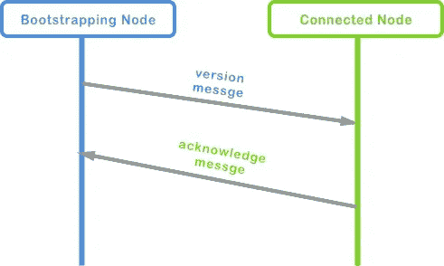
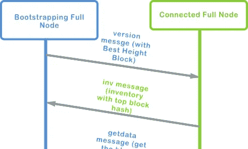

# 比特币网络

> 原文：<https://medium.com/coinmonks/the-bitcoin-network-6713cb8713d?source=collection_archive---------0----------------------->

## *探索比特币网络的基础、核心组件以及网络遵循的一些协议。*

# **比特币网络**

比特币是一个点对点( **P2P** )节点网络，没有等级或“特殊”节点，这意味着每个人都处于同一水平，没有任何权力中心。早期的互联网就是这样，一个由计算机互联而成的平面网络拓扑。比特币网络的设计是去中心化的，网络的安全和信任依赖于节点之间的交互。这些交互中的一些由比特币 P2P 网络协议给出。

> “扩展的比特币网络”是 P2P 协议加上其他协议，如用于采矿和轻量级或移动钱包的 Stratus。其他协议可以包括池挖掘协议。

# **组件:节点类型**

节点是网络中能够发送、接收和/或转发信息的任何物理设备。电脑、智能手机或服务器都可以是比特币网络中的节点。一个比特币节点，根据它在网络上的角色，可以有或多或少的功能。所有节点都包括路由功能，以便加入网络，这意味着它们可以发现和连接到其他节点，传播和验证事务和块。其他节点根据其角色可以具有钱包功能、挖掘器功能(挖掘节点)、整个区块链的副本或运行不同的协议。以下是比特币网络中不同类型节点的完整列表:

*   **参考客户端(比特币核心)**:包含钱包、完整的区块链数据库、矿工和网络路由功能。
*   **全区块链节点**:包含全区块链数据库，网络路由能力
*   **Solo Miner** :包含挖掘功能，区块链数据库的完整副本和网络路由功能。
*   **轻量级(SPV)钱包**:包含钱包和网络路由功能。
*   **池协议服务器:**这些是网关路由器，连接运行其他协议的 P2P 网络节点，例如池挖掘节点或 Stratum。
*   **挖掘节点:**包含没有区块链的完整副本的挖掘功能，取而代之的是它们具有地层协议或其他池挖掘协议。
*   **轻量级(SPV) Stratum Wallet** :包含不带区块链的 Stratum 协议上的钱包和网络功能。

*让我们来看看* ***这几类节点的一些*** *及其更详细的功能:*

# **一个完整的节点**

除了它们的网络能力之外，完整节点还维护整个区块链的最新副本，这允许它们在没有外部参考的情况下自主地和权威地验证任何交易。这些节点依靠网络接收有关新事务块的更新，然后对其进行验证并包含在其本地区块链副本中。运行完整节点可能包括一些要求，例如:

*   超过 145 千兆字节的空闲磁盘空间，以便存储整个区块链，并且这应该可以以至少 100 MB/秒的读/写速度来访问。
*   2gb 或更多的 RAM 内存
*   上传速度至少为每秒 400 千位(50 千字节)的宽带互联网连接
*   每天至少有 6 个小时运行完整节点。

运行完整节点的软件最常见的实现是比特币核心，也称为“ *Satoshi* ”客户端。比特币网络上超过 75%的节点运行着各种版本的比特币核心。

# **SPV 或轻量级节点**

这类节点仅维护区块链的一个子集，并使用一种称为 ***简化支付验证系统***(“SPV”)的方法来验证交易。它们通常被称为轻量级节点。一些运行在受限资源设备如智能手机或平板电脑上的用户钱包是 SPV 节点，并且已经成为当今最流行的节点。SPV 不像下载完整节点那样下载所有块，而是只下载块头。SPV 节点不能构建所有可用于消费的 UTXO 的全貌，因为它们没有整个区块链，而是使用 SPV 方法来验证交易，这也依赖于对等体按需提供区块链的相关部分的局部视图。

常见的说法是*‘我们必须等待六次确认才能真正确定交易已通过’，*这是因为 SPV 节点通过参考其在区块链中的 ***深度*** 来验证交易。这意味着 SPV 节点将在它想要验证的事务和包含它的块之间创建一个链接。然后，节点等待，直到六个 或更多的块 ***【堆积】*** 在包含事务的块的顶部。当这种情况发生时，我们可以确保事务是有效的，因为网络中的所有其他节点都做了必要的工作来接受事务并在其上添加更多的块。这证明了这笔交易不是双重花费。

> 关于 SPV 节点的双重花费问题，需要考虑的一点是:双重花费是指一个 UTXO 在一个以上的事务中使用，因此“双重花费”了 UTXO。这是比特币网络上解决的问题。您能理解为什么 SPV 不能自己验证双重花费，而完整节点可以吗？

# **挖掘节点**

这些节点通过运行专门的硬件来解决工作验证算法，从而竞争创建新的数据块。它们可以是具有区块链完整副本的完整节点，也可以是参与池挖掘并依赖池服务器来维护完整节点的轻量级节点。

# **比特币中继网络**

比特币中继网络是一个覆盖网络，在矿工节点之间提供额外的连接。这意味着最小化矿工之间传输数据块的延迟。区块通过网络分布的速度对矿工来说非常重要，因为一旦发现新的区块，他们必须准备好下一轮的竞争，看谁开采下一个区块，所以他们不能单独依靠 P2P 网络来完成这一点。最初的比特币中继网络在 2016 年被一套新的协议取代，这套协议被称为快速互联网比特币中继引擎(FIBRE)。

## **网络上的节点如何相互连接？**

当一个新节点启动时，它必须连接到网络中的至少一个其他节点。通常，它们使用端口 8333 上的 TCP 连接进行连接。为了实现这一点，它必须以某种方式发现节点。一种方法是通过查询提供比特币节点 IP 地址列表的 DNS 服务器列表。另一种方式是，当引导节点时，引入活动节点的已知 IP 地址。该节点不必连接到许多对等体，它必须连接到至少一个连接到网络中其他对等体的节点，然后它可以通过它已经连接到的第一个节点建立更多的连接。

一个节点不必总是依赖于相同的网络功能路径，它必须保持一个有限的，但不同的，到不同节点的连接列表。路径不可靠，因为节点可能会离线，并且节点必须有一个良好的对等连接列表，以便在新节点启动时正常工作并为其提供帮助。

节点在引导之后发送的第一个消息被称为 **' *版本* '** 消息，它包含节点正在使用的协议的版本，以及识别节点的其他有用信息。当接收节点接收到版本消息时，它检查它是否能支持发送节点的版本，如果能，它发送一个 **' *verack* '** 消息，这是一个确认节点的消息，然后它们被连接。

## **全节点连接**

当一个新的完整节点启动或联机时，在连接到网络后，它必须做的第一件事是更新其区块链数据库。它拥有的第一个块是" **genesis** "块，这是区块链中的第一个节点，嵌入在客户端软件中。起始节点发送' ***版本*** 消息时，还包含其区块链数据库的'*'高度(块数)。接收节点将看到高度，并将其与自己的区块链副本进行比较。如果接收方拥有的块数高于发送方，它将确切知道发送方缺少多少个节点。它可以发送丢失的块，以便“赶上”最新的区块链。每个节点连接有 500 个块的限制，因此如果块的数量更多，过时的节点将不得不寻找其他对等体以获得更多的块。*

**

> *正如你所看到的，P2P 比特币网络正在发生很多事情，比我们想象的还要多。我希望你学到了新的东西，对区块链有了更多的了解！*

*下次见！*

# *行动呼吁*

*[如果您想了解更多关于区块链的信息，请加入我们的每周简讯，了解加密领域的所有新闻。](https://mailchi.mp/fe27d17793e9/cryptolitics)*

> *[直接在您的收件箱中获得最佳软件交易](https://coincodecap.com/?utm_source=coinmonks)*

**