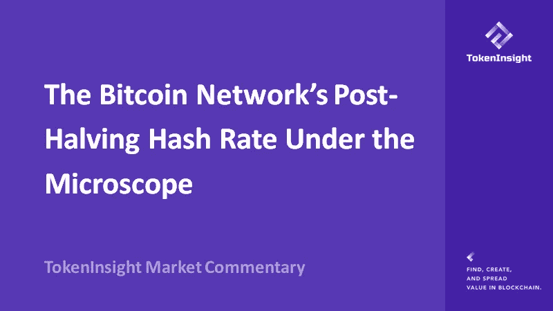
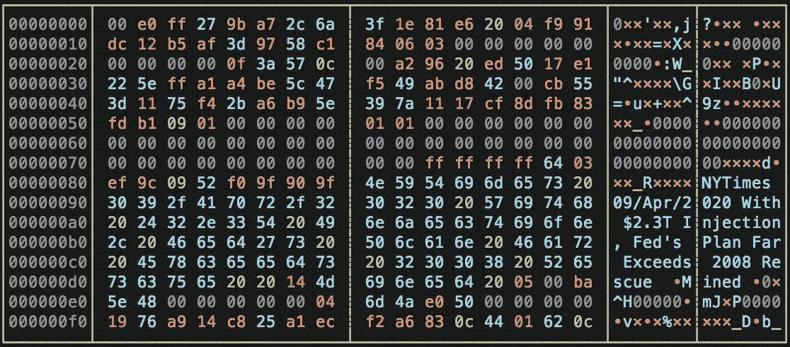
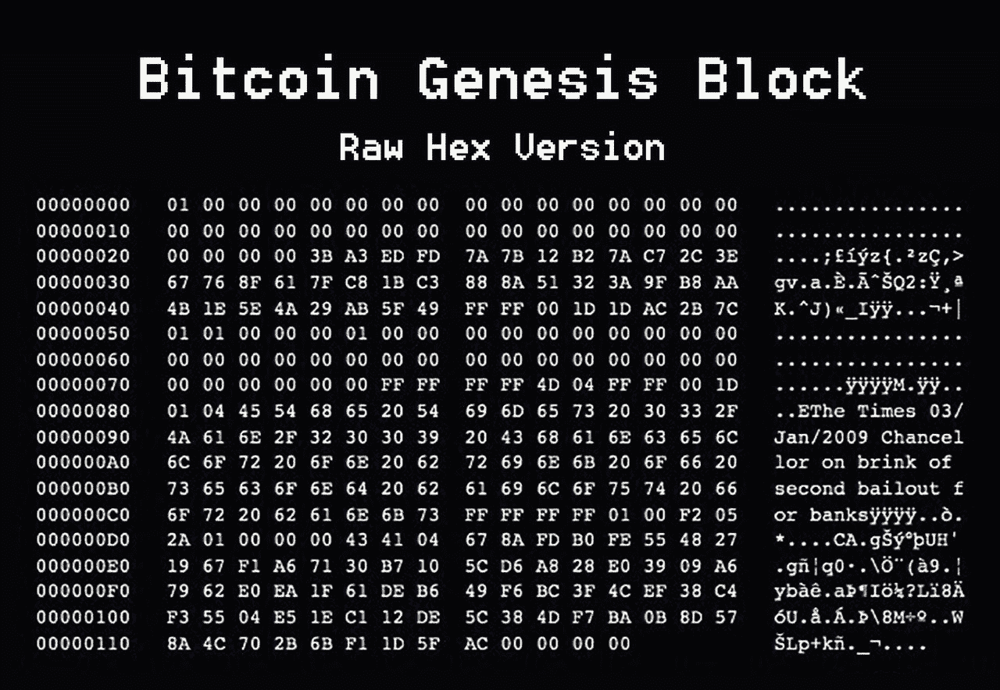
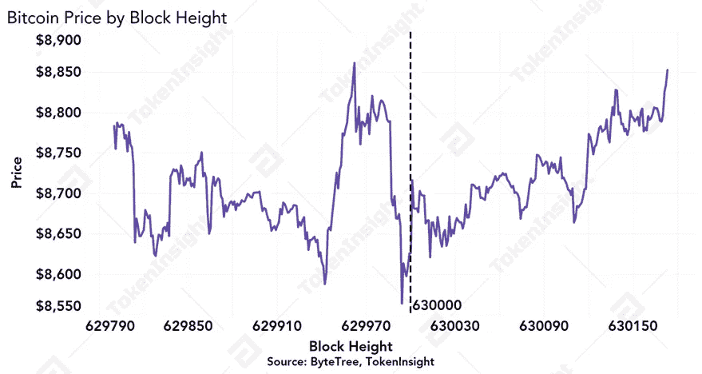
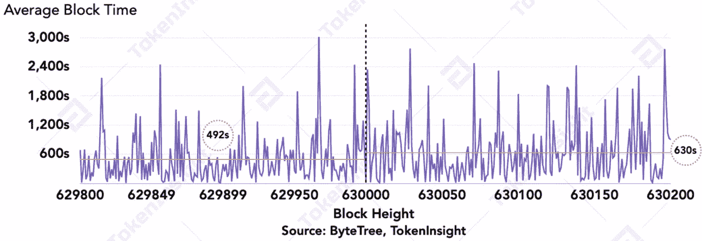
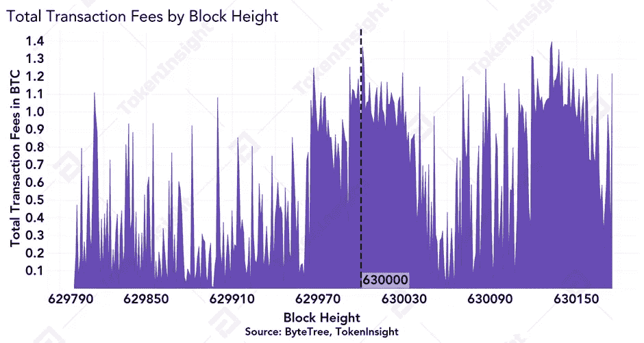
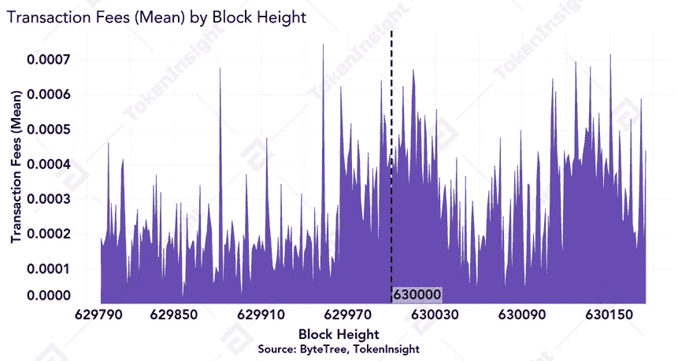
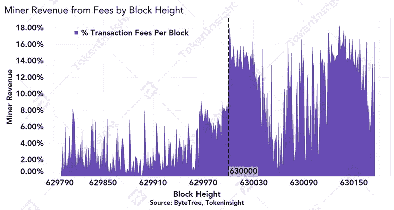
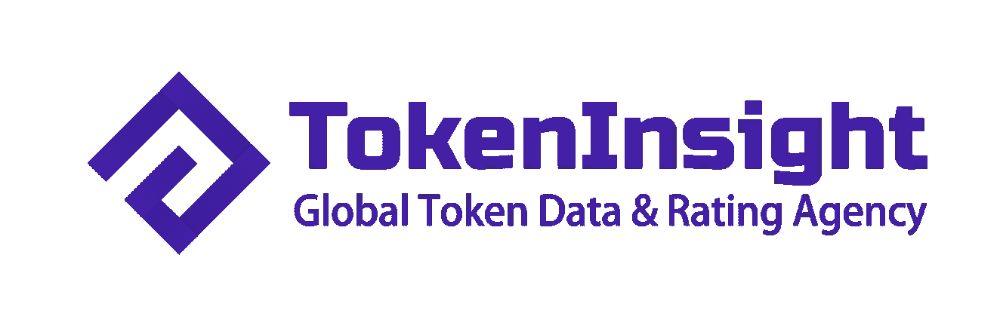

# 显微镜下比特币网络减半后的杂凑率

> 原文：<https://medium.com/coinmonks/the-bitcoin-networks-post-halving-hash-rate-under-the-microscope-3ba255ad43b9?source=collection_archive---------3----------------------->

**—2020 年 5 月 14 日由**[**token insight Research**](https://tokeninsight.com/?utm_source=article&utm_medium=medium&utm_campaign=TI)

**作者:徐强森，仇**

**电子邮件:johnson@tokeninsight.com**

# **概述**

加密货币行业刚刚经历了最受期待的事件，比特币(BTC) 2020 减半。最后的 12.5 个比特币块已经被 [F2Pool](https://blockchair.com/Bitcoin/block/629999) 挖掘出来，并编码成“纽约时报 09/Apr/2020 注入 2.3T 美元，美联储的计划远超 2008 年救援”的消息。向中本聪致敬。 [Antpool](https://blockchair.com/bitcoin/block/630001) 运气好，挖到了第一个 6.25 的比特币块。

比特币第一次减半发生在 2012 年 11 月，由 [Slushpool](https://blockchair.com/bitcoin/block/210000) 开采，第二次减半发生在 2016 年 7 月，由 [F2Pool](https://blockchair.com/bitcoin/block/420000) 开采。对于比特币，我们现在已经正式进入 6.25 块补贴时代，第 4 个比特币减半开始倒计时。

# **比特币网络杂凑率经历了一些下降，第一次难度调整后减半将出现负调整**

在减半之前的最后 60 个街区，市场经历了一些波动，然而，在活动期间的 24 小时窗口内，比特币价格保持在 8500 美元至 9000 美元的范围内。

Bitcoin Price by Block Height, Source: [ByteTree](https://bytetree.com/), [TokenInsight](https://tokeninsight.com/?utm_source=article&utm_medium=medium&utm_campaign=TI)

在数据减半之前的 24 小时内，每个数据块的平均数据块生产时间大约为 7.5-8.5 分钟，我们发现数据减半后数据块生产时间有所增加，在数据减半后的 12 小时内，每个数据块的平均生产时间为 11 分钟。有了可用的样本，我们可以有把握地得出结论，网络在减半后经历了哈希速率下降，这表现为比减半前的平均时间更长的数据块生产时间。

*Average Block Time, Source:* [*ByteTree*](https://bytetree.com/)*,* [*TokenInsight*](https://tokeninsight.com/?utm_source=article&utm_medium=medium&utm_campaign=TI)

[根据](https://diff.cryptothis.com/)比特币难度估算，立即将网络速度减半大约比计划提前了 52 个街区。这可能是因为在产量减半之前的 24 小时内，矿商加快了区块产量。根据目前的估计，下一个难度变化将会在几天后发生，并且会有一个负面的调整。然而，在此期间，随着矿商试图调整其运营，区块生产时间可能会发生重大变化。

# **交易费略有上涨，以补贴 2020 年左右减半的矿商收入**

在减半之前的 24 小时内，事务数量一直呈上升趋势，平均每个块包含 1，959 个事务。

No. of Transactions by Block Height, Source: [ByteTree](https://bytetree.com/), [TokenInsight](https://tokeninsight.com/?utm_source=article&utm_medium=medium&utm_campaign=TI)

总交易费用大约翻了一番，从不到一个比特币减少到一个比特币以上，最终回落到减半前的水平。

Total Transaction Fees by Block Height, Source: [ByteTree](https://bytetree.com/), [TokenInsight](https://tokeninsight.com/?utm_source=article&utm_medium=medium&utm_campaign=TI)

在过去的 50 个街区中，该网络的每笔交易的平均费用略有上升，在减半后的前 20 个街区中，平均费用一直在下降，并保持相对稳定。

Transaction Fees (Mean) by Block Height, Source: [ByteTree](https://bytetree.com/), [TokenInsight](https://tokeninsight.com/?utm_source=article&utm_medium=medium&utm_campaign=TI)

在减半之前，矿商的收费收入仅占其总收入的个位数。由于奖金减半，矿商的收费收入在减半后立即大幅增加。6.25 区块补贴时代开始 12 小时后，矿商的收费收入降至较低水平，但平均保持在每区块 10%左右。

Miner Revenue from Fees by Block Height: [ByteTree](https://bytetree.com/), [TokenInsight](https://tokeninsight.com/?utm_source=article&utm_medium=medium&utm_campaign=TI)

同样值得注意的是，Slushpool [开采了](https://blockchair.com/bitcoin/block/630001)第 630，001 区块，其中包含近 18%的交易费用，大约相当于 1.369 BTC 的费用。自收费减半以来，这是迄今为止矿商收费收入最高的几个区块之一。

# 2020 比特币减半快乐！现在倒数到 2024 年

比特币诞生于银行和传统金融业面临动荡的时代。然而，超过 11 年后，该行业正在共同努力，将[比特币](https://blog.coincodecap.com/a-candid-explanation-of-bitcoin/)和加密货币行业推向世界舞台。

区块 629，999 的编码 coinbase 参数“纽约时报 09/Apr/2020 注入 2.3 万亿美元，美联储的计划远远超过 2008 年的救援”呼应了中本聪对区块 0 的编码消息，“纽约时报 03/Jan/2009 财政大臣处于对银行的第二次救助的边缘。”这提醒了我们为什么创造比特币:为了提供一个更值得信赖的货币体系。

我们期待和全世界一起见证未来的比特币减半。这只是开始。

# 关于 TokenInsight

**成立于 2017 年的**[**token insight**](https://tokeninsight.com/?utm_source=article&utm_medium=medium&utm_campaign=TI)**是一家领先的数据&技术驱动的区块链金融机构。** TokenInsight 首创了完整的区块链行业分类体系，覆盖了超过**1600 个项目，**发布了超过 **300 份评级报告，**并对 **10 个主要行业进行了深入研究。**

TokenInsight 的数据、评级和研究报告可以访问全球 70 多个数据平台，包括 **Messari、Delta、币安信息、AICoin、火币信息、**等。，月 PV 超过 3000 万。TokenInsight 已正式加入由加密货币排名网站 CoinMarketCap 发起的数据问责与透明联盟(Data)。

# 如果您喜欢我们的评论，请关注我们:

💡官方网站:【https://www.tokeninsight.com 

📌领英官方页面:【https://www.linkedin.com/company/tokeninsight/】T4

🔎电报:[https://t.me/TokenInsightOfficial](https://t.me/TokenInsightOfficial)

🗺推特:[https://www.twitter.com/tokenInsight](https://www.twitter.com/tokenInsight)

📕https://www.reddit.com/r/TokenInsight/

> [直接在您的收件箱中获得最佳软件交易](https://coincodecap.com/?utm_source=coinmonks)

