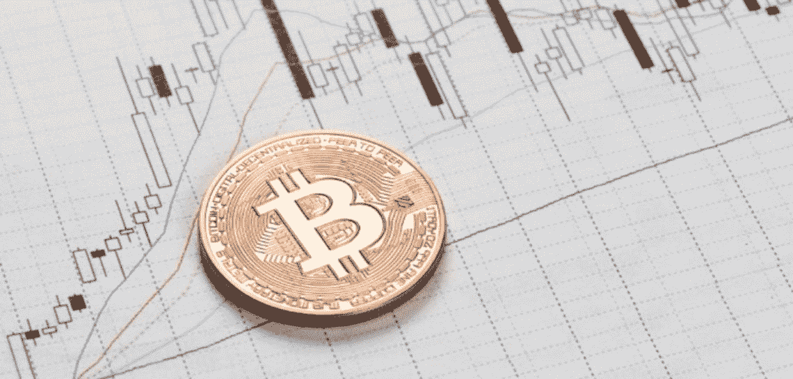
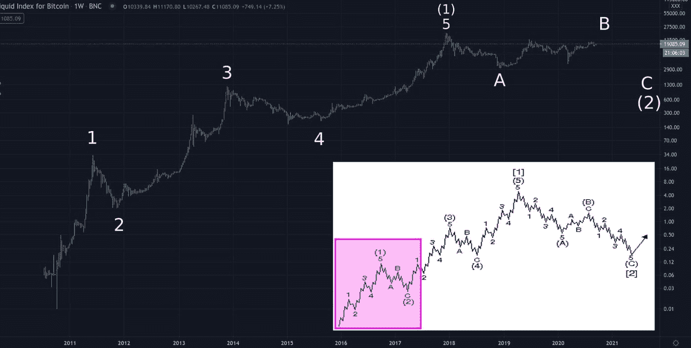
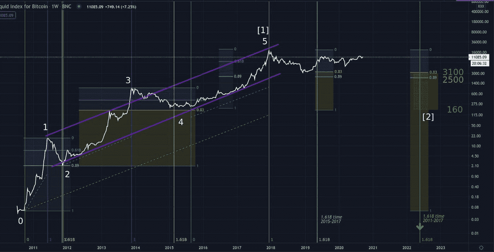
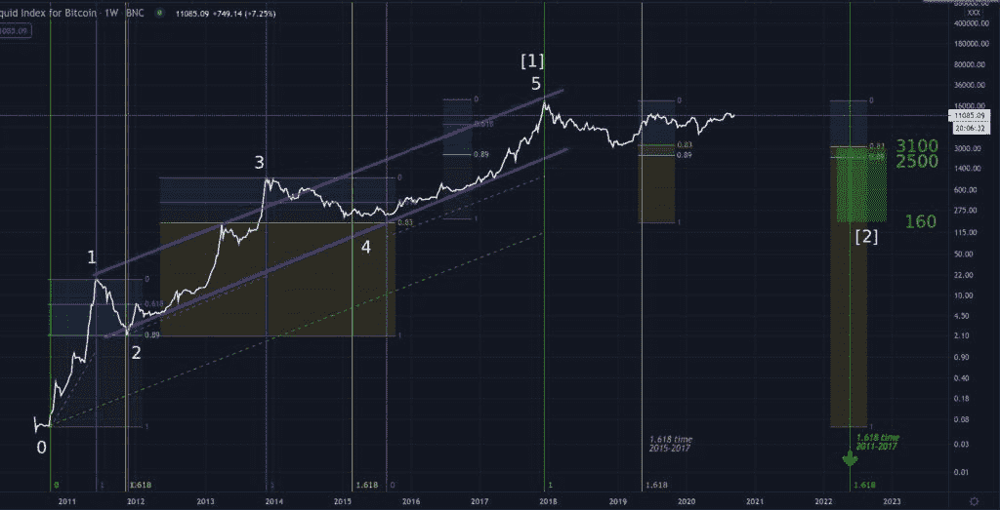

# 比特币的长期价格——到处都是斐波纳契比率！

> 原文：<https://medium.com/coinmonks/the-bitcoin-price-in-the-long-run-fibonacci-ratios-everywhere-71553a5f43bd?source=collection_archive---------0----------------------->

本系列分析文章的第 1 部分介绍了艾略特波浪原理(EWP)。首先，核心假设是反直觉的:

*“波动原理认为，市场不是由基本面或消息驱动的，而是由“社会情绪”——所有市场参与者的集体心理”驱动的*

[请阅读第一部分](/machinatrader/the-bitcoin-price-in-the-long-run-part-1-the-role-of-social-mood-f8a9a66e9397)，这样你就可以理解这篇文章对长期[比特币](https://blog.coincodecap.com/a-candid-explanation-of-bitcoin)价格图的应用。回想一下第 1 部分中提出的波数:

*Elliott Wave count for the long-term bitcoin price*

# 历史比特币价格图表概述

自 2010 年比特币首次交易以来，我们可以看到五波涨到 2017 年的市场顶部。看一下理想化的 EWP 市场结构的插图，完整的五波序列被标为(1)。

EWP 的预期是，三个大的浪现在应该在标签(2)处展开到熊市低点。

在第二波完成后，随着第三波的推进，我们将走出洋红色的盒子，这是一个长期的牛市，应该比我们在 2017 年高点看到的第一波(1)更大。

你可能会想，这很好，但是我们怎么知道一个波什么时候结束呢？我们是否简单地在顶部和底部贴上任意的标签，并希望我们是正确的？幸运的是，EWP 比仅仅在图表上贴上主观标签更彻底。要真正应用 EWP，我们必须承认市场价格在本质上是分形的，价格波动是以前一波的比率展开的。具体来说，波浪原理要求我们识别图表中的斐波纳契比率，因为这是人类心理的潜意识指南。

# 到处都是斐波那契比率

无论是在建筑、绘画、音乐还是图表中，我们的大脑都会发现某些比例令人愉悦。最令人满意的比率——0.618 的黄金分割比率——是一个重要的斐波那契比率。这个黄金分割点和其他斐波纳契比率，例如 0.382 和 0.89，普遍存在于自然界和所有人类的努力中，包括集体项目，例如文明的发展和……市场价格图表。

通过对数万张价格图的研究，EWP 的从业者发现，每张价格图往往都有自己的“个性”——每个市场都倾向于特定的斐波那契比率，然后在更大或更小的时间框架内重复——这是特定价格图的分形“指纹”。接下来，我们将考虑表征比特币价格图表的斐波那契比率。

# 比特币价格的比率分析

*Fibonacci ratio analysis of the long-term bitcoin price chart*

现在，忽略图表中的垂直线，专注于白色波浪标签 1、2、3、4 和 5。看一看。

请注意，五个价格波是在一个平行的通道中展开的——紫色的斜线。这是一个关键的 EWP 要求，即五个连续的波应该在一个平行的通道中有接触点。第 3 波和第 4 波倾向于超过通道边界，我们可以看到第 3 波高于通道，但是第 4 波和第 5 波确认了定义五波序列的平行通道。

让我们看看图表最左边的第一波。斐波纳契回撤工具是从第一波的底部到顶部绘制的。第二波折回第一波距离的 0.89 倍。这可以在浅蓝色标记 0.89 处得到验证。

接下来看浪 3 和浪 4 做的 0.81(橙色)回撤。不是斐波那契比率，也不是我们预期的完美的 0.89 修正低点，但足够接近了，考虑到 200 周移动平均线(一个强大的支撑)当时位于 210 美元，阻止了进一步的下跌。注意，我们正在测量标签 2 和标签 3 之间的波 3 的距离。第四波回撤的深度通常比第二波回撤的深度浅。

所以我们看到，比特币价格往往会修正其长期上涨的 81%至 89%。

接下来，测量从标签 4 到标签 5 顶部的第 5 波。横跨第 5 波绘制的斐波那契工具显示，2018 年的熊市已经回撤了第 5 波的 0.82(橙色标记)。在流行的概念中，熊市已经达到了其典型的深度(> 80%的修正)，因此，比特币价格肯定处于其下一阶段的上涨中。对吗？

两个关键的 EWP 规则揭示了市场的未来发展:

1.  在通道中展开了五波之后，市场完成了一波更大的浪。在这种情况下，大度数波浪在 2017 顶部被标记为[1]。接下来，必须完成一次类似的大幅度修正。这种大的修正将是波动[2]。请参考上面第一张图表中的插图了解背景。
2.  考虑到价格图表的分形性质，我们预计小度数波浪 2(图表的最左边)的特征会在大度数波浪中重复出现[2]。这应该包括它的回撤深度(0.89 波[1])以及它的持续时间。

# 斐波那契时间分析

*Fibonacci ratio analysis of the long-term bitcoin price chart*

*注意:这是与上面相同的图表，贴在这里是为了便于参考*

正如我们可以用斐波纳契比率来测量距离一样，我们也可以测量波的持续时间。我们现在将考虑图表中的垂直线。

请看图表最左侧比特币价格开始时的垂直绿线。第一波的持续时间是从绿线到蓝线测量的。该距离被校准为具有值 1。这个距离是用它的黄金分割率(0.618)投影出来的。黄线标志着第一波的持续时间加上 0.618。请注意，这个时间标记也是第二波的底部。

将斐波纳契时间投影应用于第 3 波的持续时间(从标签 2 到标签 3 测量), 1.618 时间标记指定了 2015 年第 4 波低点的时期。

为了说明 EWP 规则，即在五浪序列之后会出现大幅度的调整，这一时间分析也适用于第五浪。第五波持续时间的 1.618 标志着 2019 年初的熊市低点。但是我们可以看到事实并非如此。粉红色的 1.618 线是不相关的，因为我们知道预期整个五浪序列的修正。

从图表最左侧的绿线一直测量到 wave [1]的顶部(图表的中间)，1.618 时间投影由图表右侧的绿色垂直线指定为 2022 年。

# 艾略特波浪分析结论

换句话说，鉴于比特币价格图表倾向于修正到前一波的 80-90%的深度，并在上涨波持续时间的 1.618 处完成这样的修正，EWP 预测 2022 年上半年将出现一波熊市低点，价格为 2500 美元 BTC/美元。

这是 EWP 分析的合理预期。虽然时间标记应该相当准确，但准确的价格水平并不容易预测。至少接近 3100 美元的双底是可能的，预期中值为 2500 美元。然而，恐慌性抛售可能会将价格推低至第四波的底部，接近 160 美元。这不会违反任何 EWP 规则或准则，也符合比特币价格波动顶部和底部的极端情绪化。

使用此分析作为指导。不要孤立地采取行动。我们不知道价格将通过哪条路线达到最终市场低点。每个交易者都必须找到一种他们从基本原则中理解的交易方法和实践。将这一分析与你自己的结合起来，你应该会发现，你将能够更好地预测未来熊市的底部，而不是简单地阅读 Twitter 上的每日分析，并遵循一致的观点。

## 另外，阅读

*   最好的[密码交易机器人](/coinmonks/crypto-trading-bot-c2ffce8acb2a)
*   [密码本交易平台](/coinmonks/top-10-crypto-copy-trading-platforms-for-beginners-d0c37c7d698c)
*   最好的[加密税务软件](/coinmonks/best-crypto-tax-tool-for-my-money-72d4b430816b)
*   [最佳加密交易平台](/coinmonks/the-best-crypto-trading-platforms-in-2020-the-definitive-guide-updated-c72f8b874555)
*   最佳[加密贷款平台](/coinmonks/top-5-crypto-lending-platforms-in-2020-that-you-need-to-know-a1b675cec3fa)
*   [最佳区块链分析工具](https://bitquery.io/blog/best-blockchain-analysis-tools-and-software)
*   [加密套利](/coinmonks/crypto-arbitrage-guide-how-to-make-money-as-a-beginner-62bfe5c868f6)指南:新手如何赚钱
*   最佳[加密制图工具](/coinmonks/what-are-the-best-charting-platforms-for-cryptocurrency-trading-85aade584d80)
*   [莱杰 vs 特雷佐](/coinmonks/ledger-vs-trezor-best-hardware-wallet-to-secure-cryptocurrency-22c7a3fd391e)
*   了解比特币的[最佳书籍有哪些？](/coinmonks/what-are-the-best-books-to-learn-bitcoin-409aeb9aff4b)
*   [3 商业评论](/coinmonks/3commas-review-an-excellent-crypto-trading-bot-2020-1313a58bec92)
*   [AAX 交易所评论](/coinmonks/aax-exchange-review-2021-67c5ea09330c) |推荐代码、交易费用、利弊
*   [Deribit 审查](/coinmonks/deribit-review-options-fees-apis-and-testnet-2ca16c4bbdb2) |选项、费用、API 和 Testnet
*   [FTX 密码交易所评论](/coinmonks/ftx-crypto-exchange-review-53664ac1198f)
*   [n 零审核](/coinmonks/ngrave-zero-review-c465cf8307fc)
*   [Bybit 交换审查](/coinmonks/bybit-exchange-review-dbd570019b71)
*   [3Commas vs Cryptohopper](/coinmonks/cryptohopper-vs-3commas-vs-shrimpy-a2c16095b8fe)
*   最好的比特币[硬件钱包](/coinmonks/the-best-cryptocurrency-hardware-wallets-of-2020-e28b1c124069?source=friends_link&sk=324dd9ff8556ab578d71e7ad7658ad7c)
*   最佳 [monero 钱包](https://blog.coincodecap.com/best-monero-wallets)
*   [莱杰纳米 s vs x](https://blog.coincodecap.com/ledger-nano-s-vs-x)
*   [bits gap vs 3 commas vs quad ency](https://blog.coincodecap.com/bitsgap-3commas-quadency)
*   [莱杰纳米 S vs 特雷佐 one vs 特雷佐 T vs 莱杰纳米 X](https://blog.coincodecap.com/ledger-nano-s-vs-trezor-one-ledger-nano-x-trezor-t)
*   [block fi vs Celsius](/coinmonks/blockfi-vs-celsius-vs-hodlnaut-8a1cc8c26630)vs Hodlnaut
*   Bitsgap 评论——一个轻松赚钱的加密交易机器人
*   为专业人士设计的加密交易机器人
*   [PrimeXBT 审查](/coinmonks/primexbt-review-88e0815be858) |杠杆交易、费用和交易
*   [埃利帕尔泰坦评论](/coinmonks/ellipal-titan-review-85e9071dd029)
*   [赛克斯·斯通评论](https://blog.coincodecap.com/secux-stone-hardware-wallet-review)
*   [区块链评论](/coinmonks/blockfi-review-53096053c097) |从您的密码中赚取高达 8.6%的利息