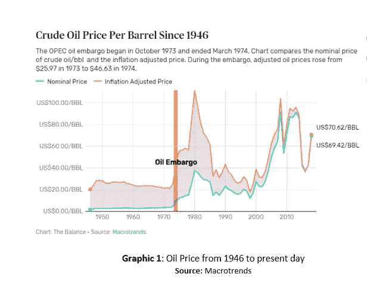
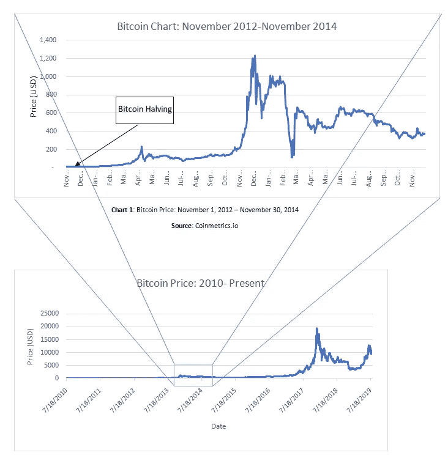
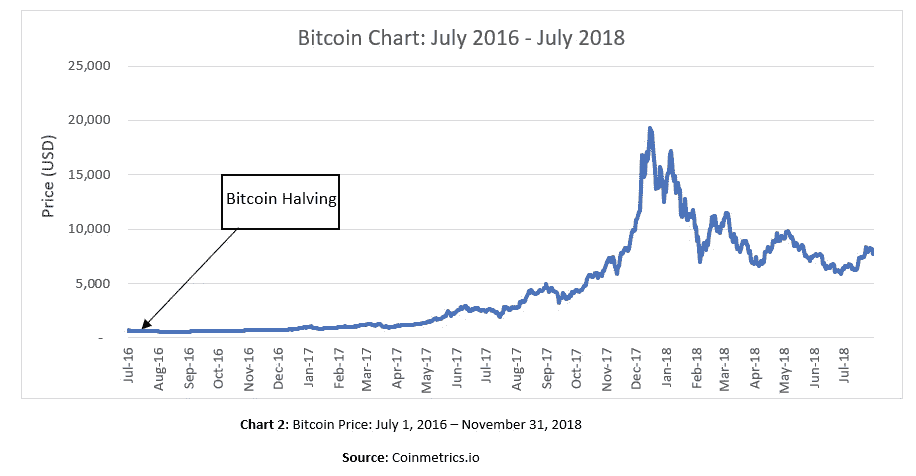
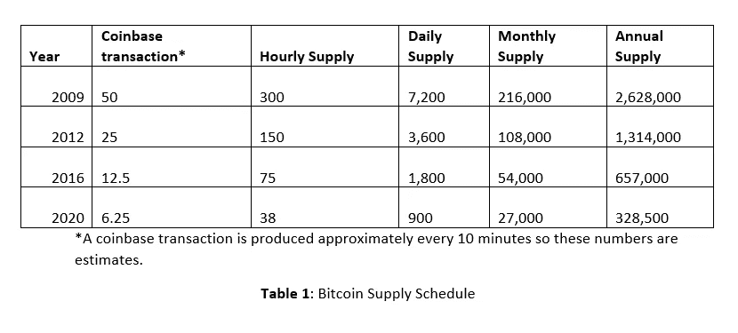
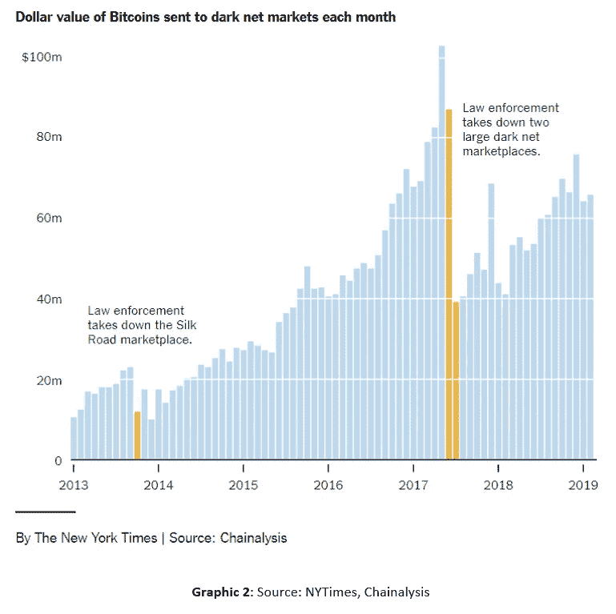
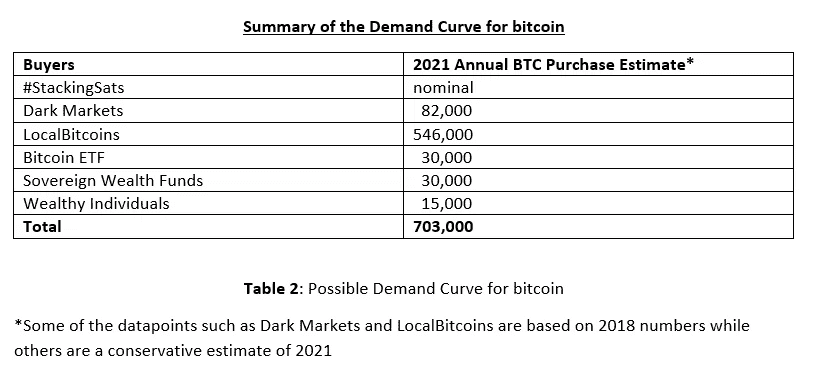
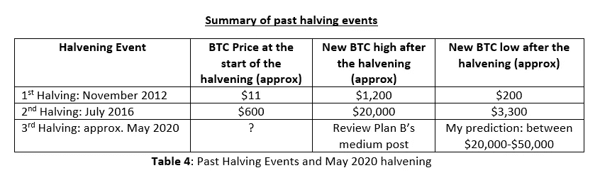

# 比特币的挤压

> 原文：<https://medium.com/coinmonks/the-bitcoin-squeeze-95c2ea30d725?source=collection_archive---------0----------------------->

很多长期持有比特币的人都经历过几次繁荣和萧条的循环。最近，许多人注意到了这些周期的一种模式，这种模式与每 210，000 个区块或大约每四年发生一次的比特币减半事件有关。下一次预计将在 2020 年 4 月/5 月进行。从历史上看，这些减半事件没有被适当地反映到市场价格中，因此导致了一轮大牛市；随之而来的是熊市。这种乐观情绪是由导致比特币供应下降的基本面因素支撑的，而从历史上看，对比特币的需求有可能增加。如果这是真的，这最终可能导致价格飙升，并最终修正回到一个新的均衡价格。

阿姆斯特丹一位名叫 Plan B 的匿名人士为比特币定价提供了一个非常有趣的金融模型。你可以在他的[媒体文章](/@100trillionUSD/modeling-bitcoins-value-with-scarcity-91fa0fc03e25)中了解更多。他创造了三个模型，其中新的均衡价格可能在 5 万美元到 10 万美元之间。我个人认为他的模型相当准确。然而，我也认为下一轮牛市的高价可能会超出他的预测。当市场进入熊市时，它可能会低于 50，000 美元，但我预测它可能会高于之前的高点 20，000 美元。

比特币的行为类似于一种商品。甚至比特币的命名法也使用了“挖矿”等术语。然而，没有代币的物理挖掘，但有一个工作机制的证明来挖掘新的“coinbase”交易，因为它们被称为产生新的比特币(不要与比特币基地交易所混淆)。许多网站已经解释了工作证明、coinbase 事务和 UTXO(未用事务输出),所以我在这里不再赘述。

比特币减半事件的影响可能类似于 1973 年 10 月发生并于 1974 年 3 月结束的石油禁运。这不是一个完美的类比，但它是可比的。在禁运实施之前，尼克松政府退出了布雷顿森林协定，并放弃了金本位制。这影响了油价，因为石油过去和现在都是以美元定价的。此外，石油输出国组织还想对那些在赎罪日战争中支持以色列的国家发表声明。美国市场大量进口石油输出国组织石油。当实行石油禁运时，在禁运期间，原油的名义平均价格从每桶 3.50 美元飙升至每桶 15 美元。即使解除了禁运，石油价格仍继续上涨，达到每桶 39.50 美元的高位，并最终下跌。然而，即使在价格下降后，石油价格仍继续保持在石油禁运前的价格之上。图 1 显示了石油禁运前后的价格变动。这证明了一个事件，需求保持不变或可能增加，而供应曲线移动和下降。这导致了油价的永久上涨。这一事件与导致比特币价格永久上涨的比特币减半事件非常相似。

2012 年 11 月(见图表 1)，加密资产市场低调地经历了第一次比特币减半事件。本月，比特币交易价格约为 11 美元。该协议仍然相对模糊。在减半事件后的第一年，价格缓慢上涨，然后从 2013 年 11 月开始上涨，在 2013 年 12 月达到约 1200 美元的峰值。市场最终修正了。2014 年 1 月初发生了两起负面新闻事件。Mt. Gox 在 2014 年 2 月被黑客攻击并申请破产，中国在 2013 年 12 月禁止中资银行处理比特币交易。尽管有负面消息，但与减半事件开始时相比，比特币在 2014 年 11 月保持了较高的价格。

第二次比特币减半事件发生在 2016 年 7 月(见图表 2)。当月，比特币徘徊在 600-700 美元左右。从 2016 年 12 月左右开始，比特币开始上涨，几乎达到 1000 美元。许多业内人士都希望 Winklevii 比特币 ETF(交易所交易基金)能在 2017 年初通过。它最终没有通过，但价格确实开始上升。随着媒体开始更多地报道该行业，这导致了对比特币的需求增加。华尔街日报和巴伦周刊分别于 2017 年 6 月 2 日和 2017 年 7 月 3 日首次在他们的首页提到比特币。与前一次事件一样，价格自我修正，导致熊市。尽管如此，2018 年 7 月底 7000 美元左右的价格仍然高于减半活动开始时的 600-700 美元。此外，比特币在 2018 年 12 月触及 3300 美元的低点。这个价格仍然高于之前的高点 1200 美元。

上世纪 70 年代的石油禁运为大宗商品的供应冲击提供了一个很好的例子。在比特币的情况下，减半事件是对市场的永久性供应冲击。在我的分析中，我推测比特币的需求在增加，而供应量却急剧减少了 50%。

# 经济学:供给曲线

工作证明挖掘机制产生新的比特币供应，直到达到 2100 万的上限。比特币矿工是市场上的重要参与者，因为他们帮助更新账本来跟踪所有的 UTXO。作为补偿，除了交易费(也在 BTC 定价)之外，他们还收到一笔 coinbase 交易，目前为 12.5 BTC。在这一点上，交易费是相当象征性的，所以在这个讨论中将不予考虑。矿工大约每 10 分钟获得一次奖励。目前，大部分支付来自 coinbase 交易。一个假设是，机构比特币挖矿业务只关心法定净利润。所有者可能不知道比特币协议，因为许多矿工现在可以用期货合约对冲他们的比特币。如果这种假设是正确的，比特币矿工不想暴露于外汇风险。把他们的 BTC 变成菲亚特符合他们的最大利益。他们中的许多人通过与大买家的合同或场外交易(OTC)柜台进行交易。根据表 1，2019 年，通过 coinbase 交易创建的 BTC 总数约为 657，000，交易费用不包括在此总数中。

假设比特币矿工正在出售他们的 coinbase 交易，市场在 2019 年一直在吸收它，而没有给价格带来太大的下行压力。需要思考的一个普遍问题是，这些人是谁，为什么要买比特币。这方面有几个理论和数据。它们包括以下内容:

-一场#stackingsats(本文将进一步详细定义)运动，其中个人正在积累比特币以长期持有，称为比特币持有者。

-不幸的是，黑市仍在使用比特币从事非法交易。

-Localbitcoins.com 提供了有价值的数据，说明哪些国家有公民将他们的纸币兑换成比特币。

-有些亿万富翁试图积累头寸，以对冲全球金融危机或法定货币通胀。有一个人特别想购买整个供应的两位数百分比。

-比特币巨鲸希望通过购买来继续支持网络，以保护其目前的持有量。

-各国都在购买黄金，以分散主权财富。在过去的三年里，有传言说中国一直在购买比特币来对冲他们在美国的巨额国债头寸。

可能还有其他比特币买家我没有涵盖在内。他们可能在市场上举足轻重，但很难正确量化或估计他们的购买力。

除非另有说明，所有比特币金额都被假定为每 BTC 10，000 美元。

# **#StackingSats**

Twitter 上出现了一个趋势，叫做#stackingsats。比特币的最小单位被称为 satoshi，或 sats。因此，术语堆叠 satoshis，或堆叠 sat。一个 satoshi 是一个比特币的一亿分之一。它与 0.00000001 BTC 相同。堆叠 satoshis 是一个运动，鼓励比特币的信徒以低于 100 美元的金额购买平均比特币。用户在 Twitter 上发布他们购买的截图。出于安全原因，并不是每个人都公布他们的购买情况。因此，很难估计这场运动购买了多少比特币。我估计这对于整个市场来说只是一个象征性的数字，但也可能是巨大的。

# 黑市

黑市使用比特币作为支付方式来进行交易。虽然，一旦用户在 UTXO 上自学，他们会意识到现金是进行非法交易的更好的媒介，因为比特币会留下可审计的记录。执法部门可以追踪区块链上的比特币交易，并在法庭上将其作为证据。根据[chain analysis](https://www.nytimes.com/2019/04/23/technology/bitcoin-tulip-mania-internet.html)(图 2)，2018 年约有 6.2 亿美元(约 8.2 万 BTC)的比特币在黑市上被使用。这不是比特币的乐观用例，因为这违反了法规和联邦法律。然而，它仍然对交易量和需求有所贡献。许多人错误地认为比特币是可替代的。最近在 2019 年 10 月关闭了一家[儿童色情](https://www.coindesk.com/us-law-enforcement-traces-bitcoin-transactions-to-nab-largest-child-porn-site)网站，这表明比特币具有高度可追溯性，可以在法庭上用作证据。与 zcash 或 monero 等其他隐私币相比，比特币仍然是一种更容易获得和交易的令牌。由于其可替代性，这将是黑市的首选方法。

# Localbitcoins.com

Localbitcoins.com 是一个点对点的交易平台。历史上，比特币在这里的交易价格一直高于现货价格。由于现货有溢价，我不相信这里有交易者试图赚钱，因为溢价通常在 5%左右。该网站主要用于菲亚特到比特币的转换。在提取和汇总这些数据后，2018 年全球平均每周交易量约为 6100 万美元的比特币。以 BTC 计价的平均每周交易量约为 8200 比特币，相当于 2018 年交易了约 424414 BTC。发达国家和发展中国家的公民都在这个平台上进行交易。由于当地货币委内瑞拉玻利瓦尔经历了恶性通货膨胀，委内瑞拉等国家的交易量有所增加。2018 年，委内瑞拉人共交易了约 35，000 BTC。人们可以推测，委内瑞拉公民已经开始使用比特币作为价值储存手段。截至 2019 年 11 月，本地比特币的总交易量已经比同期的 2018 年高出约 10%。localbitcoins.com 的数量足以表明，随着时间的推移，随着越来越多的人在这个领域接受教育，我们正在见证一个不断增长的需求。

# 未经证实的谣言

有些富人正在寻求保护他们的财富。他们理解比特币的价值主张，因此他们可能已经开始在公开市场上慢慢积累 BTC。根据这篇福布斯[文章](https://www.forbes.com/sites/billybambrough/2019/05/30/how-billionaires-are-buying-up-bitcoin/#70d83f4c208c)，有一个人试图积累当前流通供应量的 25%。这相当于超过 400 万比特币。大约有 2200 名亿万富翁。如果这些亿万富翁中只有 1%的人有兴趣购买 10 亿美元中的 1%的比特币，这仍然是超过 2 亿美元的比特币或 2 万个比特币。保守地说，我估计 2021 年富人会购买大约 15000 BTC。

与此同时，主权财富基金可能正在购买比特币。这都是基于未经证实的谣言的猜测。[保加利亚](https://www.newsbtc.com/2019/07/22/bulgaria-big-on-bitcoin-as-reserves-could-exceed-its-gold-stash/)已经公开表示，他们通过政府没收来自有组织犯罪的比特币。他们目前拥有超过 20 万 BTC，相当于超过 20 亿美元。这成为头条新闻，因为他们的比特币价值超过了他们持有的黄金价值。韩国等其他国家也通过非法活动获得比特币。我相信这将最终导致各国政府通过购买比特币来对冲其投资组合。最终，富有的个人和主权财富基金可能会公开宣布他们的持股。这一消息可能会成为积极的催化剂，因为它验证了比特币的价值主张。我估计这可能是 2021 年 30，000 BTC 的低额。

根据彭博[的文章](https://www.bloomberg.com/news/articles/2019-09-26/venezuela-has-bitcoin-stash-and-doesn-t-know-what-to-do-with-it)，委内瑞拉政府账户中已经有比特币，以避免美国的制裁。对于比特币的采用来说，这不是一个积极的消息。然而，它显示了一个政府如何看待比特币的价值。我相信一些政府可能正在慢慢积累比特币。一旦他们对自己的投资组合配置感到满意，他们可能会发表一项重大声明，这可能会引发各国之间争夺比特币有限供应的竞赛。如果一个主要超级大国宣布在 2021 年持有比特币，我相信这可能会延长反弹。

# 附加催化剂

尽管比特币的价格和需求可能很重要，但从长期来看，最重要的因素很可能是随着基础设施的发展，人们对该协议的接受程度。随着钱包、节点和矿工的软件变得更加用户友好，许多人可能会开始认为它比黄金标准更好。随着越来越多的用户支持该网络，它将处于一个更好的位置，该协议可能会留在这里，而不会走向与荷兰郁金香泡沫相同的历史。这最终会在生态系统中产生巨大的网络效应。这也是脸书和 Instagram 获得巨额估值的原因。由于每个人都使用这些社交媒体网络，破坏变得更加困难。

许多知名演讲者和教授继续反对比特币。然而，数据显示，人们对比特币的兴趣越来越大。教育在这方面发挥了很大的作用，因为许多大学，如巴鲁克学院(我的母校)、纽约大学、斯坦福大学和其他许多大学已经开始提供围绕区块链和加密资产的课程。此外，还有尼科西亚大学和 Udemy 提供的在线课程。甚至还有成为[认证比特币专业人士](https://www.udemy.com/course/bitcoin-certification/)的认证。受教育程度的提高可能导致购买比特币的需求增加。我认为理解这项技术及其价值主张存在教育障碍。开始每天花 30 分钟了解比特币的人最终会掉进谚语所说的兔子洞。

还有一些额外的催化剂可以推动牛市走得更远。随着该行业获得合法性，不同的基础设施公司得以建立，巨额投资得以贡献，这增加了比特币交易所交易基金(ETF)获得证券交易委员会(SEC)批准的可能性。我推测，2021 年初可能会看到第一个批准。利用斯潘塞·博加特在 2017 年 1 月的[文章](https://www.coindesk.com/needham-bitcoin-etf-attract-300-million-assets-approved)，他讨论了比特币 ETF 的潜在影响，他推测保守估计有 3 亿美元可以进入比特币市场。这相当于在短时间内购买了大约 30，000 个比特币。

由于基础设施是围绕加密构建的，我们可能会看到更大的机构开始向该领域投入大量资金。2017 年“机构正在到来”的说法可能会在 2021 年实现。这可能不会立即带来大量资本流入，但我们可能会开始看到少量机构资本流入这一领域。如果养老基金和捐赠基金为其投资组合寻求阿尔法，比特币可能是相对于其他加密资产的首选。这种催化剂可能会将市场推得更高。

Square 的现金应用让用户在手机上购买比特币变得非常容易。还有在现金 App 上溢价购买比特币。Square 从差价中赚钱，因为他们不收取佣金。Square 最近发布的财报显示，随着时间的推移，用户开始通过他们的应用购买更多的比特币。在这一点上，我没有把他们的数据包括在我的估计中，但我最终会围绕 Cash App 的数据提供更多的研究。

# 杠杆作用

除了上述因素，许多密码交易所提供的杠杆作用超出了我们的想象。在传统的股票市场，作为投资者，你最多只能获得现有资产的 2 倍。如果你投资于市值较小的公司，券商通常不会提供任何杠杆。在当前环境中，许多加密交换提供超过 2 倍的利用率。这里总结了你目前可以获得的杠杆类型。

当散户投资者利用这种可用的杠杆时，这将是火上浇油。换句话说，如果我只有 1000 美元，我在币安的购买力实际上是 125000 美元。因此，我认为我们可能会见证比 2017 年更大的反弹，因为投资者利用这一杠杆购买更多的加密货币。我预测这可能会导致 B 计划估计的更高均衡价格(100，000 美元)的过度扩张。当泡沫破灭时，我认为这将导致剧烈的向下运动，这对任何在顶部附近购买的人来说都是非常痛苦的。

# 经济学——需求曲线

比特币的供应时间表大约每四年减少一次。这导致了供给曲线的突然转变。在下一次减半事件中，保守地说，需求可能保持不变，但供应会突然减半。随着人们继续购买，他们会注意到以要求的价格购买他们想要的数量变得越来越难。慢慢地，这开始推高价格。随着这种情况的发生，最终人们可能会开始体验 FOMO(害怕错过)，并开始购买比特币。

基于这一信息，我认为 2020 年 4 月/5 月左右发生的比特币减半事件没有被市场正确定价。活动结束后，购买者可能会意识到可供购买的比特币短缺。从历史上看，减半事件与减半事件后一年的牛市相关。由于该领域教育的增加，我相信这可能会比以前的 halvenings 发生得更快。我的最佳猜测是 2020 年 12 月或更早。如果需求曲线上移(需求增加)，我们可能会看到比 2017 年更大的牛市。很难知道事件将在何时发生，所以这些日期都是推测性的。

# 结论

在表 3 中，我总结了 2021 年 703，000 BTC 的可能需求，假设需求没有增加。从 2020 年 5 月左右开始，目前每年创造的 657，000 辆供应将突然减少到每年 328，500 辆。这种供应曲线的突然转变很可能会成为下一轮比特币牛市的催化剂。

# 免责声明和假设

前面提到的需求曲线可能与本地比特币数据和黑市需求有一些重叠。此外，一些估计可能完全不准确。我试图以最保守的方式呈现数据，因为我没有考虑来自其他交易所的数据，也没有考虑可能对比特币感兴趣的其他买家。

黑市的连锁分析数据可能不完整。他们有可能没有所有的黑市比特币地址来获取完整的数据。他们对黑市交易量的估计可能更低。

比特币协议制定了一些规则，许多人认为这些规则是硬规则。由于这个协议是分散的，规则只能通过协商一致来改变。这包括改变 2100 万比特币的供应上限。虽然，许多比特币狂热分子会认为这是亵渎神明的。然而，这是一种可能性。这件事发生的几率可能很低，但值得一提。代码中可能还有一个[错误](https://www.coindesk.com/the-latest-bitcoin-bug-was-so-bad-developers-kept-its-full-details-a-secret)，允许无限印刷新的比特币。在过去，有一个错误允许它，但谢天谢地，在有人利用它之前，它被修补。

比特币因为其特殊的使用案例，现在和将来都会面临竞争。目前，比特币由于其复杂的用户界面(UI)而不容易使用，因此最终为普通用户创造了糟糕的用户体验(UX)。可能会有一种新的协议来快速解决比特币的问题。这可能最终导致用户转向新的协议。在社交媒体领域，Myspace 是先行者，但脸书创造了一个更好的产品，因此说服用户转向他们的平台。比特币就可能发生这种情况。

**更多披露:**我拥有比特币。本材料不构成出售或购买任何证券的要约。这里的任何数据都是从被认为可靠的来源获得的；但是，它的交付并不保证其中包含的信息是正确的。

本报告仅供参考，不应被视为投资建议。它不是对任何特定证券、策略或投资产品的推荐、出售要约或购买要约。本报告的研究是基于我认为可靠的当前公开信息，但我不代表该研究或报告是准确或完整的，也不应依赖于此。我在本报告中表达的观点和意见是截至本报告发布之日的最新信息，可能会发生变化。过去的表现并不代表未来的结果。

本文件中包含的任何预测、预测和估计必然是推测性的，并基于某些假设。此外，他们描述的事情受到已知(和未知)风险、不确定性和其他不可预测因素的影响，其中许多因素超出了我的控制范围。对这些前瞻性陈述的准确性不做任何陈述或保证。可以预计，部分或全部此类前瞻性假设将不会实现，或与实际结果有很大差异。因此，任何预测都只是估计，实际结果会有所不同，可能与所示的预测或估计有很大差异。

这些策略过去的表现不一定代表未来的结果。损失的可能性是存在的，所有的投资都有风险，包括本金的损失。

> [在您的收件箱中直接获得最佳软件交易](https://coincodecap.com/?utm_source=coinmonks)

