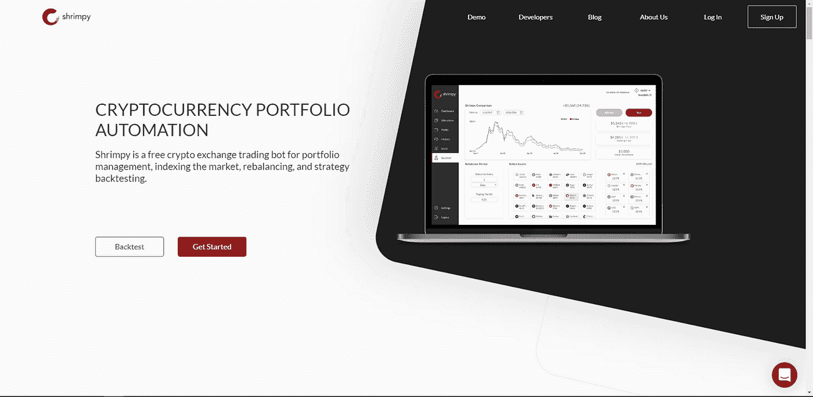
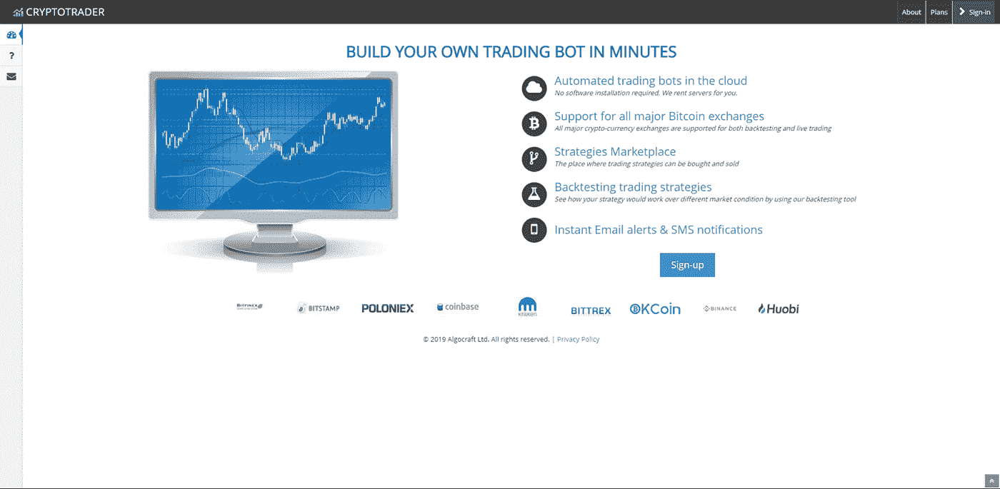
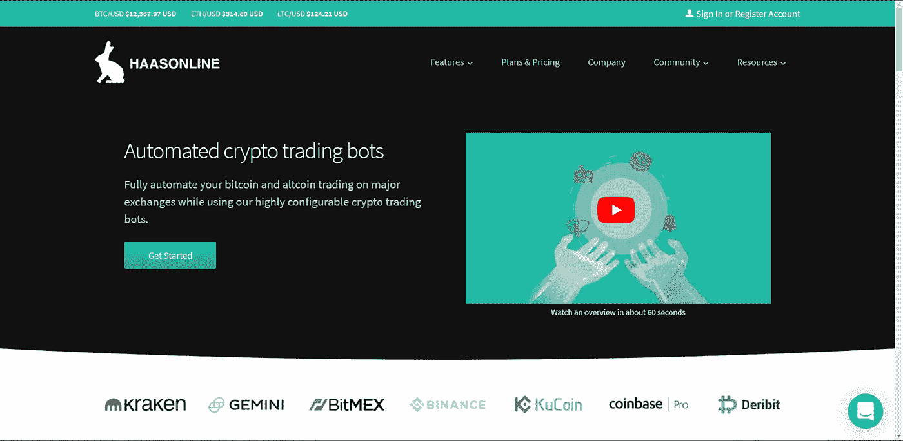
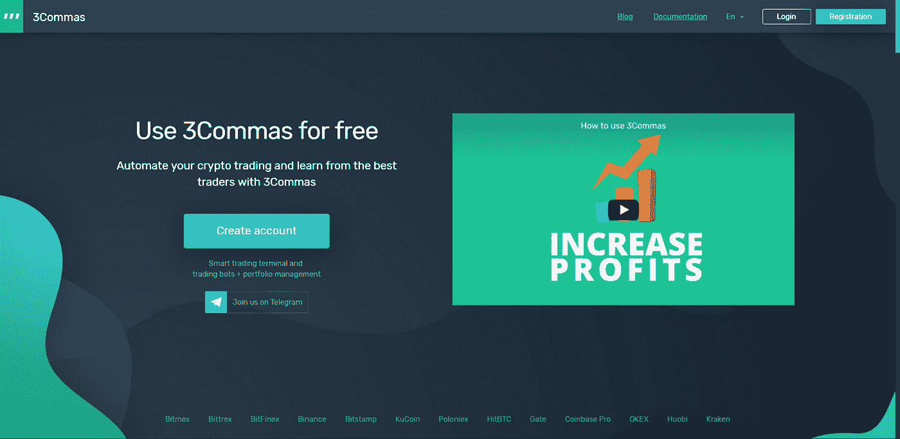
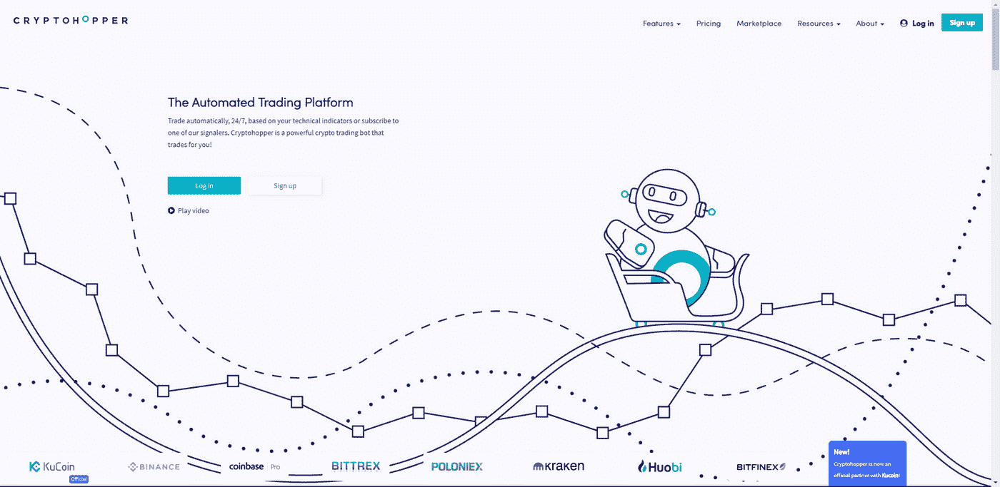

# 每个人都应该使用的比特币交易机器人

> 原文：<https://medium.com/coinmonks/the-bitcoin-trading-tools-everyone-should-use-e619c01581d1?source=collection_archive---------0----------------------->

## 在 5 分钟或更短时间内自动化您的加密货币投资组合！

随着最近比特币价格重新突破 10，000 美元大关(在 6 月下旬)，对加密货币交易的兴趣再次开始飙升。像加密世界中的许多机会一样，交易也是一个可行的选择。但是，就像它在菲亚特世界中的类似外汇交易一样，由于这个新兴市场的性质，加密货币交易可能会很复杂，很难操作。

无论你是一个有经验的交易者还是第一次尝试这个想法的人，拥有正确的知识和工具，都会有所不同。谈到加密货币交易，通常有两种流行的策略。这些策略中的第一个是“HODLing”。在 BitcoinTalk 论坛上的一次醉酒漫谈中，这种不顾价格变动而持有资产的简单策略引起了世界的轰动。加密货币投资者采用的第二个最受欢迎的策略是[**投资组合再平衡**](https://blog.shrimpy.io/blog/portfolio-rebalancing-for-cryptocurrency) 。历史上，大型机构执行这种策略是为了降低其投资组合的风险，由于 [**研究显示了这种策略的长期好处**](https://hackernoon.com/rebalance-vs-hodl-a-technical-analysis-6f341b0db9cd) ，它已经成为每个加密货币投资组合的主要内容。

> [发现并回顾最佳交易自动化软件](https://coincodecap.com/category/trading-automation)

如果你喜欢积极主动地投资，降低风险，随着市场波动调整你的配置，那么第二个选择可能是你的策略。然而，加密货币市场的交易感觉就像是在枪战中拿刀。为了给新手和有经验的加密货币交易者授权，我们为[比特币](https://blog.coincodecap.com/a-candid-explanation-of-bitcoin)编制了一份最佳工具列表

交易，我们在这里讨论自动化比特币交易的概念，以及[交易机器人](https://blog.coincodecap.com/a-guide-to-cryptocurrency-trading-bots)如何帮助您优化加密货币投资组合。

# 如何开始交易比特币

谈到最好的比特币交易平台，有很多交易所，一些最受欢迎的比特币交易所包括:****排名最大的密码交易所，其他热门的还有 [**Bittrex**](https://blog.shrimpy.io/blog/bittrex-review) ， [**KuCoin**](https://blog.shrimpy.io/blog/kucoin-review) ， [**北海巨妖**](https://blog.shrimpy.io/blog/kraken-review-exchange-features-trading-fees-and-security) ， [**比特币基地**](https://blog.shrimpy.io/blog/coinbase-pro-cryptocurrency-exchange-review) 。交易者可以很容易地在这些交易所创建账户，快速开始交易。****

****加密货币交易的一个主要缺点是市场的波动性。由于加密市场 24/7 交易，根据快速变化的市场动态跟踪你的投资组合可能很快成为一项难以管理的任务。大多数交易者在发现自己的投资组合一夜之间下跌后，早上醒来就听到了坏消息。****

****这就是自动交易工具和交易机器人的用武之地。由于交易机器人可以直接访问加密交易所，它们可以代表交易员执行买入/卖出指令。他们通过分析市场的不同价格变动来做到这一点，并确定额外的因素，如数量、订单和时间。交易者还可以为 bot 设置特定的监控因素，以便根据交易者的策略做出决策。****

****自动化比特币交易在当今的加密货币交易世界中相当流行，在选择最佳加密货币交易机器人时，交易者有很多选择。下面我们比较了一些最好的自动比特币交易工具。****

# ****最佳比特币交易工具****

# ****1.[虾肉](https://shrimpy.io/referral?r=I6VFZ7d2E)****

********

****[**Shrimpy**](https://shrimpy.io/referral?r=I6VFZ7d2E) 是一个很有前途的[投资组合自动化](https://coincodecap.com/category/portfolio-management)和[加密货币交易机器人](https://coincodecap.com/category/trading-automation)，它为新手和有经验的交易者提供了很多很棒的功能。Shrimpy 支持最好的比特币交易所，如币安、Bittrex、KuCoin、北海巨妖、比特币基地专业等。因此，用户可以轻松地将他们的交换与 Shrimpy 集成，这是一项相当简单的任务。****

****Shrimpy 的交易机器人有很多很酷的功能，用户可以自动执行他们的交易策略，并通过回溯测试来测试他们的策略，回溯测试提供了 5 年的历史数据，用户还可以在一个地方以统一的方式跟踪他们所有交易所账户、硬件钱包或冷存储解决方案的表现。****

****Shrimpy 还提供了一个重新平衡投资组合的独特功能，这对霍德勒来说是一个很好的策略。用户可以简单地安排 Shrimpy 交易机器人根据用户指定的标准自动执行买入/卖出指令，允许他们低买高卖。****

****开发者还可以利用 [**通用加密交易 API**](https://developers.shrimpy.io/)来构建个性化的比特币交易机器人。它们提供了轻松访问您的交易所账户、便捷的智能交易功能和丰富的市场数据。****

****Shrimpy 为用户管理一个充满活力的社区，用户可以在这里参与、分享策略，并研究更多关于优化投资组合表现的内容。Shrimpy 免费提供了很多很有价值的服务，但这项服务的核心是为每月支付 19 美元的高级订户保留的。****

****[**现在就报名吧！**](https://www.shrimpy.io/)****

# ****2.[密码交易商](https://cryptotrader.org/?r=3161)****

********

****CryptoTrader 是一个基于云的自动化加密货币交易机器人。它支持所有主要的比特币交易所，支持回溯测试和实时交易，通过回溯测试功能，用户可以查看策略在不同市场条件下的效果。****

****CryptoTrader 还提供了一个策略市场，允许用户购买策略或出售他们自己经过验证的策略。它还向用户提供短信和电子邮件通知，提醒他们重要的市场变化和趋势。****

****CryptoTrader 提供 5 种不同的定价方案，从每月 0.0015 ₿的基本价格到每月 0.0178 ₿的高级价格****

# ****3.哈斯博特****

********

****Haasbot 是一个自托管的自动化比特币交易机器人解决方案，拥有许多出色的功能。它支持 20 多个交易所，使交易者的自动交易变得容易。Haasbot 平台在 Windows、Mac 和 Linux 上运行，为用户提供超过 16 个交易机器人的选择，每个机器人都有自己独特的功能和交易策略。****

****他们的定价结构包括每月支付订阅有点贵，因为他们分为初学者₿0.066，简单的₿0.114 和先进的₿0.187 不同的功能。****

# ****4.[3 条消息](https://3commas.io/?c=tc189413)****

********

****3Commas 是另一个受欢迎的自动比特币交易工具，它与许多主要交易所合作。3Commas 有一个基于网络的界面，可通过任何设备访问，为用户提供 24/7 全天候监控和自动交易功能。****

****3Commas 提供了许多很棒的功能，比如设置止损和止盈目标的能力。它还提供社交交易，允许用户复制成功交易者的策略。****

****它允许创建、分析和回测加密投资组合的能力，使用户能够复制其他交易者的最佳投资组合。****

****3Commas 有点贵，每月订阅计划从 22 美元/月开始，高级 37 美元/月，专业 75 美元/月。****

# ****5.[隐翅虫](https://www.cryptohopper.com/?atid=14576)****

********

****CryptoHopper 是一款基于云的自动化比特币交易工具。由于几个原因，它在自动交易领域是一个众所周知的成熟玩家。他们提供了一个简单的设置，简单明了，几乎不需要 5 分钟。他们的仪表板非常直观，允许用户完全控制自己的投资组合，并设置特定的触发器和技术指标。****

****CryptoHopper 的定价也与 3Commas 相似，因为它们提供免费试用，可以选择升级到 Bunny(19 美元/月)、Hare(49 美元/月)和 Kangaroo(99 美元/月)。****

# ****6.[壁虎](https://gekko.wizb.it/)****

********

****在开源和免费提供的比特币交易机器人中，盖柯是一个熟悉的名字。它可以很容易地从 Github 下载，支持 16 个交换机，并可以很容易地根据用户的规格进行配置。Gekko 为用户提供了多种功能，可用于运行策略、运行模拟回溯测试、纸上交易以及通过交易机器人自动执行订单。****

****Gekko 支持多种操作系统，包括 Windows、Mac 和 Linux。Gekko 的代码库是如此的小而灵活，以至于它甚至可以在一个 Raspberry Pi 上设置和执行。****

****不幸的是，多年来，由于缺乏适当的维护，你应该预料到 Gekko 会遇到错误和故障。这导致许多用户放弃该项目，寻找更好的替代方案。****

# ****结论****

****从投资角度来看，加密货币交易与传统金融市场相比有很大不同，在漫长的熊市中持有加密货币可能不会继续成为最佳选择。机器人可以监控每天每一秒的市场，以自动化您的比特币交易策略。****

****尽管如此，自动化比特币交易和加密货币交易机器人并不适合所有人。这些机器人需要一定程度的交易知识和金融策略知识。对于那些有本事学习并努力在加密货币市场表现出色的人来说，自动化的[加密货币机器人](https://blog.coincodecap.com/a-guide-to-cryptocurrency-trading-bots)是一个值得使用的工具。****

## ****另外，阅读****

*   ****[最佳加密交易机器人](/coinmonks/whats-the-best-crypto-trading-bot-in-2020-top-8-bitcoin-trading-bot-c16adeb13317)****
*   ****[Deribit 审查](/coinmonks/deribit-review-options-fees-apis-and-testnet-2ca16c4bbdb2) |选项、费用、API 和 Testnet****
*   ****[FTX 密码交易所评论](/coinmonks/ftx-crypto-exchange-review-53664ac1198f)****
*   ****最好的比特币[硬件钱包](/coinmonks/the-best-cryptocurrency-hardware-wallets-of-2020-e28b1c124069?source=friends_link&sk=324dd9ff8556ab578d71e7ad7658ad7c)****
*   ****[密码本交易平台](/coinmonks/top-10-crypto-copy-trading-platforms-for-beginners-d0c37c7d698c)****
*   ****最好的[加密税务软件](/coinmonks/best-crypto-tax-tool-for-my-money-72d4b430816b)****
*   ****[最佳加密交易平台](/coinmonks/the-best-crypto-trading-platforms-in-2020-the-definitive-guide-updated-c72f8b874555)****
*   ****最佳[加密贷款平台](/coinmonks/top-5-crypto-lending-platforms-in-2020-that-you-need-to-know-a1b675cec3fa)****
*   ****莱杰 vs 特雷佐****
*   ****[PrimeXBT 审查](/coinmonks/primexbt-review-88e0815be858) |杠杆交易、费用和交易****
*   ****HaasOnline 评论享受九折优惠****
*   ****Bitmex 保证金交易的白痴指南****
*   ****[eToro 评论](/coinmonks/etoro-review-78807ddeb33c) |交易股票、密码、交易所交易基金、差价合约和商品****
*   ****[Bitmex 高级保证金交易指南](/coinmonks/bitmex-advanced-margin-trading-guide-2270c195ce25?source=friends_link&sk=1d986cca731f5084b9a2db4a4bc4a7ad)****
*   ****开发人员的最佳加密 API****
*   ****[加密套利](/coinmonks/crypto-arbitrage-guide-how-to-make-money-as-a-beginner-62bfe5c868f6)指南:新手如何赚钱****
*   ****顶级[比特币节点](https://blog.coincodecap.com/bitcoin-node-solutions)提供商****
*   ****最佳[加密制图工具](/coinmonks/what-are-the-best-charting-platforms-for-cryptocurrency-trading-85aade584d80)****
*   ****了解比特币最好的[书籍有哪些？](/coinmonks/what-are-the-best-books-to-learn-bitcoin-409aeb9aff4b)****

> ****[直接在您的收件箱中获得最佳软件交易](https://coincodecap.com?utm_source=coinmonks)****

********