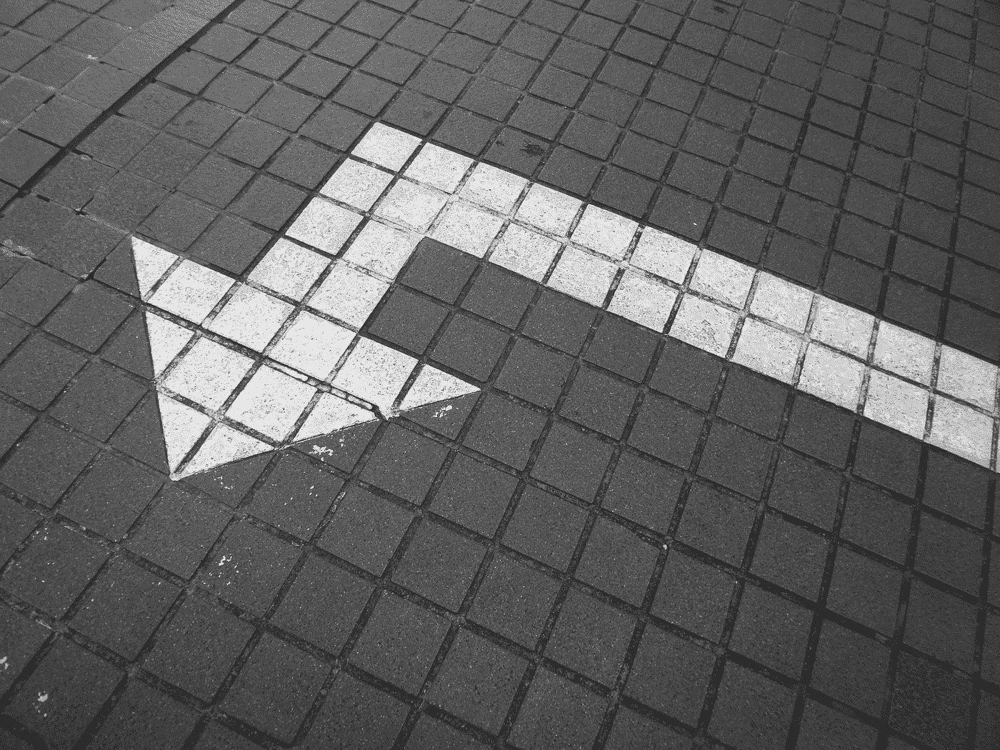
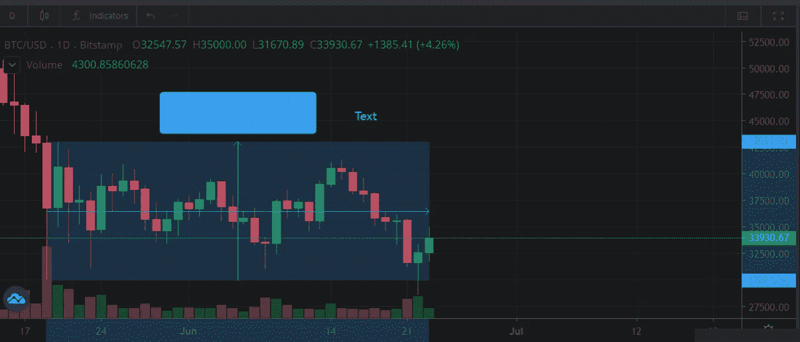

# 比特币的三重底部——给新手加密投资者

> 原文：<https://medium.com/coinmonks/the-bitcoin-triple-bottom-for-the-novice-crypto-investor-bd9d8d252dd1?source=collection_archive---------5----------------------->

Photo by [Possessed Photography](https://unsplash.com/@possessedphotography?utm_source=medium&utm_medium=referral) on [Unsplash](https://unsplash.com?utm_source=medium&utm_medium=referral)

在比特币价格点的定期崩溃和反弹中，即使作为新人，观察价格点和模式也是非常重要的。对于不熟悉加密货币的投资者来说，技术分析可能听起来像火箭科学，然而，重要的是要注意到在相当长的时间内反映的总
涨跌，这与人们在加密交易所看到的短期订单相反，尤其是在比特币方面。

当你是加密交易和投资的新手时，在购买任何其他加密货币之前，知道主要加密货币的底部何时被测试是很重要的。

## 什么是**三重底**？

这是一种视觉模式，在一段合理的时间内观察表明，买方正在从持续的卖方手中控制价格行为。

## **牛 vs 熊解读**

即使在最不稳定的情况下，你也有经常交易者对价格行为有很大影响的例子。观察反映同样情况的总体趋势是很自然的。在三重底期间，通常被视为三个特定低点从一个价格点反弹的模式，在该价格点会出现大量买入，因此充当支撑位。理想情况下，三重底的形成给了买家一个暗示，他们应该在传统市场中看涨。

35 day trading view (Illustrative purpose only) — [Source](https://www.bitstamp.net/market/tradeview/)

谈到加密货币市场，我们已经注意到，就增长而言，当谈到同比分析时，比特币价格已经采取了自然的价格上涨行动。人们几乎很自然地认为，当比特币的采用率
在对采用、使用和效用的猜测中持续上升时，比特币的某些价格底线可能永远不会达到。

你如何在比特币价格预测的内容中寻找实质内容？

无论是熊市还是牛市，从内容创作者和分析师那里寻找可靠的分析，了解幕后发生的实际基本面是非常重要的。

在过去几个月最常用的术语中:

*   死亡十字架
*   阻力(轴承控制)
*   支撑位(多头控制)

与粗略预测相比，这可能很容易发现，即使是可靠的来源和账户也很少陈述明显的数字和预测，这是一个主要的危险信号，因为即使是一个坏掉的时钟每天也是正确的两次。

## **关键外卖**

尽管第二代加密货币承诺了更多的实用性和潜在的可用性和实用性，但有必要知道比特币世界是推动主要趋势和价格点的网关加密资产

限制:谈到秘密市场的不确定性。虽然双底和三底可能是最容易识别的模式，但可预见的模式可能是反映熊市趋势的一致头肩底模式。在做出明智的决策之前，将市场模式与现实世界的趋势和特定资产的采用相关联是至关重要的。

信用到巧用比特币三重底: ***投资答案***

喊出一个可靠的加密教育娱乐内容——数学、金钱和自由]

Current Trends to be wary of (for buyers & sellers)

**参考消息**:不要把以上任何一条当作财务建议，在进入购买价位之前，DYOR(自己做研究)总是很重要的。

**接下来:**以太坊价位趋势