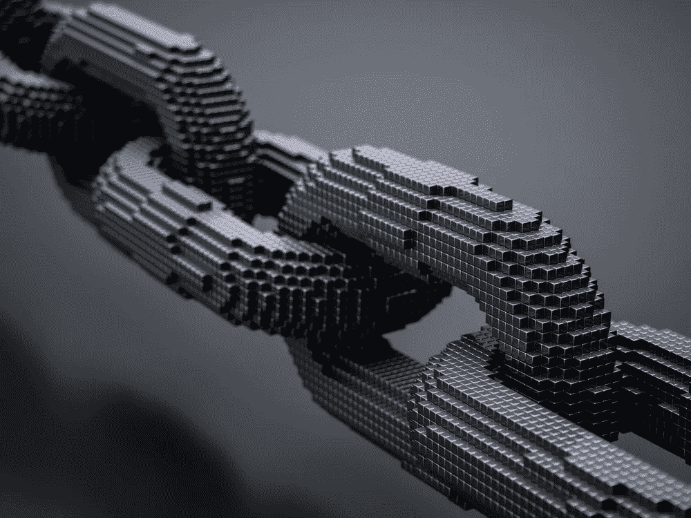
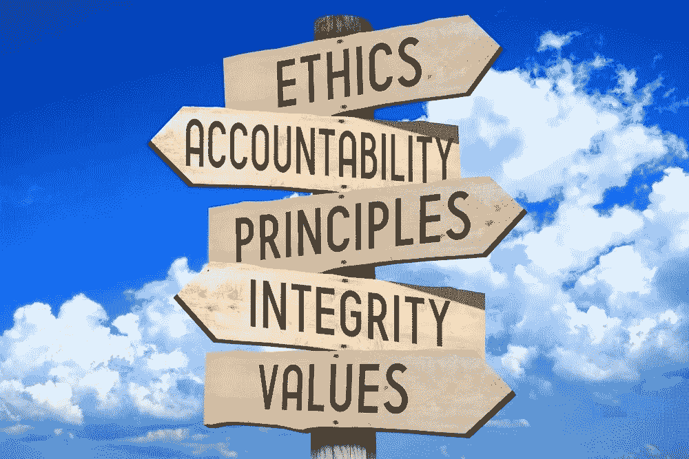

# 比特币的价值

> 原文：<https://medium.com/coinmonks/the-bitcoin-value-ae73cdea202d?source=collection_archive---------10----------------------->

由[罗德里戈·博尔赫斯](https://www.linkedin.com/in/rodrigocaldasborges/)和[亚历克斯·布劳](https://www.linkedin.com/in/buelau/)

由于比特币在过去 12 个月中的升值，加密货币，特别是比特币，已经引起了媒体，特别是金融媒体的大量关注。许多金融分析师讨论了比特币的性质、缺乏金融支持、缺乏控制机构和缺乏监管；但很少有分析师试图提出比特币最近报价达到 1 万美元的原因。价格是由需求决定的，但高需求是否像许多经典经济学家所说的那样，只是反映了对未来价格繁荣的预期，或者还有其他原因？

想象一下，当互联网出现时，人们被允许购买部分技术？有多少人愿意拥有一点点著名的“http”协议，正是它成就了我们今天所知的互联网？那值多少钱？

面对巨大的变化时，大多数人的自然方式是否认它，至少不去深入探讨这个问题。这和比特币没什么区别。用一种传统金融资产的心态去思考和分析比特币，当然会引发对其价值的质疑，但我们面临的是一场技术革命，而且，和任何伟大的变革一样，它需要我们拓宽视野，这样才能看到“新”。

因此，我们建议用适应新奇事物的心态进行分析，让我们理解比特币的真正价值，简要分析其社会、经济和法律方面。

当我们谈论比特币时，我们必须澄清技术有两个基本部分:比特币货币，它运行在计算机的去中心化网络上，官方称为比特币网络(小写“b”)，以及使这一切成为可能的区块链系统。

区块链系统是使比特币和其他加密货币如以太坊、Ripple 等成为可能的技术创新(有超过 1000 种加密货币)，但区块链被证明不仅仅是作为支付系统有用。一些国家和公司已经使用区块链技术来更好地控制公共支出，通过发行代币筹集资金，改善房地产转让记录等。区块链本身已经有了价值，因为它的各种用途和巨大的未来可能性。

因为它是一个开放的系统，比特币和大多数其他使用区块链的加密货币充当了一个平台，允许与我们社会最多样化的部门的任何其他项目和解决方案轻松集成。任何具有编程知识的人都可以使用区块链技术进行交互并开发产品和解决方案，几乎没有任何成本，这使得创新以指数级的规模出现。此外，开源消除了许多通常与集中式解决方案相关的风险和不确定性，因为任何人都可以查看源代码，提出改进建议或识别潜在的安全问题。

作为第一种也是最广泛使用的加密货币，比特币目前被用作该行业的“储备货币”:几乎所有参与加密货币的人都有比特币；所有接受加密货币的服务都接受比特币，其他加密货币的价格一般都以比特币入账。

比特币带来的进步将反映整个社会，因为技术允许广泛的新功能，其中包括消除任何类型交易中的中介，包括金融部门的中介。如今，为了进行金融交易，我们求助于金融系统的实体:我们使用由政府发行的纸币，或由银行控制的数字货币，它们充当中介。

金融机构和政府通过部门监管和控制，享有社会的信任，可以在支付和转移资源方面进行调解。他们负责确认和核实以电子方式进行的所有金融交易，避免“双重支出”的风险，确保资金确实从一个人转移到另一个人，并对交易中出现的任何不一致或问题作出反应，这些服务往往收取高额费用。政府经常滥用这种权力，比如 1990 年巴西政府冻结储蓄账户，以及一再发生的困扰巴西的腐败案件。

利用金融系统，在当前的模式下，我们放弃了我们的绝对自由，将信任委托给公司/经济集团。在过去，别无选择，因为需要一个集权代理人，这总是会造成滥用权力的风险。但是，正如互联网使获取信息民主化一样，区块链也使进入金融市场民主化。

通过区块链，比特币解决了“双重支出”的问题，无需中介(金融机构在“传统”交易中的作用)，消除了银行的信任因素，或者更确切地说，赋予了每个比特币持有者以微不足道的成本自由进行转账的权力，无论价值如何，没有限制。这项技术将曾经局限于物理操作的自由带到了数字世界。我们再次成为唯一对我们的态度负责的人，唯一对控制我们的财富负责的人，而不需要一个中央集权的机构。

一些分析师表示，比特币是一个泡沫，他们的分析基于传统金融市场的技术问题。现实情况是，没有人确切知道我们是否正面临金融泡沫，但从技术、社会、经济和法律的角度来看，我们无疑正面临一种范式转变，这种转变将继续增长和发展，即使这种所谓的金融泡沫已经溢出。

从硅谷到莫斯科，从德国到非洲，世界各地的创新者正在利用区块链、比特币和其他加密货币创建公司、项目和旧问题的新解决方案。2017 年，世界各地的公司利用 ICOs(初始硬币发行)筹集了超过 30 亿美元的投资，ICOs 是一种利用加密货币为新想法和项目融资的融资形式。

因此，比特币的巨大价值是创造了一个充满动力的人的网络，他们相信更美好的未来，在这个网络中，规则对每个人都一样，信息透明，权力分散，好主意很容易执行、融资和奖励。

*   最初由汤森路透于 2017 年 12 月发布了[葡萄牙语版本](https://www.slideshare.net/slideshow/embed_code/key/yuIiNvh8sS3JFM)

____________________

[罗德里戈·卡尔达斯·德·卡瓦略·博尔赫斯。](https://www.linkedin.com/in/rodrigocaldasborges/)OAB(巴西律师协会)/SP-pinh eiros 创业委员会主席。LLM-Lucas de Lima 和 Medeiros Advogados 的合伙人。区块链学院区块链和网络设计专家。他目前在牛津大学赛德商学院学习区块链战略专业课程。INSPER 公司法律硕士。INSPER 的数字法律和创业专家。FGV/标准普尔并购专家。PUC 圣保罗天主教大学法学学士。

亚历克斯·米切里斯·布劳。，全球最大的 ICO(首次公开募股)网站 Coinschedule.com 的首席执行官兼联合创始人。作为加密货币的早期采用者，他自 2013 年以来一直是比特币矿工，并参与了多种加密货币的开发，包括 NXT 和 Waves。

> [在您的收件箱中直接获得最佳软件交易](https://coincodecap.com/?utm_source=coinmonks)

