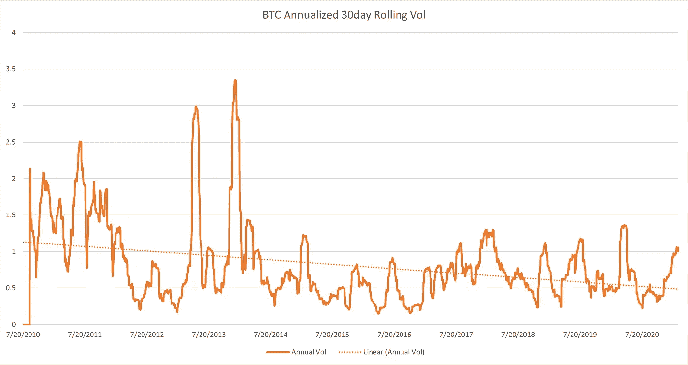
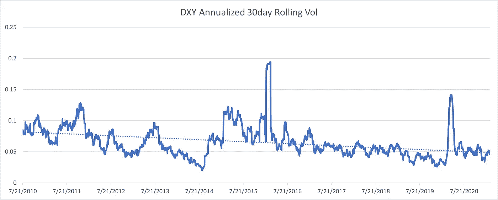
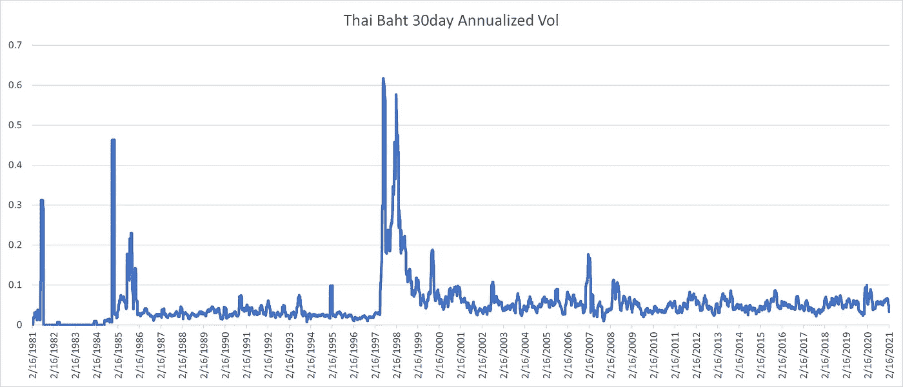
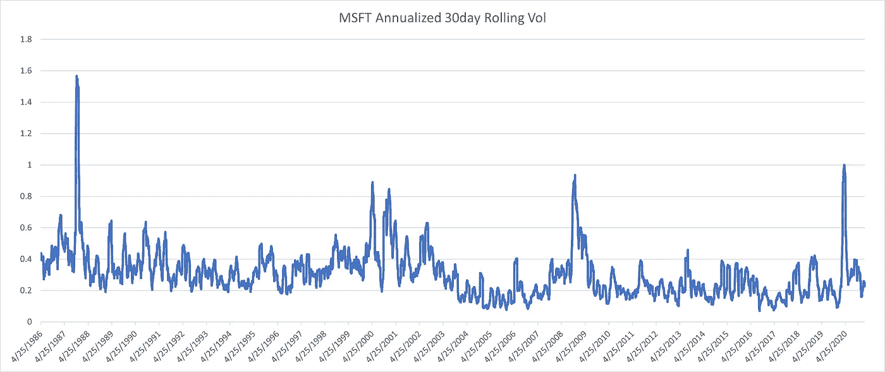

# 比特币波动问题，以及可能的解决方案

> 原文：<https://medium.com/coinmonks/the-bitcoin-volatility-problem-and-possible-solutions-fa030e61e447?source=collection_archive---------2----------------------->

## BTC Vol 问题能克服吗？

BTC Log Returns

比特币无疑是历史上最重要的经济实验之一。它代表着由财政鲁莽的政客领导的世界的希望。但是，为了成为一种接近实用的货币，比特币必须跨越几个逻辑障碍。它的波动性和无尽的不确定性目前使它不适合作为好货币。

随着时间的推移，它能克服这些障碍吗？让我们来看看一些图表，看看比特币还能走多远。我在这篇文章中包含了我的 Excel 工作簿中的数据，它链接在本文的末尾。

## 波动性问题

如果比特币能够成为一种实用的货币，它的价值**已经**稳定下来。长期合同依赖于货币的稳定性来满足所有相关方。

换个角度来看:比方说，去年，当比特币的价格刚刚低于 8000 美元时，你申请了一笔比特币贷款。今天，当我在 2021 年 2 月写这篇文章时，你的债务已经增加了 7 倍多。你从价值 8000 美元的债务到现在欠了 58000 美元。事情就是这样的。这是政府喜欢货币贬值的主要原因之一。通货膨胀，或者说货币的*贬值，使得偿还债务变得非常容易。通货紧缩，或者说*升值，使得偿还债务变得更加困难。**

一般来说，随着时间的推移，*升值*的货币比*贬值*的货币更实用，但是通货膨胀和通货紧缩都会削弱资产作为货币的作用。

在比特币的生命周期中，波动性一直呈下降趋势。但这也包括比特币的发现期——在 2013 年左右，比特币从接近 0 飙升至三位数的最初阶段。但是如果我们看一下过去 5 年，我们会看到相反的情况:

The standard deviation of 30 days of daily log returns multiplied by the square root of 252 (number of trading days); this is the standard way of calculating vol in finance. Data included in attached workbook. Average vol: 0.805040772\. Confirmed by [https://www.buybitcoinworldwide.com/volatility-index/](https://www.buybitcoinworldwide.com/volatility-index/)

Seeing a slightly increasing vol over the last 5 years.

这是有道理的。[比特币的交易量](https://www.blockchain.com/charts/n-transactions)随着时间的推移呈上升趋势，交易量的增加往往会增加波动性，这在金融界是一个众所周知的现象。这并不是说这是一条规律，而是一种现象— *它往往会发生。*一般来说，成交量的增加=波动率的增加。

那么，与其他货币相比，这一数量如何呢？美元呢？

DXY average vol over BTC’s existence: 0.064585031\. BTC vol: 12.5 times higher.

平均而言，比特币的波动性是美元的 12.5 倍。

尽管政客们竭尽全力让美元贬值，但与其他货币和商品相比，美元还是相当稳定的。

## 关于收养的概念

概括常见的比特币最大化论点，他们声称，一旦比特币接近或达到“*采用*”，价值应该开始稳定。

似乎没有人清楚地知道“*领养*是什么意思。如果“采纳”的意思是，“T2”被政府接受并强制执行，那么这个论点也许有坚实的基础。但这是极不可能发生的。我倾向于认为，许多政府会发动战争，甚至可能对自己的公民发动战争，或者颁布奥威尔式的商业管制，然后才允许自己的货币被他们几乎无法控制的东西取代。正是国家货币赋予了政府对其民众的财政权力。我们永远都不应该低估他们为了确保这一点会走多远。

更进一步，目前比特币用户总数约为 1 亿，比特币钱包约为 2 亿，(如果 [*本来源*](https://www.buybitcoinworldwide.com/how-many-bitcoin-users/) *的数字正确*)。

仅从用户来看，比特币用户就相当于地球上人口第 15 多的国家。如果“*采用*”是指某个最佳用户量，(*没人敢具体说明*)，那有没有可能我们已经过了那个假设点？

**真的是用户数量，以及由此产生的套利让一项资产变得稳定吗？**

我过去是这样认为的，但我现在相信事情可能比那更复杂。有些货币的用户少得多，总估值也比比特币低得多，但它们保持着比 T21 稳定得多的价格。

Thai Baht average vol over BTC’s existence: 0.048984\. BTC vol: 16.4 times higher.

例如，泰铢占外汇交易的 0.5%，而泰国本身只有大约 7，000 万人口。

根据 blockchain.com 的比特币交易量数据，2020 年比特币交易量为 6265.1 亿美元

根据来自 bis.org 的[报道](https://www.bis.org/statistics/rpfx19_fx.pdf)，泰铢在 2019 年的外汇交易量约为 320 亿美元。

这意味着比特币的交易量大约是泰铢的 20 倍。然而，比特币的波动性仍然是泰铢的 16.4 倍。

根据[coinmarketcap.com](https://coinmarketcap.com/fiat-currencies/)，**比特币目前是全球市值第 14 大的货币。**泰铢是#16。

**泰铢甚至比美元稳定 1.3 倍**，**尽管美元占全球贸易的 80%以上！！**

这似乎打破了总套利往往会带来稳定的想法。稳定似乎比我们想象的要复杂得多。

## 比特币固有的不确定性

你到底如何评价一个可能是任何东西的东西？

给一块煤定价非常简单。煤炭具有某些化学特性，这使得它非常适合加热和燃烧——但你不能用它来打造一把剑，你不能用枪来射击它，你可能不应该吃它，你也不能在网上储存它。它具有其存在所固有的物理属性；这些属性可以操作，但不容易改变。它有明显的局限性。

正如投资者吉姆·罗杰所言，在对大宗商品进行估值时，你真正需要知道的唯一一件事是，它是太多了，还是太少了？也就是说是过剩还是短缺？公司是更抽象的概念，它们是*势能、*，因此更难估值。数以百万计的指标被用于评估公司，从市盈率，到每股收益，再到每股自由现金流的*。*大宗商品的情况就不一样了，大多数大宗商品指标只是简单的供求指标。苹果可能不会一直存在，但另一方面，黄金是坚不可摧的。

比特币支付网络可以无休止地分叉。这项技术将继续发展。从这个意义上说，对比特币进行估值与试图对一家公司进行估值没有什么不同。

比特币具有内在的不确定性，投机者意识到了这一点。**这种不确定性提供了一个永无止境的做空理由，**创造了股票往往会经历的同样的波动引擎。

这就引出了一个问题，我们曾经尝试过把股票当作货币吗？嗯，有点吧。一个著名的例子来自法国 1720 年的密西西比泡沫，这是历史上一个迷人的时期。经济学家约翰劳说服法国政府购买他的密西西比州公司的股票，作为为国家巨额债务再融资的计划。政府随后开始发行纸币，可以兑换成黄金和白银。但是这些纸币并不是真的基于黄金或白银，它们主要是基于密西西比公司的股票。政府将购买密西西比公司的股票，这将鼓励投资者也购买股票，这将允许劳出售更多的股票；然后，他可以用这笔资金为法国债务再融资。

该计划以法国货币的恶性通货膨胀而告终，大约 50 人在惊恐的法国公民争先恐后地将纸币换成白银时被踩死。

然而，与市场上一些最受欢迎的股票相比，比如苹果和微软，比特币的成交量如何？

MSFT average vol over BTC’s existence: 0.236702\. BTC vol: 3.4x higher.

AAPL average vol over BTC’s existence: 0.264055\. BTC vol: 3.04x higher.

苹果是目前世界上最有价值的上市公司，它的波动性比比特币小 3 倍。鉴于比特币与苹果有着类似的不确定性，这可能是我们对比特币随着时间推移可能获得的任何自然稳定性所能期望的最好结果。

作为一种货币，苹果股票表现如何？

就稳定性而言，它目前比比特币更好，但自 2016 年以来，苹果股票每年都接近翻番。你想看到你的债务每年翻倍吗？

## 竞争性货币的交易

竞争性货币是一个必要的进化过程，但它们并非没有权衡。加密货币市场已经成为一个高度竞争的领域，一个巨大的思想实验室。从长远来看，这将如何影响比特币？

通常，相互竞争的货币会降低彼此的价值。

货币市场是零和游戏。这与大多数市场形成鲜明对比，但货币有一个非常独特的属性:只有在所有人都同意的情况下，它们才会运转良好。因为所有货币本质上都做同样的事情，所以没有理由持有多种货币。因此，当一种货币上涨时，另一种货币往往会下跌。

相互竞争的货币也会让会计成为一场噩梦。会计必须有一个固定的衡量价值的点；这是易货经济的主要问题之一。如果会计试图确定公司在月底是否盈利，他们发现他们拥有 3 头牛、2 只鸡和一头牛，但他们交易了 30 盎司铜和 50 磅铝，他们创造了多少价值？只是因为我们太习惯于像美元这样的固定点，所以我们可以直观地做出这种估计。这种固定的价值点随着货币竞争的加剧而降低，这就是为什么一种普遍接受的货币对一个社会是有益的。

外汇交易员对这种现象很了解。一些交易员就是这样发财的，买入一种货币，同时做空另一种货币。

当然，这种竞争无助于缓解比特币的波动性问题。我们不知道密码战会持续多久。**是什么让比特币免受杀死 Myspace 的同样现象的影响？**

从长远来看，理论上更稳定的加密货币应该会得到更广泛的使用。我得到的印象是，[美联储也有同样的想法](https://lending-times.com/2018/05/14/solving-cryptocurrency-volatility-with-hedge-lending/)，这就是为什么他们没有将比特币视为对美元的威胁，但他们似乎认为比特币是。

加密货币市场的超竞争格局将导致重大破坏；它将会以牺牲金钱的核心原则为代价来改进技术，成为一个稳定的、公认的交易媒介。

## 可能的解决方案

我不是第一个解决这个问题的人，但我似乎是少数人之一。关于这个问题的绝大多数思想家似乎都认为这个问题会随着时间的推移自行解决。我完全承认这可能只是一个基于时间的问题，我的立场是这是极不可能的。

假设说，即使这是一个随着时间推移会自行解决的问题，你真的认为美联储在那之前不会有自己的加密货币，他们不会强迫你使用它吗？记住，货币市场是一个零和游戏；如果美联储在比特币的 vol 问题解决之前发行自己的密码，这对比特币来说一点都不好。

我遇到的一项服务可能有助于缓解这个问题，这是一家名为 Digits 的公司推出的对冲贷款服务的概念。明确一点，我根本不隶属于这家公司；我从未和这家公司的任何人说过话，这只是我遇到的为数不多的解决方案之一。[这里有一篇关于概念](https://lending-times.com/2018/05/14/solving-cryptocurrency-volatility-with-hedge-lending/)的文章，它本质上为每一笔交易创造了自动债务义务，这样交易中的任何波动都可以随着时间的推移而得到偿还，(*或者至少是我对它的理解)。*

但我不认为这是最好的答案。债务仍将受到波动性问题的影响。到目前为止，我还没有找到一个很好的答案，但我一直在思考智能合约自动对冲的可能性。

需要说明的是，我还没有完全充实这个想法，事实上我甚至不确定它对比特币是否有意义。基本想法是这样的:如果你买了一只股票，然后你做空这只股票，会发生什么？完美的稳定性。你的头寸价值没有增加或减少，你的头寸保持在你买入股票时的价格。这被称为 [*做空盒子*](https://www.investopedia.com/terms/s/sellagainstthebox.asp) ，它曾经是完全合法的，但监管机构讨厌任何可能通过税收减少你的财富提取的事情，所以它在几年前就被禁止了。

这个概念可以应用于比特币 vol 问题吗？我真的不知道。如果你认为我错了，或者你有其他可能的解决方案，或者你和我一样对这些想法着迷，请随时和我联系。我很乐意和你联系。

[这里是我在本文中使用的 Excel 工作簿](https://drive.google.com/file/d/1WPc6TjI-CKH2FXeeiL4XuHcWUXphInfG/view?usp=sharing)。希望你喜欢。