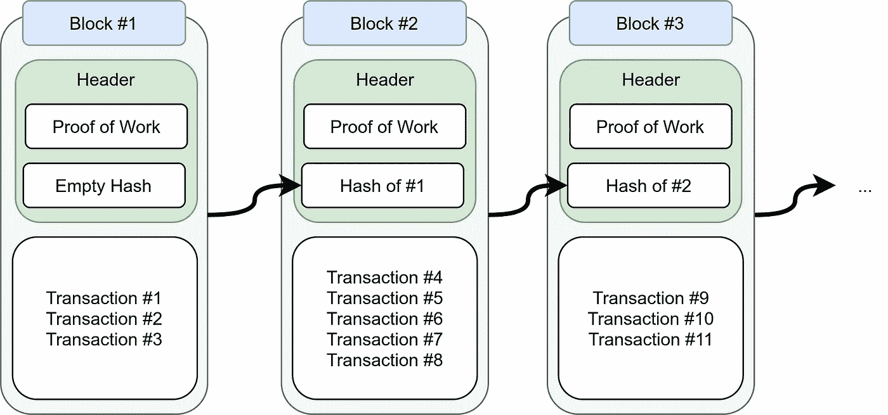

# 区块链

> 原文：<https://medium.com/coinmonks/the-blockchain-473aac352e5?source=collection_archive---------2----------------------->

## ₿区块链、比特币及相关概念介绍

An example of a blockchain. Image by Martin Thoma.

比特币最近首次突破 40，000 美元，因此它再次成为新闻。比特币只是最知名的**加密货币**。这是一个使用**区块链**的应用程序。在本文中，我将带您了解区块链和加密货币的一些核心概念。这篇文章是为初学者写的，在某些方面有点松散…