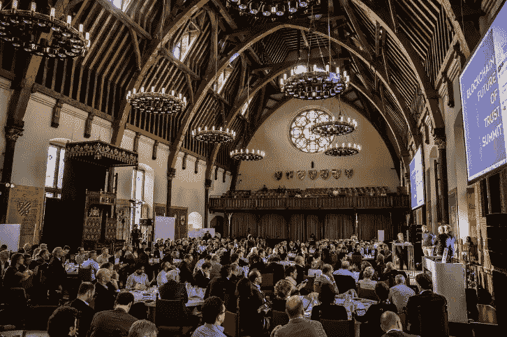
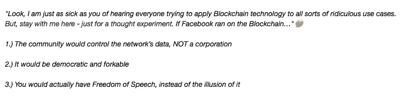
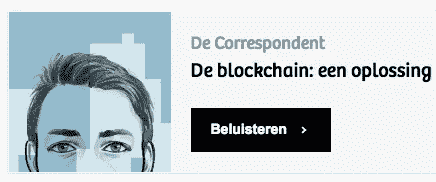
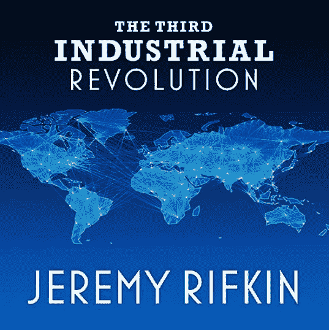
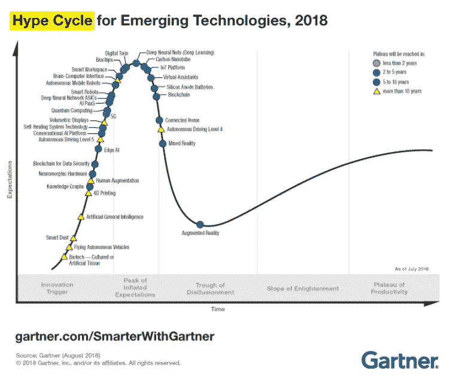

# 区块链:一个解决方案…

> 原文：<https://medium.com/coinmonks/the-blockchain-a-solution-ba43010f5eaf?source=collection_archive---------3----------------------->

[**Hall of Knights in the Hague**](https://twitter.com/blockchaingers/status/913825718605316097)

我觉得有义务对上周出现在荷兰媒体*(【记者**)*上的[篇文章做出回应。记者写了一些关于区块链的有趣用例，但是把它们完全放在一起*(如果你问我..【过于消极】以*的语境来看待世界。此外，我认为他应该在这个问题上多做一些研究。](https://decorrespondent.nl/8628/de-blockchain-een-oplossing-voor-bijna-niets/331703460-7aae193b)

> *在这里你可以找到我文章的* [*荷兰语版*](/@bertbosman/de-blockchain-een-oplossing-5fee75d8570b)*……*

作者以他拜访封锁者的故事开始了他的旅程。最大和最具挑战性的黑客马拉松来自欧洲，正如组织者自己也 [**形容它**](http://www.dvhn.nl/economie/De-wereld-kijkt-naar-Groningse-blockchain-hackathon-met-een-ton-aan-prijzengeld-23050281.html) 。(Y *es，部分链接来源于荷兰，抱歉；)*。我认为这个活动是让格罗宁根出名的好方法。不幸的是，我自己不能参观黑客马拉松，但是在这个活动的筹备阶段，组织了各种“深度潜水”，我可以参加。我认为你可以未经许可参观这些活动是非常酷的。如果你是区块链和密码爱好者，那当然…

深度潜水是探索“区块链技术”在不同专业领域的影响和可能性的聚会。我所见证的是一种连接荷兰商业世界和加密领域创新者的绝佳方式。接下来是一个非常有趣的探索，探索这种新技术可以在哪里实现，以及寻找实际上可以用它做什么。

Vinay Gupta *(看看* [*他的介绍*](http://www.youtube.com/watch?v=5g3DJgG91xc)*；)*举例来说，在一次深度潜水中，对“[全球数字身份](https://blockchaingers.org/events/global-digital-identity)的主题进行了检查。他的公司 Mattereum 正在开发一个解决方案，确保用数字身份做生意的方式。在我看来，在这个数字时代，这是一个非常方便的用例。毕竟，我们的身份不再仅仅存在于我们的护照和驾照中。我们的“数字身份”越来越与我们在离线世界中的身份融合在一起。

鉴于通过万维网发送信息正变得越来越容易受到安全问题的影响，而且当你的证件放在护照上时，你可以向海关官员出示这些证件，对我来说，我们在这一领域的“在线”进展似乎非常重要。要是有解决这个问题的方法就好了。当然..区块链可能是它。但是…

> 为什么我们需要一个分散的区块链协议来保护我们的数字身份？

嗯……‘美国荷兰人’……在国外旅行时可能没那么痛苦，但问问一个难民，他对中央政府控制他或她在这个世界上的存在有什么看法。我想每个人都可以想象这样的事情是一个相当大的问题。区块链为我们提供了一个绝佳的机会，为人们提供一个全球性的替代解决方案。

> 你不应该仅仅从当地的角度来看待区块链的发展。

“身份”是一项基本人权。一个不能留给中央党的权利，据[**Tykn**](https://tykn.tech/)**也。我真诚地同意他们的观点，我们的记者也应该同意。你几乎可以说[这篇伟大的文章](https://decorrespondent.nl/8117/we-hebben-een-groot-probleem-met-facebook-en-dat-gaat-verder-dan-privacy/249646452-4d450a04)早些时候*(正如我们从他们那里所习惯的；)*主要是关于我们的数字身份和围绕它的信息。脸书现在在很大程度上控制着这一切。**

**此外，对于他们在文章中描述的许多其他危险，现在有了区块链替代品。大型中央集权公司对我们的社会是一种威胁。期。他们迫切需要颠覆。在任何情况下，如果我们有选择的余地，那将是非常受欢迎的，因为…现在就有…可用！去试试 [**Blockstack**](/coinmonks/earning-bounties-by-participating-with-your-own-decentralised-blockstack-browser-535c864a107) **这款全新的去中心化浏览器吧。这是一个很酷的新工具，它之所以成为可能是因为..区块链！这已经很顺利了吗？不，还没有，但它正在开发中，现在我们有一个选择。有了它，你还可以访问一个分散的 [**Twitter**](http://afari.io/) **…在那里你可以用你自己独特的分散块堆栈身份登录。**非常酷。****

> **“在荷兰，没有一个部门不依赖于一个或多个这样的平台。最重要的科技公司——谷歌、脸书、亚马逊、苹果、微软——构成了我们新的在线基础设施。想想搜索引擎、地图、云服务、识别和登录系统、应用商店等等...这些是商业产品。私人基础设施越来越多地由商业价值而不是公共价值来界定。还有学校、媒体和医院等公共部门。”...据记者报道。**

**所以。在身份认同这个主题上，已经有许多方面在努力寻找解决方案，但在其他专业领域也有许多进展。例如，无数的区块链团队正在致力于保护隐私。我对[地平线](https://horizen.global/)很感兴趣，但是还有很多。欧洲隐私立法也是向前迈出的一大步，当你使用区块链技术时，没有人说这些规则不再适用。但是作为最终用户，你必须非常小心地与这项新技术互动。伴随着区块链的参与，也伴随着巨大的责任。但是……在这个我们在互联网上相互交流的数字时代，不就是这样吗？**

**为了保持对我们数据的控制，已经有[个不同的应用程序](/coinmonks/the-ten-most-interesting-blockchain-apps-on-my-iphone-eeccc4f11a5e)需要发现。是的，当然还有很多工作要做。这也是为什么对拥有这方面技能的开发人员有巨大需求的原因。除了记者公正地认定的区块链炒作之外，这个空间也在[蓬勃发展](https://twitter.com/ethereumJoseph/status/968212395222093824)，因为那里有潜力。人们可以参与无数的倡议[无需许可](/coinmonks/being-an-ambassador-10-best-projects-so-far-38c05c85782)。你甚至不需要成为一个开发者。区块链为每个人而存在…**

**Vinay Gupta 的 Mattereum 正在研究在现实物质世界的数字资产、服务和产品之间建立联系的立法和技术方面。我想知道作者是否也去和所有这些创新者聊天了。他是否结合区块链研究了所有这些非常具体的专业领域？我真心质疑他到底有没有在网上看一些[视频](https://dlive.io)。**

**是的，当然这些都是复杂的主题。没有现成的完美解决方案。任何发生在区块链系统之外的事情都容易腐败。在区块链可以有所作为的许多领域，都存在巨大的障碍，但每天都在取得进展。**

****

****From an article of** [**Loom Network**](/loom-network/sick-of-zuckerberg-pimping-you-out-the-blockchain-might-be-your-savior-eae1e84b7285?__s=5it4hvsusz2gpaztmzmx)**…****

**像记者向我们指出的那些数字公司是世界上最大的，这不是巧合。所有这些公司都在互联网上开展业务，并使用我们的数据。如果有一种方法可以让我们把那些集权公司的控制权掌握在自己手中，那会怎么样？嗯……这是显而易见的，但是是的，区块链会处理好的。我们现在可以用自己的数据交易，而不是复制它。你也应该看看区块链大师安德里亚斯·安东诺普洛斯制作的视频。聆听并了解 [**价值互联网**](http://www.youtube.com/watch?v=6xIq0FdmsIA&t=20s) 的时代。我可以全心全意地向记者推荐这一点，我期待着一篇关于这个主题的新文章！**

****政治和媒体****

**在过去的几年里，我听说了很多关于区块链的事情。谁没有呢？到处都是。**

**这就是为什么我决定从去年八月开始全身心地投入到“区块链技术”的研究中去。2017 年 9 月，我参观了我们在海牙 的 [**骑士堂(在同一个 Blockchaingers hackathon 开始时，*);聆听我们的皇家王子康斯坦丁二世。这位“初创企业真的能有所作为”的王子也看到了尝试新技术的可能性。我们当时的安全和司法部长 Stef Blok 也在场。他主要谈到了创新的重要性以及它给不同代人带来的不同。他还谈到政府作为企业家和科学家避风港的作用。不，这不仅仅是关于几个学生正在开发的由 Zuidhorn 市政当局开发的***](https://futureoftrust.eu/#home) ***[**1 app**](https://media.consensys.net/40-ethereum-apps-you-can-use-right-now-d643333769f7) 的重要性，记者在他们的文章中提到了这一点。但是当然它确实从那里开始！*****

**我听说 Stef 的梦想是…**

> **“……我们的社会将使我们能够像过去一样，随着技术进步的发展，向前迈出同样的步伐。”**

**如果媒体给我们提供关于那些新技术的不准确的报道，那是没有帮助的。Zuidhorn 的学生非常明确地报告说，在将这项新技术应用到他正在制作的应用程序时，有些事情并不顺利。媒体不也有责任给我们一个正确的报道吗？等待..如果区块链能为我们提供一个解决媒体问题的方案会怎么样？**

**我认为，我们拥有像荷兰的 Zuidhorn 这样的城市是非常重要的，在那里创新正在被接受。有一些实验。他们的所作所为会出现在新闻中。他们正在参与！如果后来对发生的事情有不好的报道，如果没有做任何“后续”报道，那么在我看来，媒体是罪魁祸首。**

**是的，Zuidhorn 的创新政策当然值得称赞。他们一头扎进新的可能性，并试图有所作为。太好了！即使一开始没有做好，他们仍然值得表扬。即使你一开始找不到应用程序的正确用途，你也应该为自己的创新付出代价。哦，等等..他们还得到了 2018 年 **的那个 [**奖！**是的，有时候这些先驱者不得不走错一点方向。有时你不得不去尝试用一辆](http://www.gemeentepioniers.nl/)**的叉车把六罐啤酒放在柜台上……*(这是引用记者原文中的一段话；当事情不可能或不像你计划的那样实现时，你可以再试一次…一次又一次…直到你做对为止。在我看来，这就是实验的全部意义。*******

> ****是的…大型中央集权公司对我们的社会是一种威胁！****

****我很高兴看到[区块链者](https://futureoftrust.eu/#home)将于明年回归。我很高兴生活在一个我们可以自由尝试所有这些新可能性的国家。我认为，如果我们不试图在前门阻止颠覆和创新，或者试图用监管来控制它，这对荷兰的发展非常重要。这对初创企业来说可能是一个障碍，可能没有足够的发展空间。当监管是在我们不知道自己在谈论什么的情况下制定的，它可能会更加有害。****

****为了做出好的决定，我们必须从为我们的国民意识提供好的信息开始。我们必须传播让这些技术与众不同的知识。我们必须了解它的能力。因此，知道我们写的是什么也是非常重要的。我知道这并不容易。区块链的空间是复杂的，我也仍然在寻找一个清晰和适当的路径通过这个新的世界。****

****不过，在我搜索区块链时，我很快发现媒体上写的东西通常与我的发现不符。许多记者忽略了全球发展。他们大多从怀疑、不信任和炒作的角度写作，而不是出于好奇。我认为这是一次错失的机会，也是对投入其中的精力的浪费。****

> ****如果你也有兴趣加入我们寻找关于“区块链”技术的知识，欢迎参加我们周二在 [Blockdam](http://www.meetup.com/nl-NL/Permissionless-Society/events/254194479/) 的共同工作！！！****

********

******This is the part of the title of the Dutch article that was correct.. ;)******

******全球视角******

****不，区块链不是数据库，也不是增强型电子表格。****

****区块链是一种在不同地方同步全球数据库的方式，任何人都没有能力改变已记录的内容。****

****这是一个**的根本变化**在我们与互联网合作的可能性。唯一正确的方法是让系统自己打印一枚数字硬币。“我们甚至可以用它来解决中央银行的问题！”****

> ****“我们可以用它来解决中央银行的问题！”****

****这是维奈·古普塔演讲中的一段话，我之前已经分享过了。他认为区块链也是解决其他全球性问题的便利工具，比如贫困和气候变化。在我看来，记者更有理由对此感兴趣。是的，区块链的发现可以导致**全民基本收入**。也是一个相当有趣但是 [**难以完成的想法**](https://decorrespondent.nl/6705/zo-maken-we-het-basisinkomen-werkelijkheid/257773725-c5393c4c) 不是吗？；)呃..顺便说一下，记者先生。难道我们不应该回到在我们的世界里有更多的乌托邦的想法上来吗？维奈说，因为区块链奖给了我们一个机会，让人类对我们正在做的事情有一个更好的全球视角，我们可以解决这些全球问题。对我来说，这是看待这项新技术的完美视角。顺便说一句，那也不是乌托邦。这是一个非常实际和现实的机会。****

> ****我们必须从远处，从不同的专业和科学领域来看待这个世界。这是记者的文章中完全没有的观点。如果你谈论区块链及其演变，你不能只从国家的角度来看…****

****它是如何工作的？****

****区块链的发现导致了 2009 年 1 月 3 日比特币的诞生。创造者*中本聪*足够聪明，他意识到几个重要因素将决定他创作的成功。其中之一就是他*(或者她，或者他们？；)*会保持匿名。事后看来，这也是一个非常有用的技巧，可以从[的全球剃刀刀片](https://en.wikipedia.org/wiki/Guillotine)中拯救自己的脑袋，但这还有另外一个原因。****

****如果有一个**去中心化的自治组织** *(道的，也是的一个小发明；)*只能以一种方式证明自己，即，不受一个中心实体的指导。是的，矿工们正在解决一个非常复杂的难题，以确保网络安全，但在一个设计良好的分散系统中，他们永远不会有任何监督或控制。他们的角色是确保交易被发送、验证和保护。矿力越多，安全性越大。这并不意味着当网络被更多地使用时，也就需要更多的矿能。媒体在这一点上通常也是错误的。因为采矿机器已经达到了它们的最大能力，一些真正的大型矿池所拥有的“能量”已经在回来的路上了****

****新闻界讨论的另一点是，(比特币-)挖矿耗费大量能源！这也是从旧经济的范式来看的，在我看来，这是一种非常狭隘的范式。这是一种误解，将会看到长远的曙光，因为首先，采矿正在使用能源，因为[已经在生产](https://thenextweb.com/hardfork/2018/08/28/bitcoin-drives-energy-innovation/)..其次，嗯… [**比特币可能是世界正在等待的**](/@bartvanmaarseveen/bitcoin-is-the-energy-saver-the-world-is-waiting-for-2731e98ea22d) **节能器。******

****另一个误解在于协议的制定。由于其强大的价值，开发在意图上是缓慢的…有时我们的世界不得不等待问题的解决方案，例如可伸缩性。实现某些已经存在的解决方案需要时间和精力。).去年，在繁荣时期，交易时间和成本非常长，如果与比特币做生意的各方实施了 T2 协议，这本来是可以避免的。因为观众的兴趣，他们只是还没有时间去做。****

****目前正在部署的闪电网络将使在这个巨大的万维网上进行小额支付成为可能。这是一项全新的技术，也是一项相当特别的发明。不，它不是一个基于比特币的中央数据库！它是以去中心化的价值观为核心发展起来的。你可以[深入研究一下](https://bitcoinmagazine.com/articles/understanding-the-lightning-network-part-building-a-bidirectional-payment-channel-1464710791/)，但是我先警告你。即使经过深入研究，理解起来仍然很复杂。我期待着我们的记者将来能就此发表一篇文章！😉****

******优点******

****对于我们当中的富人来说，比特币作为一种交易媒介非常有趣。人们已经在用这种数字货币购买房子和昂贵的汽车。它可以带走这些购物的喧嚣。这也是一个开始革命的好方法，“精英”也可以参与！****

****作为荷兰人，我们很难理解这一点，但在世界的其他地方，仍然有穷人会把钱交给巴士司机，寄给国外的家人。这些人会发现[是比特币的完美替代品](http://www.cnbc.com/2018/08/27/next-bitcoin-gold-rush-may-be-happening-in-khayelitsha-south-africa.html)。现在在发展中国家有许多 T2 实验。是的，一部可以处理比特币交易的智能手机大约需要 20 欧元，这是[一个真正的大障碍](https://blog.humaniq.co/getting-into-african-users-minds-the-research-that-drives-the-humaniq-app-42e53dc56212)当然，但也是真正的[进展](https://humaniq.com/)在世界上许多地方。哦，顺便说一句，如果你不信任自己的国家，并且你在过去经历过各种恶性通货膨胀，那么比特币可能会成为一个非常有趣的选择！****

> ****我们的世界正以非常快的速度获得更多的智慧。是的，区块链是一个范式的转变，但当然，你必须知道在哪里可以看到它…****

********

****[**The Third Industrial Revolution: A Radical New Sharing Economy**](http://www.youtube.com/watch?v=QX3M8Ka9vUA)****

****这部纪录片是一个非常有趣的介绍。虽然提到了区块链技术，但它与区块链没有任何关系。然而，它确实把这项技术放在正在发生的事情的更广泛的计划中。尽情享受吧！；)****

*****“从‘Mijn Zorg Log’的最终报告来看，让区块链技术如此有趣的所有东西都没有被使用。一些团体被直接指出为独占的挖掘者，换句话说:他们可以否决对数据库的添加，在这种情况下是“产妇护理数据”。报告称，这更有利于环境，也不违反隐私法。但是，从现在开始，我们可以没有这些可信任的第三方，这难道不是区块链的全部意义吗？他们在那边做什么？这不是承诺的“指数创新混合物”，对吗？正如卫生、福利和体育部的最高官员 Erik Gerritsen 后来在推特上说的那样…“*****

****不，的确。**一个提供分散解决方案的中央党**，有点奇怪。任何人都可以看出这里有矛盾。尽管有许多公司也可以从区块链解决方案中受益。只要你看看它们的运作规模，你就能看到巨大的可能性。就连**银行业也通过应用区块链技术在不同领域取得进展。******

*******“与此同时，据* [*彭博*](http://www.bloomberg.com/news/articles/2018-07-31/blockchain-once-seen-as-a-corporate-cure-all-suffers-slowdown) *估计，Blockchain 的全球市场规模约为 7 亿美元(约合 600 亿欧元)。像 IBM、微软和埃森哲这样的大公司都有探索这项革命性技术的完整部门。”*******

******这确实不是一个小市场。很可能这些投资最终不会产生真正的分权解决方案。真正的发展大多发生在 [**表面之下**](http://www.tdameritrade.com/blockchain) 。这是开发人员乱搞的地方。区块链技术的真正力量需要数年才能起飞，尤其是在全球范围内。不过，这些投资会有后果。会有发现，应用会蓬勃发展。从这个角度来看，密码本身只是一个巨大的实验！******

******好吧……再多几个可能性……我们就快到了。******

****“智能合同”一词早在 1994 年就已经由尼克·绍博(T21)发明了，但是随着区块链技术的发展，这个领域又增加了一个全新的维度。这些“智能合同”的无数可能性是什么？在以太网和比特币等平台上(以及许多竞争对手；许多人正在探索这项新技术。我们什么也没看到！****

****“对区块链进行投票？” …这也是一件非常复杂的事情。很高兴看到新的领域正在被探索。你如何将“区块链技术”与代码之外的世界联系起来？试着谷歌一下'**'**'*(*[*也发明了更早的*](http://www.cmu.edu/piper/news/archives/2017/january/yuji-ijiri-obituary.html) *)* 然后意识到如果你涉及到区块链的使用，这会带来怎样的不同。管理和审计的世界是巨大的，对于我们的税务局来说也是如此。看看通过与区块链科技合作，在透明度方面开展业务的总体优势。****

****游戏和“收藏品”领域的发展日新月异。是的，这始于一个 [**秘密小金库**](http://www.cryptokitties.co/) ，它将延伸到遥远的销售和营销区域。已经有了玩游戏的可能性，甚至不知道你在‘使用这项新技术’。在你知道之前，你将会使用一个应用程序，甚至不知道你是在一个区块链平台上。直到在分散的市场**进行*套现*的时候，这才算偏离了轨道。 [**阿泽**](https://azelo.org/) 正在研制中 [**海牙**](http://www.meetup.com/nl-NL/blockbar/events/254066743/) 。你可以在星期五去拜访他们！如果你有兴趣定期来个*(而且很爽；)*关于区块链的碰头会我推荐你去看看伟大的**！********

******是的，最近所有的筹款人都在进行许多骗局，但是在[‘代币经济学’](https://hackernoon.com/designing-multi-token-economies-7c7f39916e)领域做了多少实验呢？用数字代币做生意的艺术。这本身就是一次相当漫长的旅程…许多团队现在都在关注它。*‘为什么是区块链？"*嗯，因为你想尝试一种新的代币。一种全新的筹款方式，也是一种全新的客户接触方式，为市场营销和销售部门带来了新的可能性，以及更多的东西。******

******有医疗、后勤、立法、增强&虚拟现实、 [**人工智能**](https://effect.ai/) 应用！在所有这些专业领域，数十个团队正在探索这项技术，到处都涌现出有趣的用例。是的，这些都是区块链促成并与之合作的发展。在荷兰的 [**听很多项目的 Blockrock**](http://www.blockrock.nl/) 播客！******

****总结一下。我希望我能向记者的一些读者展示对“区块链技术”的不同看法。当然这是不必要的，因为技术会自己找到路，但是让人们知道正在发生什么对我来说似乎不是一件坏事。****

****我认为用这些新技术找到我们自己的路是非常重要的，但是我们应该被正确的信息所引导。然后读者就可以决定 [**哪一部分是真的**](http://www.gartner.com/en/information-technology/insights/blockchain) …以及这些东西需要多少时间发展。****

********

******Gartner’s latest technology** [**hype cycle**](http://www.ledgerinsights.com/gartner-blockchain-hype-cycle/) **puts blockchain past the peak of expectations and close to entering the trough of disillusionment. They estimate a 5–10 year timescale before it enters the plateau of productivity, or mainstream.******