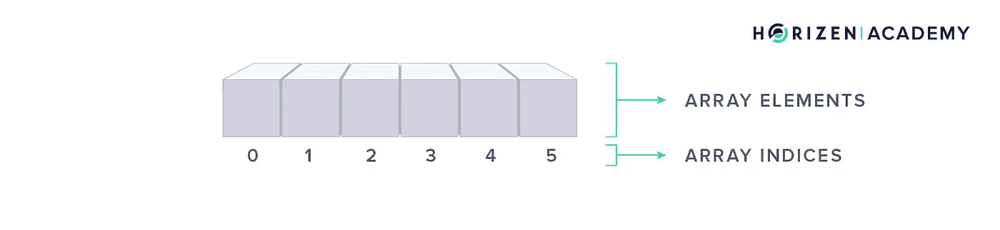
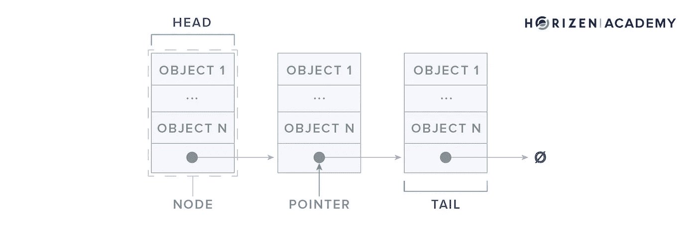
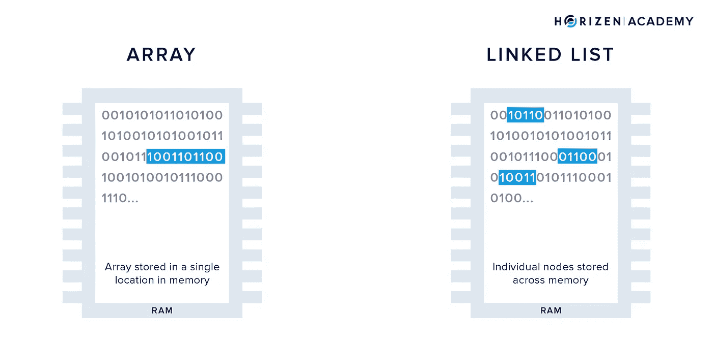
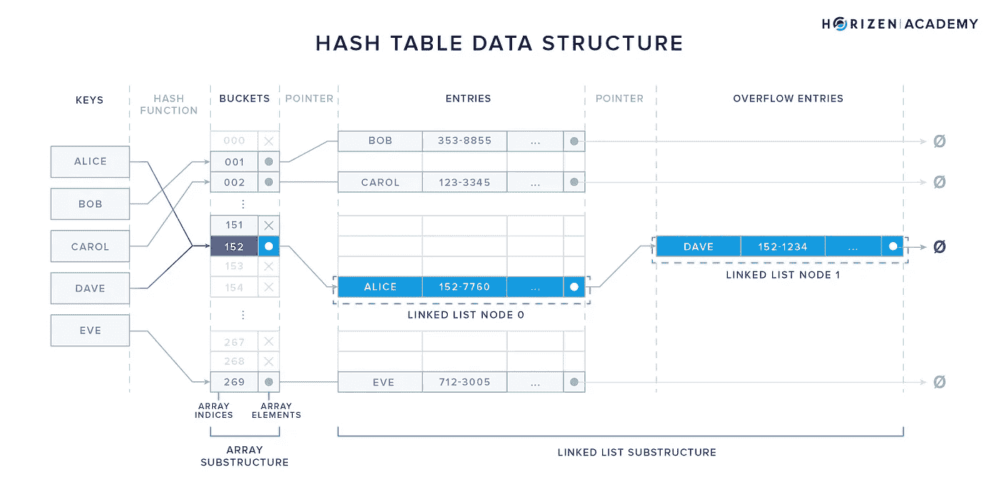
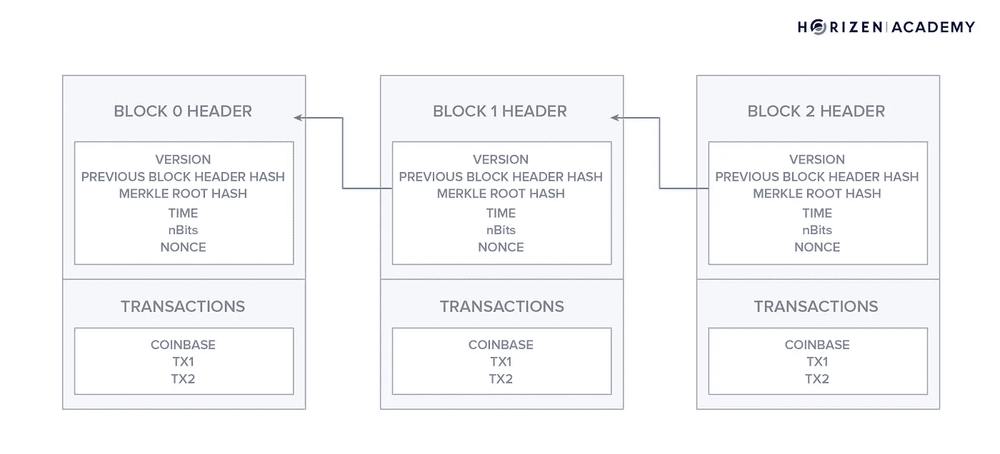
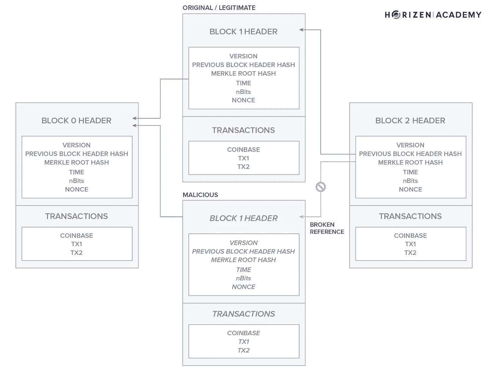
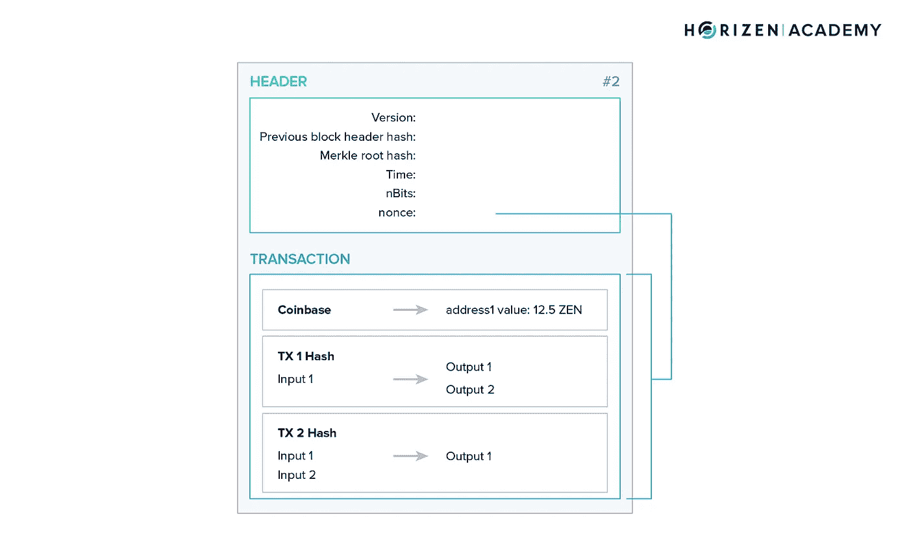
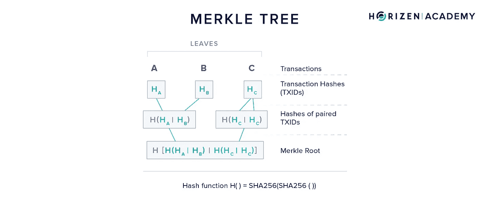
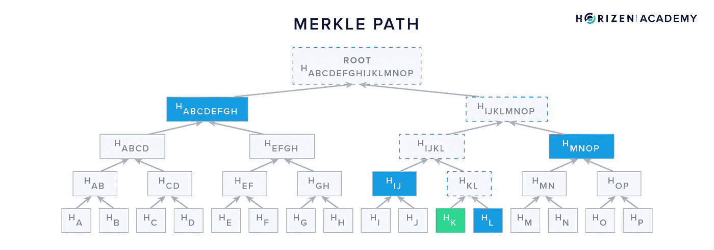

# 作为数据结构的区块链

> 原文：<https://medium.com/coinmonks/the-blockchain-as-a-data-structure-9e34b16bc07d?source=collection_archive---------2----------------------->

Image by [Free-Photos](https://pixabay.com/users/free-photos-242387/)

## 区块链没有你想的那么复杂！从技术上讲，这只是一种存储数据的奇特方式。怎么想象？在这篇文章中找到答案！

*本文是* [*堀森书院*](https://bit.ly/3dcZxnH) *专家内容及章节* [*什么是区块链？*T12”。](https://bit.ly/310g4sK)

*如果你觉得这篇文章中的信息比你需要的更多，可以考虑阅读初级* [*初级*](https://bit.ly/3exobBl) *或* [*高级*](https://bit.ly/2ASybWL) *级别的版本。它们传达了相同的概念，但细节较少。*

区块链技术的第一个用例是数字货币。要有一个没有中央控制的货币系统，你必须有一个特殊而复杂的方法来处理每笔交易产生的所有数据。想象一下，如果每个人都可以访问和修改银行保存的数据库。这将是一场灾难。

为了使分散的资金成为现实，必须开发一种会计方法——UTXO 模型，也称为三重分录会计。通过将所有交易存储在数字分类账中，您可以随时计算每个账户的余额。

用于数字货币的数字分类账需要一系列的属性，这些属性在区块链出现之前是无法实现的。在本文中，我们将了解区块链是如何处理数据的，以及为什么区块链的特殊属性部分源于它。

# **通用数据结构**

在研究区块链之前，让我们先了解一下数据结构。以下是一些最常见的数据结构:

## **数组**

数组是存储数据的最纯粹的形式之一。当您知道需要存储多少数据元素以及每个数据元素有多大时，数组就很有用。您的计算机将从这些输入中计算出所需的存储空间，并将其放在一边，防止其他程序访问您的内存分区。对内存进行分区的缺点是保留的内存对于将来的扩展来说可能太小。在这种情况下，整个阵列必须移动到不同的位置。

数组的每个元素都有一个从 0 开始的索引。如果知道存储元素的位置，就可以立即访问和修改元素。如果你不知道一个元素的位置，你必须做一个*顺序查找*。这意味着您要逐个检查元素(从索引 0 开始)，直到找到为止。

数组因其简单性和*即时访问*特性而非常有用。

One-dimensional array with six elements.

## **链表**

使用*链表*存储数据的程序不需要事先知道你要存储多少个数据元素，但是链表确实需要知道每个元素由什么组成。链表的数据元素称为*节点*。每个节点可以包含几个不同类型的对象。

例如，如果要在一个链表中存储关于汽车的信息，可以将一个节点定义为关于品牌、型号、生产年份和牌照的信息集。

链表的第一个元素叫做头，最后一个叫做尾。

Linked list with three nodes and n objects per node.

每个节点还包含一个指向下一个节点的*指针*。*指针*告诉你的计算机下一个节点在内存中的位置。这允许你很容易地扩展一个链表，因为数据不必在内存中一个单一的、连续的位置。

Usage of RAM by arrays and linked lists. Array stored in a single location; linked list stored across the memory.

当搜索一条数据时，你的计算机会先检查链表的*头*。如果它不在那里，它将查看指针，转到内存中存储下一个节点的位置，并继续跟踪指针，直到找到所需的数据。这种查找数据的方法称为*顺序查找*。

使用链表可以让您在以后通过添加新节点来扩展列表时更加灵活，但是与数组不同，它不能让您即时访问。

## **哈希表**

在进入区块链之前，我们想看的最后一个数据结构是*散列表*。您存储在*散列表*中的数据元素被称为*键*。为了存储密钥，首先使用[散列函数](https://bit.ly/3ehPYFg)对其进行散列。此时，您需要知道的是，哈希函数使用可变长度的*参数*作为输入，并产生固定长度的输出。在下面的例子中，输出是一个三位数。

Schematic of a hash table. Keys mapped to buckets (array elements) using a hash function. Buckets expanded as linked lists to accommodate overflow entries.

*关键字*通过它们的散列值被映射到桶，例如，如果“Alice”散列到 152，则它被存储在该桶中。桶可以存储在数组中，因为哈希函数的输出空间是已知的。每个存储桶都可以通过其索引立即访问。

当您需要存储许多相关的数据元素时，比如在客户数据库中，散列表非常有用。最初，您可以通过散列客户名称来创建客户 ID。现在有一个专门的位置来存储购买、退款或联系信息。每当您需要访问客户数据时，您的计算机会散列您正在寻找的名称，以便高效地找到存储桶，并添加、更改或删除数据。

用于哈希表的哈希函数通常不是*抗冲突的*。这意味着两个*键*可能产生相同的散列，因此将被映射到相同的桶。

哈希表中的链表用于在一个桶中存储几个键。在下面的例子中，桶 152 在第一节点中存储指向 Alice 的数据的指针，该指针指向包含 Dave 的数据的第二节点。

如果哈希表是维度良好的，则每次查找的*成本*(或指令/计算的数量)与表中存储的元素总数无关。散列表给你即时访问，甚至不需要知道每个元素在内存中的位置。位置是由数据本身定义的，这对于必须存储大量数据并重复访问它们的系统来说非常方便。

有许多不同的数据结构；它们中的每一种都有一些权衡，根据使用情况，人们可能会选择一种而不是另一种。复杂的数据结构通常利用几个更简单的概念组合来实现所需的属性集。我们选择了上面的三个例子来展示如何使用数组和链表来构建哈希表。

区块链是一种相当复杂的数据结构，由许多子结构组成。它为我们提供了一组属性，这些属性对于构建数字货币的去中心化分类账至关重要。

## **区块链**

区块链通过将数据分割成子集来组织数据，称为*区块*。块类似于链表的节点。每个块包含几个元素。块的元素通常分为*块头*及其事务。虽然数据块中的事务占了大部分数据，但数据块头包含每个数据块的基本元数据，如时间戳和*数据块高度*。

区块链和链表的主要区别在于区块链中的*引用*是加密保护的，因此*防篡改*。相比之下，链表中的*指针*可以随时改变，而不会影响数据的完整性。安全引用在整个块中建立顺序，并有效地使区块链成为一个*仅附加*数据结构，其中新数据只能与新块一起添加。

Schematic of a blockchain with three blocks, separated into block header and transactions.

前一个块头的哈希值作为引用包含在后一个块中，因为*块哈希*依赖于块的数据，即使在一个事务中改变单个字符也会使引用无效。

不断检查安全链接的有效性。如果您要在区块链中间插入一个恶意块或更改现有块中的数据(例如:下图中的块 1 和块 3 之间)，您可以包含对其前身(块 1)的引用。但是，让块 3 引用新插入的块是不可行的。

Schematic of a blockchain where an attacker is trying to insert a malicious block not references by its successor.

在现有街区的基础上建造的每个新街区被称为*确认*。块越老，它得到的确认就越多。每次确认都会使篡改块中的数据变得更加困难，因为您必须重新创建额外的有效引用。上图中的块 2 有一个确认。您必须重新创建一个有效的引用来篡改它的数据。您还必须为每个新确认重新创建一个有效的参考。块越老，您就越确信块不会发生任何变化。

需要注意的是，并不是数据结构使得区块链上的数据不可变。信息本身是*防篡改的*而已。变化很容易察觉。如果网络上没有强有力的共识规则和足够多的节点，就没有不变性。需要构建激励机制，以便大多数参与者将遵循*协议*并拒绝无效块。

我们将在后面的文章中回到数据结构、[协议](https://bit.ly/2YbmZ0e)和[共识机制](https://bit.ly/2YIHPDe)之间的关系。这些部分的互通使得区块链成为构建不可信数字货币的强大工具。

# **区块链的属性**

在仔细查看块内的数据之前，我们先来看看区块链提供的属性。对于本文，我们将假设一个分散的设置，没有一个中央权威和一个健壮的共识机制。

## **当前缺点**

首先发布某些警告是适当的。与传统数据库相比，区块链的开发更加严格和缓慢。一个破坏数据完整性的错误会使整个构造变得无用。因此，开发必须非常小心。在集中式设置中，bug 可能很容易修复，但是在没有中央权威的分布式环境中，这就变得非常困难。

第二，激励设计是建设区块链不可或缺的一部分。向区块链中添加数据总会产生一定的成本。这个成本必须足够高，以防止添加大量无用数据，但同时，它也需要足够低，以避免变得令人望而却步。部署后，由于上述原因，修复并不容易。

维护一个区块链也比传统数据库贵几个数量级。数据不是记录一次而是数千次。数据也由网络上的每个完整节点并行验证数千次。此外，数据传输在设计上效率低下，导致维护成本上升。使用区块链的每一步都存在冗余，这使得它很难扩展。稍后，我们将研究几个概念来让区块链扩大规模，例如[侧链](https://bit.ly/3fJ3vpF)和[支付渠道](https://bit.ly/3eeSqwk)。其中大多数都是基于将数据移出区块链的想法，而不是增加数据链的吞吐量。

## **使用区块链的好处**

所有这些开销只能通过效用来证明。拥有可预测通胀时间表的全球货币，以及没有中央控制和单点故障的不可信交易，可以说是使用区块链达到这一目的的足够工具。对于许多其他用例，时间会证明区块链是否提供了合适的解决方案。正如不变性属性一样，需要注意的是，公共区块链当前的缺点是由于以分布式方式运行而产生的，而不是由于数据结构。虽然高水平的冗余使数据安全，但从定义上讲，它是低效的。

反过来，您可以通过区块链获得一些独特的属性，如果特定用例需要的话，使其变得无价。区分区块链和普通数据库的主要因素是，关于如何向数据库中添加数据有特定的规则。这套规则，或称 [*协议*](https://bit.ly/2YbmZ0e) ，可以实现以下特性:

- *一致性*:新添加的数据不能与数据库中已有的数据冲突。

- *篡改证据*:仅附加数据结构，以便在数据被更改时立即发现。再加上激励拒绝无效块的强共识机制，这导致了不变性。

- *可拥有的*:数据可以归属于唯一的所有者。数据可以公开验证，但只有所有者可以对其进行更改。在加密货币的背景下，这意味着每个人都可以看到交易，但只有拥有者才能花一个 UTXO。

- *分布式*:数据库是一致的，没有中心方充当看门人。这是激励正确行为的协议的结果。共识和容错是比特币有史以来第一次实现的分布式系统的圣杯。

**从这第一部分得到的关键信息应该是下面的**:只有当有一个**强** [**共识机制**](https://bit.ly/2YIHPDe) 使网络参与者拒绝无效块时，你才能得到**不变性**数据。否则，区块链只是**显窃启**。

看了设计产生的属性之后，让我们看看它是如何构造的。首先，我们看看积木本身。接下来，我们引入一个概念，允许我们创建所有事务的有效摘要——*Merkle 树*。最后，我们看看构成块中大多数数据的事务本身。

# **积木的积木**

块由包含关于块的基本数据的头组成，这是一种摘要。就存储而言，块的最大部分由事务组成。

Schematic of a block. Metadata provided in the block header and transactions including the coinbase transaction.

## **块标题**

块头包含关于块的最重要的信息。

-*版本*指示区块开采者使用的软件版本以及遵循的区块验证规则集。

-前一个块头 hash*hashprevbloc*有两个用途。首先，它在整个块链中建立了一个顺序，其次，它确保在不影响当前块和所有后续块的情况下，不能更改前面的块。

-Merkle Root Hash*hashMerkleRoot*表示块中包含的所有事务的汇总。

-*时间*是矿工开始为挖掘过程散列报头时的 [Unix 纪元时间](https://en.wikipedia.org/wiki/Unix_time)。

-*位*或*位*是找到新块的当前难度的编码版本。

-*Nonce(n*number used*once)*是矿工改变以修改其值的块头散列以满足难度的变量。这个过程在我们关于[采矿](https://bit.ly/3hI68tU)的文章中有详细介绍。

Merkle 树在确保区块链数据的完整性方面发挥着重要作用。它们也用于其他系统，如 IPFS——星际文件系统和 NoSQL 数据库的几个实现。在我们继续从数据角度看事务是什么样子之前，让我们看看它们是如何工作和做什么的。

## **默克尔树**

一个 *Merkle 树*是在块内使用的数据结构。块中的事务组成了 Merkle 树的*叶*。产生的 *Merkle root* 作为所有事务的摘要，包含在块头中。

构建 Merkle 树是这样的:用新硬币奖励矿工的 *coinbase 事务*被放在第一位，然后是块中的所有其他事务。

首先，对每个 leave(事务)进行哈希处理。接下来，两个事务的散列被连接起来并再次散列。如果事务的数量是奇数，则最后一个事务的散列与其自身的副本连接在一起。这个过程一直持续到只剩下一个散列 Merkle 根。

Merkle tree data structure used to consolidate transactions into a single 256-bit identifier — the Merkle root.

虽然大多数 Merkle 树是二进制的，但是也可以考虑非二进制的 Merkle 树，每一步连接两个以上的散列，但是想法是一样的。试图在已经确认的块中更改单个事务会导致不同的 Merkle 根，从而导致不同的头。这是一种确保篡改证据的机制。

从计算机科学家的角度来看，这也提高了效率:可以在对数时间而不是线性时间审计事务。

## **Merkle 路径**

Merkle 路径仅仅是重建整个树所需的一组散列值。事务 *K* 的 *Merkle 路径*由事务 *L* (H_L)的散列组成，它首先与组合散列(H_IJ)、(H_MNOP)连接，最后是(H_ABCDEFGH)。这四个散列和原始事务一起，允许验证者检查树的完整性。

Merkle path (also Merkle proof) of transaction hash K. Hashes shown in blue comprise the Merkle path needed to verify hash K is included in the Merkle root.

# 交易是什么样的？

***注****:UTXO 型号* [*在地平线学院的高级*](https://bit.ly/3egRE27) *中有介绍，稍后在* [*专家级*](https://bit.ly/2YT021d) *中会有更详细的介绍。如果你还不熟悉，在你继续阅读之前，你可能想了解一下。*

**TL；DR** :每个事务(除了 coinbase 事务)至少有一个输入和一个输出。当您创建一个事务时，您正在使用 UTXOs——未使用的事务输出——将它们用作新创建的事务的输入。同时，您创建了一个或多个新的 UTXOs，收款人(新的所有者)可以使用这些 UTXOs。

为了用我们的语言准确地说，我们在这里引入一个新概念: *outpoints* 。*输出点*是表征特定事务输出的数据结构。它包括创建输出的*事务 id* ，以及在事务中创建的潜在许多输出中标识特定输出的*输出索引*。因此，*输出点*只是一种更独特的方式来引用通常被称为*输出*的内容。

交易是给网络的消息，通知它关于货币的转移。该消息是标准化的，由以下信息组成:

- *版本*:正如每个块都表示创建它所用的软件版本一样，每个事务都包含这个信息。

- *tx_ in count* :使用的输入数，即消耗的 UTXOs 数。

- *tx_in* :使用的每个输入由四个数据点表征:它花费的 outpoint，花费该 outpoint 所需的*签名*的大小，[数字签名](https://bit.ly/37TKfDz)本身，以及*序列号*。*序列号*可以用来修改*outo point 的消费条件*，但是我们正在超越自己。

- *tx_out count* :事务中创建的输出数。

- *tx_out* :交易输出。每个输出以三个数据点为特征:花费的金额，*花费条件*的大小，以及基于新所有者的私钥的[数字签名](https://bit.ly/37TKfDz)可以满足的花费条件本身。

-*lock _ time*:Unix 纪元时间或块号，在此之后输出可用。这是可选的。

每个事务都以称为原始格式的序列化字节格式进行广播。然后对它进行两次散列( *SHA256(SHA256())* )以创建它的事务 ID (TXID)，正如您已经知道的，它用于创建 Merkle 树。

好吧，那是很多。这段话提到了许多已经在我们的[高级课程](https://bit.ly/3fJ7Byn)中介绍的概念。为了全面了解区块链技术，这也是[专家级别](https://bit.ly/2UYim7Q)的目标，我们需要将各个概念整合在一起，并了解它们之间的关系。作为区块链的基本组成部分，交易就是一个例子。

首先，理解 UTXO 会计模型是必要的。

其次，为了理解区块链上的*可拥有的*部分数据，需要理解[公钥加密](https://bit.ly/3ekw1O8)的基本原理:私钥、公钥、地址和数字签名。

最后，需要了解区块链的整体结构。

# **总结**

区块链本身就是一种存储事务的数据结构。它类似于一个链表，因为数据被分成容器——块。每个块通过加密的安全引用与其前一个块连接。这使得数据结构的篡改显而易见，对旧块的更改很容易被检测到并消除。公共区块链的开发和维护非常昂贵，但某些用例(如数字货币)可以证明这种开销是合理的。

一个块由一个标题和包含的事务组成。在块内，Merkle 树用于创建所有事务的 256 位摘要，即 Merkle 根，它包含在块头中。

事务是向网络发送的关于事务中花费了哪些未用完的事务输出(utxo)以及正在创建哪些新的 utxo 的消息。

我们想以一条推文来结束这一部分，这条推文提炼了数据结构背景下区块链技术属性的含义。

*如果你觉得这篇文章有价值，请考虑访问* [*地平线学院*](https://bit.ly/3dcZxnH) *。在那里你还会发现一个* ***延伸阅读*** *下面列出了大多数文章，引用了同一主题的伟大文章。*

Horizen Academy 的文章有三种复杂程度:初级、高级和专家。如果你开始阅读一篇文章，只是意识到它太详细或不够详细，你可以简单地使用侧边栏切换级别。

*下面有一段* [*概述了*](https://bit.ly/3fFoTMz) *写作时的全部内容。*

如果你想在 Twitter 上关注我:[给你](https://twitter.com/SLebur)；)

> [在您的收件箱中直接获得最佳软件交易](https://coincodecap.com/?utm_source=coinmonks)

