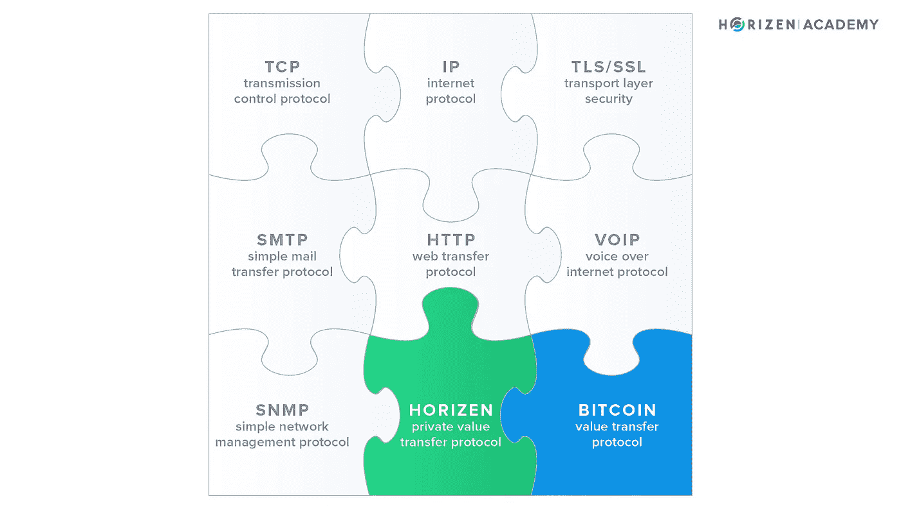
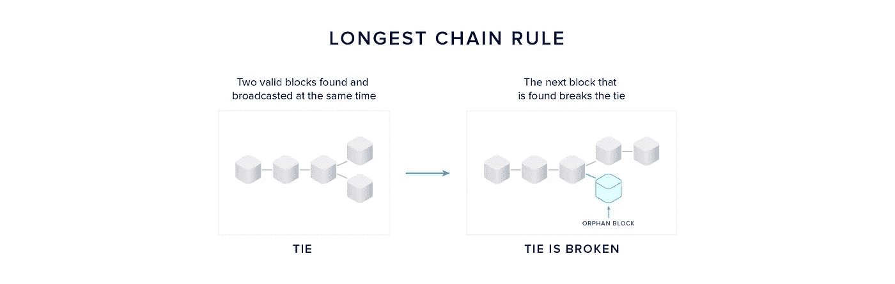
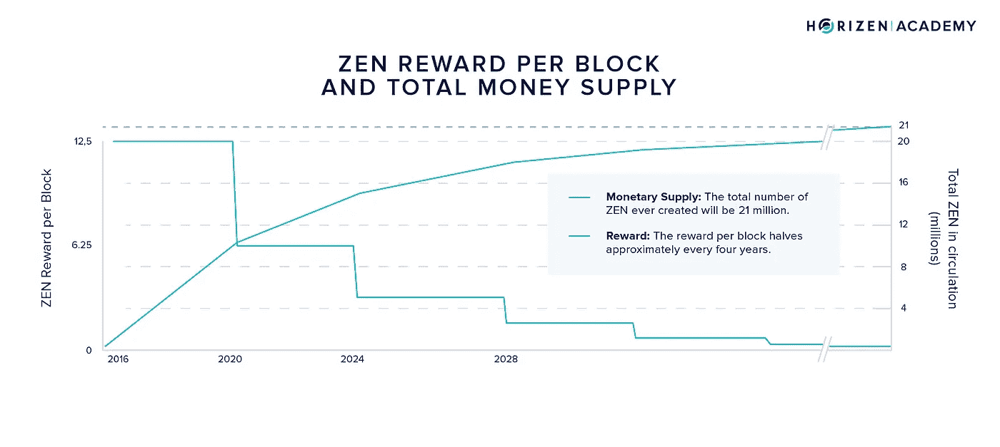
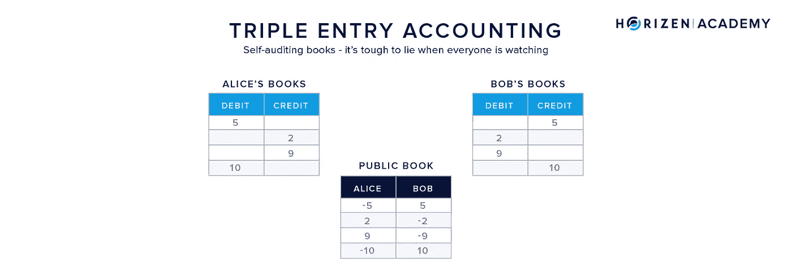
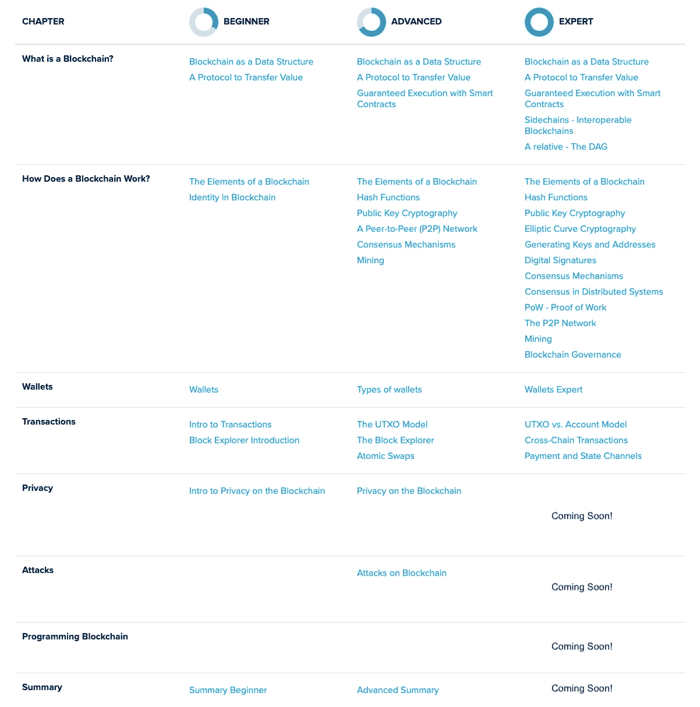

# 区块链作为传递价值的协议

> 原文：<https://medium.com/coinmonks/the-blockchain-as-a-protocol-to-transfer-value-1d976f28cc0b?source=collection_archive---------0----------------------->

Thanks to [Christine Roy](https://unsplash.com/@agent_illustrateur)

## 口语、互联网、区块链都可以理解为网络协议。每一种都在一组参与者(网络)中使用，以实现一个共同的目标。

*本文是* [*堀森书院*](https://academy.horizen.global/) *专家内容及章节* [*什么是区块链？*T12”。](https://bit.ly/310g4sK)

*如果你觉得这篇文章中的信息比你需要的更多，可以考虑阅读初级* [*初级*](https://bit.ly/2VjY0Xt) *或* [*高级*](https://bit.ly/3ehTZcN) *级别的版本。它们传达相同的信息，但不太详细和复杂。*

在本文中，我们想说明区块链的多学科性质。没有正确的激励机制和经济考量，全球数字货币就无法运转。如果不在技术和货币方面建立一座认知的桥梁，人们对区块链会是什么样子就不会有一个完整的印象。

在比特币之前，数字稀缺是不存在的。数字商品是无限可复制的，所以它们的自然价值(理论上)是零，因为你有无限的供给和有限的需求。

今天，价值交换的工作方式类似于互联网出现之前的信息交换；从点到点，涉及中间人和第三方。加密货币是价值转移的创新，就像互联网彻底改变了信息交换一样；从 P2P 到 P2P，大大减少了对中间人的需求。

一个设计良好的全球价值交换系统还能带来更大的社会可扩展性。当我们说*系统*时，我们隐含地说协议，因为协议定义了系统。术语*社会可伸缩性*指的是大型群体有效合作的能力，或者如创造这个术语的尼克·萨伯在他最著名的论文之一中所说:

> “社会可伸缩性是一个机构的能力——一种关系或共同的努力，其中多人重复参与，并具有约束或激励参与者行为的习俗、规则或其他特征——以克服人类思想中的缺点以及所述机构的激励或约束方面的缺点，这些缺点限制了谁或多少人能够成功参与。”—尼克·萨伯

区块链可以分为两层:应用层(T0)和网络层(T2)。

> “应用层处理事务管理、区块链处理和挖掘等任务。[……]网络层处理节点之间的通信，这种通信通过节点间 TCP 连接的 P2P 网络进行。— [蒲公英纸](https://arxiv.org/pdf/1701.04439.pdf)

在本文中，我们将重点放在应用层的区块链协议上。在关于 P2P 网络的文章中，我们讨论了网络层的协议。

# 网络协议

口语、互联网和区块链可以理解为网络协议，每个协议都有一套规则，因此它们可以服务于自己的目的，而不需要中间人。每一种都用于一组参与者——网络。所有的共同点是，遵守规则比违反规则给个人带来更大的利益。

你可以发明自己的语言，以防你不想遵循现有语言的规则，但你没有人可以交谈。人们也可以认为 TCP/IP 协议可以被更有效的协议所取代。但是如果你是唯一一个使用新协议的人，没有任何人与你交换信息就毫无意义。随着参与者数量的增加，效用的增加被称为*网络效应*。

对于加密货币，我们有类似的情况。加密货币可以被视为货币，因此也可以被视为信息。货币是一种非常具体的信息，但也可以这样理解。安德烈亚斯·安东诺普洛斯[最擅长讲述这个故事](https://www.amazon.com/Internet-Money-Andreas-M-Antonopoulos/dp/1537000454)，但简而言之:

> “在最基本的层面上，金钱不是价值。金钱代表价值的抽象；这是一种交流价值的方式。这是一种语言。”安德烈亚斯·安东诺普洛斯

为了交流信息，所有参与者都需要一套他们共同遵守的规则。给定的单词是什么意思？如何向服务器请求信息？交易看起来像什么？这套规则就是我们所说的区块链协议。它涵盖了从如何处理数据、对等网络中的对等方如何通信到网络如何就单个交易历史达成共识的所有内容。

您可以区分几种主要类型的网络协议。一些例子包括:

*   网络通信协议，如 TCP/IP(传输控制协议/互联网协议)
*   网络安全协议，如 HTTPS 和 SSL(超文本传输协议安全/安全套接字层)以及
*   网络管理协议，例如 SNMP 和 ICMP(简单网络管理协议/互联网控制消息协议)
*   Horizen 或比特币等价值转移协议

*Overview of network protocols, including TCP/IP, HTTP, VOIP, Bitcoin, and Horizen.*

上面你可以看到一系列的协议，其中很多你每天都在使用。TCP/IP 协议规定了如何将数据分解成数据包，对数据包进行寻址，并通过万维网对其进行路由。SSL(安全套接字层)是一种标准协议，用于在在线通信中在 web 服务器和客户端(如您的计算机)之间建立加密链接，并用于数据的安全传输。简单网络管理协议(SNMP)是网络设备(如路由器、服务器或打印机)支持的一组协议，负责实现它们的无缝互操作(有时)。像比特币或 Horizen 这样的协议可以实现点对点的数字价值转移。

# 规则是什么？

现在让我们来看看区块链的协议是什么样子的。规则是什么？为了使系统运行，需要对什么进行标准化和规范？

主要目标是维护所有交易的一致的分类账，有几个适当的规则来实现这一点。首先，我们需要关于数据(如事务和块)的某些标准。一个有效事务的数据以何种顺序提供，使用何种格式，以及在一个块中使用何种结构，在我们上一篇关于作为数据结构的[区块链](https://bit.ly/2BfMpRF)的文章中已经讨论过。我们在本文中涉及的所有约定都由协议定义。

当软件交换信息的通用语言建立后，我们需要关于如何将新数据添加到区块链的规则。添加数据是有代价的。这一成本必须足够高，以防止添加大量无用数据，但同时也不能高得令人望而却步。

首先，所有的[挖掘器](https://bit.ly/3hI68tU)和满节点维护所谓的*内存池*，其中包含新的和未确认的事务。一旦事务被包含在终结块中，它就被从内存池中删除。

[*共识机制*](https://bit.ly/2YIHPDe) 决定了向链中添加新块的过程如何工作，以及网络如何就历史的单一版本达成一致。*最长链规则*或 *Nakamoto 共识*确定哪个区块是有效的，以防两个矿工在不久之后发现两个有效区块，从而产生平局的情况。

*Longest chain rule applied to a fork of the blockchain.*

为了保持区块链的增长相对于每单位时间增加的块的数量是稳定的，一个*难度调整*已经就位。越多的矿工用他们的散列能力支持一个网络，如果没有适当的对策，他们平均能越快地找到块。如果总散列率增加，块难度也会增加。通过这种机制，平均*阻塞时间*基本保持不变。

最后,《议定书》界定了货币政策。大多数加密货币都有一个最大流通供应量。通过定期将*区块补贴*削减一半(Horizen 每 84 万区块削减一次，比特币每 21 万区块削减一次，两者大致相当于 4 年)，总流通供应量渐进地接近其极限，但永远不会越过它。

*Graph of the disinflationary supply schedule and the declining block subsidy over time.*

这种货币政策被称为*。根据 Investopedia:*

> *“通货膨胀和通货紧缩指的是价格的走向，而反通货膨胀指的是通货膨胀率的变化率。尽管有时会与通缩混淆，但反通胀并不被认为是有问题的，因为价格实际上不会下降，而且反通胀通常并不意味着经济放缓的开始。”*

*可预测的货币供应是由中央银行控制的政府发行的法定货币的最大区别之一。涵盖给定协议的所有规则会超出本文的范围。关键在于，有些抽象的术语“协议”是定义给定区块链及其所有部分的一组规则。*

# *如何改变一个区块链的规则？*

*区块链的初始规则集是由 genesis 块定义的。对它的任何更改都需要得到大多数网络参与者的批准。在没有中央控制的分布式环境中，必须围绕每个提议的协议更改建立共识。在这方面，区块链开发与许多其他开源项目没有太大的不同。我们希望区分:*

*   *建议改变的过程*
*   *决定这些变化的过程*
*   *最后是实施这些变革的过程。*

*为了建议改变，大多数大型区块链项目都有一个*改进建议*系统。任何人都可以在 GitHub 上查看代码并提出改进建议，通常是通过展示相应的代码。在开发人员社区中，将对建议的改进进行讨论和完善，如果大多数人认为它们是有益的，并且不会对安全性产生负面影响，则可能会实施这些改进。*

*决定变更被称为协议的[治理](https://bit.ly/2NdNmws)。通常这只是一套松散的指导原则，但它可以更有条理。在后面的文章中，我们将更多地讨论治理。詹姆森·洛普(Jameson Lopp)整理了一篇[关于比特币治理过程的非常有见地的文章](https://blog.lopp.net/who-controls-bitcoin-core-/)，我们强烈推荐阅读。*

*可以通过软分叉或硬分叉来实现更改，其中软分叉是向下兼容的更新，而硬分叉是向下不兼容的。如果对协议的更改可以用软分叉实现，那么有两种方法可以处理这种转换。在[用户激活的软分叉](https://www.mycryptopedia.com/uasf-user-activated-soft-fork-explained/) (UASF)中，节点网络正在实施这些改变。节点运营商在特定的标志日期更新他们的软件，并将根据新的共识规则集接受或拒绝矿工区块。矿工有强烈的动机遵守新的规则，因为他们冒着开采无效区块的风险。*

*[矿工激活的软叉](https://www.mycryptopedia.com/uasf-user-activated-soft-fork-explained/) (MASF)不要求将变更与特定的旗帜日期联系起来。矿工可以通过改变其块标题中的 [*版本位*](https://bitcoincore.org/en/2016/06/08/version-bits-miners-faq/) 来发出 MASF 准备就绪的信号。一旦某个百分比的已产生块发出准备更新的信号，完整节点可以相应地实施规则改变。*

# *比特币带来的伟大创新*

*即使一套设计完美的规则已经到位，它仍然需要以某种方式执行。没有中央权威，外部执法是不可能的。因此，该议定书是一项自我执行的协议。[博弈论](https://en.wikipedia.org/wiki/Game_theory)是对描述和预测不同方之间战略互动的模型的研究。评估一个协议及其内在动机属于这一类:*

*在博弈论中，合作行为只能通过[自我执行协议](https://www.jstor.org/stable/2352355?seq=1#page_scan_tab_contents)来执行的博弈被称为非合作博弈，而允许依赖外部执行的策略的博弈被称为合作博弈。*

*这是比特币带来的伟大创新之一；互不信任的未知实体之间在全球范围内的自我执行协议。这是唯一可能的，因为有一个激励系统，使诚实的行为比欺诈行为更有利可图。*

## *分散共识*

*在比特币出现之前，在不受信任的参与者表现出恶意或错综复杂的行为以及不可靠的异步网络的环境中，T4 不可能达成共识。*

## *自动执行协议*

*工作证明区块链最重要的激励措施之一是让矿工花费真实的资源(电力和采矿设备)来保护账本，并在区块链上用当地货币奖励他们。这在分类账周围建立了一个热力学安全层，只有那些愿意获得大量计算能力并花费大量电力来破解它的实体才容易受到攻击。*

*正如中本聪在比特币白皮书[中所阐述的:](https://bitcoin.org/bitcoin.pdf)*

> *“如果一个贪婪的攻击者能够聚集比所有诚实节点更多的 CPU 能力，他将不得不选择用它来通过偷回他的付款来欺骗人们，或者用它来产生新的硬币。他应该会发现，遵守规则比破坏体系和自己财富的合法性更有利可图，这些规则让他获得的新硬币比其他人加起来还多。”—中本聪*

*攻击者现在必须平衡攻击区块链的成本:攻击成功的可能性及其潜在的好处与花费相同电量诚实采矿和收集区块奖励的好处。关键要点如下:只要激励措施设置正确，区块链协议是自我执行的。这就是为什么 rational 代理拒绝无效的块和事务，并且用他们的计算能力保护网络。*

## *数字稀缺*

*比特币是第一个解决双重消费问题的技术。以前不可能验证一个数字对象是否只存在一次。当你转移一个单位的加密货币时，你就移交了一个数字对象的所有权，接收者可以确定她是该数字对象的新的唯一所有者。抵制双重消费的特性也被称为数字稀缺性。*

## *三联簿记*

*随着时间的推移，会计发展了三个步骤。首先，使用了单式记账，复式记账引发了贸易的第一次革命，比特币在 2009 年推出了三式记账，这可能引发商业、贸易和会计的又一次革命。*

**单式簿记*是你用于个人理财的东西。您可以将进出交易记录为正或负交易，并可以随时计算您的当前余额。不过，这对商业没有用，因为你不能相信另一个实体的账本。欺诈活动很容易产生，但很难被发现。*

**复式记账法引发了商业革命。每个参与者在他们的账簿中为每笔交易创建两个分录:借方和贷方。任何对自己的贷记都必须与另一方的借记相匹配。一旦你比较了相互作用的各方的账簿，欺诈就很容易被发现，但是你必须依赖第三方作为验证者来实际审计账簿。欺骗系统仍然是可能的，但是你必须创建一个虚假交易的完整历史来这样做。**

**假设整个网络由大多数诚实的参与者控制，复式记账*现在使得凭空创造基金变得不可能。每笔交易都有三个分录:收款方的贷方，付款方的借方，以及公共收据，即分类账上记录的交易。因为每个人都可以保留整个交易历史的副本，所以没有任何行为者可以为自己创建欺诈信用。你可以信任系统本身，而不是必须信任像审计员或银行这样的第三方。*

**

**Schematic of the triple-entry bookkeeping principle.**

*三条目簿记仍然有一个缺点:总的交易吞吐量是有限的，因为它必须由网络的所有参与者来处理。我们想参考 Todd Kronenberg 的文章[“为什么比特币的闪电网络是巧妙的”](/coinmonks/why-bitcoins-lightning-network-is-the-ingenious-10dc1ad9ccae)，上面的部分借鉴了这篇文章，以了解三重分录会计的优缺点以及在区块链之上建立复式记账系统的“巧妙”缓解策略——像[闪电网络](https://bit.ly/3eeSqwk)一样的第二层解决方案。*

## *货币与国家的分离*

*从历史上看，央行在今天这样的范围内制定货币政策是个例外。我们不想开始一场经济讨论，因为这本身就是一个话题，但拥有一种分散的、未经许可的、独立的货币形式，作为传统金融体系的替代，肯定不会有什么坏处。竞争总是有利于服务，我们相信我们很快就会看到加密货币与国家发行的法定货币竞争。*

*上面的每一个想法都值得写一本书，这个简短的概述没有公正地对待加密货币的相关性和复杂性。尽管如此，我们还是想提到几个方面，给你一个方向和一个研究你感兴趣的不同方面的基础。以上概念都不是孤立存在的。它们是相互关联的，可以从不同的角度来探讨。当我们将区块链的范围扩展到加密货币之外时，我们可以发现更多有趣的发展。*

# *维护区块链的非财务激励*

*虽然数字货币和传统资产的数字代理形式的金融应用是最早的，并且仍然是谈论最多的用例，但区块链可以被视为实现其他方法的工具。*

*当互不信任的多方想要维护一个共享且一致的数据集时，区块链可以是一个选择。不同的实体可以决定各自运行一个节点，并在彼此之间旋转网络。添加正确的激励结构并确保系统中的所有参与者不能滥用或破坏数据库是一个重要的考虑因素，就像任何公共区块链一样。如果挖掘者和节点没有动力以一致的方式维护数据，区块链将毫无用处。通常，这些激励措施具有直接的财务性质。*

*但是激励也可以是非财务性质的。例如，如果一组企业评估一个共享数据库。供应链管理就是一个很好的例子:生产商想要证明他们已经及时发送了货物，物流公司想要证明它何时收到并交付了货物，客户想要查看他的货物是否以及何时转手。当每一次移交都由直接交互的两方签署时，在延迟交付的情况下就更容易确定责任。有人可能会说，潜在的激励是金融性质的，但这种好处来自效率的提高，而不是直接的货币利益。*

# *摘要*

*在本文中，我们研究了应用层区块链的协议，并将其定义为值传输协议。组成我们提到的协议的规则的一些例子是当存在临时链分裂时应用的最长链规则、保持块生产率恒定的难度调整以及反通货膨胀货币时间表。*

*接下来，我们谈到了[区块链治理](https://bit.ly/2NdNmws),接着列举了区块链科技引入的主要创新:网络参与者之间的自我执行协议、数字稀缺性、三重记账以及金钱与国家的分离。最后，我们举了一个例子，激励我们为不同于数字货币的目的(如共享数据集)维护区块链。*

**如果你觉得这篇文章很有价值，请考虑访问* [*堀场书院*](https://bit.ly/3dcZxnH) *。在那里你还会找到一个* ***进一步阅读*** *下面列出了大多数文章，引用了同一主题的伟大文章。**

**Horizen Academy 文章有三种复杂程度:初级、高级和专家。如果你开始阅读一篇文章，只是意识到它太详细或不够详细，你可以简单地使用侧边栏切换级别。**

**下面有一段* [*概述了*](https://bit.ly/3fFoTMz) *写作时的全部内容。**

*如果你想在推特上关注我:[给你](https://twitter.com/SLebur)；)*

**

> *[直接在您的收件箱中获得最佳软件交易](https://coincodecap.com/?utm_source=coinmonks)*

**