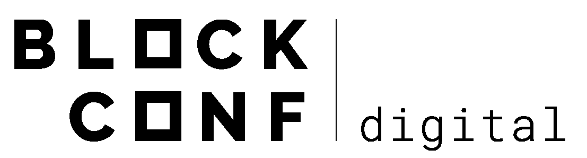

# block Conf——虚拟区块链会议

> 原文：<https://medium.com/coinmonks/the-blockchain-community-worldwide-is-preparing-for-a-48-hour-non-stop-online-experience-the-9f042ec700ec?source=collection_archive---------4----------------------->

全球区块链社区正在准备 48 小时不间断的在线体验，BlockConf Digital 将于 5 月 25 日星期一上午 9 点(GMT + 8)开始开放。

*BlockConf Digital 是 FAS | Fintech 咨询服务公司和 STO 经理人的联合项目，旨在为全球区块链行业的数字化转型和增长贡献一种新工具。*

BlockConf Digital 准备了两个阶段，邀请了 100 多名演讲者，如 Adam Back、Peter McCormack、David Chaum、Miko Matsumura、Juan Pablo Thieriot、Catalina Castro、Eddy Travia 等，他们来自卡巴斯基、RSK、Crypttp、Decred、Dash、Quantia、Money On Chain、Decrypto、币安、北海巨妖、CoinGecko、UNICEF、Blockchain Valley Ventures、AVA 实验室等公司。卡巴斯基是一家创新的全球网络安全公司，拥有 21 年的业务和 4 亿多用户的保护，作为主要赞助商参加了会议。该公司有一个保护可持续区块链系统的终极解决方案，**卡巴斯基区块链安全，**团队将在活动中展示。

该会议旨在为与会者提供完整的网络体验:

●带有视频聊天功能的虚拟展台，与参与公司进行电子会议

● VIP 电子会议室，用于安排私人会议和交换名片

●电子研讨会，了解更多关于区块链的信息

●电子咖啡休息室，与所有与会者交流

BlockConf Digital 还将为那些希望向区块链生态系统中的顶级风险投资公司展示其项目的公司举办一场**创业演示日**。初创公司可以通过联系 business@blockconf.digital 的活动团队来注册演示日

**想先睹为快 BlockConf Digital？加入美国东部时间 5 月 14 日下午 1 点的虚拟 BlockConf 会议。**

虚拟会议厅将对每个人开放，供虚拟 Meetup 探索平台并与 **RSK、**法令和**短跑**团队进行电子会议。在虚拟 BlockConf Meetup 上使用 BlockConf Digital 热身，为 5 月 25 日做好准备。

您可以在 https://www.blockconf.digital/#register[注册参加 MeetUp](https://www.blockconf.digital/#register)两种体验均可注册:主活动和 MeetUp。

电子商务大会上见！

**了解更多信息:**
[网站](https://www.blockconf.digital/) — [LinkedIn](https://www.linkedin.com/company/blockconf/) — [电报](https://t.me/blockconfDigital) — [推特](https://twitter.com/BlockconfD) — [邮箱](http://media@blockconf.digital)

**联系人:**[**Manuel beau droit**](https://t.me/mbeaudroit)

> [直接在您的收件箱中获得最佳软件交易](https://coincodecap.com/?utm_source=coinmonks)

