# 区块链解释道

> 原文：<https://medium.com/coinmonks/the-blockchain-explained-cdee61e7b831?source=collection_archive---------4----------------------->

## 加密货币、交易所和矿业

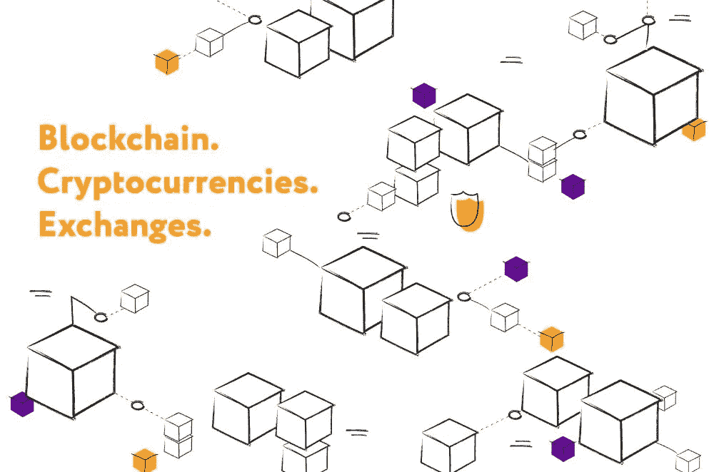

围绕区块链和数据库的讨论已经持续了很长时间，但是并不是每个人都理解它是什么以及如何使用它。

这就是为什么我决定用简单的语言解释一切，并整理出关键概念。

# 这一切都始于一个数据库

让我们想象一个只有一个表的数据库。此表中除了 5–6 个固定列之外没有其他内容。在这样的数据库中，我们所能做的就是插入和读取。无法执行更多操作。

现在想象一下，在一个名为[比特币](https://blog.coincodecap.com/tag/bitcoin/)的大型游戏中，每个参与者都有这个数据库的副本。该软件是以这样一种方式设计的，所有这些数据库都是相互同步的，并且，如果你向其中插入一些数据，那么在一段时间之后，所有拥有该数据库副本的人都将获得这些数据。因为有了这样的系统，欺诈变得不可能。

但今天我们不仅要讨论数据库，还要分析什么是加密货币和交易所，看看比特币和以太坊。

# 假人区块链

简单来说，是一个环环相扣的区块链。每个块的每一侧都有一个相邻的块。这是一种圆舞，可以加新的积木，但是谁也不能离开。

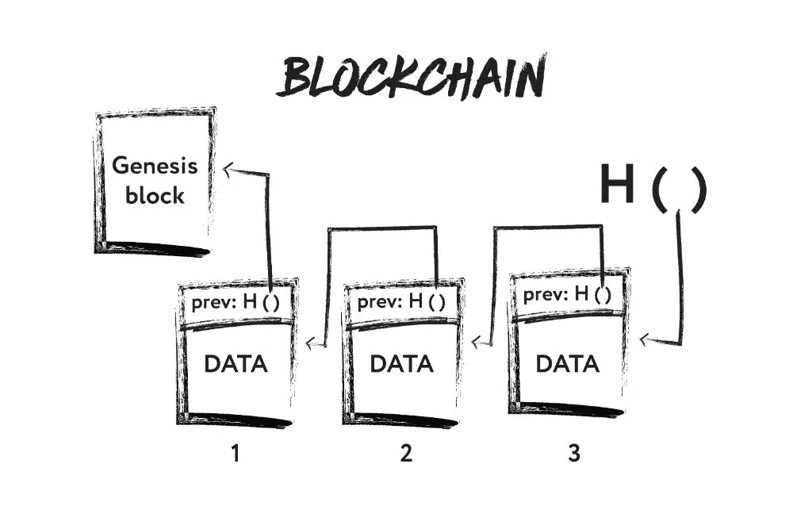

区块链有一个初始区块，一切都从这里开始。它就是**创世纪街区**。作为类比，我们可以给出一个简单的列表作为例子，其中总是有一个开头或一个词根。当你走的时候，一个新的石块粘在最初的石块上，于是一个链条开始形成。为了连接这些块，使用了 **H ()** 函数。

我们如何将这些块链接在一起，区块链与常规列表有何不同？

问题是有数学上的**哈希函数**。他们是 SHA-1、SHA-2 等。这些函数的独特之处在于，它们允许您向其中传输一些数据，并在输出端获得一个字符串(通常是位)。但是这种功能不能反过来工作。从字符串中获取源数据是不可能的。

**哈希函数**有雪崩效应。假设我们有两组输入数据:

*   敏捷的棕色狐狸跳过一只懒惰的狗
*   敏捷的棕色狐狸跳过一只懒狗

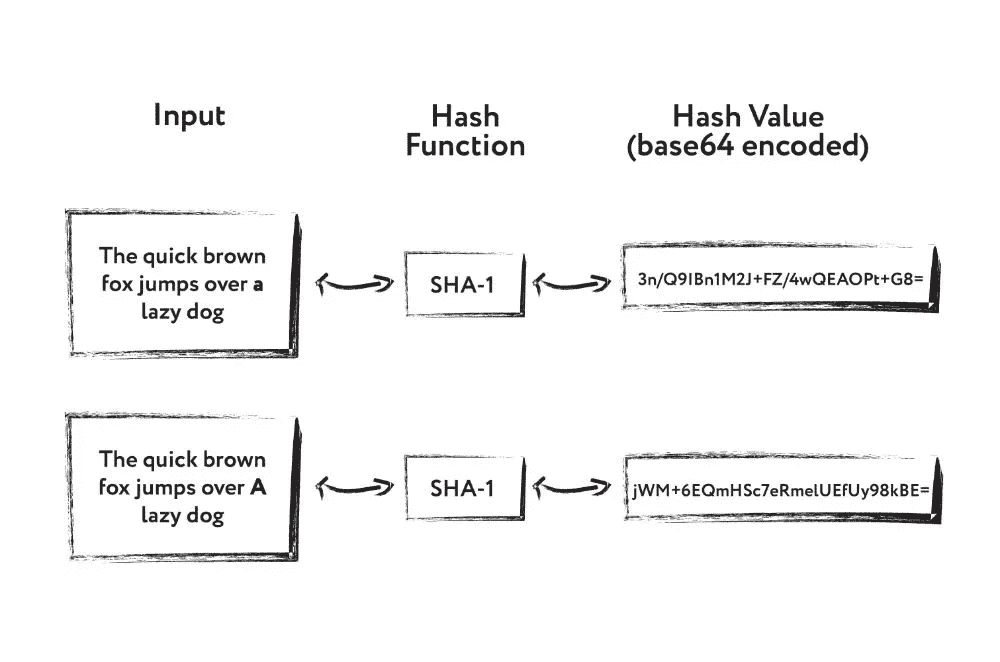

正如我们所看到的，在输入数据集中有一个细微的差别。是大写字母 a，当我们考察产值时，会看到两个完全不同的值。改变散列函数会产生雪崩效应，不仅 1–2 位的值会改变，许多其他值也会改变。

我们如何使用哈希函数将所有块链接在一起？

假设我们有一个包含一些信息的数据块。这可以是任何性质的信息，如句子、数字和结构。此外，每个块中有一个字段，即前一个块的散列。我们有最初的阻碍；它在该字段中没有任何内容，因为它没有先前的块。要向[区块链](https://blog.coincodecap.com/tag/blockchain/)添加一个新的块，您需要计算我们想要添加一个新块的块的散列。计算完 hash 后，我们将它输入到一个新的块中。

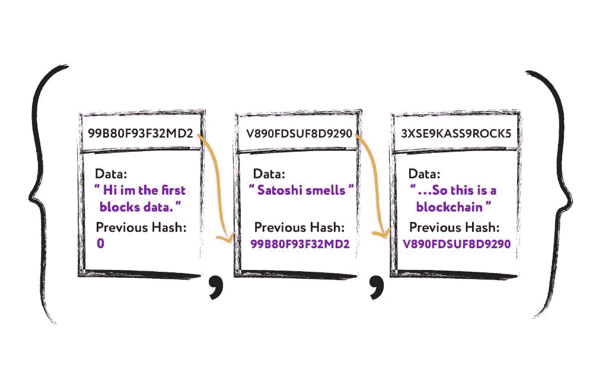

如果我们改变块中的任何字母或数据，那么散列将改变，值将变得不同。此外，在检查链时，我们会看到值不匹配。很快就会发现 hash 被替换了，或者它有问题。这就是区块链数据的整体一致性。

# 货币的演变

值得注意的是， [**比特币**](https://blog.coincodecap.com/tag/bitcoin/) 非常喜欢区块链，并以其为基础。首先，让我们更深入地了解一下区块链创造和货币演变的历史。这一切是如何开始的？

这一切都始于人们交换物品时的一次简单的物物交换。但通常情况下，交换不能以相同的速度进行。比如一头牛换了 1kg 小米。由于没有交换单元，一切都变得复杂了。

然后是黄金，黄金开始充当交换单位。但是黄金太少了，不是每个人都能买得起的。这使得交易和交换变得困难。

因此，新的兑换单位开始出现如**金属币**。随着金、铜、银和各种合金的出现。然而，金属货币的问题是它很重。

因此，纸币开始出现。转折点就是在这个时期到来的，因为在此之前，货币本身就有一定的价值。纸币正在成为法定货币。请暂时忘记纸币是一种钞票。然后，很明显，它的成本比实际成本要低得多。

从这一刻开始，货币史上的革命开始了。经济在上升，但法定货币没有黄金做担保，只有国家的债务义务做担保。国家承诺接受这笔钱，我们可以得到一些回报。

钱的数量增加了，变得太多了。因此，有必要把钱存在某个地方，同时保持随时使用的能力。于是**塑料卡**出现了。

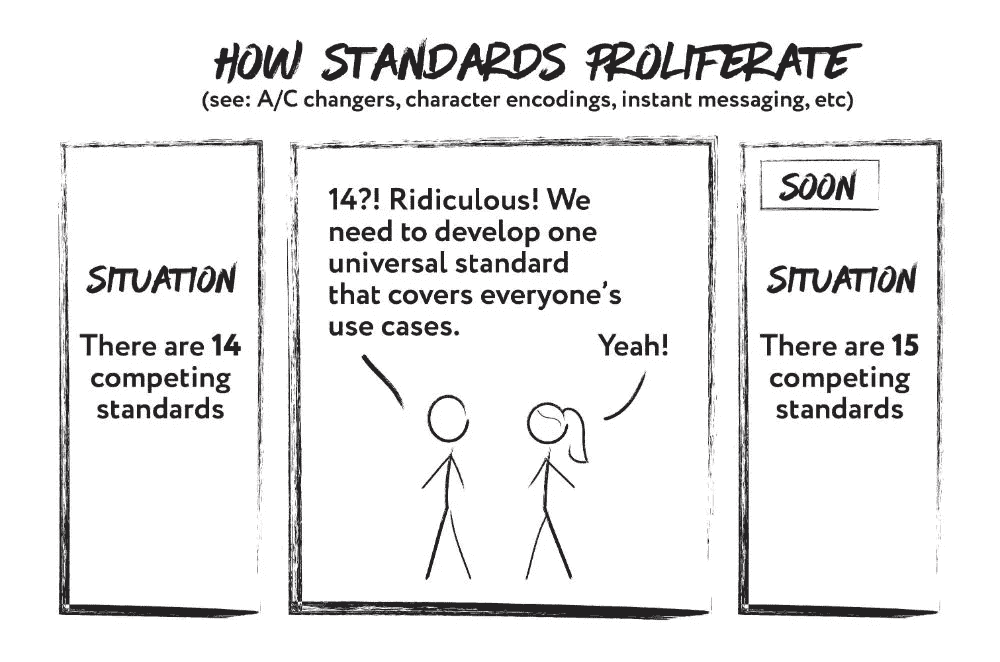

继塑料卡之后，**电子货币**出现。我们为什么需要它们？世界上使用许多不同的货币，特别是在市场全球化的情况下，经常需要找到一种使用某种共同货币进行交易的方法。电子货币的发明就是为了找到摆脱这种局面的方法。

然后是**加密货币**。但是如果有电子货币，为什么要加密货币呢？加密货币解决了一个相当重要的问题，即安全性。借助于水印来保护钞票。在电子货币的情况下，**重复消费**的问题相当严重。如果钱在数据库中表现为一些文件，那么我们可以复制它。也就是说，它只是我们可以毫无问题地复制的位的集合，并且它将不可能证明数据被复制并且存在于其他地方。

但是加密货币在区块链的帮助下解决了这个问题。一开始，我们有实物货币可以转让给另一个人，但没有出现**重复消费**的问题。然后出现了电子货币。在这里，要想把这笔钱从一个人身上毫无问题地转到另一个人身上，就需要第三方的帮助。在这种情况下，可能是银行解决了这个信任问题。加密货币通过区块链消除了这一中介。它们提供了一种去中心化的方法来解决这个问题。

加密货币区块链是一个分布式数据库。这意味着不存在任何事情都依赖的中央集权；在这种情况下，它是一家银行。如果银行数据库出了问题，那么人们将会失去所有的钱。

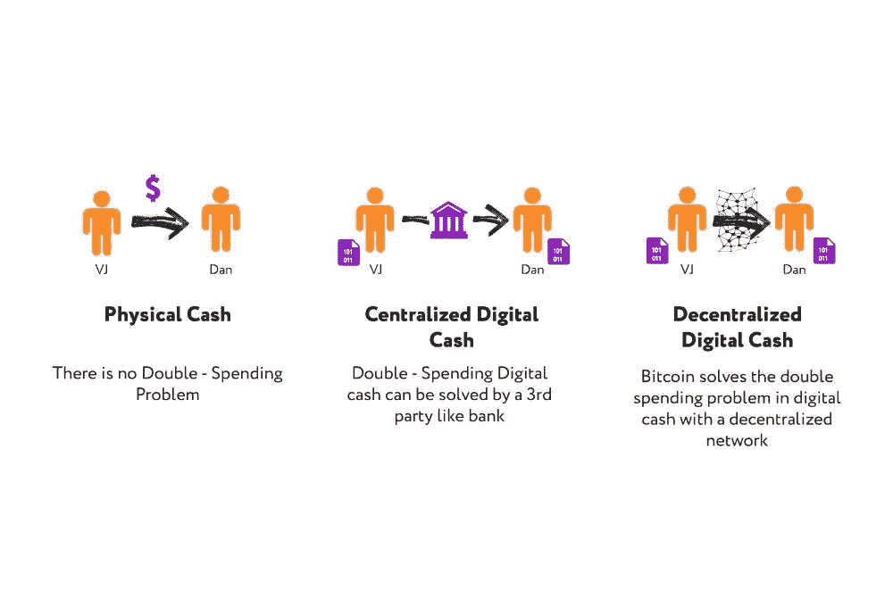

在这里，具有分布式数据库的区块链具有很大的优势。这种类型的数据，我们可以复制到许多计算机，并迫使区块链同步这个数据库。因此，所有关于我们的钱，钱的数量，和它的主人的信息将不是储存在一个特定的人的一台电脑上，而是一次储存在所有的电脑上。此外，由于有成千上万个这样的数据库，丢失这些信息变得更加困难。

# 比特币区块

一个**比特币块**只是一个有数据的块，一个存储一些值的规则结构。通常，这是区块的高度(区块链中的区块编号)、哈希(该区块的唯一指纹)、开采时间、开采者以及许多其他字段。该模块存储一般信息和交易。这里的交易正是在银行概念中使用的。这是从一个账户到另一个账户，从一个人到另一个人的钱数。此外，我们可以看到在块本身中处理的比特币数量。

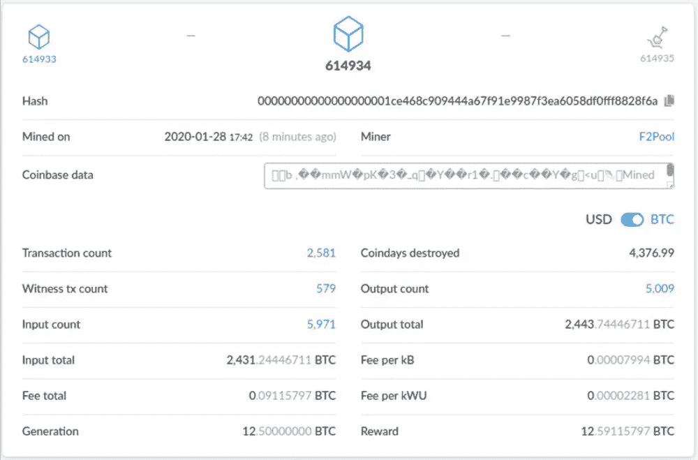

在比特币产生的时候，人们试图避免产生大量的区块。重要的是，不是所有的事务都放在一个块中，并且一个事务没有多个块。区块链基地有必要达到可接受的规模。

因为这个问题，**难度**参数出现了，这有助于创建新的区块。它的主要任务是控制创建新块的速度，并确保每 2 周创建所有 2016 个块(每 10 分钟创建 1 个块)。这是怎么发生的？创建一个块，所有事务都放在其中，然后开始[挖掘](https://blog.coincodecap.com/tag/crypto-mining/)过程。只有到那时，这一块才被送到区块链。主要任务是 10 分钟的挖掘过程，并使其有可能在网络中创建块，而不管有多少人在挖掘比特币或网络中有多少用户。

# 比特币挖矿

这是一个相当简单的过程。我们有一个块(有自己的哈希值、时间等。)和一个叫 NONCE 的数。NONCE 是只使用一次的*号的缩写。随机数是从 0 到无穷大的常规计数器。 **NONCE** 与前一个块的哈希值一起被添加到块数据中，然后计算其哈希值。之后，检查某些条件。如果散列小于**目标值**，则块被挖掘，这意味着满足条件并且块进入区块链。如果散列大于目标值，则 NONCE 被增加，再次被添加到块和前一块的头部，散列被重新计算，验证被完成，等等。*

我们如何比较散列值和目标值，这有什么意义？哈希是一组位，位是一个数。也就是说，HASH 是一个很大的数字。当我们给 HASH 添加某种计数器(NONCE)时，我们就改变它。当我们检查散列值是否小于某个数字时，我们会删除足够多的无效散列值。

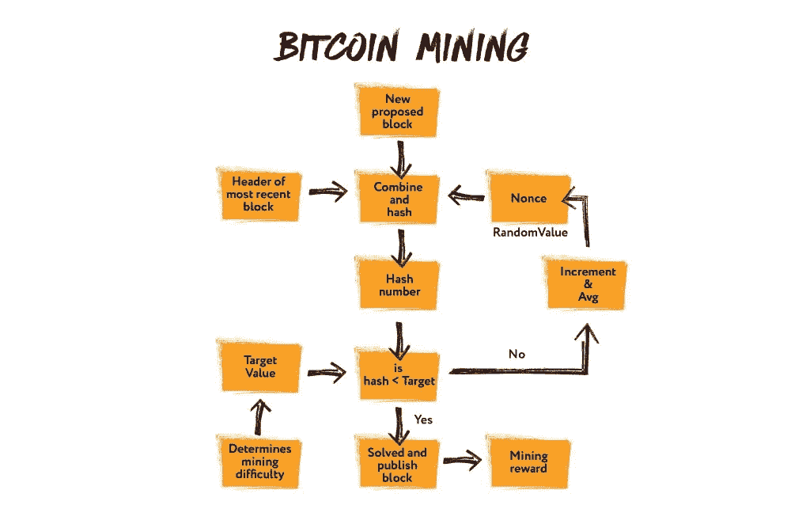

事实上，只需要简单地使计算机工作，并使块创建的过程不那么容易。如果这个过程更简单，每个人都可以创建一个块。这可能会导致重复消费的问题。

由于计算机的速度，如果没有这种验证，一个人将资金转移到另一个人身上，然后重写整个历史，就好像他们没有转移任何东西一样。

# 比特币的特点

1.  **安全** 区块链是最安全的信息存储类型之一。
2.  **匿名
    地址是纯哈希值，与任何人或组织无关。所以，区块链本身保证了用户的匿名性。**
3.  **透明** 一个人无法重写任何东西。我们有一个不变的区块链，我们总是可以看到里面有什么，什么变了。
4.  非常低的佣金这个事实对于各种银行和组织来说尤其重要。举个例子，在比特币的历史上，有一笔 112291802 美元的交易，而佣金只有 0.50 美元。但是我们为什么需要它呢？有必要排除将资金从一个地址转移到另一个地址再转移回来的可能性。这限制了创建空网络活动的可能性，并保护了比特币价格不会发生跳跃。

# 如何获得一枚比特币

今天只有通过采矿或货币交换才有可能。

**加密货币交易所**是一个对买卖加密货币感兴趣的人的社区。如果一个人想要购买比特币，那么他们会找到将在交易所出售比特币的人。这种交易所的存在是为了将比特币兑换成美元、欧元等。，即普通法定货币。

如果有一天人们决定商店里的牛奶可以用比特币购买，对银行的需求将会消失，因为它们将不再被需要。这是不可能的，因为人们更看重美元、欧元和其他货币，而不是比特币，因为钱是可以感觉到的。

如果你看看货币的发展趋势，我们会发现现在数字资产的处置越来越多。其中之一就是 Ripple。目前，银行使用这种技术在它们之间进行交易。Ripple 扩展了一致存储的抽象，并使用了分布式账本技术。

# 以太坊

除了比特币，还有另一种加密技术**以太坊**，它的加密货币是**以太**。然而，这个系统有一个显著的不同。直到最近，比特币的主要和唯一应用领域一直是货币，即保存交易和将资金从一个人转移到另一个人。**以太坊**还有其他功能。它为我们打开了新的视角，并不局限于转移资金。有转让房子，车子，和其他东西的可能。从转移中提取并继续进行一些动作的简单委托(像以前一样，例如，付款)变得可能。也就是说，我们用信息和对它的一些行动来代替货币和它的转移。

我们如何描述这些信息以及在它的帮助下采取的行动？有编程语言允许我们这样做。使用编程语言，我们可以描述我们在做什么，如何做，在什么条件下做，等等。以太坊不是关于钱，而是关于智能合约。简单地说，这是一个创建智能合约的平台。

# 智能合同

首先，智能合约只是一种在区块链上运行的算法。这个算法由所有拥有以太坊节点的人执行。这些智能合同是由那些持有区块链数据库并从事采矿的人执行的。

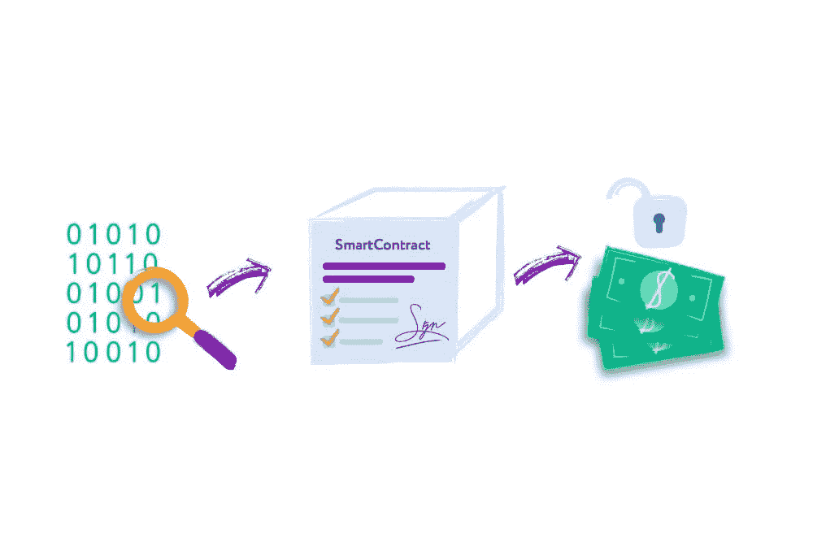

让我们看看智能合同如何在一个简单的买房例子中发挥作用。所以，我们有一个买家和一个卖家。为了出售这套房子，他们必须联系银行、专门机构、律师或其他第三方。这些第三方在销售时收到交易金额的一部分。需要第三方来确认，买家把钱转了，卖家把权利转到了房子上。但是你可以用代码代替第三方。在这种情况下，我们声明法典等同于法律。在交易过程中缔结的通常合同，我们可以翻译成一种编程语言。如果买方将资金转移到智能合同，合同将记录资金转移，并自动将房屋权利转移给买方。并且作为该交易的结果收到的钱，合同转移给卖方。这里不需要第三方来证实这一切。最重要的是，这个智能合同的执行结果被记录在区块链中。

智能合约是用专门的编程语言编写的 **Solidity** 。我们写一个契约，然后用以太坊编译器编译。它为 EVM 创建了一个**字节码。本质上，所有以太坊和区块链都在**以太坊虚拟机**中旋转。这是与例如 GraalVM 或 Java 的 JVM 等相同的虚拟机。块存储在其中，EVM 字节码写入块。写入该块的是**部署合同**。之后，我们可以访问它，调用它，因为我们知道它存储在这个块中。**

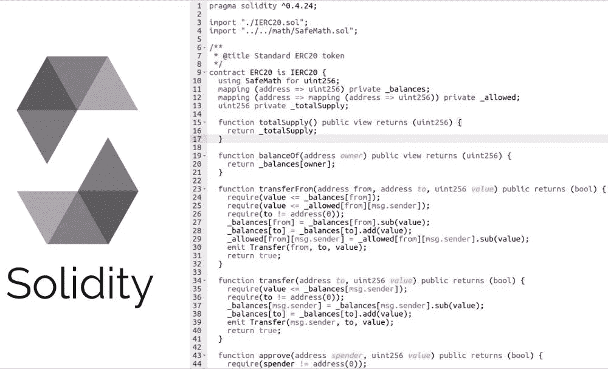

但是，即使在智能合同的情况下，也需要考虑某些事情。假设我们有一个合同，我们可以创建并要求某人履行它。因此，我们不会履行合同。但为什么不创造一个永无止境的循环，让合同永远无法履行呢？需要一定的条件不允许这样做。我们需要天然气来启动智能合同。

那么，我们如何才能要求某人履行智能合同呢？要做到这一点，你需要创建一个交易，转移一定量的以太币，兑换成气体。字节码中执行的每个操作都会消耗一定量的 gas。当天然气耗尽时，合同将停止生效。如果我们想履行合同，那么我们需要给更多的汽油。

# ICO vs IPO

IPO 是一个已经存在多年的标准事物。让我们想象一下，我们有一个足够发达的公司，我们需要大量的资金来进一步发展。在这种情况下我们能做什么？我们可以联系投资人，向他要钱。但是一个投资者不会有那么多钱。很明显，我们需要以某种方式吸引资源。因此，该公司联系银行，并提供交易所和整个社区购买股票。

**IPO** 或**首次公开募股**是公开发售公司股票。当投资者和机构购买股票时，所有收到的钱都转到公司的账户上。收到钱后，公司可以将其投资于进一步的发展。

随着加密货币的出现，出现了 **ICO(初始硬币发行)**这样的概念。这里已经提供的不是股票，而是硬币。我们可以借助以太坊允许我们创建的智能合约来描述这种新货币的转移。在以太坊本身，我们可以创建**令牌**。

代币是一种价值单位，也是一种记账单位，在 T2 国际货币联盟中最常用。这是项目的内部资产，类似于公司的股票。有一个 **ERC20** 标准，它定义了一组必须遵守的规则，以便令牌被接受并能够与网络上的其他令牌交互。任何人现在都可以创建代币。平均而言，100 美元将足以在区块链启动这一智能合约。因此，任何一个在家里有笔记本电脑的人都能够实现 ERC20 标准，并在以太坊数据库中创建自己的令牌。

这和 ICO 有什么关系？如果我们想吸引资金到我们的公司，我们可以创建一个代币。这需要最少的投资，而银行则不需要。银行不会关注中小企业，因为它们习惯于只与大公司合作。有了硬币，一切都简单多了。创造硬币后，我们可以为目标受众投放广告，这样人们就可以购买这些硬币。在那之后，我们将在以太网中接收资金，我们将能够通过**加密交换**提取和接收法定货币。如果公司的价格提高，代币的价格也会提高。

# 工作证明与利益证明

以太坊曾经和比特币几乎没什么区别。然而，很快计划用 [**股权证明**](https://blog.coincodecap.com/tag/proof-of-stake/) 系统替换**工作证明**系统。这将解决一个最重要的问题，即交易创建的时间。过去需要几分钟。另外还需要计算资源，需要大量资金来组织池。这些是转向股权证明的主要原因。

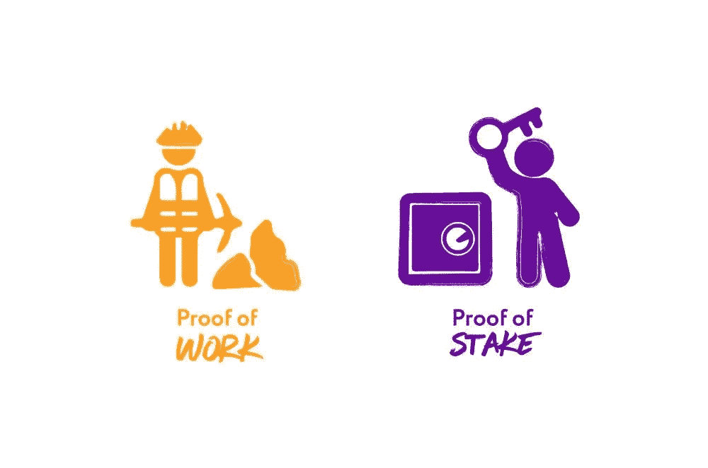

如果**工作证明**需要计算机执行许多计算操作，对于**利害关系证明**拥有一定数量的加密货币就足够了。

进入网络的人越多，网络内的资源就变得越分散。股权证明允许矿商在账户上有更多乙醚时检查更多的交易。如果某人的账户上有大量乙醚，那么我们有更大的可能性可以信任他们，因为他们没有提取乙醚，而且总的来说，他们什么也没做。由于比其他网络参与者更信任他们，我们向他们发送更多的交易。

以太坊切换到**股权证明**的另一个原因是速度。使用 PoS，您可以显著加快交易的验证速度。值得注意的是，除了 PoW 和 PoS 之外，还有许多其他不同的验证模型。

# 结论

目前，区块链技术是世界上最有前途的发展之一。在它的帮助下，你可以革新和自动化大量的活动领域。

在短短几年内，区块链已经从技术世界的一个新奇事物变成了大型银行、公司和政府开始使用的工具，这只会加强人们的信念，即在未来这项技术将会展现出更多的潜力。

> [在您的收件箱中直接获得最佳软件交易](https://coincodecap.com/?utm_source=coinmonks)

*原载于 2020 年 3 月 19 日*[*【https://intexsoft.com】*](https://intexsoft.com/blog/the-blockchain-explained-cryptocurrencies-exchanges-mining/)*。*

