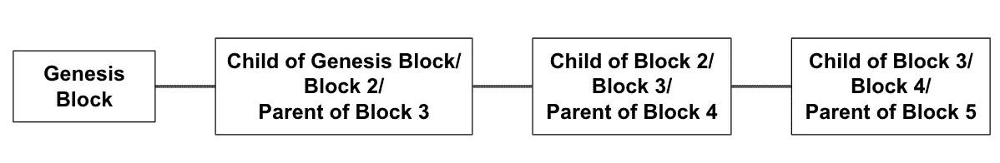
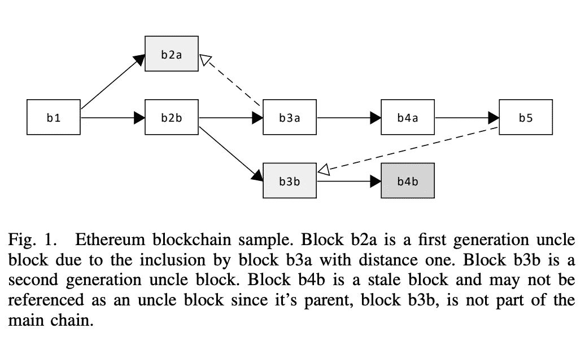
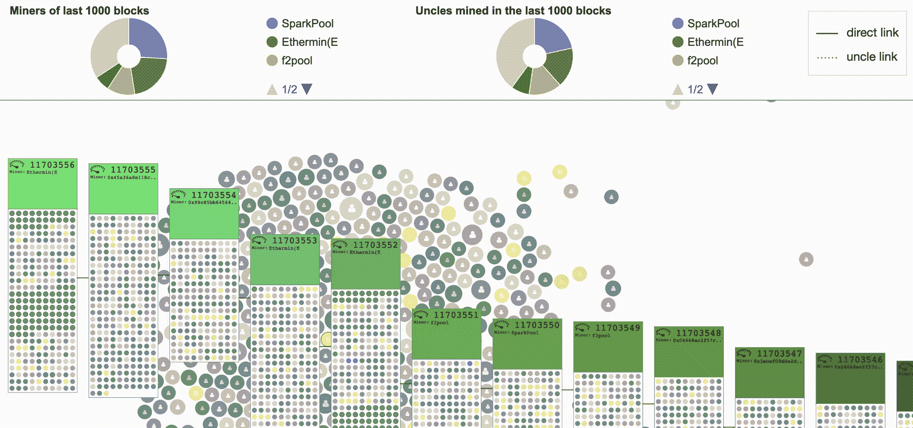

# 区块链家族成员:

> 原文：<https://medium.com/coinmonks/the-blockchain-family-members-34822216d98f?source=collection_archive---------1----------------------->

## 父母、孩子、叔叔、侄子、爷爷和鬼魂。

虽然可能被认为是一个大家庭的成员，但他们毕竟是区块链大家庭的一员。

***父与子***

让我们设想一个区块链是一个物种的几代人的家谱，叫做“街区”。每块积木所携带的是“交易”，是它们一生中发生的事情。这是将永远跟随他们的业力。有许多不同类型的区块链，就像不同的人类种族。

这个物种有些奇怪。除了通常被称为起源块的第一个块(它天生没有父块)之外，每个块仅是一个块的父块，并且每个块仅是一个块的唯一子块。

当一个新的块诞生时，它带有由它的父代传递下来的散列。当它有自己的子节点时，它会将自己的哈希(包括其父节点的哈希和在此期间发生的事务)传递给它的子节点。你可能会说散列就像一个 DNA，可以一直追溯到它的祖先，创世纪块。

每一个区块链种族每一代都有不同的寿命，称为“阻塞时间”。像人类一样，我们的平均寿命是 79 岁，但有些人活得更长，有些人活得更短。Eacf 区块链站有一个平均的“阻塞时间”，但是仍然有一些阻塞时间会更短，一些会更长。

***叔叔、侄子和鬼魂***

关于区块链的另一个奇怪的事情是孩子不是由父母产生的，而是由记录他们那一代人的整个历史的人产生的，有点像一群神。他们像鹳鸟一样把孩子送给合格的父母。

每当一个区块链孩子出生，创造这个孩子的神应该通知所有其他的神。不知何故，有时，不是所有的神都得到信息，可能有不止一个神创造了一个孩子，最后一个父母有两个或更多的孩子。这是不允许的。

在一个像以太坊一样有很短阻塞时间的区块链中，有很大的机会同时创造两个或更多的孩子。在这种情况下，只有一个孩子包含在家谱中，其余的孩子将成为过时的成员并被抛弃。通常，这些被遗弃的孩子被称为孤儿，因为他们没有父母。

这削弱了区块链种族对抗撒旦攻击的力量，并可能导致众神的集中化。这两种情况都不是有利的。为了解决这些问题，以太坊召唤出了 GHOST，贪婪最重的观察子树协议。你可以把幽灵看作是从上面照看整个区块链种族的祖先。它喜欢尽可能地让大家在一起。通过这种协议，没有被包括在主家谱中的孩子可能被包括在子家谱中，并且被称为叔叔。叔叔只能被侄子邀请到子树中，侄子是主家谱中其兄弟姐妹的合法子女。只有在主系谱树上有父母的区块才可以被认为是叔叔。如果块的父代来自子系谱树，它将不会被邀请成为叔叔。请参考下图查看可视化解释。

Source: [https://arxiv.org/pdf/1805.08832.pdf](https://arxiv.org/pdf/1805.08832.pdf)

一个大叔不一定是被直系下一代邀请的。可能是玄孙发出邀请，一直到第七代。(都是指侄子，“曾-曾”加进来只是给你代的概念。)每个侄子只能邀请 2 个叔叔到子家谱。两个伯侄关系都会得到相应的奖励。

*(你可以在这里读到更多的***)，标题下的“Stales，Efficiency and Centralization”和“GHOST”为细节，正如本文所谈的是家庭纽带。让我们把这个留给另一个时间。)**

**

*Illustration of block creations and the links between Uncle and Newphew. Source: [http://www.ethviewer.live/](http://www.ethviewer.live/)*

****爷爷****

> *祖父(基于 GHOST 的递归祖先派生前缀协议)是为 Polkadot 中继链实现的终结性小工具。— [波尔卡多特维基](https://wiki.polkadot.network/docs/en/learn-consensus)。*

*爷爷是另一个区块链种族波尔卡多特的最终决定权人。它的行为就像区块链以太坊比赛中友好的终结幽灵卡斯珀。父母无权选择与哪个孩子断绝关系。在波尔卡多特，权力掌握在爷爷手中。一旦最终决定留下哪个孩子，多余的孩子将被从家谱中剔除。从那时起，任何父母都不能与孩子断绝关系，任何孩子都不能离家出走；没有外人(攻击者/撒旦)可以来打破家庭纽带。几代人从此安全地生活在一起。*

*(相关阅读:[以太坊 2.0 vs 符号(第二部分):共识协议](https://ivyfung1.medium.com/ethereum-2-0-vs-symbol-part-2-consensus-protocols-73e0a2589242?sk=cd76097533495f30abb79c65cd693107))*

****奖金:美女****

*来自 Polkadot 的 BABE 代表 Block Extension 的盲分配。它做到了它所说的:根据神的投资和一个叫做 Polkadot 随机循环的系统，随机分配块生产者(神)。它通过制定备份计划来确保在给定的时间段内产生一个子代，在备份计划中，它使用循环法在后台选择一个额外的生产者来产生第二个子代。如果第一个被选中的神没有生育孩子，第二个孩子将作为合法的孩子。如果产生了第一个孩子，第二个孩子也不会被驱逐。这将如何处理？那是另一个话题了。*

*你可能会认为贝比是真正关心整个区块链种族延续的生育顾问。*

*你现在已经见到了一些不同区块链种族的家庭成员。我希望你有兴趣更多地了解整个物种。直到下次讲故事的时候。*

**参考文献:**

1.  *第七章。区块链[https://www . oreilly . com/library/view/mastering-bit coin/9781491902639/ch07 . html](https://www.oreilly.com/library/view/mastering-bitcoin/9781491902639/ch07.html)*
2.  *【https://eth.wiki/en/fundamentals/design-rationale *
3.  *[https://arxiv.org/pdf/1805.08832.pdf](https://arxiv.org/pdf/1805.08832.pdf)*
4.  *[https://blog . ether eum . org/2014/07/11/forward-a-12-second-block-time/](https://blog.ethereum.org/2014/07/11/toward-a-12-second-block-time/)*
5.  *[https://wiki . polkadot . network/docs/en/learn-consensus](https://wiki.polkadot.network/docs/en/learn-consensus)*
6.  *[https://polkadot . network/polkadot-consensus-part-2-爷爷/](https://polkadot.network/polkadot-consensus-part-2-grandpa/)*

> *加入 coin monks[Telegram group](https://t.me/joinchat/EPmjKpNYwRMsBI4p)学习加密交易和投资*

## *另外，阅读*

*   *什么是[闪贷](https://blog.coincodecap.com/what-are-flash-loans-on-ethereum)？*
*   *最好的[密码交易机器人](/coinmonks/crypto-trading-bot-c2ffce8acb2a)*
*   *[3 商业评论](/coinmonks/3commas-review-an-excellent-crypto-trading-bot-2020-1313a58bec92) | [Pionex 评论](/coinmonks/pionex-review-exchange-with-crypto-trading-bot-1e459d0191ea) | [Coinrule 评论](https://blog.coincodecap.com/coinrule-review-a-perfect-trading-bot)*
*   *[AAX 交易所评论](/coinmonks/aax-exchange-review-2021-67c5ea09330c) | [德里比特评论](/coinmonks/deribit-review-options-fees-apis-and-testnet-2ca16c4bbdb2) | [FTX 密码交易所评论](/coinmonks/ftx-crypto-exchange-review-53664ac1198f)*
*   *[n 零审核](/coinmonks/ngrave-zero-review-c465cf8307fc)*
*   *[按位交换审查](/coinmonks/bybit-exchange-review-dbd570019b71) | [位码审查](https://blog.coincodecap.com/bityard-reivew)*
*   *[3Commas vs Cryptohopper](/coinmonks/3commas-vs-pionex-vs-cryptohopper-best-crypto-bot-6a98d2baa203)*
*   *最好的比特币[硬件钱包](/coinmonks/the-best-cryptocurrency-hardware-wallets-of-2020-e28b1c124069?source=friends_link&sk=324dd9ff8556ab578d71e7ad7658ad7c)*
*   *[总账 vs 平均](https://blog.coincodecap.com/ngrave-vs-ledger)*
*   *[密码本交易平台](/coinmonks/top-10-crypto-copy-trading-platforms-for-beginners-d0c37c7d698c)*
*   *[莱杰纳米 s vs x](https://blog.coincodecap.com/ledger-nano-s-vs-x)*
*   *[Vauld Review](https://blog.coincodecap.com/vauld-review)|[you hodler Review](/coinmonks/youhodler-4-easy-ways-to-make-money-98969b9689f2)|[BlockFi Review](/coinmonks/blockfi-review-53096053c097)*
*   *最好的[加密税务软件](/coinmonks/best-crypto-tax-tool-for-my-money-72d4b430816b) | [硬币追踪评论](/coinmonks/cointracking-review-a-reliable-cryptocurrency-tax-software-5114e3eb5737)*
*   *最佳[加密借贷平台](/coinmonks/top-5-crypto-lending-platforms-in-2020-that-you-need-to-know-a1b675cec3fa)*
*   *[莱杰 Nano S vs Trezor one vs Trezor T vs 莱杰 Nano X](https://blog.coincodecap.com/ledger-nano-s-vs-trezor-one-ledger-nano-x-trezor-t)*
*   *[block fi vs Celsius](/coinmonks/blockfi-vs-celsius-vs-hodlnaut-8a1cc8c26630)vs Hodlnaut*
*   *[Bitsgap 审核](/coinmonks/bitsgap-review-a-crypto-trading-bot-that-makes-easy-money-a5d88a336df2) | [Quadency 审核](/coinmonks/quadency-review-a-crypto-trading-automation-platform-3068eaa374e1)*
*   *[埃利帕尔泰坦评论](/coinmonks/ellipal-titan-review-85e9071dd029) | [赛克斯斯通评论](https://blog.coincodecap.com/secux-stone-hardware-wallet-review)*
*   *[BlockFi 评论](/coinmonks/blockfi-review-53096053c097) |在您的密码中赚取高达 8.6%的利息*
*   *[DEX Explorer](https://explorer.bitquery.io/ethereum/dex) 和[区块链 API](https://explorer.bitquery.io/graphql)*
*   *[加密套利](/coinmonks/crypto-arbitrage-guide-how-to-make-money-as-a-beginner-62bfe5c868f6)指南:新手如何赚钱*
*   *最佳[加密制图工具](/coinmonks/what-are-the-best-charting-platforms-for-cryptocurrency-trading-85aade584d80)*
*   *了解比特币的[最佳书籍有哪些？](/coinmonks/what-are-the-best-books-to-learn-bitcoin-409aeb9aff4b)*

> *[直接在您的收件箱中获得最佳软件交易](/coinmonks/newsletters/coinmonks)*

**