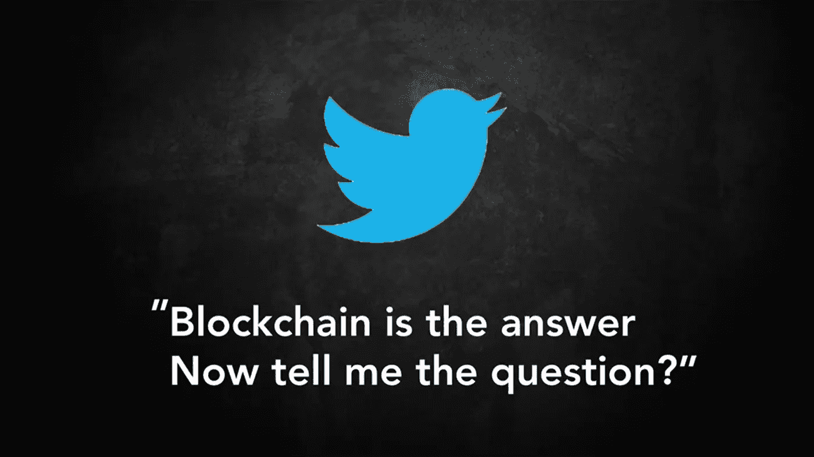
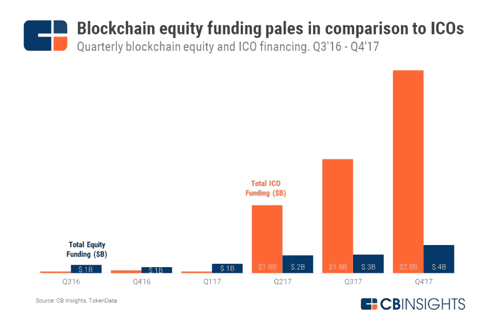
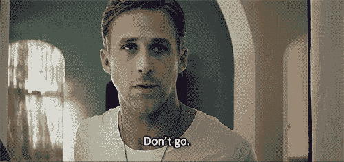

# 区块链:只是炒作吗？

> 原文：<https://medium.com/coinmonks/the-blockchain-hype-c0717acf973c?source=collection_archive---------0----------------------->

## 区块链经常被吹捧为下一个互联网。一项意义重大的创新，它将彻底改变我们的生活方式。

# 区块链炒作没有击中要害

甚至比人工智能更重要的是，区块链是大多数高管知道他们应该关心的东西，但还没有真正想出如何使用它。

我看到有人宣称区块链是解决所有公司问题的灵丹妙药。

这不是真的。

围绕区块链炒作的主要原因是，这只是我们所处的炒作周期的一部分。

包括区块链在内的促销活动源自标准机构和机构投机者，顺便提一下，这些正是它在任何情况下都希望避开的群体。

> “怀疑主义比任何人对任何事情的盲目相信都更有必要和价值”
> ——卡罗琳·金

这至少适用于现在。

通常情况下，强烈的嗡嗡声和难以掌握的技术的混合导致一些人不去进行批判性思考，尽管他们可能会这样做。一些公司的[股票上涨的那种 ***把“*** ”三个字放在名字里就是一个例子。](https://www.cbinsights.com/research/blockchain-vc-ico-funding/)

2017 年，ico 总共在近 800 笔交易中筹集了超过 50 亿美元。将这些数字放在大背景下看，股票投资者在该行业的 215 笔交易中配置了 1B 美元。

# 区块链不负众望吗？

在基本层面上，区块链可以在任何情况下被利用，然而我们现在相信一些物质以新的方式处理我们的信息，帮助我们互动。在这一点上，当你认为有许多情况符合这一描述时，例如脸书、亚马逊和优步，它们确实有一个帮助我们互动的前提。也许有一天，区块链会编造新的在线模型，让我们拥有自己的信息，或者出售我们的合法考虑。

当区块链消除对中介的需求时，区块链提醒我们为什么我们发现这些中介很难做。

*   **中介可以纠正失误。**

释放你的网上银行密码，你的银行会发给你另一个免费的比特币钱包密码，你就可以和你的比特币说再见了。

*   **中介解决纠纷。**

在任何情况下，如果在任何区块链授权的阶段出现争议情况，不存在解决争论的工具。

*   **如果你的智能合约代码有错误，你会失去全部现金。**
*   如果有人有效地黑掉了区块链的安全系统，你会失去所有的钱。

从众多观点来看，相信创新比相信个人更有热情。

出于某种原因，

*   **区块链可能很慢，很耗电。**

例如，比特币每秒钟可以进行 3 到 4 次交易，而 Visa midpoints 每秒钟可以进行 1600 次交易，据估计，为了验证这些交易，解决这个密码难题的计算机消耗的电力相当于 7 座邓杰斯核电站同时发电的电力。

攀登区块链的技术挑战似乎是真实的。

> “在大约 90%的情况下，区块链不是某个公司或组织的解决方案，有一个更好的答案。”

尽管如此，对 10%来说，区块链是一个好兆头，是一个突破性的扩张，带来了直率、责任和巨大的优势。关键是要认识到这种创新是什么，做了什么，能做什么。

嗯，事情是这样的…

# 革命还没有完全发生

然而，大银行已经变得越来越大，越来越根深蒂固，隐私只存在到下一次黑客攻击。万事达卡敲诈是无法回避的事实。许多“遗留系统”曾经被设计来使我们的生活更轻松，使我们的经济更有效率，但现在已经不能胜任这项任务了。然而，有一种方法可以克服这一切――一种新型的操作系统，它有可能彻底改变我们经济的大部分领域:有人认为是区块链。

区块链正被用于通过供应链跟踪商品，或应用于发达国家的特许创新。或者更快地签订合同，以便更安全地管理我们的投票系统。

> “在许多情况下，一旦克服了最初的障碍，就可以节省成本——显然，引入任何新系统都是昂贵的，”
> 
> ——企业家海伦·迪斯尼

尽管区块链的慷慨陈词毫无疑问会继续下去，但就连伯奇这样的怀疑者也认为，一些积极参与的应用程序可能会显示出优势。
到目前为止，区块链可能还没有改变世界——但它已经引起了很多人的思考。

*2020 年，我们预计将会看到混合区块链模型的实验增加，包括金融部门(例如，分散金融或 Defi 和“合成”CBDCs)和公共部门(智能合同的使用增加)。*
*出自* [*世界经济论坛年会*](https://www.weforum.org/events/world-economic-forum-annual-meeting-2020) *。*

# 炒作正在扼杀区块链技术

区块链发明才十年，难道我们在搞清楚它的好处之前，不应该期待一些错误的举动和错误的开始吗？
这是一个像现代软件套件中许多其他工具一样的工具。并且应该在相关的地方应用。Long Blockchain Corporation 的股价立即暴跌 96%，这并不奇怪。

但是，这也不应该让我们对某一天可能发生的事情过于怀疑。

> “我确实认为区块链的基础设施会继续存在。”
> 
> 苏姿丰

阅读更多信息:

*   [区块链将如何转变制造业和供应链](https://internetofbusiness.com/iot-101-how-blockchain-impacts-manufacturing-and-supply-chains/)
*   [https://www . investopedia . com/tech/forget-比特币-区块链-未来/](https://www.investopedia.com/tech/forget-bitcoin-blockchain-future/)
*   [https://www . wired . com/story/whats-区块链-无用之人/](https://www.wired.com/story/whats-blockchain-good-for-not-much/)

> [直接在您的收件箱中获得最佳软件交易](https://coincodecap.com/?utm_source=coinmonks)

