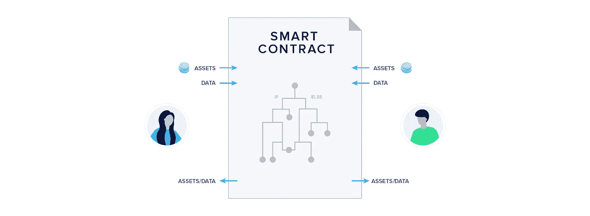
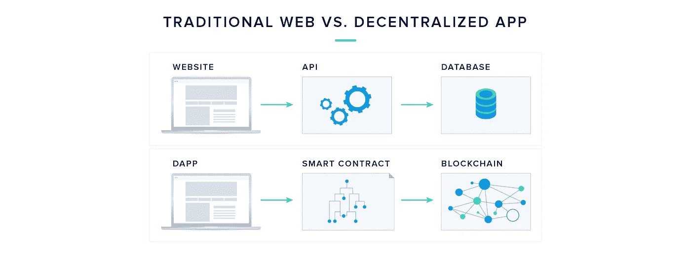
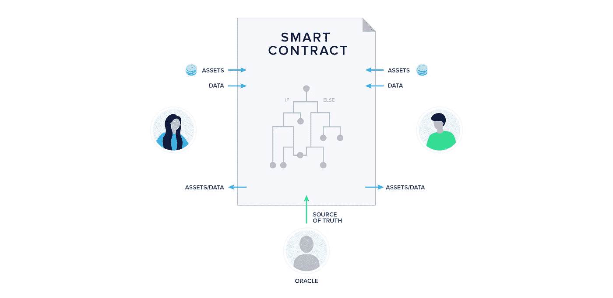
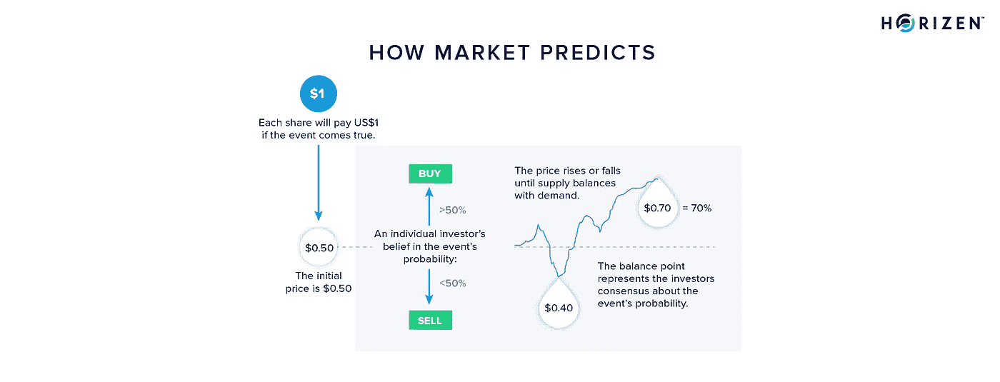
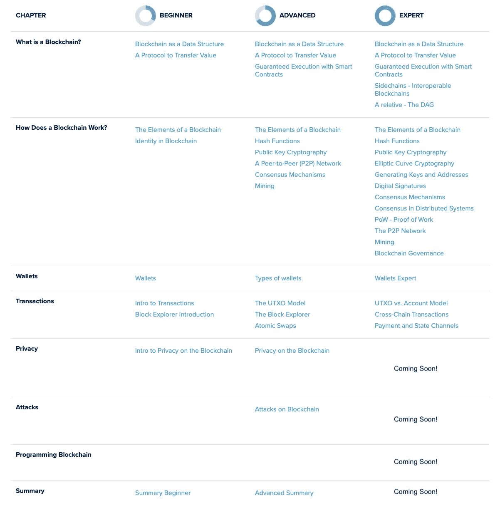

# 智能合约——运行应用的区块链

> 原文：<https://medium.com/coinmonks/the-blockchain-running-applications-80ec0d9c3eb0?source=collection_archive---------0----------------------->


## 区块链不仅仅可以存储数据；它还可以运行软件—满足智能合同。

*本文是* [*堀森书院*](https://bit.ly/3dcZxnH) *专家内容及章节* [*什么是区块链？*T12”。](https://bit.ly/310g4sK)

*如果你觉得这篇文章中的信息比你需要的更多，可以考虑阅读它的* [*高级*](https://bit.ly/3dMs7fV) *级别版本。它传达了相同的概念，但没有那么详细和复杂。*

很多人都这么说过，我也是:智能合约既不是智能合约，也不是合约。在大多数情况下，它们是区块链上的软件。智能合同需要用它所在的区块链的协议定义的特定语言来编写。

合同可以被定义为双方之间的一种协议，这种协议将双方约束在未来发生的事情上。“智能”一词来自这些数字“契约”的自动执行。

而第一种加密货币比特币已经使用名为 *Scrypt* 的脚本系统支持在其上运行的基本逻辑。像 *Solidity* 这样复杂的智能合同语言在[以太坊](https://www.ethereum.org/)这样的平台上实现了更复杂的智能合同。

在简单的脚本系统和更复杂的、 [*图灵完整的*](https://stackoverflow.com/questions/7284/what-is-turing-complete) 系统之间有一个折衷。虽然前者不允许复杂的逻辑，但它更容易编写程序并保护它们。功能丰富的语言允许更精细的智能合约，但它们更容易出错，也更难保护。

智能合同环境中的安全性意味着考虑合同执行的每一种可能方式，并考虑其中的每一种情况。简单的智能契约语言具有较少的潜在用例，但使契约的可能状态更容易枚举、检查和说明，从而更容易保护契约。

## 静态代码与契约实例

智能合同一词可以有两种含义。它可以引用给定语言中的静态代码或执行代码的动态对象*契约实例*。操作系统中的程序和进程也有类似的区别。

> 人们可以将智能合约实例视为可信的第三方，用户可以向其发送硬币，并且可以根据静态代码中写的条件在各方之间分发硬币— Dziembowski，Faust，Hostáková，[国家频道论文](https://eprint.iacr.org/2018/320.pdf)



让我们来看看下面的一些智能合同用例，以直观地了解智能合同的好处。

## 加密令牌

加密令牌或简称为*令牌*是区块链上的数字项目。它们可以代表使用平台、金融资产或一块数字不动产的权利。

假设 Netflix2.0 可能会出售网飞令牌，如果你想访问他们的流媒体服务，每个月需要使用一个令牌。代币也可以代表债券的一部分，所有权伴随着定期的利息支付和到期日的偿还。

大多数代币是在以太坊区块链上使用 [*以太坊征求意见* (ERC-20)标准](https://eips.ethereum.org/EIPS/eip-20)发行的，该标准最早由 [Fabian Vogelsteller](https://medium.com/u/4b59b3ef14a2?source=post_page-----80ec0d9c3eb0--------------------------------) 提出。

令牌在智能合约中发行，智能合约定义了令牌传输的总供应量和条件等。ERC-20 令牌标准是一种智能合约模板，允许轻松发行并与不同的钱包和交易所集成。如果你想更仔细地了解一下代币的发行过程，甚至想亲自尝试一下，这里的[是一个简单易懂的指南。](/coinmonks/6-steps-to-erc20-tokens-and-ico-smart-contracts-e90523afafa1)

## 支付渠道

另一个经常与智能合约无关的用例是[支付和状态通道](https://bit.ly/3eeSqwk)。在大多数情况下，它们允许发生在链外的交互就像发生在链上一样不可信。最受欢迎的支付渠道网络可以说是比特币上的[闪电网](https://lightning.network/)。

# 减少对中间商的需求

智能合同承诺大大减少对律师或公证人等中间人的需求，从而降低做生意的成本。最重要的是，它们通过消除中介节省了参与者的时间。可以构建许多用例来实现这一点。

想象一个体育俱乐部及其票务流程。不需要收取费用的第三方参与，只需要一个票务平台的开源实现就可以让许多票务服务过时。

一个算法的非正式的高级描述叫做*伪代码*。例如，以下是票证智能合同的伪代码:

```
program Ticketing
while (number of tickets sold <= max. amount of tickets available for the event)
{
	if only personalized tickets can be issued {
		ask buyer for personal details
    	        safe personal details
		put address on the whitelist
   	} if amount x is received from address Y {
		if there is a whitelist && Y is not on the whitelist {
      			refund address Y
      			end program
    		} send Y the correct amount of tickets
		increment "number of tickets sold"
  	} if address Y sends message "I want to sell" {
		refund address Y 
		invalidate ticket  
		decrement "number of tickets sold"
  	}
}
```

智能合同不仅可以实现售票和退票。可以建立一个具有自我执行规则的自动化二级市场。虽然上面的例子显然过于简化，但它应该让您了解智能合约中使用的逻辑。

智能合同的某些动作的执行由*消息*触发。这些消息可以是转账交易，也可以是仅传输数据的消息。稍后我们将回到由数据触发的智能合约。

当一组条件组合在一起启用一个应用程序时，这个智能契约集合被称为 dApp，即一个分散的应用程序。不过，智能合约和 dApps 之间的界限有点模糊。

## 分散式应用— dApps

智能契约经常在分散应用程序或 dApps 的上下文中讨论。dApp 几乎可以是任何东西，从分散的交易所到拍卖平台或游戏。你可以在 dApps 的[状态上找到今天市场上的广泛概述。](https://www.stateofthedapps.com/)

dApp 允许其用户执行一组功能、任务或活动，就像任何其他应用程序一样。大多数传统应用程序使用 API(应用程序编程接口)与其各种组件进行通信，如社交媒体集成、底层数据库或微服务。

dApp 使用一个或多个智能合约与其底层区块链以及非区块链组件进行通信。智能合同可以用来检测用户的付款，向用户支付款项，充当托管服务，或根据某种形式的提交数据触发操作。



我们仍处于分散应用的早期阶段。已经有并将会有许多成长的烦恼。一些 bug 导致了用户的资金损失，另一些 bug 导致了网上交易的低效使用。虽然良好开发和审核的智能合约库将使 dApps 的开发更加容易和安全，但是像 [sidechains](https://bit.ly/3fJ3vpF) 这样的扩展方法可以允许智能合约的通信进行扩展。智能合约平台是专门设计的，不仅支持区块链上的资金，还支持智能合约和 dApps 的部署。

# 智能合约平台

数字世界似乎偏爱赢家通吃或者至少赢家通吃的场景——想想谷歌、脸书、网飞或者亚马逊。可以想象，智能合约平台的市场也将朝着类似的方向发展。更好的技术吸引更好的开发人员，开发人员构建更好的工具和库，这使得项目更容易使用平台，从而带来更多的开发人员。

这不仅使平台本身更具吸引力。更容易将代币集成到现有的[钱包](https://bit.ly/2YdlSgM)中；在交易所上市因广泛接受的标准而得到简化，dApps 之间的互操作性得到提高。所有这些可能会以非常不同的方式进行，并且在这个领域有很多争论。但从今天的角度来看，赢家通吃的情况肯定要以非零概率来考虑。

但是今天的集中式 web 可能有一个重要的区别:用户可以在底层的区块链上拥有他们的数据。[锁定效应](https://en.wikipedia.org/wiki/Vendor_lock-in)减少，从一个 dApp 切换到另一个可能会比现在的成本更低。Joel Monegro 在 2016 年提出的 [*Fat 协议论文*](https://www.usv.com/blog/fat-protocols) 描述了价值在协议层而不是应用层被捕获的这种影响。今天，大多数人反对这个论点，但是它仍然有一定的道理，并且经常被讨论。

我们想包括这个小旅行，以说明区块链技术的多学科性质。不仅仅是技术。它融合了经济学、社会经济学、博弈论、计算机科学等等。

为了让自己成为该领域的“专家”，你应该知道一些超出技术本身的讨论和思想实验。但是现在，让我们继续。

# 利用智能合约进行扩展

智能合同给区块链有限的吞吐量增加了额外的负担。它不仅需要存储对用户清晰可见的事务和数据。许多纯数据交易用于智能合约之间的通信。 [CryptoKitties](https://www.cryptokitties.co/) 的推出给以太坊区块链带来了很大压力，导致交易费用大幅上涨，确认时间长。

## 使用正确的会计模型

区块链有两种不同的结算或会计系统——[UTXO 模式和基于账户的模式](https://bit.ly/2YT021d)。

> 第一个模型是在用户之间移动的资产的有向图，第二个模型是具有当前网络状态的数据库—德米特里·米舒宁

大多数智能合约平台都使用帐户模型，因为它使智能合约的开发更加直观，并且数据密集程度更低。有两种类型的帐户:

*   私钥控制的**用户账户**
*   **合同**-密码控制**账户**。

每个帐户都有自己的余额、存储空间和代码空间，用于调用其他帐户或地址。

## 将数据移出链

除了账户模型实现的协议层效率提升之外，[状态通道](https://bit.ly/3eeSqwk)等第二层技术是一种很有前途的方法，可以让智能合约平台实现规模化。它们是将状态修改移出链的几种技术之一，将所需的操作重新定位到可以以较低成本执行的辅助环境中。

只有双方之间的状态通道的打开和关闭需要链上事务。此后，双方几乎可以无限期地进行交互，而无需向区块链广播任何更新。

> “当事方与合同实例的互动总是“本地的”，即当事方自己计算新的状态[……]，然后只是[在其上]交换签名。”— Dziembowski，Faust，Hostáková，[国家频道论文](https://eprint.iacr.org/2018/320.pdf)

## 并行处理

另一种扩展方法是使用[侧链](https://bit.ly/3fJ3vpF)。虽然有时也被称为第二层技术，但它实际上是一种基于并行化的方法。侧链本身就是一个区块链，能够与中央*主链*通信。这种通信可以包括数据或资产的交换。

dApp 可以在专用的侧链上启动，在侧链上，参数针对当前应用的特定需求进行了优化。它甚至可以运行与主链不同的[共识机制](https://bit.ly/2YIHPDe)。根据具体的构造，可能必须提供激励，以便节点运行侧链(在 PoS 侧链模型中)或矿工执行合并挖掘(在 [PoW](https://bit.ly/2zPfLG6) 侧链模型中)。


有许多方法可以实现可扩展的智能合约平台，通常还会结合不同的方法。但是，除了创建具有足够吞吐量的系统来大规模采用智能合同和 dApps 之外，还有另一个问题需要解决:oracle 问题。

# 甲骨文问题

智能合约的承诺是允许自动执行规则的无信任执行。但他们真的能兑现这一承诺吗？

大多数资产受各自当地司法管辖。这意味着一份合同，无论是否明智，除了对合同本身的信任之外，还需要对管辖区的额外信任。智能合同中的占有不等于现实世界中的占有。正如常规合同一样，条款可能会受到不断变化的环境和解释的影响。非法合同没有法律约束力。我们将需要看到新一代精通技术的律师出现，以便有意义地采用具有法律约束力的智能合同。

另一个需要克服的主要挑战是 oracle 问题。智能契约需要了解真实世界的事件(取决于用例)，以便它能够运行和执行。oracle 是向智能合同提交数据的实体。随之而来的信任问题被称为 oracle 问题。

想象一下，一份智能合约在一个据称不可信的环境中运行一个博彩平台。先知需要提交一场比赛的结果，以便让智能合约将资金分配给获胜者。因为 oracle 决定了智能合约看到什么，所以它也控制着它做什么。



集中式 oracle 不被认为是 Oracle 问题的解决方案。无论实际实现看起来如何，在某些情况下，不真实地提交数据的动机可能会超过诚实行事的好处。根据可信任的第三方提供的信息进行不可信任的执行有什么意义？正如吉米·宋(Jimmy Song)所言:“一份信任第三方的聪明合同消除了不信任这一致命特征。”

无论是集中式还是分散式，oracle 都是有成本的。诚实行事必须永远是最有利可图的策略，因此需要为提交真实数据提供强有力的激励。这是一个需要博弈论评估和激励设计的问题。

## 预测市场

高度依赖甲骨文的智能合约的一个用例是 [*预测市场*](https://www.getsmarter.com/blog/wp-content/uploads/2017/07/mit_prediction_markets_report.pdf) 。预测市场为特定事件创造了一个市场，市场参与者基本上是“交易结果”。最著名的预测市场项目是[预测](https://www.augur.net/)和[预测](https://gnosis.io/)。

为了举例说明，让我们假设一个具有二元结果的事件:是 X 队还是 Y 队赢得了超级碗。一个参与者以 1 美元买入并得到两份期货合约，每份对应一个结果。其结果实现的期货合约支付 1 美元，另一个 0 美元。



同样可能的结果是，参与者不知道该保留哪份合同，该出售哪份。两者的交易价格都应该在 0.50 美元左右。如果一个参与者对一个结果有很高的信心，比如说 X 队赢了，他将出售在 Y 赢的情况下支付的合同。

如果许多人想法相同，这就增加了对合同 X 的需求，增加了合同 Y 的供应。期货合同 X 的价格上涨，而合同 Y 变得更便宜，例如 0.70 美元对 0.30 美元。期货合约的价格可以解释为相应事件发生的可能性，在这种情况下，X 队获胜的可能性为 70%。

这种构造依赖于一些神谕提供关于事件结果的信息。一些受信任的实体可以提交该信息，但是这将产生对新型中介的依赖。oracle 问题的分散式解决方案目前并不存在。

正如丹芬利(Dan Finley)所言，由于预测市场有可能影响一个事件的结果，它们在大范围内如何发挥作用仍有待观察。

在解决创建具有法律约束力的智能合同的问题和 oracle 问题之前，智能合同的使用将受到限制。令牌的创建是一个有价值的用例，独立于前面提到的当前缺点。另一个潜在用例的例子是游戏中的支付，由代码客观验证的某些成就触发。

# 摘要

智能契约可以确保在代码强制执行的双方同意的条款的基础上客观地执行。它们有可能减少中间商，从而降低成本和节省时间。它们很可能会促进软件开发商和司法系统之间的更紧密联系。

令牌的创建和[国家和支付渠道网络](https://bit.ly/3eeSqwk)的部署是智能合约最常见的用例。在我们看到广泛采用之前，我们必须克服一些障碍。必须解决伸缩问题，因为完全在链上运行的智能合约对其底层区块链施加了很大压力。第二层技术，如状态通道或并行化方法，如[侧链](https://devweb-academy.horizen.global/horizen/expert/sidechains/)可以解决这个问题。

对于许多用例来说，智能合约需要通过神谕来了解真实世界的事件。集中式解决方案消除了智能合约的致命特征——不信任，而*预测市场*可能会以一种有问题的方式围绕事件的概率创造激励。在我们看到智能合约在不同领域的广泛使用之前，还有很长的路要走，但它们绝对是一个值得探索的概念。

*如果你觉得这篇文章有价值，请考虑访问* [*地平线学院*](https://bit.ly/3dcZxnH) *。在那里你还会找到一个* ***的进一步阅读*** *列表，下面列出了大多数文章，引用了同一主题的伟大文章。*

Horizen Academy 的文章有三种复杂程度:初级、高级和专家。如果你开始阅读一篇文章，只是意识到它太详细或不够详细，你可以简单地使用侧边栏切换级别。

*下面有一段* [*概述了*](https://bit.ly/3fFoTMz) *写作时的全部内容。*

如果你想在 Twitter 上关注我:[给你](https://twitter.com/SLebur)；)



> [直接在您的收件箱中获得最佳软件交易](https://coincodecap.com/?utm_source=coinmonks)

[](https://coincodecap.com/?utm_source=coinmonks)