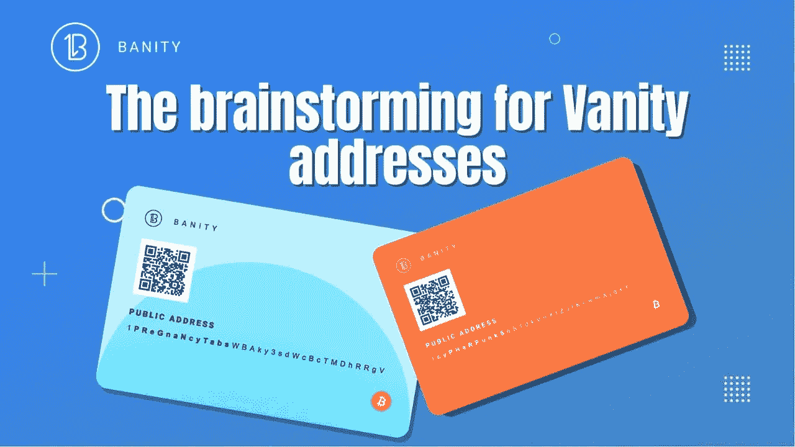
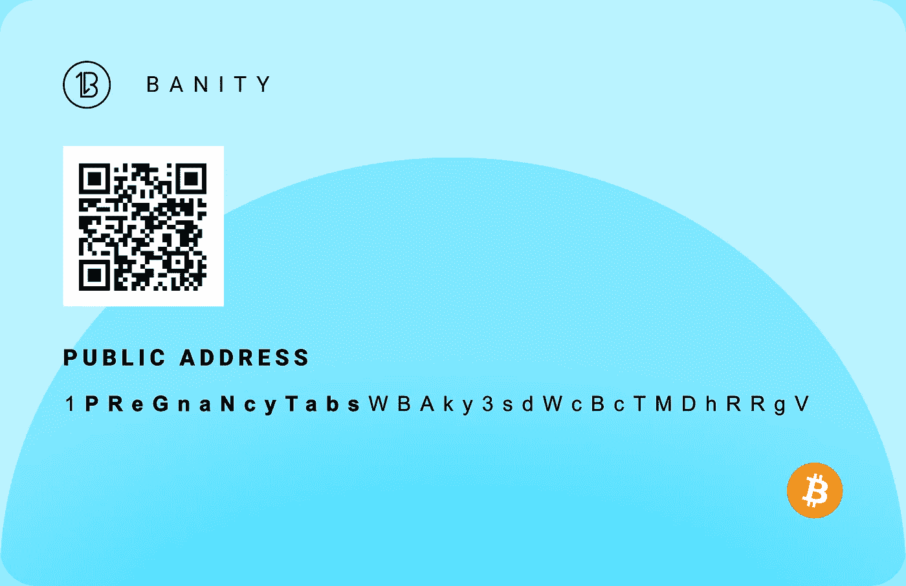
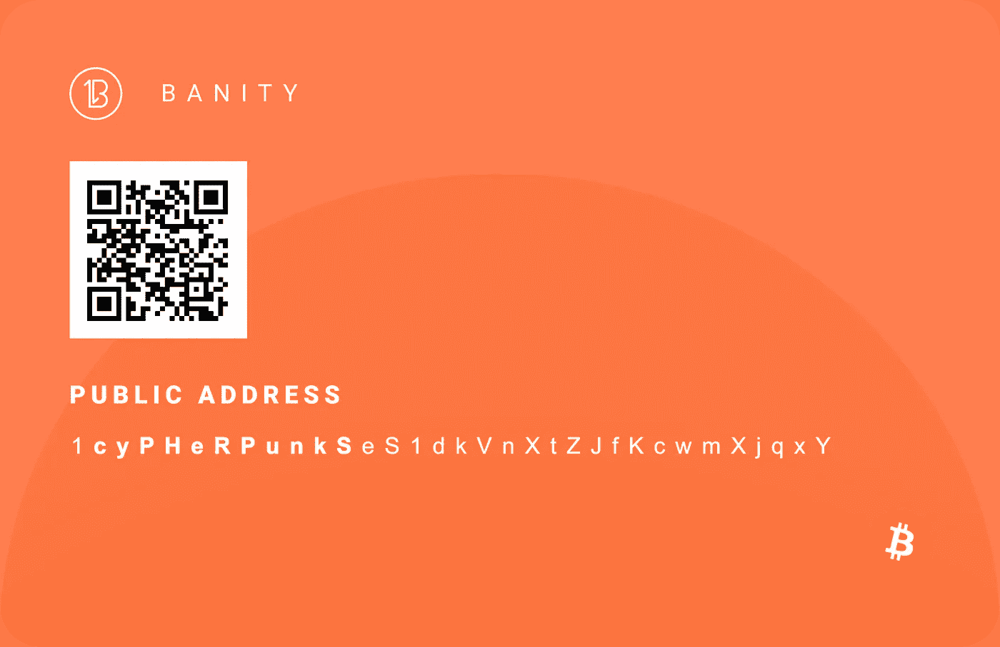

# 虚荣心地址的头脑风暴

> 原文：<https://medium.com/coinmonks/the-brainstorming-for-vanity-addresses-a2b289768f35?source=collection_archive---------12----------------------->

加密是一个如此迷人的主题，不仅如果你是一个比特币迷——我们肯定是——而且如果你对算法和数学感兴趣。利润当然很重要，但明智的利润或投资是完全不同的一块蛋糕，加密货币允许你两者兼而有之。举个例子，一个人是如何进入比特币地址的。对于许多密码迷来说，这是一个谜。你称之为神秘，我们称之为艰苦努力。

如果你有一点耐心，今天想学习一些新的东西，我们将与你分享我们最近在创建虚荣地址方面的一些有趣的经历…不是任何类型的地址，而是虚荣地址皇冠上的宝石。

我们很乐意分享我们认为自己一生中太幸运而没有的经历。

准备好迎接激动人心的大脑之旅了吗？

**它是如何开始的…**

像任何好故事一样，它开始于…从前…

几个月来，我们一直在使用高度专业的软件不断寻找一些好的、有价值的比特币虚拟地址。我们首先建立了一个数据库，为我们展示了精选的非常有趣的单词。基于这个列表，计算机开始每秒生成数十亿个比特币地址。

在这方面，我们依靠蛮力方法。也称为穷举搜索，这种方法被认为是一个很大程度上通用的问题解决技术。作为一种算法范式，它系统地列举了一个解决方案的所有可能的答案，以便检查每个答案是否对问题表述中的陈述有满意的答案。

大量的工作和正在进行的操作，你怎么看？

但这只是整个过程的一小部分。

每一个地址都与我们数据库中已有的地址进行了进一步的比较。总的来说，这种方法在时间和金钱方面都非常昂贵。就举个例子。例如，在开始的几个月里，我们的地址分别只有 8 位、9 位和 10 位。

你可能想知道为什么我们对这些巨大的成果一点也不满意？因为，事实上，我们在这个过程中建立了一个完全不同的目标，那就是到达一个由 11 个或更多字符组成的地址。无论如何，我们对小数字的结果感到高兴，但我们知道我们可以做得更多，更多。

**我们余生中最美好的早晨**

然后，突然，一切都变了。一个快乐的早晨，当我们回到办公室，检查机器计算的隔夜结果时，她在那里…唯一的…那个我们日日夜夜梦寐以求的地址。

[1 **怀孕统计表** WBAky3sdWcBcTMDhRRgV](https://www.blockchain.com/btc/address/1PReGnaNcyTabsWBAky3sdWcBcTMDhRRgV)

我们不得不一遍又一遍地检查，休息一会儿再回来……我们简直不敢相信自己的眼睛……我们漂亮的地址就在那里……而且不是任何一种地址，而是最长的比特币虚拟地址。老实说，怀孕标签这个词并不是我们所期待的，它听起来很奇怪，但尽管如此，我们还是拥有世界上最长的虚荣地址！

她不是 11 位，不是 12 位，而是 13 位！第 1 位后的 13 位实数。一个罕见的发现，连同 1 个**尴尬的** zwXrdWu1dDAVMMdJ7Ci2 现在是世界上最长的比特币虚拟地址。我们是抱着侥幸心理进入比特币“稀有地址名人堂”的……或者说，不仅仅是侥幸心理吧？

对于那些可能没有完全意识到我们所取得的令人印象深刻的结果的人，我们敢简短地提一下:通过使用一台非常普通的简单计算机，搜索并最终找到具有相同前缀的地址可能需要几十万年的时间。在这种情况下，计算机的容量根本无关紧要。即使使用所谓的高计算能力，仍然需要数千年才能找到这样的地址。

因此，我们惊奇地发现了如此有价值的地址…

糟糕，我们又成功了！

但不仅如此…

不久之后，我们在天空中发现了另一颗钻石……地址是:

[1 **密码朋克** eS1dkVnXtZJfKcwmXjqxY](https://www.blockchain.com/btc/address/1cyPHeRPunkSeS1dkVnXtZJfKcwmXjqxY)

你可能会问，这个地址有什么特别之处……首先，它有 11 个数字，其中包括一个 100%适合比特币的有价值的单词……这些[密码朋克](https://nakamoto.com/the-cypherpunks/)奠定了比特币和其他加密货币的哲学基础。他们编写的大部分代码和脚本都是免费的，可以在互联网上获得，因为他们不仅承诺没有政府和中央银行，而且还承诺绝对的信息自由。

在不到一周的时间里，我们如此幸运，感到敬畏和欣喜若狂。

**上市销售**

你可能会问，接下来会发生什么？

我们有一些非常好的消息给周围的密码爱好者。12 月 15 日将是一个铸造日，在此期间，投资者可以获得世界上最长的比特币虚拟地址。这个地址是我们今年在 DECOM 制作的第一个 NFT 城市地址集的众多元素之一。

造币活动的主要元素是公平分配原则。这样，任何参与的用户都将知道她或他购买了什么物品。当你记住在你创建一个加密钱包的时候，一个地址会自动分配给你，这个原因就相对容易理解了。对于这些地址中的每一个，都分配了 34 个字母数字字符—小写字母、数字、大写字母。这些字符通常描述加密钱包。钱包不容易记住，即使你是个记忆天才。

现在进入图片一个虚荣的地址。这样的地址是一个金矿，因为它使用的字符是可读的，因此容易记住，特别是如果你的大脑与这种复杂的数学运算相连的话。用特定的公钥连接，你可以很容易地识别一个虚名地址。

地址里有什么

搜索虚位地址是一个计算量很大的问题。

你可能知道，虚荣心地址是一种完全不同的地址。它是一个有效的比特币地址，在它的描述中有人类可读的消息，或者一般来说，有一个特定的字符组合。这些人物是通过长时间的反复试验和错误创造出来的。虚空地址是通过我们之前描述的强力算法生成的。如果目标数字和字母序列不匹配，算法将自动随机创建一个新的私钥。这个过程一次又一次地重复。在创建特定虚位地址的过程中出现的最大困难是必须进一步测试的地址的出现。

有一个方面要考虑进去:虚空时间越长，难度越高。这个独特的相位影响了识别虚荣心所需的时间。在这种情况下，我们谈论的是几个小时、几天甚至几年。时间的长短直接取决于一个人要寻找的字符。

**所有权优势**

当某人拥有一个地址时，他或她就自动有权赎回该地址的私钥。给定有限数量的 NFT，这样的地址越多，集合中包含的元素数量就越少。在区块链上，可以追踪物品的所有权和真实性。当地址从一个人手中转移到另一个人手中时，收藏家仍然是正式的所有者。当它决定赎回令牌时，所有者就获得了解锁私钥的权利。所述令牌被销毁。由于该过程是不可逆的，因此该地址不可能在将来的任何其他时间改变所有权。

Banity 可在 [Opensea.io](https://opensea.io/) 上交易。为了能够自由地从一个以太坊钱包转移到另一个钱包，一个钱包应该遵循关于以太坊区块链的 ERC-721 标准。

**巴尼蒂解释道**

投资 Banity，首先要获得一个比特币虚拟地址。该地址可以随后以不同的、优选更高的价格出售。然而，关于私钥的信息没有被公开。Banity 的一个同样重要的优势是，它不会花太长时间进行搜索。该过程很快，因为它使用了升级的硬件和软件。

一个可交易的虚名地址不会泄露任何关于地址私钥的信息，这是一个重要的优势。虽然一个 Banity 不能产生一个独特的钱包，但它有助于在你的钱包上找到一个特定的比特币地址。

我们，在 DECOM，我们储存私人密钥。一旦代币被兑换，所有者就会收到比特币地址的私钥。接下来，令牌将被烧毁。兑现令牌后，DECOM 会删除关于密钥的任何特定和私有信息。因此，我们可以向私人和机构投资者保证最高的标准。

感谢您的阅读，如果您正在寻找一些秘密的灵感，请不要犹豫与我们联系！

> 加入 Coinmonks [电报频道](https://t.me/coincodecap)和 [Youtube 频道](https://www.youtube.com/c/coinmonks/videos)了解加密交易和投资

## 另外，阅读

*   [德国最佳加密交易所](https://blog.coincodecap.com/crypto-exchanges-in-germany) | [WazirX P2P](https://blog.coincodecap.com/wazirx-p2p)
*   [如何购买 Monero](https://blog.coincodecap.com/buy-monero) | [IDEX 评论](https://blog.coincodecap.com/idex-review) | [BitKan 交易机器人](https://blog.coincodecap.com/bitkan-trading-bot)
*   如何在 Bitbns 上购买柴犬(SHIB)币？ | [币安](https://blog.coincodecap.com/binance-in-india)
*   [币安 vs Bitstamp](https://blog.coincodecap.com/binance-vs-bitstamp) | [Bitpanda vs 比特币基地 vs Coinsbit](https://blog.coincodecap.com/bitpanda-coinbase-coinsbit)
*   [如何购买瑞波(XRP)](https://blog.coincodecap.com/buy-ripple-india) | [非洲最好的加密交易所](https://blog.coincodecap.com/crypto-exchange-africa)
*   [非洲最佳加密交易所](https://blog.coincodecap.com/crypto-exchange-africa) | [Hoo 交易所评论](https://blog.coincodecap.com/hoo-exchange-review)
*   [eToro vs robin hood](https://blog.coincodecap.com/etoro-robinhood)|[MoonXBT vs by bit vs Bityard](https://blog.coincodecap.com/bybit-bityard-moonxbt)
*   [Stormgain 回顾](https://blog.coincodecap.com/stormgain-review) | [Bexplus 回顾](https://blog.coincodecap.com/bexplus-review) | [币安 vs Bittrex](https://blog.coincodecap.com/binance-vs-bittrex)
*   [Bookmap 评论](https://blog.coincodecap.com/bookmap-review-2021-best-trading-software) | [美国 5 大最佳加密交易所](https://blog.coincodecap.com/crypto-exchange-usa)
*   [如何在 FTX 交易所交易期货](https://blog.coincodecap.com/ftx-futures-trading) | [OKEx vs 币安](https://blog.coincodecap.com/okex-vs-binance)
*   [如何在势不可挡的域名上购买域名？](https://blog.coincodecap.com/buy-domain-on-unstoppable-domains)