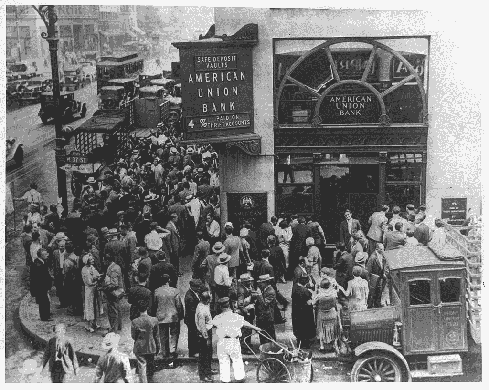

# 加密货币的光明面

> 原文：<https://medium.com/coinmonks/the-bright-side-of-cryptocurrencies-b1744140d0ac?source=collection_archive---------4----------------------->

我之前讨论过加密货币的黑暗面****s**，为了平衡起见，我现在将概述加密货币的光明面。但简单回顾一下，加密货币的两个重要缺点是市场操纵和在非法交易中的使用。**

**以下是加密货币的优点:**

*   **全球吸引力和认可度**
*   **机构投资**
*   **加密货币产业的崛起**
*   **美元的不稳定性**
*   **反对中央银行和商业银行**
*   **对数字货币的需求**

**我想指出的是，当我说“加密货币光明的一面”时，它暗示了比特币等加密货币的潜力。美元的不稳定性或对央行的反对没有任何亮点，但对于加密货币的支持者来说，这些是重要的决策因素，也是许多人转向比特币的原因。**

> **这不是虚拟货币是否会占据主导地位的问题，而是什么时候的问题。**

# ****全球吸引力和认可度****

**加密货币不再晦涩难懂，不为世人所知。例如，比特币经常出现在新闻中，以至于它可能与主要品牌(苹果、耐克、百事可乐、谷歌、微软、特斯拉等)一样强大和受欢迎。今天，比特币达到 60，000 美元，估值超过 1 万亿美元。随着比特币被广泛采用，它将帮助世界上数百万拥有手机但负担不起银行账户的人。对他们来说，比特币不仅仅是一种货币，它还是通往自由和控制感的桥梁。在银行和官僚体系腐败和滥用职权的国家，或者法定货币极不稳定的国家，情况尤其如此。这些社会不会在一夜之间采用比特币，但最终会采用——就像他们采用互联网、移动和社交媒体技术一样。**

# ****机构投资****

**一些机构和公司在比特币上持有大量头寸，因此总体上给了加密货币可信度和认可。就在最近，加拿大公司 [**Purpose Investment 推出了两款基于比特币的 ETF**](https://www.purposeinvest.com/funds/purpose-bitcoin-etf)使得投资加密货币成为可能，而无需从加密交易所购买。他们还声称，他们提供了更高水平的安全和保证。以下是持有比特币的十大机构名单:**

****十大机构比特币拥有量(截至 2020 年 6 月)****

****

**来源:福布斯**

# ****加密货币产业的崛起****

**在 19 世纪的淘金热期间，淘金者还要卖“铁锨”(工具、住宿、交通等)。)都是想发财。人们经常开玩笑地说，在某些情况下，不是那些淘金者，而是那些卖“铁锨”的人发财了！历史重演。如今，随着人们争相购买和投资加密货币，与之相伴的是整个行业的发展:加密货币交易交易所、采矿硬件和软件、就业机会、书籍、研讨会等。在比特币基地，全球最大的加密货币交易所是 T1，在预期的 IPO 之前价值接近 1000 亿美元的 T2 T3。因此，市面上交易比特币等加密货币的不仅仅是个人，整个行业都在蓬勃发展，加密货币也不例外。**

> **比特币价格的波动性将随着时间的推移趋于稳定。**

# ****感知美元不稳定****

**人们对美元的未来普遍持悲观态度。我在另一篇文章《比特币会取代美元吗？》中详细讨论了这些问题。 。虽然我认为美元不会立即受到比特币的影响，但美元不稳定的观念正促使一些人转向比特币等虚拟货币。2008 年的金融危机，当时银行不得不接受救助，导致许多人对银行系统失去信心。许多人冲到银行(银行挤兑)取钱。这种情况过去已经发生过多次，比如在大萧条时期，今后可能还会再次发生。历史几乎总是重演。**

****

**Bank Run: American Union Bank, New York City. April 26, 1932\. Public domain photo.**

# ****反对央行和商业银行****

**这与上述观点有关，因为许多人认为，中央银行的货币政策使货币贬值和贬值。他们认为，加密货币可以消除央行和商业银行充当“中间人”和“监管者”的需要，让人们能够直接控制自己的货币。对中央银行和商业银行以及政府政策的批评声不断增加，这为比特币和其他加密货币的走强和普及提供了支持。**

# ****数字货币的需求****

**对数字货币的需求是不可避免的。实体商业的侵蚀和零售业所谓的“亚马逊化”已经扩展到几乎所有其他领域。比起携带现金和/或与银行打交道，千禧一代和下一代更喜欢数字货币。当我们虚拟地要求搭车、订购食物、产品和服务时，我们也应该有一种虚拟货币，这是有道理的。因此，加密货币只是技术进化的自然进程。这不是虚拟货币是否会占据主导地位的问题，而是什么时候的问题。**

# **最后的评论**

**简言之，如果对加密货币阴暗面(市场操纵和非法交易)的担忧最小化，比特币价格的波动将稳定比特币(或任何其他主流加密货币)作为主要支付选项和价值储存手段的地位。**

**总而言之，这可能会导致财富和控制权的公平再分配，而此前这些控制权集中在央行和商业银行手中。**