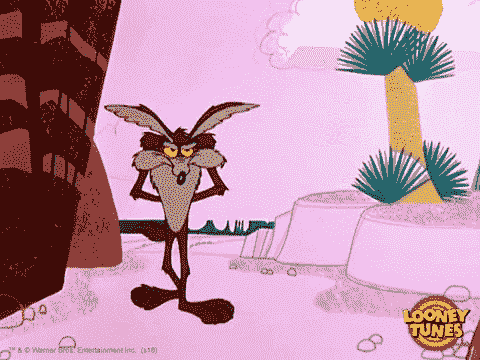

# 区块链的构建模块:分布式账本和挖掘

> 原文：<https://medium.com/coinmonks/the-building-blocks-of-blockchain-distributed-ledgers-4d9a0d56c3a?source=collection_archive---------3----------------------->

> **更新**:我决定经营自己的博客——[1.21 吉瓦](https://121gigawatts.org)，我将不再在这里写介质。[点击这里](https://121gigawatts.org/the-building-blocks-of-blockchain-distributed-ledgers-mining/)查看这篇文章关于 1.21 千兆瓦的最新版本。
> 
> 这是“区块链的构建模块”系列的第 4 篇文章。你可以在这里找到该系列[的介绍帖。](/@backoftheenvelope/the-building-blocks-of-blockchain-introduction-ea964e1ea45c)

他制造的第一个区块链是比特币背后的区块链。创造比特币的目的是创造一个完全数字化、去中心化的货币系统。我们很快会谈到“去中心化”意味着什么——我现在想强调的是,**区块链被发明出来是为了实现一个货币系统**。这是一个简单的目标，在这篇文章中，我想解释区块链是如何实现这个目标的。一旦你明白了这一点，你就会明白区块链如何运作的最重要的部分。

# 交易簿

比特币使用区块链来存储每个人有多少钱，以及他们如何在彼此之间转移“钱”的信息。换句话说，比特币的区块链是一个包含余额和交易信息的 ***数据库*** 。这基本上就是 ***一笔交易的账簿*** ，也叫 ***一笔总账*** 。当我告诉你这是一个区块链 ***的样子时，我甚至没有太夸张:***

```
1\. Sylvester creates 25 Bitcoins
2\. Sylvester gives Yosemite Sam 10 Bitcoins
3\. Yosemite Sam gives Porky Pig 4 Bitcoins
4\. Porky Pig gives Wile E. Coyote 1 Bitcoin
```

这就是你所期望的任何分类账的样子，对吗？每一行都是一笔交易，包括金额、发送方和接收方。第一行有点例外，因为它没有发送者。相反，它声明了 25 个比特币的 ***创造*** ，并将它们奖励给西尔维斯特。我将在下一篇文章中描述比特币是如何产生的。现在，让我们关注余额和事务。

***伊莱杰是真理的源泉。*** 只有账本上写着你有比特币，你才拥有比特币，如果你想给某人比特币，你只能通过在账本上添加一个这么写的交易来实现。从我们上面的示例账本中，我们可以清楚地看出西尔威斯特有 15 个比特币，猪小弟有 3 个比特币，怀勒·e·郊狼有 1 个比特币，我相信你可以自己算出燥山姆有多少个比特币。

这就是我们的货币体系。我们可以通过合计分类账中的所有交易来告诉每个人当前的余额，参与者可以通过向分类账中提交新的交易来兑换货币。但是这到底是怎么发生的呢？ ***其中*** 为总账， ***谁*** 将新的交易写入其中？

这个问题的简单解决方案是——一个全能的会计师。换句话说，保护分类账的单一参与者，也是唯一被允许将新交易写入分类账的人。


如你所见，在我们的故事中，西尔维斯特是全能的会计师。如果燥山姆想给兔八哥一个比特币，山姆需要做的就是告诉西尔威斯特他要给虫子一个比特币。Sylvester 检查分类账，看到 Sam 有 6 个比特币可用，意味着新交易有效，于是 Sylvester 将新交易记录在分类账中。现在分类账看起来像这样:

```
1\. Sylvester creates 25 Bitcoins
2\. Sylvester gives Yosemite Sam 10 Bitcoins
3\. Yosemite Sam gives Porky Pig 4 Bitcoins
4\. Porky Pig gives Wile E. Coyote 1 Bitcoin
**5\. Yosemite Sam gives Bugs Bunny 1 Bitcoin**
```

这是一个完全合法的解决方案，我相信你以前也遇到过这样的全能会计师——Visa、PayPal、*你的银行……*他们都是你 ***信任的各方*** ，他们拥有在各自支付系统中进行交易的专属权利。例如，当你想通过 PayPal 给你的朋友汇钱时，你 ***告诉******PayPal***你正在这么做，PayPal 将这笔交易记录在他们的账本上。这就是我们所说的*集中支付系统，因为它依靠一个 ***可信的中央方*** 来管理总账。*

*但是在 2008 年，出现了一个叫中本聪的家伙，他说“拿着我的啤酒”，然后发表了一份名为“[比特币:一个点对点的电子现金系统](https://bitcoin.org/en/bitcoin-paper)”的白皮书，描述了如何在没有可信的中心方 的情况下让数字支付工作。顺便说一下，事实证明 Satoshi 甚至不是一个真实的人，所以直到今天我们也不知道是谁发明了比特币🤷*

# *分布式分类账*

*比特币通过使用*分布式账本*实现无中央方的数字支付。但是 ***什么是分布式账本？*** 的基本思想是，任何人都可以下载一份分类账的副本，而且，任何人都可以将新的交易写入分类账***。****

**

> *等等，什么？这怎么可能呢？！*

*让我们来看看！假设达菲鸭决定下载一份账本。在这一点上，达菲鸭和西尔维斯特都持有相同的账本。达菲鸭然后宣布 ***他*** 现在也是可信的会计，并且交易也可以提交给他以进入分类账。*

*与此同时，兔八哥欠爱发先生和马文火星一号比特币。他听到消息说现在有两个值得信任的会计师，所以他决定做一个*聪明人*来处理这件事。他告诉西尔维斯特，他要给火星人马文**一个比特币**，他告诉达菲鸭，他要给爱发先生****一个比特币**。现在分类账看起来像这样:*******

```
********## Sylvester's Ledger***
1\. Sylvester creates 25 Bitcoins
2\. Sylvester gives Yosemite Sam 10 Bitcoins
3\. Yosemite Sam gives Porky Pig 4 Bitcoins
4\. Porky Pig gives Wile E. Coyote 1 Bitcoin
5\. Yosemite Sam gives Bugs Bunny 1 Bitcoin
**6\. Bugs Bunny gives Marvin the Martian 1 Bitcoin*****## Daffy Duck's Ledger***
1\. Sylvester creates 25 Bitcoins
2\. Sylvester gives Yosemite Sam 10 Bitcoins
3\. Yosemite Sam gives Porky Pig 4 Bitcoins
4\. Porky Pig gives Wile E. Coyote 1 Bitcoin
5\. Yosemite Sam gives Bugs Bunny 1 Bitcoin
**6\. Bugs Bunny gives Elmer Fudd1 Bitcoin*******
```

> *****受苦了，达菲！看来 bug 犯了**双花**！*****

*****西尔维斯特发现他和达菲的账本不再匹配，更糟糕的是，兔八哥似乎把他的 ***只*** 比特币给了 ***两个*** 不同的人！他们很快意识到他们的货币体系不会以这种方式运行，所以他们决定雇佣一名专家。*****

**********

*****还记得我们说过的 ***任何人都应该可以写进总账*** 吗？这意味着我们不能希望西尔维斯特和达菲永远是仅有的两个会计师。很快就会有几十个会计，也许几百个会计，他们都应该会写分类账。Wile E .如何让它们 ***都维护一个相同的*** 总账副本？*****

*****他怀疑关键在于要确保****一次只有一名会计*** ***将*** 一笔交易记入总账。但是他怎么能保证 ***一次只有一个会计将*** 一笔交易写入分类账，即使作为 ***新会计可以随时加入*** ？怀尔斯. e .不得不考虑这个问题。******

************

# ******谜题！******

******就是这样！怀尔斯·e .提出了一个 ***巧妙的*** 法则:******

> ******在一个会计可以把一笔新的交易写进分类账之前，他们必须解决一个难题！******

******这个难题将会非常复杂，以至于即使所有的会计师都试图*努力*解决它， ***他们所有人同时*** ，大约需要 ***10 分钟*** 然后 ***其中一个*** 设法解决它。解决了这个难题的会计师可以将一笔交易记入分类账。******

******然后，她将刚刚添加的交易以及谜题的答案分享给所有其他会计师。他们验证解决方案是正确的，因此接受新的交易并将其添加到他们的分类账副本中。******

******会计师要解决的难题是基于分类账中的最后一笔交易*和会计师打算添加的新交易***。由于上一次交易现在发生了变化，他们都必须解决一个新的难题，并再次花费 10 分钟来解决它，因为这个过程在重复。**********

> ******谜题的目的是**随机** **挑选一名会计作为将下一笔交易记入分类账的人**。这可以防止创建不同版本的分类账，而不给任何人对整个分类账的完全控制权。******

# ******聪明的兔八哥，第二部分******

******狼向西尔维斯特和达菲解释了他的新规则，但他们并不真正理解，所以他们认为如果他们尝试一下，他们可能会更好地理解它们。不过，作为第一步，他们决定删除兔八哥虚假的重复消费交易。现在他们的分类账是一样的，看起来像这样:******

```
*******## Sylvester's Ledger***
1\. Sylvester creates 25 Bitcoins
2\. Sylvester gives Yosemite Sam 10 Bitcoins
3\. Yosemite Sam gives Porky Pig 4 Bitcoins
4\. Porky Pig gives Wile E. Coyote 1 Bitcoin
5\. Yosemite Sam gives Bugs Bunny 1 Bitcoin***## Daffy Duck's Ledger***
1\. Sylvester creates 25 Bitcoins
2\. Sylvester gives Yosemite Sam 10 Bitcoins
3\. Yosemite Sam gives Porky Pig 4 Bitcoins
4\. Porky Pig gives Wile E. Coyote 1 Bitcoin
5\. Yosemite Sam gives Bugs Bunny 1 Bitcoin****
```

******与此同时，兔八哥觉得自己很厚颜无耻，所以他决定再次耍同样的花招:他告诉西尔威斯特他要给火星人马文 1 比特币，他告诉达菲鸭他要给爱发先生 1 比特币。******

******不过这一次，达菲和西尔威斯特没有立即将交易记入他们的总账，因为他们必须先解决这个难题。所以他们着手去做。******

************

******碰巧的是，达菲是第一个解决难题的人，所以他把他的交易加到他的账本上:******

```
*******## Daffy's Ledger***
1\. Sylvester creates 25 Bitcoins
2\. Sylvester gives Yosemite Sam 10 Bitcoins
3\. Yosemite Sam gives Porky Pig 4 Bitcoins
4\. Porky Pig gives Wile E. Coyote 1 Bitcoin
5\. Yosemite Sam gives Bugs Bunny 1 Bitcoin
**6\. Bugs Bunny gives Elmer Fudd 1 Bitcoin******
```

******然后，他与西尔维斯特分享了这一新交易，还告诉了他难题的解决方案。Sylvester 验证了 Daffy 难题的解决方案，因此接受了新的交易并将其添加到自己的分类帐中。西尔维斯特的账本是这样的:******

```
*******## Sylvester's Ledger***
1\. Sylvester creates 25 Bitcoins
2\. Sylvester gives Yosemite Sam 10 Bitcoins
3\. Yosemite Sam gives Porky Pig 4 Bitcoins
4\. Porky Pig gives Wile E. Coyote 1 Bitcoin
5\. Yosemite Sam gives Bugs Bunny 1 Bitcoin
**6\. Bugs Bunny gives Elmer Fudd 1 Bitcoin**---
## Pending Transactions:
** **Bugs Bunny gives Marvin the Martian 1 Bitcoin******
```

******西尔威斯特现在看到，根据账本的新状态，兔八哥没有任何比特币剩余，所以他只是 ***拒绝*** 本来要把巴哥的比特币给火星人马文的未决交易。******

************

******但是嘿，至少 Wile E. Coyote 的规则现在有了一个明确的方法来决定 ***谁得到写入分类帐*** ***下一个*** ，从而使分类帐 ***免受双重支出！*********

# ******这又是怎么回事？******

******你可能会觉得这个类比有点太疯狂了，但事实上，你刚刚读到的所有内容都非常*非常*接近比特币的实际运作方式！我所描述的解谜过程，真的是 [***挖矿***](https://en.bitcoin.it/wiki/Mining) 的过程，而 ***会计就是* *矿工*** 。比特币矿工真的在互相竞争解决[哈希难题](https://www.vpnmentor.com/blog/hash-puzzle-bitcoin/)。******

******我希望从这个故事中得到的是对比特币试图解决的问题的直观理解，以及它如何试图解决这个问题:******

*   ******比特币打算实现一个账本，不能由一方控制，而是由多方以公平的方式控制。******
*   *********多人控制****是通过始终将控制权交给一个*单个参与者来实现的*。*********
*   **********公平性*** 是通过每个参与者基于 ***机会*** (有幸成为解决下一个谜题的人)在有限的时间内获得控制权来实现的。*******

******在下一篇[帖子](/@backoftheenvelope/the-building-blocks-of-blockchain-putting-it-all-together-940601c509e9?source=friends_link&sk=c2b1a09a376472777db5785058045381)中，我们将详细介绍所有这些在比特币中的实际情况——包括这些哈希难题如何工作，交易如何组织成块，块如何链接在一起，以及比特币如何创建。我们终于可以把所有的模块放在一起，构建一个大的画面，让我们当之无愧地“啊哈！”瞬间。活着是多么美好的时光啊！******

> ********下一个积木:** [**把所有东西拼在一起**](/@backoftheenvelope/the-building-blocks-of-blockchain-putting-it-all-together-940601c509e9)******

******这有趣且可以理解吗？我分享了一些可怕的错误信息吗？你不同意我吗？你有什么问题吗？**请在评论中或者在 [LinkedIn](https://www.linkedin.com/posts/zoltanmaric_the-building-blocks-of-blockchain-distributed-activity-6632659779988803584-CBqL) 上，或者在 [Twitter](https://twitter.com/zoltanmaric/status/1226895106353123333?s=20) :)上让我知道********

******如果你还没有，你可以在这里读一下关于我是做什么的介绍文章。******

## ******图像制作者名单******

******[西尔威斯特写作](https://giphy.com/gifs/looneytunes-cat-looney-tunes-sylvester-603cLZVdYomSgIBhB0)，[达菲惊讶](https://giphy.com/gifs/looneytunes-cartoon-looney-tunes-7TnyEw1YpXaxBtVLBe)，[威尔 e 名片](https://tenor.com/view/bugs-bunny-wile-ecoyote-coyote-genius-introduction-gif-4912179)，[威尔 e 思索](https://giphy.com/gifs/looneytunes-oyPTTOQMtuzthM5xKX)，[达菲思索](https://giphy.com/gifs/nervous-looney-tunes-worried-rHzSn4U4BPemY)，[西尔威斯特思索](https://giphy.com/gifs/looneytunes-scared-bored-2uwZ4xi75JhxZYeyQB)，[马文愤怒](https://giphy.com/gifs/looneytunes-cartoon-looney-tunes-NTDh6ioJhvKlL2qBGW)。所有受版权保护的材料在合理使用下用于教育目的。******

> ******[直接在您的收件箱中获得最佳软件交易](https://coincodecap.com/?utm_source=coinmonks)******

******[](https://coincodecap.com/?utm_source=coinmonks)************[](https://coincodecap.com)******