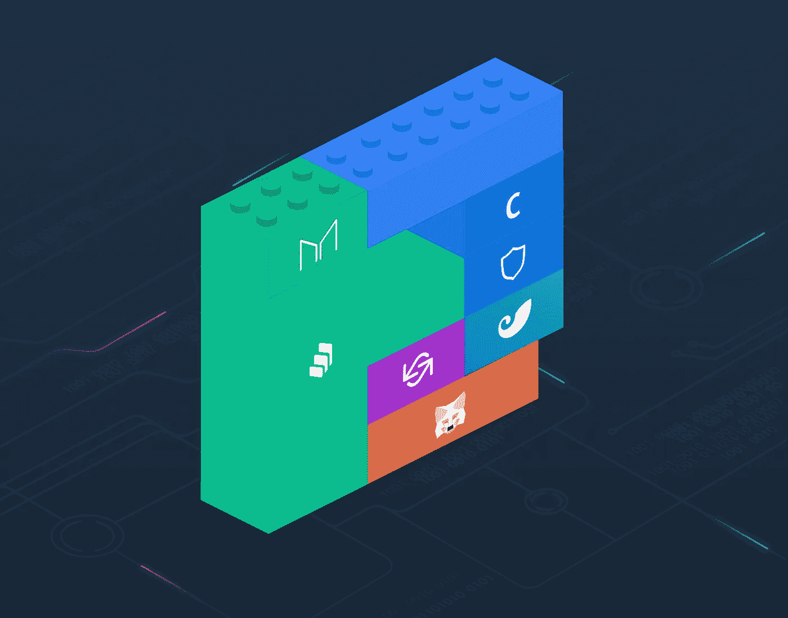

# 介绍了分散式交易所(DEX)的构建模块。

> 原文：<https://medium.com/coinmonks/the-building-blocks-of-decentralized-exchanges-on-defi-explained-5cd6756bd3e9?source=collection_archive---------2----------------------->

Legos for Money Source: [https://medium.com/totle/](https://medium.com/totle/)

围绕去中心化金融( **DeFi** )的整个想法是“金钱乐高”(money Lego)——类似于乐高积木的应用程序，可以层层叠加，建立创建完全去中心化金融层所需的基础——省去中间人(银行、保险公司)，以降低成本，使服务更具包容性。