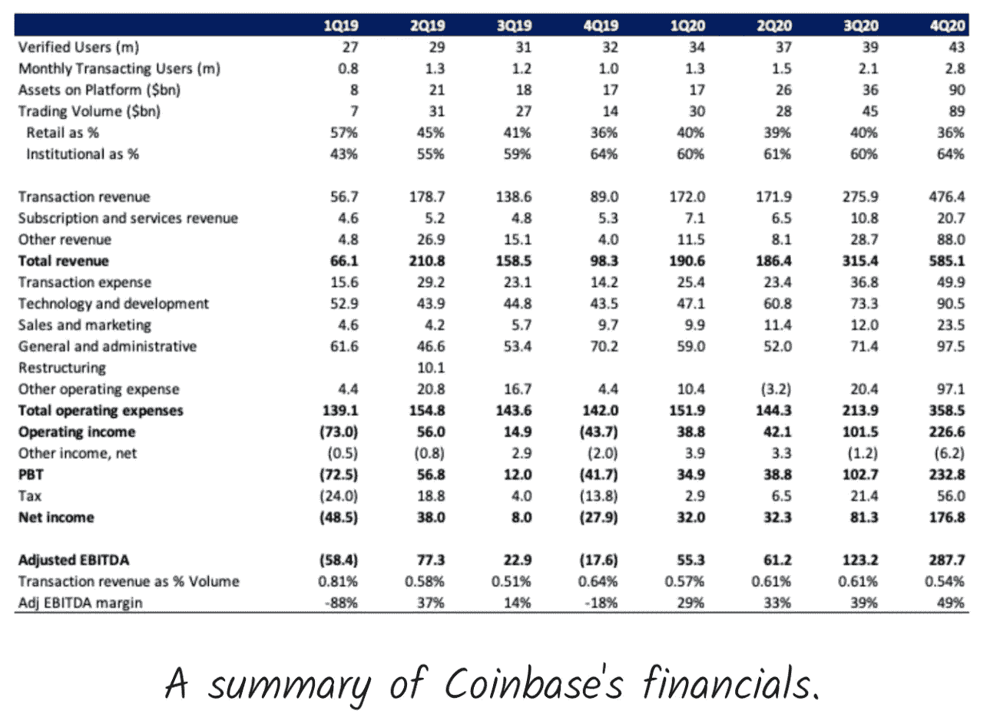

# 比特币基地的牛市案例

> 原文：<https://medium.com/coinmonks/the-bull-case-for-coinbase-3f44ed3313a9?source=collection_archive---------6----------------------->

## 给比特币基地的炒作火上浇油

All board the $COIN hype train! Source: [reddit](https://www.reddit.com/r/smashbros/comments/85j3s0/hype_train_in_4k/)

昨天，我写了比特币基地在纳斯达克上市的熊市案例——列举了竞争加剧、业务依赖于牛市，以及他们信任的品牌中的一个单点失败。

今天，我要对所有这些观点说“谢谢，但不要谢谢”，并列出公司前进的牛市案例。

正如我昨天所说，比特币基地是一家非常罕见的晚期公司，它不仅发展迅速，而且在发展的同时还赚了很多钱。

上周早些时候，比特币基地在公开上市前公布了 Q1 2021 的数据:

*   3350 亿美元的交易量
*   总收入约为 18 亿美元
*   净收入约为 7.3 亿至 8 亿美元

这些指标都大大超过了比特币基地 2020 年全年的数字——该公司在 1930 亿美元的销量上实现了 12 亿美元的收入和 3.32 亿美元的利润。

虽然我可以更深入地了解该公司的财务状况，谈论其竞争优势并预测其未来收益…

坦白地说，所有这些事情都让我感到厌烦，我会将这些分析保存到 r/wallstreetbets DD 或 VC twitter 帐户的热门话题中。

相反，我要做一些更有趣的事情，谈谈三个荒谬的论点:

1.  比特币基地和 Web3 的精神
2.  其他不断增长的收入来源
3.  自我分裂和自相残杀的可能性

# 比特币基地和网络 3

希望至此，你已经从我写的[无数其他帖子](https://jimmy-chang.medium.com/)中了解了 Web3。

如果没有，不要担心，这里有一个快速入门:

Web3 是互联网的下一个时代，它建立在开放、无许可和无信任的价值观之上；区块链是 Web3 运动的技术驱动力量之一。

在 Web3 之前，我们有(现在仍然有)Web 2.0。

Web 2.0 是移动优先、社交优先和纯云的——给我们带来了互动体验、用户生成的内容和市场经济，催生了优步、脸书和 Twitter 等美国科技巨头。

**比特币基地和币安是 Web3 的典型代表。**

你也可以把比特币和以太坊包括在这个列表中，但它们更多的是技术——而比特币基地和币安是被赋予了个性的公司和实体。

随着世界越来越多地参与到 Web3 中，越来越多的公司涌现出来，用身份、社交网络等去中心化的原语创建 Web3-native Internet。—越来越多的人将会了解 Web3，并因此把比特币基地和币安放在他们的脑海中。

换句话说，投资比特币基地就是投资于 Web3 的必然性和广泛影响。

就像谷歌和亚马逊是将世界从 Web 1.0 连接到 Web 2.0 的桥梁公司一样，比特币基地在将世界带到 Web3 方面扮演着同样的角色——可能具有相同的货币价值。

是的，还有其他像雅虎这样的 Web 1.0 -> 2.0 桥梁公司，但我认为比特币基地更像谷歌或亚马逊，而不是雅虎。

我自信地说，因为他们不害怕创新和颠覆自己。

# 其他收入来源

为了完整起见，我想快速指出，即使交易费(占比特币基地目前收入基础的 85%)，也有其他方式通过加密版的[PFOF](https://www.investopedia.com/terms/p/paymentoforderflow.asp)*a la*robin hood 或通过保证金贷款来实现交易量的货币化——就像富达和其他传统券商所做的那样。

但我更愿意双击比特币基地的另一个收入杠杆——他们在 S-1 中称之为“订阅和服务收入”。

Source: Coinbase S-1

“订阅和服务”是来自比特币基地保管和赌注服务的收入——这意味着他们对安全保管和[赌注](https://en.wikipedia.org/wiki/Proof_of_stake#:~:text=Proof%20of%20stake%20(PoS)%20is,(i.e.%2C%20the%20stake).)用户和企业的密码的服务收费。

虽然这项业务产生的收入仅比交易收入少一个数量级，但它正在快速增长。

这种收入流是比特币基地管理的总资产的函数。2020 年，AUM 为 903 亿美元——比 2019 年增长了 500%。相比之下，同期交易量仅增长了 200%。

目前，在 Q1 2021 中，比特币基地拥有 2230 亿美元的 AUM，占加密市场总市值的 11.3%，在三个月内翻了一倍多。

通过直接押注这些资产，比特币基地可以获得 1%至 1.5%的赌注回报，以及必须向用户和企业支付的费用。

# 自我分裂

布莱恩·阿姆斯特朗和创始团队都是本地人。他们在 2012 年创立了这家公司，当时比特币是 12 美元。

他们不得不竭尽全力去争取一个自己名下的银行账户——因为当时没有银行会与一家加密初创公司合作。

九年后，他们创建了一家公司，成为加密生态系统的一部分。

但他们也知道，他们在 2012 年需要创建的公司，将不会是他们在 2030 年取得成功所需的公司。

到那时，世界看起来会有很大的不同，所以公司也一定会有很大的不同。

我非常确信任何一个本土的加密团队都知道这个行业的发展方向。

布莱恩·阿姆斯特朗和他的团队一定在关注 DeFi，并把它视为下一个进入的机会，而不是一个威胁。

因为他们意识到 DeFi 比比特币基地更好地服务于开放金融的使命。

> “比特币基地的使命是为世界创建一个开放的金融体系。这意味着我们希望使用加密货币为全世界人民带来经济自由。”—布莱恩·阿姆斯特朗

这样做，他们将蚕食自己利润丰厚的 CEX 业务。

但如果不这样做，他们可能会输给更新、更精简、更具资本效率的 DEXes 和其他 DeFi 协议。

1200 个人不可能与数百万建设 Web3 互联网的开发者和用户竞争。

比特币基地已经涉足 DeFi 领域的一些赌注。

他们有一个装有 dApp 浏览器的移动钱包。因此，他们已经通过将流量导向 DEXes 来蚕食自己的销售。

Source: Coinbase.com

他们创建了 [WalletLink](https://walletlink.org/#/) ，这是一个开源平台，可以轻松地将加密钱包与 Web3 应用程序同步。

他们还创建了 [Rosetta](https://www.rosetta-api.org/) ，这是一个开源框架，用于在一个平台生态系统中构建和部署区块链——就像比特币基地的列表一样。

纯属猜测，但我认为比特币基地有巨大的潜力——利用其简单和信任的知名品牌——成为 DeFi 的一站式商店。

凭借其入口(即，将美元或其他货币从当地银行转移到比特币基地平台以转换为加密货币的能力)及其赌注服务和钱包的结合，比特币基地作为一站式商店可能非常强大。

流程如下:

1.  我很容易地把我的美元从大通银行存到比特币基地。我甚至可以从比特币基地获得即时存款功能+一些额外的保证金，这样我就可以立即交易。
2.  我使用比特币基地的 dApp 浏览器来寻找获得收益的最佳方式。也许我会把我的钱交给分散的资产管理公司，比如{\\ f85 {\\ f85 ,}渴望{\\ f85 {\\ f85 {\\ f85 ,} T7 {\\ f85 ,}或者我会积极地在{\\ f85 ,} uni swap {\\ f85 {\\ f85 {\\ f88 }} uni T9 }这样的指数上交易我的钱。
3.  所有这些策略都有一定的风险。然而，我发现比特币基地有一种基本上没有风险的赌博服务。年息 4%无风险？我会的。

在这种情况下，比特币基地不再是一个 CEX，而更像是一个用户的聚合者，来吸收自己的增值服务，或者定义协议。

DeFi 协议成为比特币基地可以提供的产品，而无需建立自己的能力——同时仍能在将用户连接到这些协议上获得一些传播。

与现有形式相比，这是一项资本效率更高、运营杠杆更高的业务。

> “自成立以来，比特币基地在行业中的主要地位一直是一个聚合者:通过其可访问的产品积累用户，然后随着时间的推移销售更先进的产品。”—马里奥·加布里埃尔，通才的创造者

一如既往，如果你有任何问题或想详细讨论这些话题，请在 LinkedIn 或 T2 Twitter 上给我发消息。我喜欢和人们谈论加密和广泛的生活:)