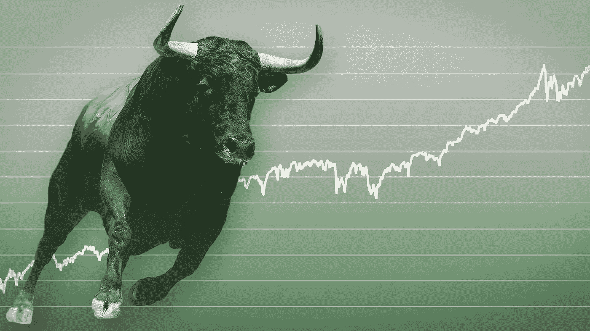

# 牛市还没有结束

> 原文：<https://medium.com/coinmonks/the-bull-run-is-not-over-bccad474747b?source=collection_archive---------0----------------------->

密码市场正在从巨大的打击中恢复。先是马斯克，然后是中国政府的决定使 Crypto 的估值从最近的年度高点下跌了近一半。

就在埃隆马斯克(Elon Musk)首次宣布特斯拉取消比特币(BTC)作为支付选项后几天，中国政府决定继续在地区禁止加密货币开采。