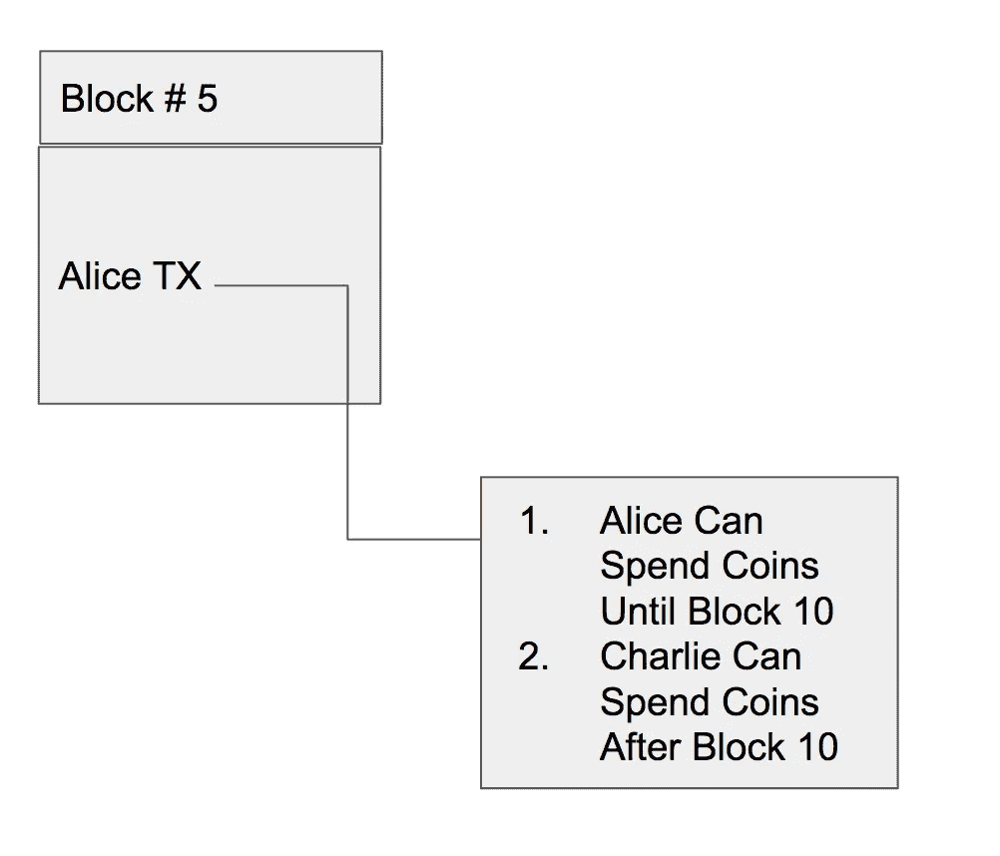
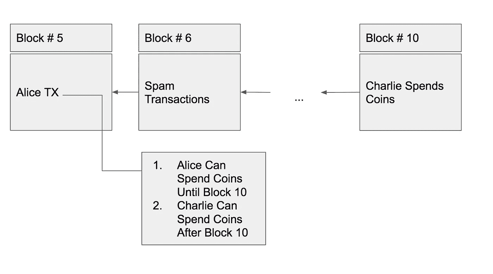
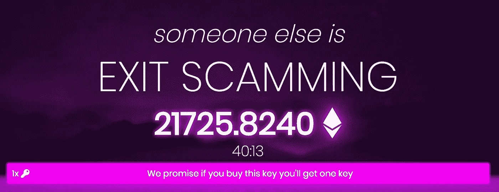

# 购买大宗商品的攻击

> 原文：<https://medium.com/coinmonks/the-buy-a-block-attack-c0ce845475d7?source=collection_archive---------5----------------------->

## 与时间相关的分散式应用程序中存在的漏洞分析

下面描述的攻击是一个模型，可用于与时间相关的分散式应用程序进行交互。攻击者旨在预先花钱，试图在以后增加利润。

以下这些例子不包括在实施攻击前做空硬币(或买入看跌期权)的分析。做空 dApps 代币可能会增加他们的利润。

## 一些背景信息:

大多数区块链鼓励矿工使用两种类型的费用来验证交易(这样人们就不会花他们没有的钱——即双重消费):

1.  通货膨胀奖励——比如集体奖励
2.  交易费——用户产生的费用，用于激励采矿者优先处理他们正在开采的区块的交易

许多区块链对块的大小有限制。要么直接用 1MB 比特币块，要么间接用一个缓慢移动的限制，如以太坊的气体限制。

# 攻击:

在设定的时间段内需要一些交互的分散式应用程序允许攻击者用垃圾邮件事务完全填充块，以便指定的交互不会发生。攻击者将支付很高的费用(将在后面详细讨论),以便他们是块中唯一的交易。

## 一个简单的例子:

为了简单地说明这种攻击，下面是一个例子。

想象一下，我们有一个区块链:鲍勃链与硬币鲍勃硬币

*   Bob-chain 每个块有 1 MB 的事务限制

Bob-chain 允许用户通过脚本或/和智能合同(类似于比特币或以太坊)指定资金使用的条件。这些条件可以像传统的 p2p 交易一样复杂或简单。

爱丽丝决定做慈善，她在区块链上随机挑选了一个陌生人的钱包(比如查理的钱包)，并给他们寄去了 1000 先令。然而，她对此不确定，所以她提出了一个条件，在接下来的 5 个街区，她可以收回资金，查理将一无所获。

Alice’s Philanthropic Transaction

Charlie 现在注意到，由于 Alice 没有撤回她的钱，所以有一笔未完成的交易。查理想尽可能多地保留这笔钱。害怕爱丽丝会收回慈善交易，他受到激励，想出一个办法来阻止爱丽丝这样做。

查理认为，他间接贿赂了矿工，让区块链在接下来的五个街区充满了垃圾邮件交易，从而关闭了爱丽丝的撤回时间窗口，并确保他至少收到了一些资金。

Charlie spams the blockchain and gauruntees some charity money

如果查理在接下来的 5 个街区中成功地填满了街区(购买街区)，他将带走 1000 个鲍勃硬币(减去用来填充街区的费用)

在实践中，很难找到像上面这样的交易，但下面是三个用例，开发者需要小心，不要产生类似的激励。

Exitscam/FOMO3D Banner

# Exitscam.me/FOMO3D:

## TL；博士:

如果 Exitscam 的 jackpot(目前为 21,000 ETH)大于 24ETH，并且还剩不到 10 分钟，则有机会花费 24ETH 在以太坊区块链上填充垃圾交易，并阻止其他用户进入。剩下的时间越多，向区块链发送垃圾邮件的成本就越高。如果还剩不到一个小时，就有机会花 560 ETH 赢得头奖。如果还剩不到 10 个小时，有机会花 5600 ETH 赢得头奖。

## 规则是:

[Exitscam](http://Exitscam.me) 是一个简单透明的传销:

*   每一轮都会持续一段时间
*   如果你是最后一个把 ETH 放入彩池的人，你就拿走了头奖(大约 90%的 ETH 放入彩池)
*   如果有人在你之后投资，你会得到红利。现在，不到 1%的 ETH 已经被送到合同中以股息的形式支付
*   每存入 005 ETH(截至发稿时)，倒计时钟增加 30 秒(2 个街区)(每次购买最多 24 小时)

还有一些其他的规则让它变得更加微妙和容易上瘾，这些规则不会在本文中讨论。

## 战略:

> 当倒计时接近零时:存入 ETH，然后购买每一块直到倒计时结束，以确保没有人能在你之后存款。

如果没有其他人可以存款，您将赢得头奖。

## 数学:

*   目前的头奖是 J ETH
*   最大燃气成本约为 800 万英镑
*   支付前剩余的区块数为 38 (~9 分 30 秒)+ 2，如果你买入(= 40 = ~ 10 分钟)

如果 J ETH > 40 * 8000000 * E(气价)= 320，000，000 * E(气价)

J > 320，000，000 * E(天然气价格)

那我们应该买下头奖，然后再买下十个街区。

对于本文，我将假设 E(gas_price)可以成功地用过去 200 天的 gas_price 的平均+ 4 个标准差来完成。数据取自[以太扫描](https://etherscan.io/chart/gasprice)。

我发现 E(gas _ price)= 7.337415102356531 E-08 ETH([脚本此处](https://github.com/kennethgoodman/ethereumscripts/blob/master/average_daily_block_fees.py))所以:

J > 23.5 ETH，意味着有机会购买 10 个区块。更一般地，如果剩下 N 个块:

J > N * 2.35 ETH 意味着一个机会。

有一些复杂的情况，因为其他人可能会看到你在攻击 dApp，并在最后一刻决定比你花更多的钱。我将在另一篇文章中进行分析。

# 通过投票分散神谕:

## 规则是:

有一些事件，E，系统想要从可能的结果(比如 A，B，C)中确定结果。

该系统将让用户投票(股份)与他们的令牌为每个可能的选择。为了防止用户不诚实，那些为非多数事件投票的人将失去一些(或全部)他们的赌注硬币。

## 战略:

> 买下每一块，这样其他人就不能投票决定结果。

例如，假设进攻者在市场上投票:“勒布朗·詹姆斯将成为今年 NBA 总冠军的最有价值球员。”如果他成为 MVP，攻击者赢得赌注，如果他没有成为 MVP，攻击者在投票过程中填充区块链，这样就没有人可以报告勒布朗詹姆斯没有赢。因此，攻击者将成为结果的唯一投票者并赢得赌注。

攻击者将在投票过程中用他们对“勒布朗·詹姆斯确实成为了 MVP”的投票来填充第一个区块，并将继续向区块链发送垃圾邮件，以便没有其他人可以对结果进行投票。

## 数学:

如果投票要持续 N 个街区，只要影响“真相”的收益> C * N，攻击者就应该买下每一个街区。

## 那又怎样？

这就对任何基于 Oracle 的 dApp 的规模做出了硬性限制。任何需要外界信息的应用程序(因此，需要一个 Oracle)都必须在以下方面做出让步，才能拥有一个免受此攻击的安全环境:

1.  对应用程序进行一些控制，以延迟投票的结束块(集中控制)
2.  一些社会共识来自于矿工不去进行有利可图的采矿交易(功利主义矿工)
3.  保持规模不变，使所有可能利润的总和≤ C * N(限制规模)

请记住，如果恶意参与者利用这一点同时攻击多个 dApps，那么第三个解决方案没有帮助。

# 分散抵押贷款

## TL；博士:

因为加密资产是伪匿名的，贷款必须被过度抵押。如果一个借款人有足够多的借款开始对他们不利，他们应该买下每一块，直到成本不太可能超过可能的收益。

## 规则是:

1.  借用一个加密资产(比如说 ETH)给另一个加密资产(比如说 TUSD)
2.  通过提供大于 100%的 TUSD (TUSD 是保证金/抵押品)来抵押借入的 ETH
3.  随着 ETH 价格上涨，平台发出追加保证金通知，因此借款人需要返还一些 ETH 或提供更多 TUSD(抵押品)，从而使借入的 ETH 价值< TUSD 价值(抵押品)。

需要注意的是，如果我们做的是分散的伪匿名贷款，应该没有信用风险。

我们关注的重点是追加保证金。

要发出追加保证金通知，某一方需要让区块链知道价格已经改变，这样它就可以将 TUSD 清算成 ETH，这样 ETH 的贷方就不会损失价值。

我们将忽略:

1.  从抵押品(TUSD)到借入资产(ETH)的清算是如何进行的
2.  协议如何达成价格确实上涨的共识(基于 Oracle)

## 战略:

如果有人认为某项资产的价格会非常不稳定，如果应用程序没有正确实现，就有机会通过破坏协议来赚钱(套利)。

假设他们认为 ETH 相对于 TUSD 会下降。他们应该以 TUSD 为抵押借入 ETH，并在交易所出售 ETH 换取 TUSD。如果价格下跌，他们会以更低的价格买入资产，然后返还(正常的做空)。如果价格不动，就付利息。如果价格上涨:

> 通过买入大宗交易来阻止所有追加保证金的要求，为他们的头寸赢得更多时间来获利

## 数学:

如果有一天，资产抵押不足，然后成为超额抵押头寸的概率为 P，成本为每块 C，在获胜的情况下利润为 W，那么只要 E(C) ≤ W，就存在获胜策略，包括购买所有块，直到 E(C) ≥ W。

E(C) =每块成本*(贴现 factor^i)* p(I 块后利润)；从 1 求和到无穷大。

每块的成本总是相对恒定的。

W 可以有多大的限制与 p 成正比([以类似指数的方式](http://mathworld.wolfram.com/Erf.html))

如果每个区块的成本为 2.3 ETH(如前所述)，并且借款人借入了价值 5000 万美元的资产，则每个区块的成本为 0.00184%(400 美元/ETH)。以太坊的话，就是 10.5984%/天。对于一笔 5 亿英镑的借款，这一利率仅为 1%/天。对 dApp 来说，这并不是一个巨大的损失。

## 查看宣传材料:

借入的抵押品将是:*(1+****X****)*借入资产的价值*

如果借入资产的波动性相对于***×相对于*** 较高，成功的变化可以值得冒风险。

假设我们正在借入资产 ***A*** 用于资产 ***B*** ，预期波动率为每日***【V】***%(从正态分布中提取)，而标准差为每日***【SD】***%*。*

*我们试图找出贷款抵押不足的概率:Z =(***X***-***V***)/***SD***，[将其转换为您的 Z 表。](https://stackoverflow.com/questions/2782284/function-to-convert-a-z-score-into-a-percentage) P 直接取决于 **X** 、 ***V*** 和 ***SD。v******SD***是市场驱动的，所以 dApp 的创作者和出借人并没有控制权，他们唯一的控制权是 ***X*** 。*

*我将在这里结束，但不分析为什么选择任何足够的 X 来让贷款人高兴可能会让所有借款人不高兴，而 X 足够低来让借款人高兴会让贷款人在失去资金时不高兴。在我看来，我们将留给另一篇完整的文章，分散贷款将很难与完全成熟的中央一级经纪商竞争。*

## *免责声明:*

*本文档中提供了某些链接，包括指向其他网站的链接。这些链接是为了方便起见而提供的，并不意味着肯尼斯·古德曼对这些网站或其内容的赞助或批准。Kenneth Goodman 对可从本网站访问的其他网站、其内容、其安全或隐私政策或其可能提供的任何产品/服务没有控制权或责任。如果您通过本文档或您收到本文档的相应电子邮件访问任何第三方网站，您需要自担风险。本文件的链接并不构成 Kenneth Goodman 或被链接的各方或企业的认可，也不一定表明 Kenneth Goodman 与此类各方或企业之间的任何从属关系。*

*肯尼斯·古德曼不是注册投资顾问，我的文章没有任何意图，也不应该被解释为投资建议。这里写的任何材料仅供参考。对证券、商品、衍生品、指数或其他工具的任何提及既不是购买、出售或持有该资产的建议，也不构成 Kenneth Goodman 对该资产是否适合任何特定用途的意见。*