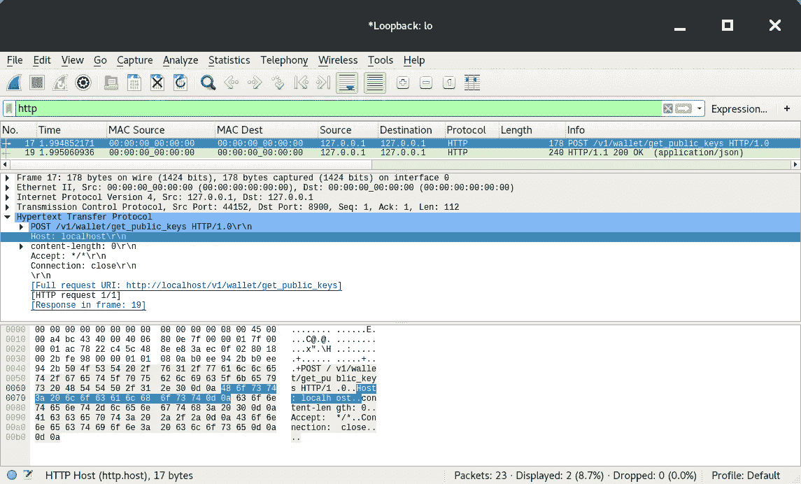
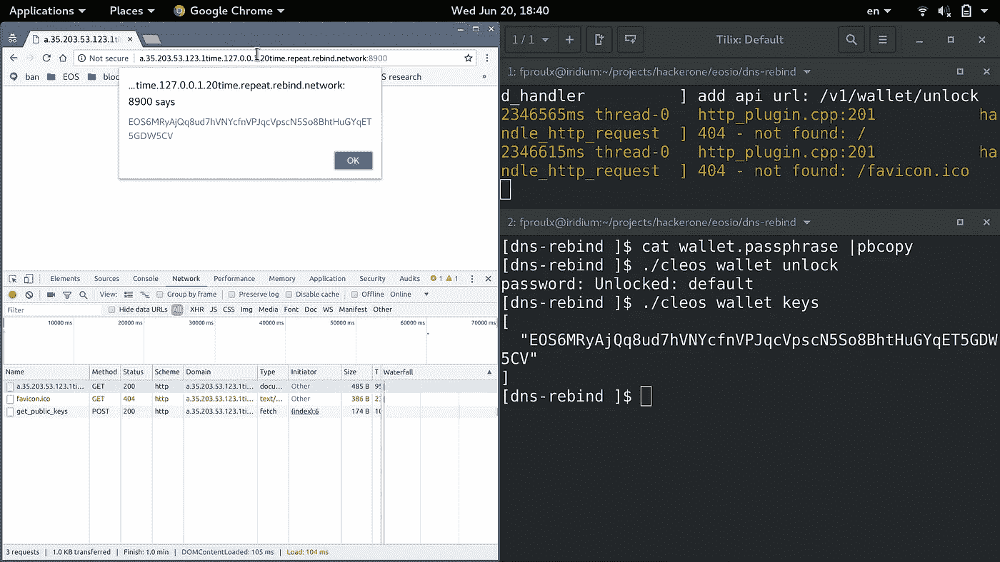
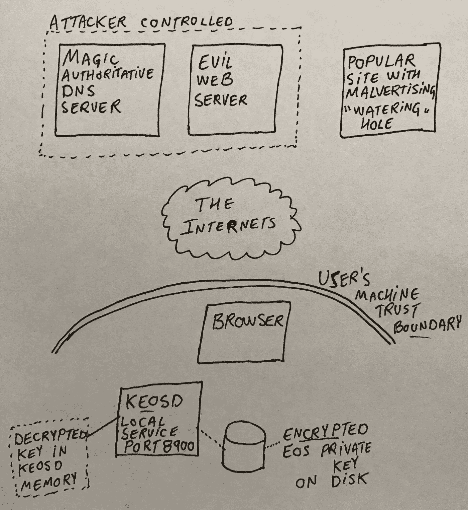
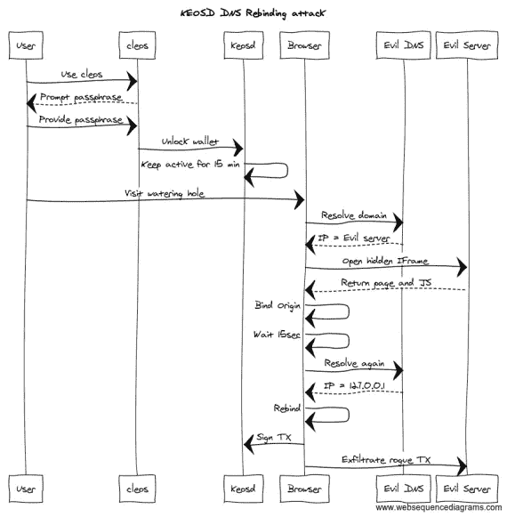

# 电话是从房子里面打来的 EOSIO keosd 钱包中的 DNS 重新绑定

> 原文：<https://medium.com/coinmonks/the-call-is-coming-from-inside-the-house-dns-rebinding-in-eosio-keosd-wallet-e11deae05974?source=collection_archive---------4----------------------->

*(在我开始之前——这个 bug 已经被负责任地披露，并已经在 EOSIO 软件的*[*1 . 0 . 9*](https://github.com/EOSIO/eos/releases/tag/v1.0.9)*及更高版本中修复，所以我强烈建议您更新)*

到现在为止，我已经[全职从事应用程序安全工作大约 5 年了](https://www.linkedin.com/in/francoisp/)，在 bug 赏金成为“一件事”之前，我一直是 bug 赏金责任披露故事的热心读者，但不知何故，我从未参与公开的 bug 赏金。所以这对我来说是第一次，我很兴奋地讨论我使用 [HackerOne 支持的 EOSIO 程序](https://hackerone.com/eosio)的经历。

在过去的几个月里，我一直在为一个了不起的团队提供 InfoSec 和 AppSec 的指导，是他们让我对 EOSIO 和区块链技术产生了兴趣。以前，我对加密货币(尤其是比特币)一直不太感兴趣，但当我第一次听说智能合约以及股权证明(相对于工作证明——我认为这简直是不可扩展的，是对能源的巨大浪费)时，我的 AppSec 蜘蛛感觉到了刺痛。盲目执行不受信任的任意代码(这些代码在点对点网络上传播)的想法非常可怕，但也非常令人兴奋，因为现代区块链提供了去中心化和共识算法的承诺。

一个多月前，我正在编写一个脚本来自动化各种任务(比如用[多签名权限](https://developers.eos.io/eosio-nodeos/docs/accounts-and-permissions#section-multi-sig-account-custom-permissions)设置一个 EOSIO 账户)，我注意到连续调用`cleos`不会在每次调用时提示输入钱包密码。我可以看到`cleos`正在生成一个分离的`keosd`进程，这样它将在密码提示后保持活动 15 分钟([这是默认的记录行为](https://developers.eos.io/eosio-nodeos/docs/keosd-overview)——可以在您的`config.ini`中更改)。

正如我所说的，我经常在 [/r/netsec](https://www.reddit.com/r/netsec/) 上梳理每日安全新闻和 bug 赏金文章来开始我的一天，那天我在[看到了一篇关于 IOT 设备](/@brannondorsey/attacking-private-networks-from-the-internet-with-dns-rebinding-ea7098a2d325)中 DNS 重新绑定的文章。这让我想起了两位 Akamai 安全研究人员的 [NorthSec 2018 演讲](https://www.nsec.io/schedule/#session-201865)。在那次谈话中，他们[讨论了他们开发的一个新工具](https://github.com/allanlw/dns-rebinding-server)，该工具显著提高了 DNS 重新绑定攻击的性能和可用性。大约十年前我就听说过 DNS 重新绑定，但直到[塔维斯·奥曼迪](https://medium.com/u/a82703d95ec2?source=post_page-----e11deae05974--------------------------------)在推特上发布了关于[暴雪守护进程](https://bugs.chromium.org/p/project-zero/issues/detail?id=1471&can=1&q=dns%20rebinding&colspec=ID%20Status%20Restrict%20Reported%20Vendor%20Product%20Finder%20Summary&desc=3)中的一个错误，以及后来关于许多[洪流](https://bugs.chromium.org/p/project-zero/issues/detail?id=1524&can=1&q=dns%20rebinding&colspec=ID%20Status%20Restrict%20Reported%20Vendor%20Product%20Finder%20Summary) [客户端](https://bugs.chromium.org/p/project-zero/issues/detail?id=1447&can=1&q=dns%20rebinding&colspec=ID%20Status%20Restrict%20Reported%20Vendor%20Product%20Finder%20Summary)中的相同问题，这个古老的([大约在 1996 年](http://sip.cs.princeton.edu/pub/oakland-paper-96.pdf))漏洞类别才再次成为[热门](https://ret2got.wordpress.com/2018/01/19/how-your-ethereum-can-be-stolen-using-dns-rebinding/)。

那天早上，我没花多长时间就把这些都加起来了……如果`keosd`容易受到 DNS 重新绑定的攻击，并且在密码提示后 15 分钟内接受 EOS 签名交易，那将是一个可信的远程攻击，威胁参与者可以对 whales 实施攻击。同一天下午，我通过使用 Wireshark 嗅探明文 HTTP 请求来测试一些基本假设，以查看请求是如何构造的，并注意到当`cleos`发送 HTTP 请求`Host`报头时，它不符合 [RFC7230 第 5.4 节](https://tools.ietf.org/html/rfc7230#section-5.4)(即`keosd`监听端口`8900`未指定)…



Wireshark packet capture of loopback interface showing HTTP request between `cleos` and `keosd`

我很快为`127.0.0.1 example.com`添加了一个`/etc/hosts`文件条目，这样我就可以使用`curl`来验证我的假设。当我输入`curl -X POST [http://example.com:8900/v1/wallet/get_public_keys](http://example.com:8900/v1/wallet/get_public_keys)`并看到我的测试钱包的公钥时，我的手一定有点出汗了！一切都表明它是可以开发的。

```
$ curl -X POST [http://example.com:8900/v1/wallet/get_public_keys](http://example.com:8900/v1/wallet/get_public_keys)
["EOS6MRyAjQq8ud7hVNYcfnVPJqcVpscN5So8BhtHuGYqET5GDW5CV"]
```

然后我考虑尝试 Akamai 的新工具，但是我很懒，他们的公共服务似乎没有启动。就在那时，我在 GitHub 上发现了`whonow`工具[，它本质上提供了相同的功能，但不需要提前部署任何特殊的东西就可以使用(](https://github.com/brannondorsey/whonow)[)。](http://rebind.network)

我很快用一个静态公共 IP 启动了一个 Google 云计算实例，并用神奇的主机名精心制作了 URL，它将首先具有可配置的和确定的 DNS 解析行为

```
[http://a.35.23.3.13.1time.127.0.0.1.5time.repeat.rebind.network:8900](http://a.35.203.53.123.1time.127.0.0.1.20time.repeat.rebind.network:8900/)
```

第一部分指定它应该解析到`35.23.3.13`一次，然后解析到`127.0.0.1`(回送，其中`keosd`在端口`8900`上等待)并在循环中重复。基本上，该工具/服务充当区域`rebind.network`的权威 DNS 服务器，并通过遵循域令牌中的指定算法进行解析。

然后，我开始用`nginx`设置一个虚拟主机来监听端口`8900`，并为 POC 拼凑了一些难看的 HTML 和 Javascript。

```
<html>
<body>
<script>
console.log("Loaded from 35.203.35.123:8900");
setTimeout(function() {
  fetch("/v1/wallet/get_public_keys", { method: "POST" })
    .then(function(r) {
      return r.json();
    })
    .then(function(json) {
      alert(json);
    });
}, 30000); // Wait 30 seconds 
</script>
</body>
</html>
```

然后我运行`cleos wallet unlock`15 分钟解锁`keosd`钱包，并打开 Chrome 进行测试。

# 万岁！



POC screenshot showing `keosd` accepting requests (right) and a successful DNS rebinding in Chrome (left).

# 威胁建模概述



让我们做一个餐巾纸威胁模型，首先，我们的 EOS 私钥位于用户机器上的磁盘上，使用从用户的密码短语导出的密钥进行加密。每当用户使用`cleos`并输入密码短语时，它会获得 15 分钟的宽限期来连续执行多个操作。假设这些是独立的进程，它们碰巧使用环回接口上的 TCP 套接字进行通信(默认情况下是端口`8900`)。如果我们考虑到信任边界是用户的机器，并且它是完全修补的，零开放端口，等等，这一切都很好。那么我们的用户是一个精明的 EOS 社区成员，他定期访问流行的博客，那里有来自我们的威胁参与者的恶意广告活动(或简单的博客帖子)。Javascript 悄悄打开一个`<iframe>`，指示用户的浏览器对一个域执行 DNS 解析，该域的`SOA` / `NS`设置为一个神奇的 DNS 服务器，该服务器首先返回威胁参与者的 Web 服务器的 IP。浏览器继续加载一些 HTML 和 Javascript。几秒钟后，已加载且现在与威胁参与者的`Origin`相关联的同一 Javascript 将执行`fetch`，这将触发**第二次** DNS 解析(因为首先返回的`A`记录的`TTL`已经*过期*)。这一次，DNS 服务器将返回`127.0.0.1`作为`A`记录。浏览器会将这个新 IP“重新绑定”到当前访问的来源和 Bob 的你叔叔…在这一点上，威胁演员可以使用受害者机器上的活动钱包发出任意 EOS 交易。



# 根本原因

那么，bug 的根本原因是什么。为什么这不同于一个行为良好的守护进程监听环回？为什么这个可以被利用？正如我所说的，这仅仅是因为它没有遵循 RFC7230 第 5.4 节的[——如果它至少确保处理 HTTP 请求并只为白名单中的`Host`返回`200`响应(例如。`localhost:8900`或`127.0.0.1:8900`……)一切都会好的。这就是在`1.0.9`中解决漏洞的基本方法(可能还有其他选择，比如进程间的相互认证，等等)。).](https://tools.ietf.org/html/rfc7230#section-5.4)

# 昆虫赏金

正如我所说的，这是我第一次参与公开的昆虫赏金，我对 Block One 给予记者的关注程度感到惊喜。我报告了这个错误，他们确认可以在不到 24 小时内重现我的概念证明。我们就他们计划如何解决这个问题以及应该包含在哪个版本中交换了一两次意见。

Block One 在这个 bug 奖金方面相当慷慨，我认为这对他们和 EOS 社区来说是一个很好的投资回报，因为它吸引了优秀的安全研究人员在早期解决最关键的安全 bug。

干杯，

[](http://bit.ly/2G71Sp7)