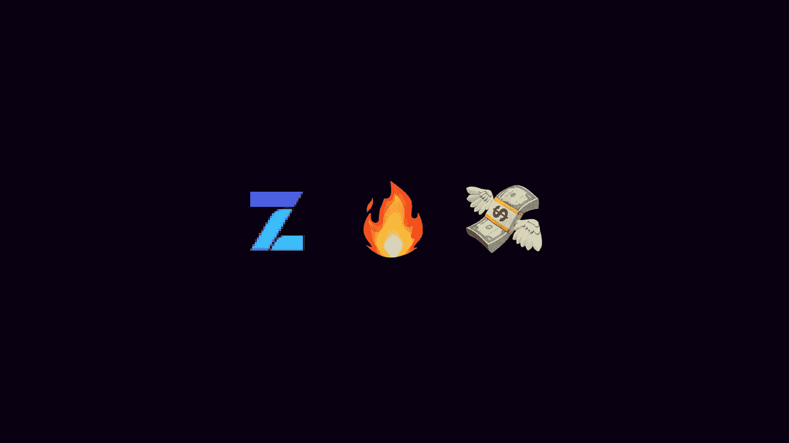
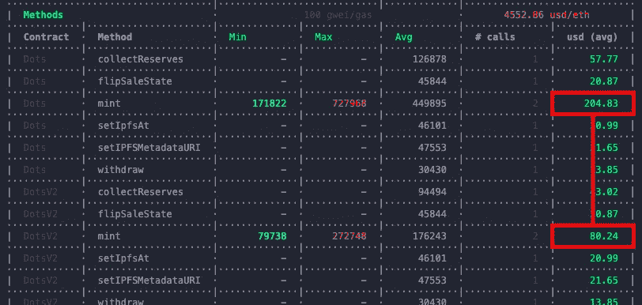
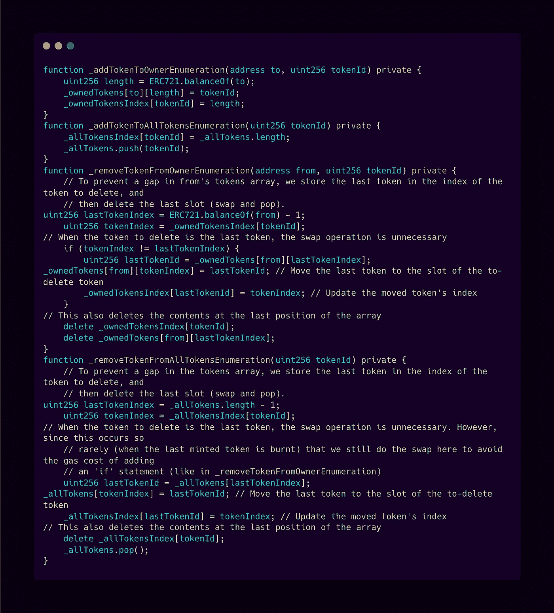
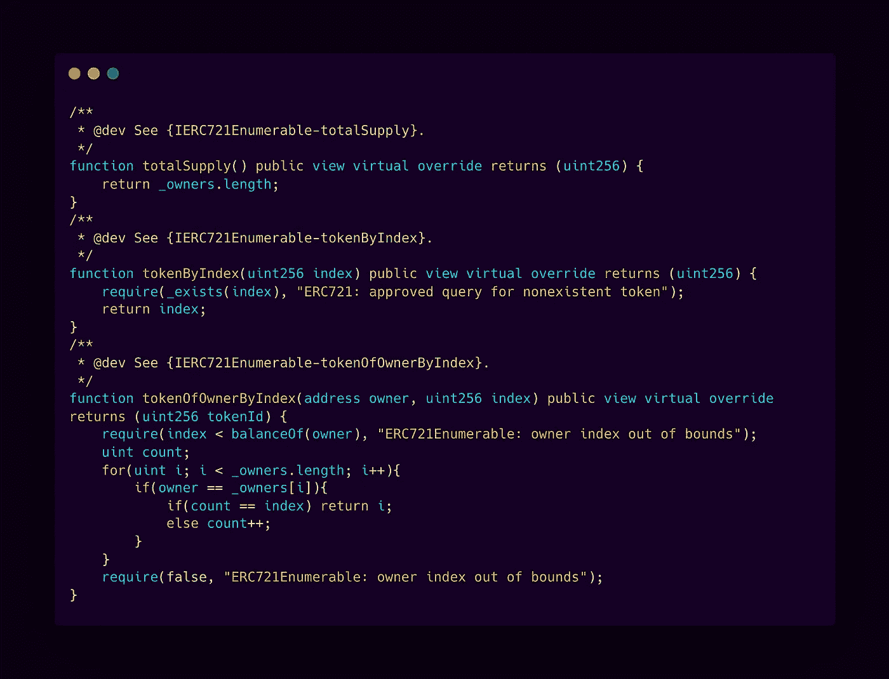
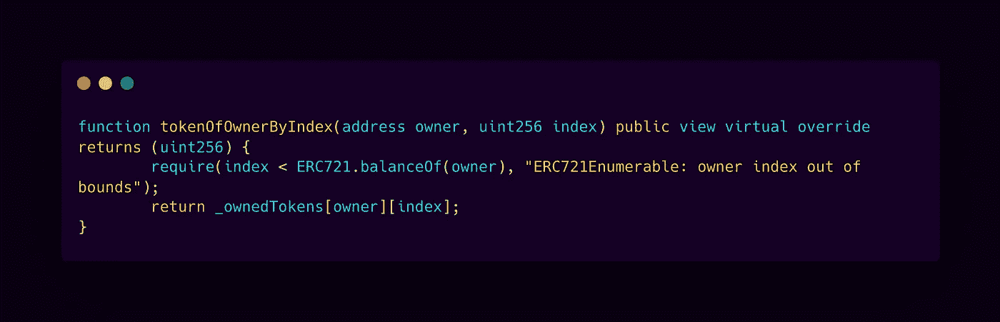
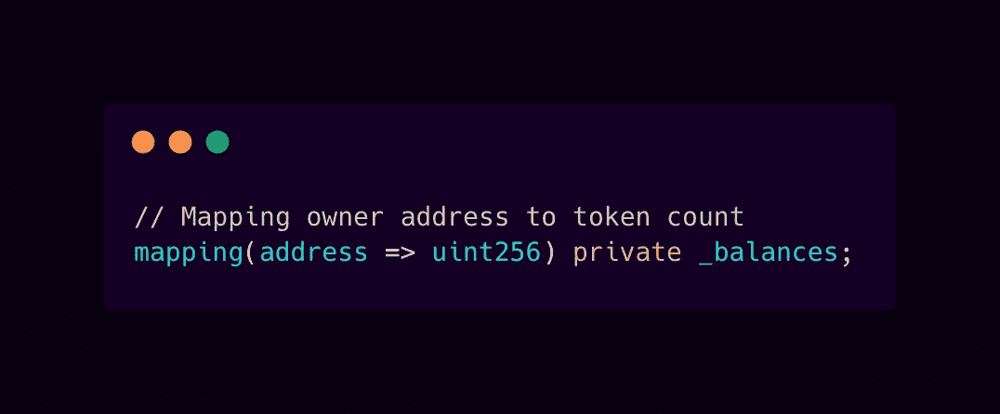
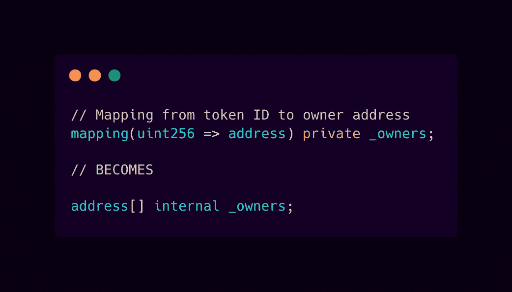
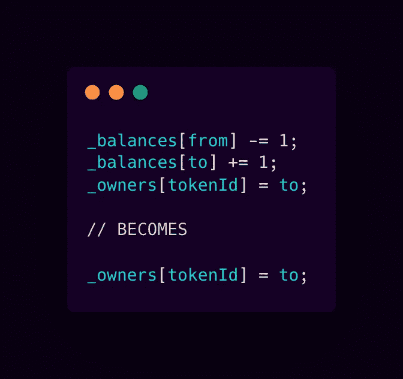
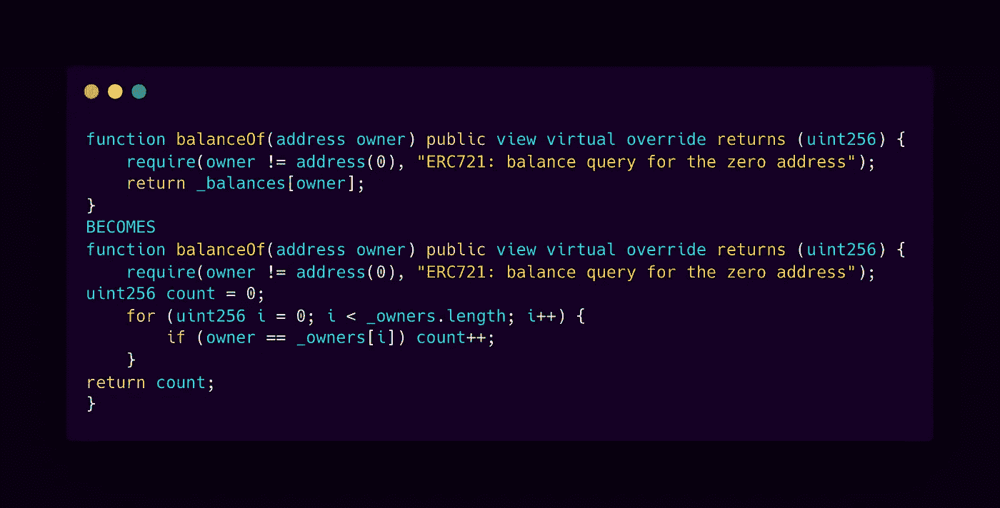
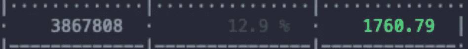

# 开放式齐柏林智能合同的标准化使用是如何以疯狂的油价蚕食 NFT 的。

> 原文：<https://medium.com/coinmonks/the-cannibalization-of-nfts-by-openzeppelin-by-insanely-high-gas-prices-cd2c9a7c1e7?source=collection_archive---------1----------------------->

OpenZeppelin, whether intentionally or not, directly contributes to the bear market and low-quality NFT projects.

几个星期以来，NFT 工业一直在尖叫“天然气价格太高了，以太坊坏了。”

让我们紧急刹车，调查一下。

你会发现，事情并不像你想象的那样。开发人员没有为您最喜欢的 NFT 提供有效的管理方法，而是经常在不太考虑后果的情况下进行组装。随着随机打开的齐柏林飞艇和复制粘贴的作品猛烈撞击在一起，许多最受欢迎的收藏是业内最糟糕的合同。

今天我们将深入探讨这个问题，并意识到给没有经验的开发者几百万美元并不是一个更好的现实。让我注意到这一点的功劳归于[*squeebo _ NFT*](https://twitter.com/squeebo_nft)*和*[*GoldenXnft*](https://twtter.com/GoldenXnft)*团队。*

对于门外汉来说， [Open Zeppelin](https://openzeppelin.com/) 是一个开源库，拥有许多流行的智能合约，在整个 NFT 行业中广泛使用。

这是走向稳定的一个很好的开端，让你在最初的日子里摆脱大量的猜测和最初的挣扎...

…但是作为一名开发人员，人们经常会听到不要使用没有完全理解的库...

为什么？

因为往往有一堆东西你并不需要，也不关心你的具体用途。这就是我们在这个周期中的遭遇。

在本文的持续时间内，我们使用:

OpenZeppelin 版本 4.3.2 和 Solidity 0.8.4。

让我们开门见山地进行🧪测试造币厂:
1 代币交易，然后是 5 代币交易。

Gas usage report from hardhat in USD.

结果立即说明了问题…

铸币 w/Open Zeppelin:204.83 美元(34.13 美元/枚)
铸币 w/优化合同:80.24 美元(13.37 美元/枚)

这是一个巨大的差异。

现在，重要的是要记住，在这个测试中，我们有一个薄荷 1 和薄荷 5。尽管我们铸造的数量不同，但这些铸造交易使用的气体并不是线性增长的。

每次我们运行交易时，我们都会检查是否满足要求，而不考虑计数，但是如果计数高于 1，我们就不需要每次都检查要求，因此数量较高的薄荷糖每颗薄荷糖使用的气体量会较低。超级简单吧？

那么，这里的问题是什么？

开箱即用，Open Zeppelin ERC721Enumerable 附带了大量的传输处理，而大多数项目根本不需要这些处理。这是什么处理？

尽可能简单地分解一下:不仅在铸造过程中浪费了汽油，而且每次转让代币时，代币的所有者都要支付比应该支付的高得多的费用。为什么？没有经验的开发人员。所以，下一次你想知道:“为什么转让这个代币要花 90 美元？”你几乎肯定有你的答案。

跟踪方法可以转移到视图功能中，而不是试图管理转移中的成本。一般来说，一个项目合同需要一些修改来适应这种方法，但它很容易启动。

开发人员使用 ERC721Enumerable 有三个主要功能。让我们确保现在就处理这些问题，然后您可以决定想要深入到什么程度。因此，不要使用 Open Zeppelin 提供的版本，让我们创建自己的版本，并确保我们拥有这些基本功能:

注意:你马上会注意到的是***tokenOfOwnerByIndex()***效率极低。这是我们为了拯救买家的小财富而做出的牺牲。

我们不只是删除几条线，我们必须在相当大的程度上返工，所以在将任何东西投入生产之前，你都要确保并测试每一平方英寸。作为参考，这是**的起点*tokenOfOwnerByIndex()***

令人难以置信的是，当使用 Open Zeppelin 时，这并不是成本优化的终点。我们可以进一步分析整个分析，看看核心的 ERC721 合同。

我们可以立即看到，我们有相当多的冗余，我们可以优化。让我们关注一个关键的问题:

如果你是一名开发人员，你应该知道将同一块数据存储两次是一个非常糟糕的做法。但是，即使你不是，让我们解释一下为什么。

在这个合同中，我们还有一个变量:

虽然我们有所有者，但我们也知道在任何给定时间集合的总供应量()。这意味着，我们已经知道了固有的平衡。我们只需要适当地管理数据，这样我们就不需要存储和使用冗余信息，尤其是当它的成本更高的时候！

因此，如果我们想遍历我们的所有者，我们可以用数组格式管理我们的所有者。我们立即删除了一个必须管理的映射，并用一个地址数组替换了一个映射。这不是一个巨大的变化，但它确实有巨大的影响。

最终结构确定后，是时候检查和更新所有内容了，例如:

因此，我们将继续更新这些所有者的管理，例如:

即使对于一般的创造者来说，这也不是一个没有意义的努力。在这样说之前，我们还需要先了解两件主要的事情:

👉你实际上节省了生态系统的气体量。
👉部署期间可以节省的资金。

作为创造者，我们必须看到拯救我们社区的价值。

在一个出售 10，000 个绝对零毒气战代币的项目中，有几十万美元留了下来🏝生态系统内。如果你有一场天然气战争，那可能会变成几百万。

每一分钱都很重要。

通过一轮优化，我们可以将部署到以太坊 mainnet 的成本从 2，004 美元降低到 1，760 美元，只需几分钟时间…

The final cost of deploying an on-chain generative project using byte hashes.

实现的目标:💪进一步降低创造者的风险，降低每一个买家的铸造成本至少 50%,即使在天然气战争期间也是如此。

依靠开放的齐柏林飞艇来收拾残局值得吗？不了解智能合同中的内容而节省的时间值得在天然气和停滞项目中损失的数百万美元吗？你知道如何解决这个问题吗？为合同不好的项目做包装值得吗？

我们能回到过去撤销时间吗？

不过这不是开放齐柏林飞艇的错。很多时候，他们强调要了解合同的内容，尤其是在进入生产阶段之前…

这里有一个基本的检查表来防止你的项目中出现这种问题:
✅检查在转移期间发生的每一件事。
✅限制你强迫一个 minter 支付的数据存储量。
✅尽可能将昂贵的处理转移到视图功能。

这个行业已经成熟，这使得像这样疯狂的错误玷污了整个行业🔁循环。

> 加入 Coinmonks [电报频道](https://t.me/coincodecap)和 [Youtube 频道](https://www.youtube.com/c/coinmonks/videos)了解加密交易和投资

## 也阅读

 [## 杠杆代币[多头代币]终极指南

### 杠杆化令牌是具有杠杆化风险敞口的 ERC20 令牌，不考虑保证金、要求、管理…

medium.com](/coinmonks/leveraged-token-3f5257808b22)  [## 最佳加密交易所| 2021 年十大加密货币交易所

### 编辑描述

blog.coincodecap.com](https://blog.coincodecap.com/crypto-exchange)  [## 2021 年最佳加密交换平台| CoinCodeCap

### 编辑描述

blog.coincodecap.com](https://blog.coincodecap.com/best-swap-platforms)  [## 2021 年最佳加密借贷平台| 6 大比特币借贷平台

### 获得比特币和其他加密货币的最佳贷款利率

medium.com](/coinmonks/top-5-crypto-lending-platforms-in-2020-that-you-need-to-know-a1b675cec3fa)  [## 2021 年 6 大最佳硬件钱包|顶级加密硬件钱包[更新]

### 最好的加密货币硬件钱包是绝对必要的。我们将在 NGRAVE、Ledger Nano X 和…

medium.com](/coinmonks/the-best-cryptocurrency-hardware-wallets-of-2020-e28b1c124069)  [## 2021 年最佳免费加密交易机器人

### 2021 年币安、比特币基地、库币和其他密码交易所的最佳密码交易机器人。四进制，位间隙…

medium.com](/coinmonks/crypto-trading-bot-c2ffce8acb2a)  [## 最佳 4 个加密交易信号电报通道

### 这是乏味的找到正确的加密交易信号提供商。因此，在本文中，我们将讨论最好的…

medium.com](/coinmonks/best-crypto-signals-telegram-5785cdbc4b2b)